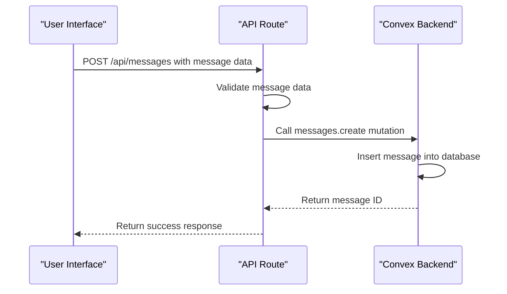
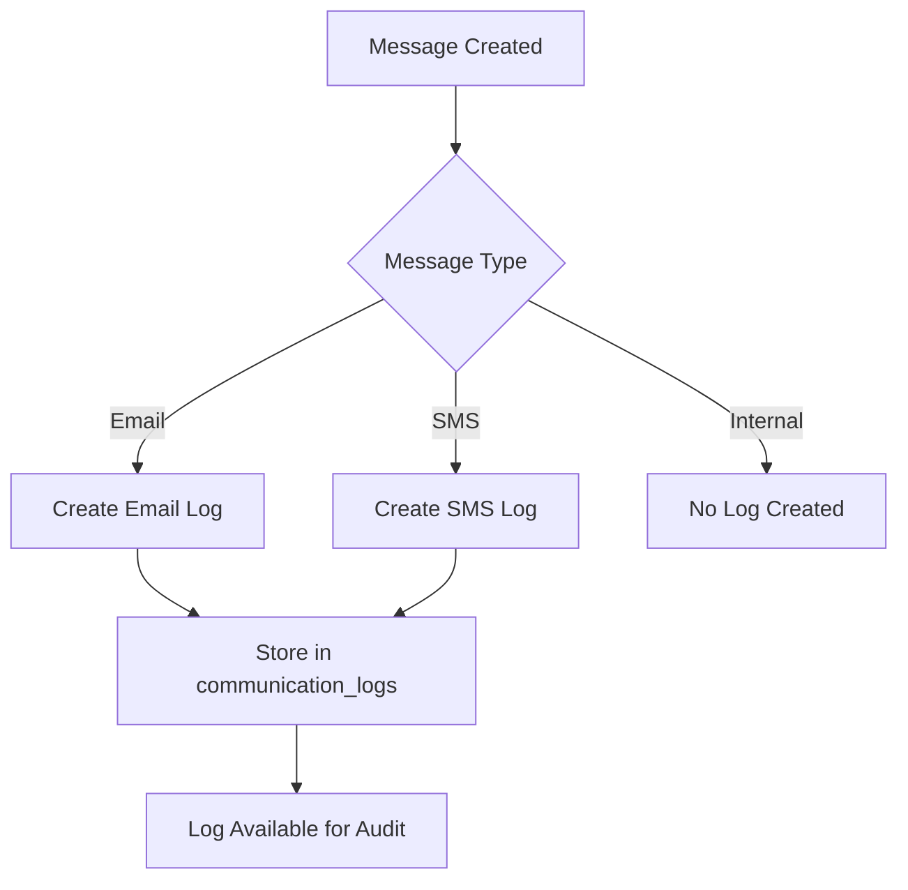
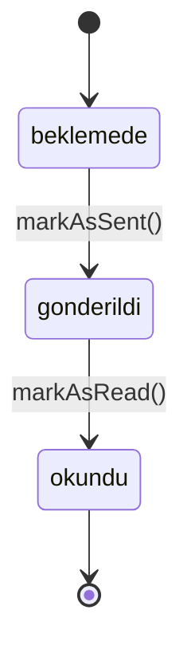
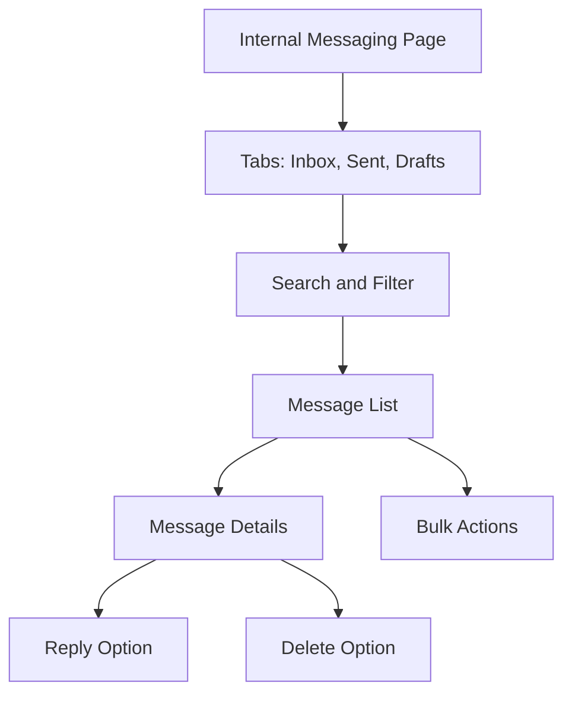
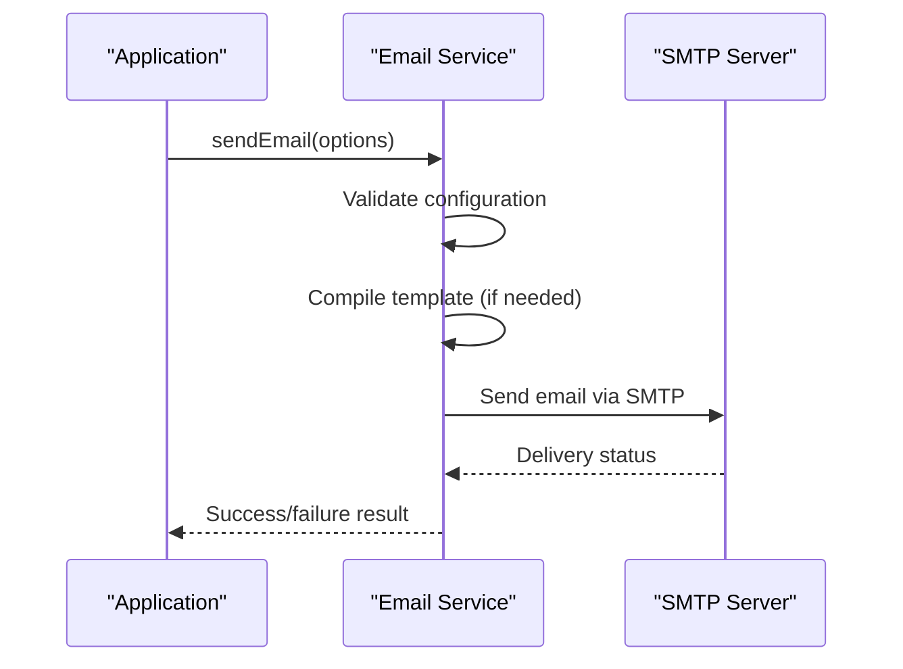

# Communication System

<cite>
**Referenced Files in This Document**   
- [messages.ts](file://convex/messages.ts)
- [communication_logs.ts](file://convex/communication_logs.ts)
- [workflow_notifications.ts](file://convex/workflow_notifications.ts)
- [message.ts](file://src/lib/validations/message.ts)
- [messageForm.tsx](file://src/components/forms/MessageForm.tsx)
- [email.ts](file://src/lib/services/email.ts)
- [sms.ts](file://src/lib/services/sms.ts)
- [api.ts](file://src/lib/convex/api.ts)
- [route.ts](file://src/app/api/messages/route.ts)
- [kurum-ici/page.tsx](file://src/app/(dashboard)/mesaj/kurum-ici/page.tsx)
- [toplu/page.tsx](file://src/app/(dashboard)/mesaj/toplu/page.tsx)
</cite>

## Table of Contents

1. [Introduction](#introduction)
2. [Data Model](#data-model)
3. [Internal Messaging](#internal-messaging)
4. [Communication Logging](#communication-logging)
5. [Workflow Notifications](#workflow-notifications)
6. [User Interface](#user-interface)
7. [Integration with User Management](#integration-with-user-management)
8. [Extending with Email/SMS](#extending-with-emailsms)
9. [Conclusion](#conclusion)

## Introduction

The Communication System module provides a comprehensive solution for managing internal messaging, communication logging, and workflow notifications within the organization. Built on the Convex platform, this system enables users to send messages through various channels including SMS, email, and internal messaging. The system maintains detailed audit trails through communication logs for compliance purposes and integrates seamlessly with user management for access control. Automated notifications are triggered by workflow events across different modules, ensuring timely information delivery. This documentation details the implementation of these components and their integration points.

## Data Model

The communication system uses three primary data models: messages, communication logs, and workflow notifications. Each model has specific fields that define its structure and behavior.

### Messages Data Model

The messages collection stores all sent and received messages with their metadata. Each message document contains the following fields:

| Field        | Type              | Description                                          |
| ------------ | ----------------- | ---------------------------------------------------- |
| message_type | string            | Type of message: 'sms', 'email', or 'internal'       |
| sender       | string            | ID of the user who sent the message                  |
| recipients   | array             | Array of user IDs who are recipients                 |
| subject      | string (optional) | Subject line for email and internal messages         |
| content      | string            | Message content                                      |
| sent_at      | string (optional) | Timestamp when message was sent                      |
| status       | string            | Delivery status: 'draft', 'sent', or 'failed'        |
| is_bulk      | boolean           | Indicates if message was sent to multiple recipients |
| template_id  | string (optional) | ID of the template used to create the message        |

**Section sources**

- [messages.ts](file://convex/messages.ts#L82-L100)
- [database.ts](file://src/types/database.ts#L310-L321)

### Communication Logs Data Model

The communication_logs collection maintains an audit trail of all external communications for compliance purposes. Each log entry contains:

| Field     | Type              | Description                                     |
| --------- | ----------------- | ----------------------------------------------- |
| type      | string            | Communication type: 'email' or 'sms'            |
| to        | string            | Recipient's email address or phone number       |
| subject   | string (optional) | Subject of the email                            |
| message   | string            | Content of the communication                    |
| status    | string            | Delivery status: 'sent', 'failed', or 'pending' |
| messageId | string (optional) | Reference to the message document               |
| error     | string (optional) | Error message if delivery failed                |
| sentAt    | string            | Timestamp when communication was sent           |
| userId    | string (optional) | ID of the user who initiated the communication  |
| metadata  | any (optional)    | Additional contextual information               |

**Section sources**

- [communication_logs.ts](file://convex/communication_logs.ts#L13-L23)
- [database.ts](file://src/types/database.ts#L322-L339)

### Workflow Notifications Data Model

The workflow_notifications collection stores system-generated notifications triggered by workflow events. Each notification document contains:

| Field        | Type              | Description                                                         |
| ------------ | ----------------- | ------------------------------------------------------------------- |
| recipient    | string            | ID of the user receiving the notification                           |
| triggered_by | string (optional) | ID of the user who triggered the notification                       |
| category     | string            | Notification category: 'meeting', 'gorev', 'rapor', or 'hatirlatma' |
| title        | string            | Notification title                                                  |
| body         | string (optional) | Notification content                                                |
| status       | string            | Notification status: 'beklemede', 'gonderildi', or 'okundu'         |
| created_at   | string (optional) | Timestamp when notification was created                             |
| sent_at      | string (optional) | Timestamp when notification was sent                                |
| read_at      | string (optional) | Timestamp when notification was read                                |
| reference    | object (optional) | Reference to related document with type and ID                      |
| metadata     | any (optional)    | Additional contextual information                                   |

**Section sources**

- [workflow_notifications.ts](file://convex/workflow_notifications.ts#L77-L85)
- [database.ts](file://src/types/database.ts#L293-L308)

## Internal Messaging

The internal messaging system allows users to communicate within the organization through a dedicated messaging interface. Messages can be sent individually or in bulk to multiple recipients.

### Message Creation and Management

Messages are created through the `create` mutation in the messages module, which validates input data and stores the message in the database. When a message is created with status 'sent', the `sent_at` field is automatically populated with the current timestamp.

**Diagram sources**

- [messages.ts](file://convex/messages.ts#L82-L100)
- [route.ts](file://src/app/api/messages/route.ts#L128-L175)

### Message Filtering and Retrieval

The system provides comprehensive filtering capabilities for retrieving messages based on various criteria including sender, recipient, status, message type, and search terms. The `list` query in the messages module handles these filtering operations efficiently using database indexes.

When retrieving messages, the system applies filters in a specific order to optimize performance. First, it applies index-based filters (sender, status), then applies additional filters through in-memory filtering. The results are paginated to improve performance and user experience.

**Section sources**

- [messages.ts](file://convex/messages.ts#L4-L71)
- [route.ts](file://src/app/api/messages/route.ts#L38-L111)

## Communication Logging

The communication logging system maintains an audit trail of all external communications (email and SMS) for compliance and troubleshooting purposes.

### Log Creation Process

Whenever an external communication is initiated, a log entry is created in the communication_logs collection. This happens automatically when messages of type 'email' or 'sms' are sent through the system.

**Diagram sources**

- [communication_logs.ts](file://convex/communication_logs.ts#L11-L27)
- [email.ts](file://src/lib/services/email.ts#L84-L124)
- [sms.ts](file://src/lib/services/sms.ts#L48-L98)

### Log Retrieval and Statistics

The system provides APIs to retrieve communication logs with optional filters by type, status, and user. Additionally, statistics about communication volumes can be retrieved for reporting purposes.

The `getStats` function in the communication_logs module calculates key metrics including total communications, successful deliveries, failed attempts, and pending messages within a specified date range. This data is valuable for monitoring system performance and identifying delivery issues.

**Section sources**

- [communication_logs.ts](file://convex/communication_logs.ts#L72-L96)
- [route.ts](file://src/app/api/communication-logs/route.ts#L10-L58)

## Workflow Notifications

The workflow notification system delivers automated alerts to users based on events occurring in various modules of the application.

### Notification Categories and Lifecycle

Notifications are categorized by their purpose, with current categories including:

- meeting: Notifications related to meetings and agendas
- gorev: Task-related notifications
- rapor: Report submission and review notifications
- hatirlatma: Reminders for upcoming events or deadlines

Each notification follows a lifecycle from creation to reading:

1. **beklemede (pending)**: Notification is created but not yet delivered
2. **gonderildi (sent)**: Notification has been delivered to the recipient
3. **okundu (read)**: Recipient has viewed the notification

**Diagram sources**

- [workflow_notifications.ts](file://convex/workflow_notifications.ts#L4-L7)
- [workflow_notifications.ts](file://convex/workflow_notifications.ts#L106-L148)

### Notification Creation and Management

Workflow notifications are created programmatically when specific events occur in the system. For example, when a new meeting is scheduled, a notification is created for all participants.

The system provides a flexible API for creating notifications with references to related documents (such as meeting action items or decisions), allowing users to navigate directly from the notification to the relevant content.

**Section sources**

- [workflow_notifications.ts](file://convex/workflow_notifications.ts#L75-L104)
- [api.ts](file://src/lib/convex/api.ts#L242-L267)

## User Interface

The user interface for the communication system is implemented through multiple pages in the dashboard, providing different views for various messaging needs.

### Internal Messaging Interface

The internal messaging interface at `/mesaj/kurum-ici` provides a tabbed view for managing messages:

- **Inbox**: Messages received by the current user
- **Sent**: Messages sent by the current user
- **Drafts**: Unsent messages created by the current user

Users can search messages, paginate through results, and perform bulk actions such as deleting multiple messages. The interface displays message metadata including sender, subject, status, and timestamp.

**Section sources**

- [kurum-ici/page.tsx](<file://src/app/(dashboard)/mesaj/kurum-ici/page.tsx#L38-L682>)
- [messageForm.tsx](file://src/components/forms/MessageForm.tsx#L46-L626)

### Bulk Messaging Interface

The bulk messaging interface at `/mesaj/toplu` guides users through a four-step wizard for sending messages to multiple recipients:

1. **Compose**: Create the message content
2. **Recipients**: Select recipients from available options
3. **Preview**: Review message details and confirm
4. **Sending**: Monitor progress of message delivery

The interface provides real-time feedback on estimated costs for SMS messages and delivery statistics after sending.

**Section sources**

- [toplu/page.tsx](<file://src/app/(dashboard)/mesaj/toplu/page.tsx#L59-L787>)

## Integration with User Management

The communication system integrates closely with the user management system for access control and recipient identification.

### Access Control

Access to messaging functionality is controlled through user permissions. The system checks if a user has the necessary permissions before allowing them to perform actions such as sending bulk messages or accessing all messages regardless of sender.

When retrieving messages, the system enforces access control by only returning messages where the current user is either the sender or recipient, unless the user has elevated permissions (users:manage).

**Section sources**

- [route.ts](file://src/app/api/messages/route.ts#L43-L65)
- [users.ts](file://convex/users.ts#L83-L121)

### Recipient Selection

The system integrates with the user directory to enable easy recipient selection. For internal messages, users can search for recipients by name or email address, and the system resolves these to user IDs for storage in the message document.

This integration ensures that messages are delivered to valid users within the system and maintains referential integrity between messages and users.

**Section sources**

- [messageForm.tsx](file://src/components/forms/MessageForm.tsx#L109-L113)
- [kurum-ici/page.tsx](<file://src/app/(dashboard)/mesaj/kurum-ici/page.tsx#L84-L87>)

## Extending with Email/SMS

The communication system can be extended to support external messaging channels such as email and SMS through integration with third-party services.

### Email Integration

Email functionality is implemented using Nodemailer with SMTP configuration. The system can send individual and bulk emails through a configured SMTP server.

Key features of the email integration:

- Support for HTML and plain text emails
- Template-based email creation
- Error handling and logging
- Configuration through environment variables

**Diagram sources**

- [email.ts](file://src/lib/services/email.ts#L84-L124)
- [messages.ts](file://convex/messages.ts#L82-L100)

### SMS Integration

SMS functionality is implemented using Twilio, a cloud communications platform. The system can send individual and bulk SMS messages to Turkish phone numbers.

Key features of the SMS integration:

- Validation of Turkish phone number format
- Support for bulk messaging with rate limiting
- Delivery status tracking
- Predefined message templates for common use cases

The SMS service includes specialized functions for common scenarios such as verification codes, aid approvals, and meeting reminders, making it easy to trigger appropriate messages from different parts of the application.

**Section sources**

- [sms.ts](file://src/lib/services/sms.ts#L48-L159)
- [messages.ts](file://convex/messages.ts#L82-L100)

## Conclusion

The Communication System module provides a robust foundation for internal messaging, communication logging, and workflow notifications within the organization. By leveraging the Convex platform, the system offers real-time data synchronization, efficient querying, and seamless integration between components. The modular design allows for easy extension with additional communication channels while maintaining a consistent interface and data model. The integration with user management ensures proper access control, and the comprehensive logging system supports compliance requirements. This system effectively connects users, workflows, and external communication channels into a cohesive communication platform.
