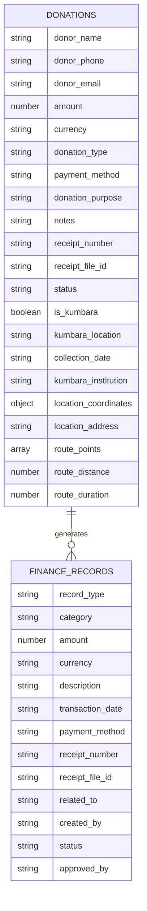
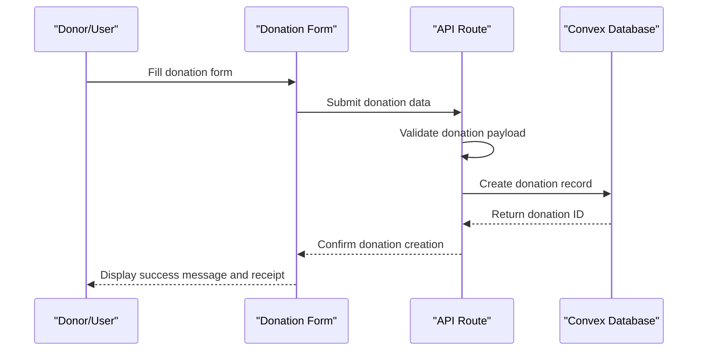
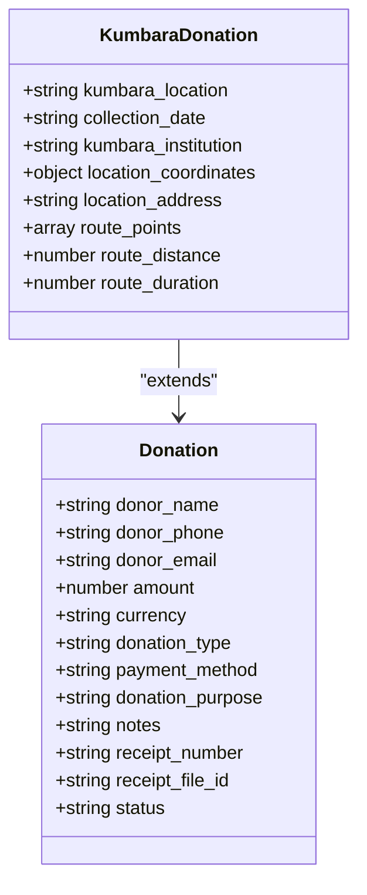
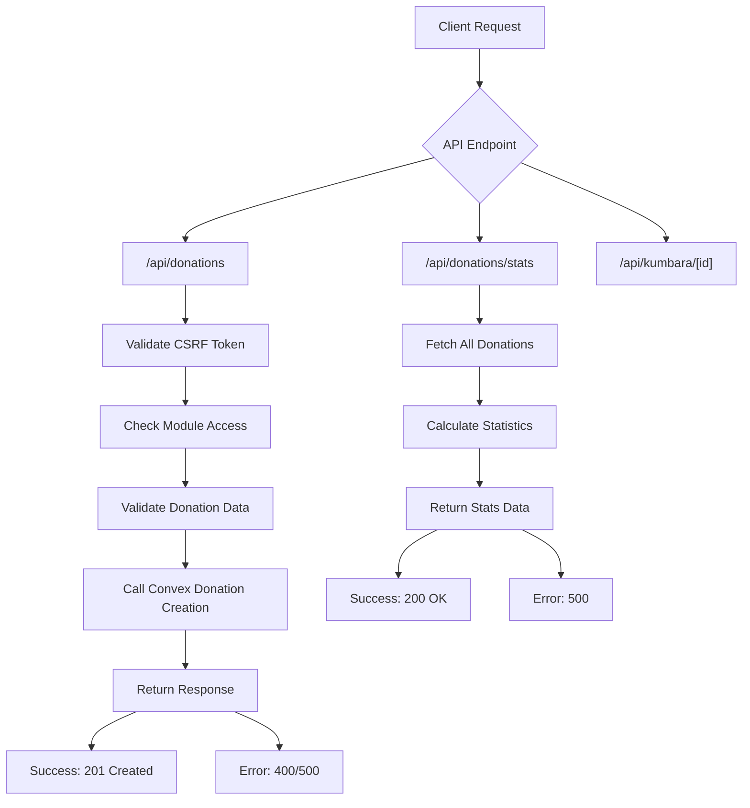
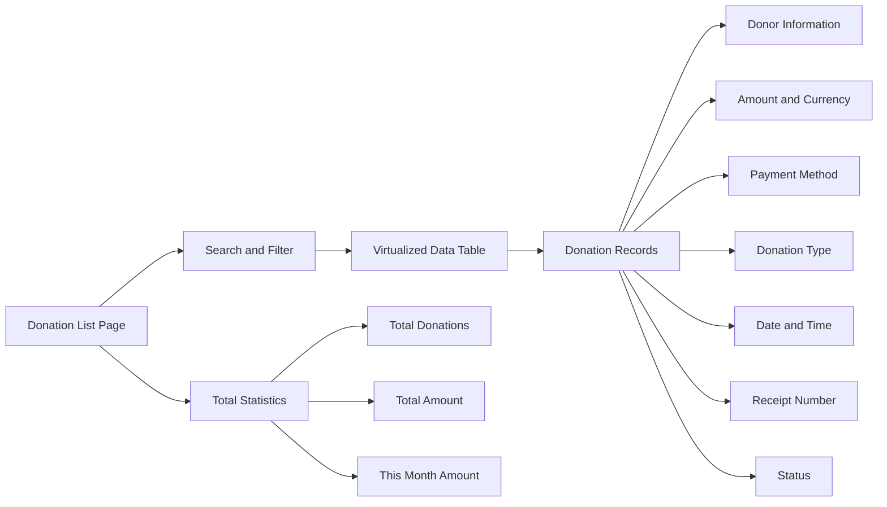
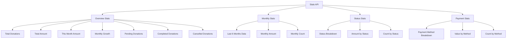
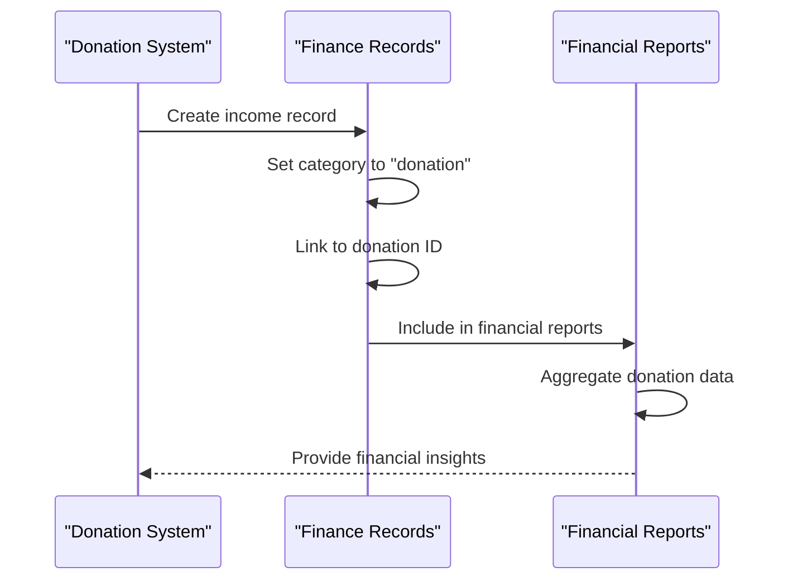
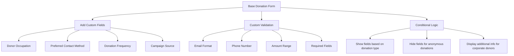
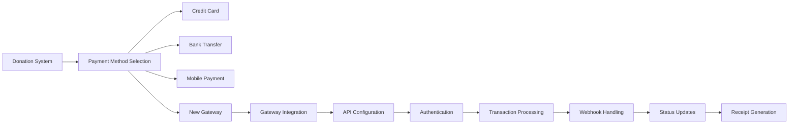

# Donation System

<cite>
**Referenced Files in This Document**   
- [donations.ts](file://convex/donations.ts)
- [finance_records.ts](file://convex/finance_records.ts)
- [route.ts](file://src/app/api/donations/route.ts)
- [stats/route.ts](file://src/app/api/donations/stats/route.ts)
- [page.tsx](file://src/app/(dashboard)/bagis/liste/page.tsx)
- [page.tsx](file://src/app/(dashboard)/bagis/kumbara/page.tsx)
- [KumbaraStats.tsx](file://src/components/kumbara/KumbaraStats.tsx)
- [financial.ts](file://src/types/financial.ts)
</cite>

## Table of Contents

1. [Introduction](#introduction)
2. [Core Components](#core-components)
3. [Data Model](#data-model)
4. [Standard Donation Processing](#standard-donation-processing)
5. [Kumbara Collection System](#kumbara-collection-system)
6. [API Integration](#api-integration)
7. [Donation History and Receipts](#donation-history-and-receipts)
8. [Statistical Reporting](#statistical-reporting)
9. [Integration with Financial Reporting](#integration-with-financial-reporting)
10. [Donation Form Customization](#donation-form-customization)
11. [Extending Payment Gateways](#extending-payment-gateways)

## Introduction

The Donation System module provides comprehensive functionality for managing both standard donations and Kumbara (money box) collections. The system integrates with financial records, supports multiple payment methods, and offers detailed reporting capabilities. This documentation covers the implementation details, data models, API integrations, and extension points for the donation system.

## Core Components

The Donation System consists of several core components that work together to process, track, and report on donations. The system is built around Convex database functions, Next.js API routes, and React components that provide the user interface.

**Section sources**

- [donations.ts](file://convex/donations.ts#L1-L149)
- [finance_records.ts](file://convex/finance_records.ts#L1-L132)
- [route.ts](file://src/app/api/donations/route.ts#L1-L148)

## Data Model

The donation system uses a structured data model to capture all relevant information about donations, including donor details, financial information, and status tracking.

**Diagram sources**

- [donations.ts](file://convex/donations.ts#L77-L105)
- [finance_records.ts](file://convex/finance_records.ts#L55-L73)
- [financial.ts](file://src/types/financial.ts#L5-L29)

## Standard Donation Processing

The standard donation processing flow allows users to create, view, and manage individual donations through a web interface. The system validates donation data, creates records in the database, and generates receipts.

**Diagram sources**

- [route.ts](file://src/app/api/donations/route.ts#L89-L147)
- [donations.ts](file://convex/donations.ts#L76-L109)
- [page.tsx](<file://src/app/(dashboard)/bagis/liste/page.tsx#L14-L17>)

## Kumbara Collection System

The Kumbara (money box) collection system is a specialized feature for tracking physical donation boxes placed in various locations. This system captures location data, collection schedules, and route information for efficient collection management.

**Diagram sources**

- [donations.ts](file://convex/donations.ts#L95-L105)
- [page.tsx](<file://src/app/(dashboard)/bagis/kumbara/page.tsx#L1-L50>)
- [KumbaraStats.tsx](file://src/components/kumbara/KumbaraStats.tsx#L8-L16)

## API Integration

The donation system provides a comprehensive API for creating, retrieving, and managing donations. The API endpoints are integrated with the Convex database functions and include proper validation and error handling.

**Diagram sources**

- [route.ts](file://src/app/api/donations/route.ts#L54-L148)
- [stats/route.ts](file://src/app/api/donations/stats/route.ts#L22-L73)
- [donations.ts](file://convex/donations.ts#L5-L147)

## Donation History and Receipts

Users can view their donation history through the donation list interface, which displays all donations with filtering and search capabilities. The system generates receipts for each donation, which can be accessed through the receipt number.

**Diagram sources**

- [page.tsx](<file://src/app/(dashboard)/bagis/liste/page.tsx#L19-L225>)
- [donations.ts](file://convex/donations.ts#L5-L53)
- [route.ts](file://src/app/api/donations/route.ts#L54-L83)

## Statistical Reporting

The statistical reporting system provides insights into donation trends, status distribution, and payment method usage. The reports are available through the stats API endpoint and displayed in the Kumbara dashboard.

**Diagram sources**

- [stats/route.ts](file://src/app/api/donations/stats/route.ts#L22-L198)
- [KumbaraStats.tsx](file://src/components/kumbara/KumbaraStats.tsx#L18-L172)
- [page.tsx](<file://src/app/(dashboard)/bagis/kumbara/page.tsx#L1-L50>)

## Integration with Financial Reporting

The donation system integrates with the financial reporting module by creating corresponding finance records for each donation. This ensures that all donations are properly accounted for in the organization's financial statements.

**Diagram sources**

- [donations.ts](file://convex/donations.ts#L76-L109)
- [finance_records.ts](file://convex/finance_records.ts#L55-L76)
- [financial.ts](file://src/types/financial.ts#L5-L29)

## Donation Form Customization

The donation form can be customized to collect additional information based on the organization's needs. The form validation and data structure can be extended to support new fields and validation rules.

**Section sources**

- [route.ts](file://src/app/api/donations/route.ts#L14-L48)
- [page.tsx](<file://src/app/(dashboard)/bagis/liste/page.tsx#L14-L17>)
- [financial.ts](file://src/types/financial.ts#L253-L263)

## Extending Payment Gateways

The system can be extended to support additional payment gateways by implementing new payment methods and integrating with external payment processing services.

**Section sources**

- [donations.ts](file://convex/donations.ts#L85-L86)
- [route.ts](file://src/app/api/donations/route.ts#L100-L120)
- [financial.ts](file://src/types/financial.ts#L253-L263)
