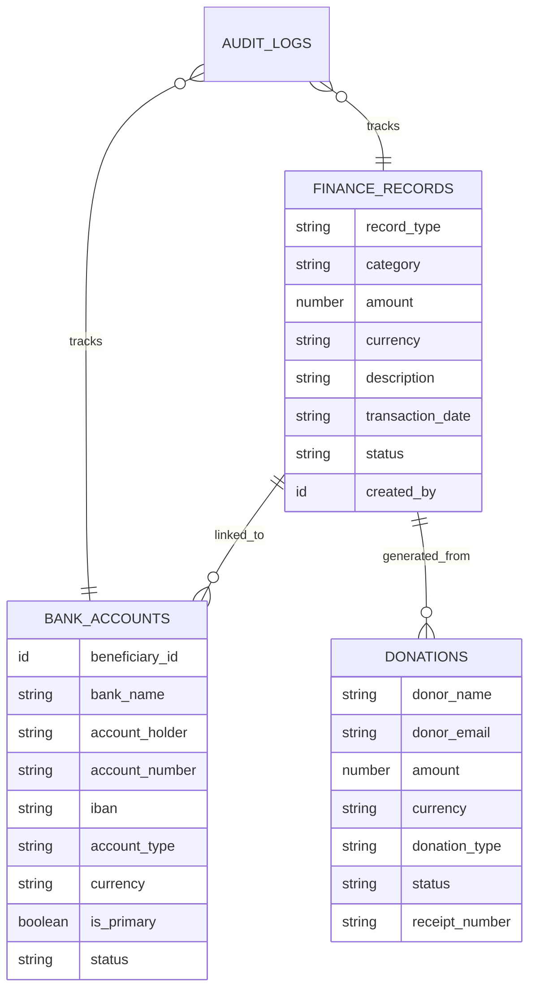
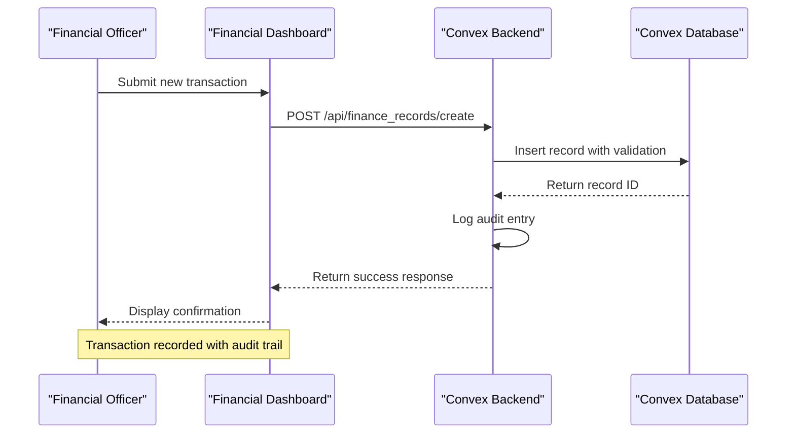
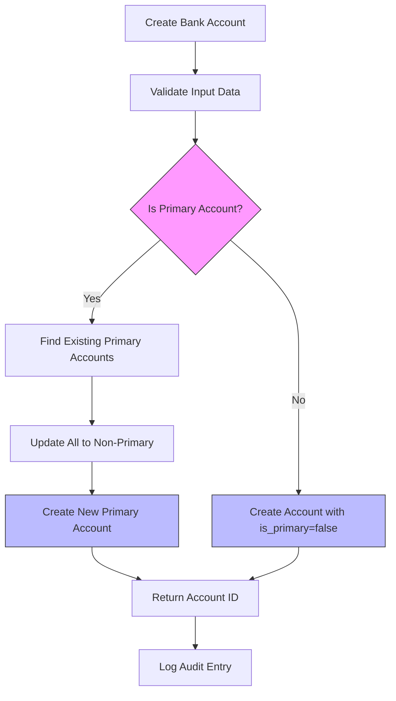
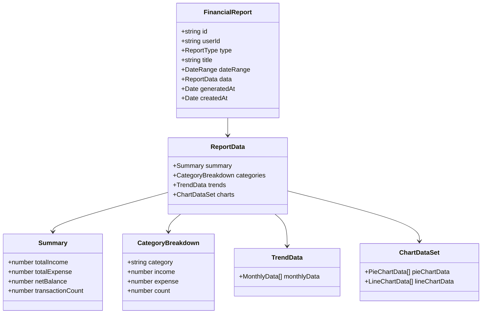
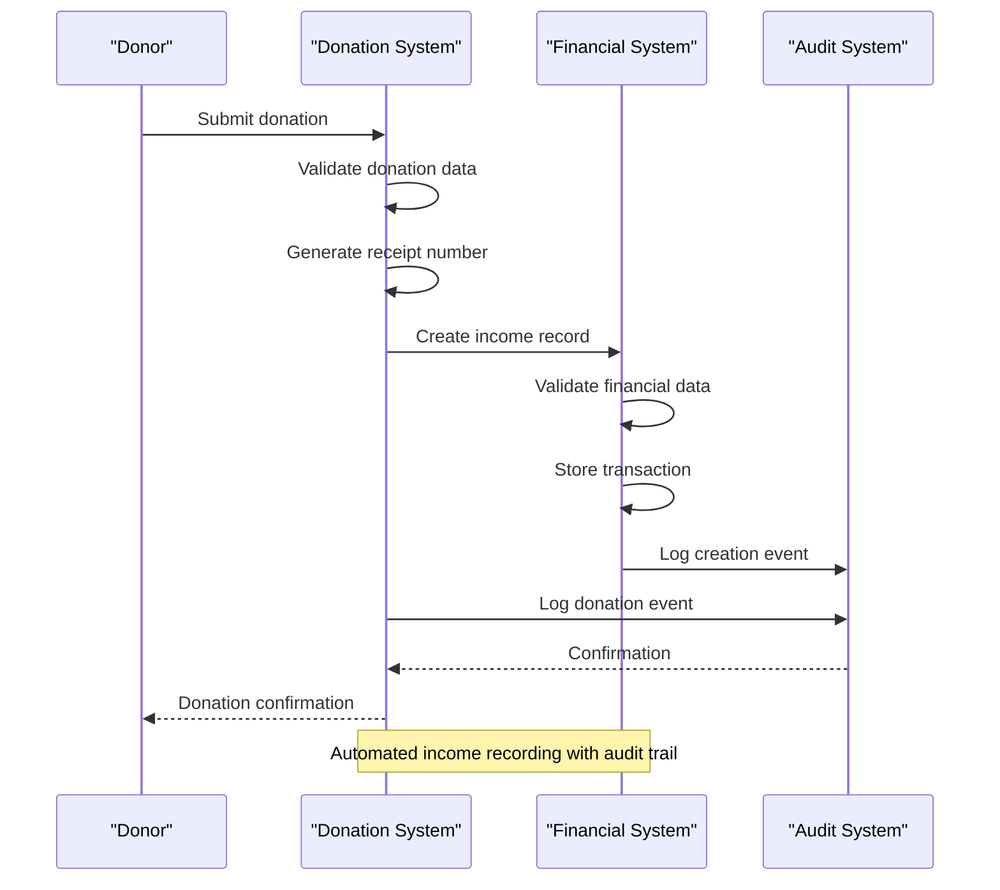
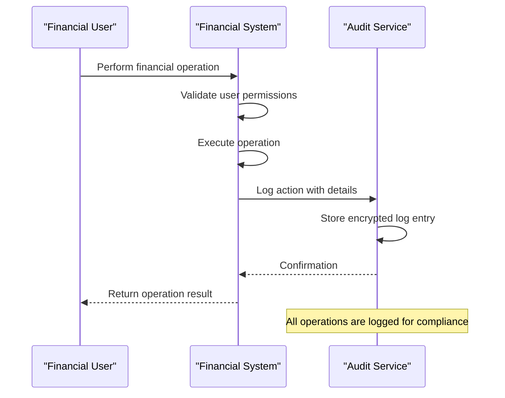
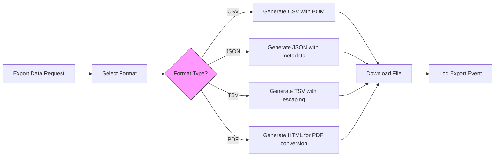

# Financial Management

<cite>
**Referenced Files in This Document**   
- [finance_records.ts](file://convex/finance_records.ts)
- [bank_accounts.ts](file://convex/bank_accounts.ts)
- [financial.ts](file://src/types/financial.ts)
- [donations.ts](file://convex/donations.ts)
- [audit_logs.ts](file://convex/audit_logs.ts)
- [BankAccountsManager.tsx](file://src/components/bank-accounts/BankAccountsManager.tsx)
- [data-export.ts](file://src/lib/data-export.ts)
- [pdf-export.ts](file://src/lib/utils/pdf-export.ts)
</cite>

## Table of Contents

1. [Introduction](#introduction)
2. [Data Model](#data-model)
3. [Income and Expense Tracking](#income-and-expense-tracking)
4. [Bank Account Management](#bank-account-management)
5. [Financial Reporting](#financial-reporting)
6. [Integration with Donation and Scholarship Systems](#integration-with-donation-and-scholarship-systems)
7. [Security and Audit Trails](#security-and-audit-trails)
8. [Chart of Accounts Configuration](#chart-of-accounts-configuration)
9. [Data Export for External Accounting Systems](#data-export-for-external-accounting-systems)
10. [Financial Dashboard Integration](#financial-dashboard-integration)

## Introduction

The Financial Management module provides comprehensive tools for tracking income and expenses, managing bank accounts, and generating financial reports. This system supports nonprofit operations with robust features for donation integration, audit compliance, and financial transparency. The implementation centers around two core modules: finance_records.ts for transaction management and bank_accounts.ts for beneficiary banking information. The system is designed to support automated income recording from donations and scholarship programs while maintaining strict security and audit requirements.

## Data Model

The financial data model is structured around key entities including transactions, bank accounts, budgets, and financial reports. Transactions are categorized by type (income/expense) and detailed classification, with support for multiple currencies and document attachments. Bank accounts are linked to beneficiaries and include primary account designation. The model supports accounting periods for budgeting and reporting purposes.

**Diagram sources**

- [finance_records.ts](file://convex/finance_records.ts#L57-L72)
- [bank_accounts.ts](file://convex/bank_accounts.ts#L22-L34)
- [financial.ts](file://src/types/financial.ts#L5-L29)

**Section sources**

- [financial.ts](file://src/types/financial.ts#L1-L303)

## Income and Expense Tracking

The income and expense tracking system is implemented through the finance_records.ts module, which provides CRUD operations for financial transactions. Transactions are classified as either income or expense with detailed categorization for reporting purposes. The system supports multiple currencies (TRY, USD, EUR) and includes status tracking (pending, approved, rejected) for workflow management.

Key features include:

- Creation of financial records with comprehensive metadata
- Filtering and pagination for large datasets
- Status-based workflows with approval processes
- Transaction reconciliation capabilities
- Search and retrieval by various criteria

The implementation uses Convex database queries with indexed fields for efficient data access. Each transaction is linked to a creator and can be associated with supporting documentation.

**Diagram sources**

- [finance_records.ts](file://convex/finance_records.ts#L54-L129)
- [audit_logs.ts](file://convex/audit_logs.ts#L12-L34)

**Section sources**

- [finance_records.ts](file://convex/finance_records.ts#L1-L132)

## Bank Account Management

Bank account management is handled through the bank_accounts.ts module, which provides functionality for creating, updating, and retrieving bank account information for beneficiaries. Each beneficiary can have multiple bank accounts, with one designated as primary. The system ensures data consistency through transactional operations that prevent multiple primary accounts.

Key features include:

- Creation of bank accounts with beneficiary linkage
- Primary account designation with automatic deactivation of existing primary accounts
- Support for multiple account types (checking, savings, other)
- Multi-currency support
- Account status management (active, inactive, closed)

The implementation uses parallel updates to prevent operational conflicts when changing primary account status. All operations are atomic and maintain referential integrity.

**Diagram sources**

- [bank_accounts.ts](file://convex/bank_accounts.ts#L19-L130)
- [BankAccountsManager.tsx](file://src/components/bank-accounts/BankAccountsManager.tsx#L1-L57)

**Section sources**

- [bank_accounts.ts](file://convex/bank_accounts.ts#L1-L132)

## Financial Reporting

The financial reporting system enables generation of various financial statements and analytical reports. The data model includes support for cash flow statements, budget comparisons, category analysis, and donor reports. Reports can be generated for specific date ranges and include summary statistics, category breakdowns, and trend analysis.

Key report types include:

- Cash Flow Report: Tracks income and expenses over time
- Budget Comparison: Compares planned vs. actual spending
- Category Analysis: Breaks down transactions by category
- Monthly/Yearly Summaries: Provides period-based financial overviews
- Donor Report: Tracks donation income by donor
- Expense Report: Detailed analysis of organizational expenses

The system supports both real-time dashboard metrics and formal financial statements. Reports include visual components such as pie charts for category distribution and line charts for trend analysis.

**Diagram sources**

- [financial.ts](file://src/types/financial.ts#L80-L140)

**Section sources**

- [financial.ts](file://src/types/financial.ts#L80-L140)

## Integration with Donation and Scholarship Systems

The financial system integrates with donation and scholarship modules to enable automated income recording. When donations are processed, corresponding income records are automatically created in the financial system. This integration ensures that all financial transactions are properly documented and accounted for.

The donation integration workflow:

1. Donation is recorded in the donations module
2. System automatically creates a corresponding income record
3. Both records are linked via receipt number
4. Audit logs track the integration process

The system supports various donation types including one-time donations, recurring donations, and kumbara (piggy bank) collections. Scholarship disbursements are recorded as expenses with appropriate categorization.

**Diagram sources**

- [donations.ts](file://convex/donations.ts#L77-L108)
- [finance_records.ts](file://convex/finance_records.ts#L54-L76)

**Section sources**

- [donations.ts](file://convex/donations.ts#L1-L149)

## Security and Audit Trails

The financial system implements comprehensive security measures and audit trails to ensure data integrity and compliance. All financial operations are logged in the audit_logs system, which tracks create, update, delete, and view actions. Each log entry includes user identification, timestamp, IP address, and detailed changes.

Key security features:

- Role-based access control for financial operations
- Comprehensive audit logging of all transactions
- Data validation and sanitization
- Secure authentication for financial officers
- Protection against concurrent modification conflicts

Audit logs support compliance reporting and provide a complete history of financial data changes. The system enables retrieval of resource histories and generation of audit statistics for specific time periods.

**Diagram sources**

- [audit_logs.ts](file://convex/audit_logs.ts#L12-L34)
- [finance_records.ts](file://convex/finance_records.ts#L54-L76)

**Section sources**

- [audit_logs.ts](file://convex/audit_logs.ts#L1-L178)

## Chart of Accounts Configuration

The chart of accounts is configured through the system's category structure, which defines standard income and expense categories. The system supports a comprehensive set of categories for nonprofit financial management:

Income categories:

- Donation
- Membership Fee
- Sponsorship
- Event Revenue
- Grant
- Other Income

Expense categories:

- Administrative
- Program Expenses
- Scholarship
- Assistance
- Marketing
- Office Supplies
- Utilities
- Transportation
- Other Expense

The system allows configuration of these categories through administrative interfaces, enabling organizations to customize their chart of accounts to match their specific operational needs. Category configurations are validated to prevent invalid entries and ensure consistency in financial reporting.

**Section sources**

- [financial.ts](file://src/types/financial.ts#L10-L29)

## Data Export for External Accounting Systems

The system provides robust data export capabilities for integration with external accounting systems. Data can be exported in multiple formats including CSV, JSON, TSV, and PDF, supporting various accounting software requirements.

Export features include:

- CSV export for spreadsheet applications
- JSON export for programmatic processing
- PDF export for formal financial statements
- Multi-sheet exports for complex reports
- Customizable filename and formatting options

The export system handles data formatting, including date formatting in Turkish locale and number formatting with appropriate separators. All exports include metadata such as export date and row counts for audit purposes.

**Diagram sources**

- [data-export.ts](file://src/lib/data-export.ts#L1-L58)
- [pdf-export.ts](file://src/lib/utils/pdf-export.ts#L1-L26)

**Section sources**

- [data-export.ts](file://src/lib/data-export.ts#L1-L396)

## Financial Dashboard Integration

The financial dashboard integration connects the backend financial systems with the frontend user interface. The dashboard provides real-time financial metrics, visualizations, and interactive controls for financial management. Although the current implementation shows a placeholder, the planned features include real-time financial indicators, income-expense graphs, budget comparisons, trend analyses, and customizable widgets.

The integration architecture:

- Frontend components retrieve data from Convex backend
- Data is processed and formatted for display
- Visualizations are rendered using charting libraries
- User interactions trigger backend operations
- Real-time updates are synchronized across components

The BankAccountsManager component demonstrates the integration pattern, using React Query for data fetching and mutation, with form controls for creating and managing bank accounts. The system follows a clean separation between data access logic and presentation components.

**Section sources**

- [BankAccountsManager.tsx](file://src/components/bank-accounts/BankAccountsManager.tsx#L1-L57)
- [financial-dashboard/page.tsx](<file://src/app/(dashboard)/financial-dashboard/page.tsx#L1-L20>)
