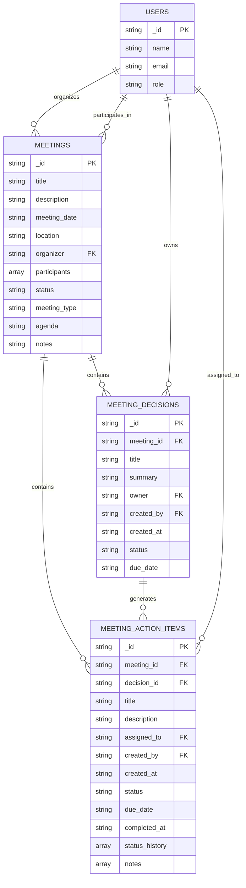
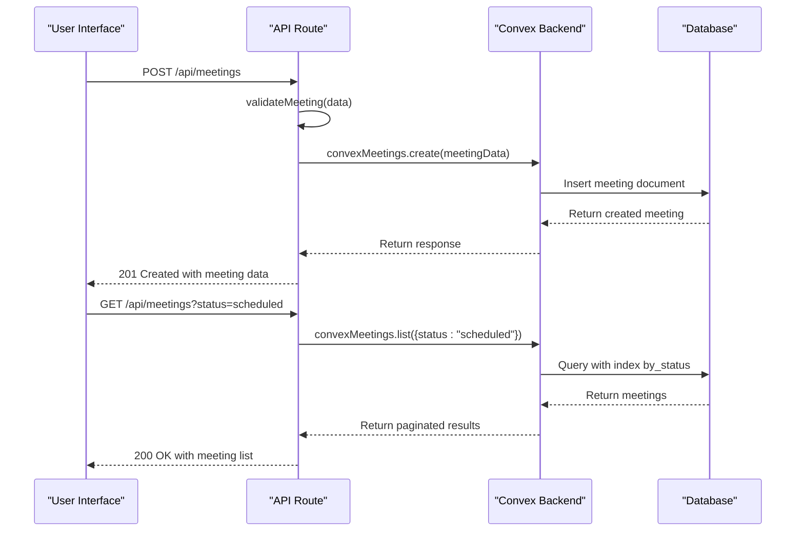
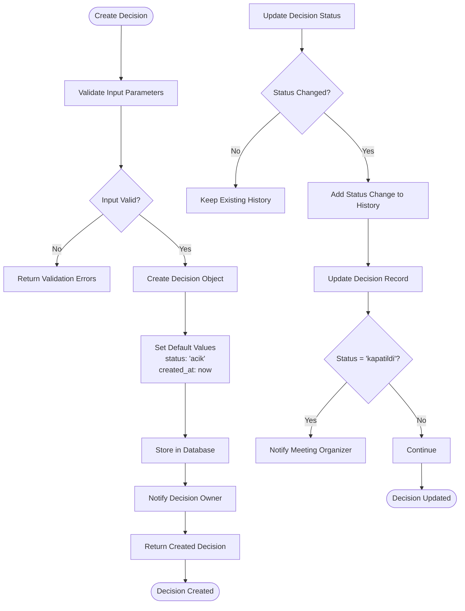
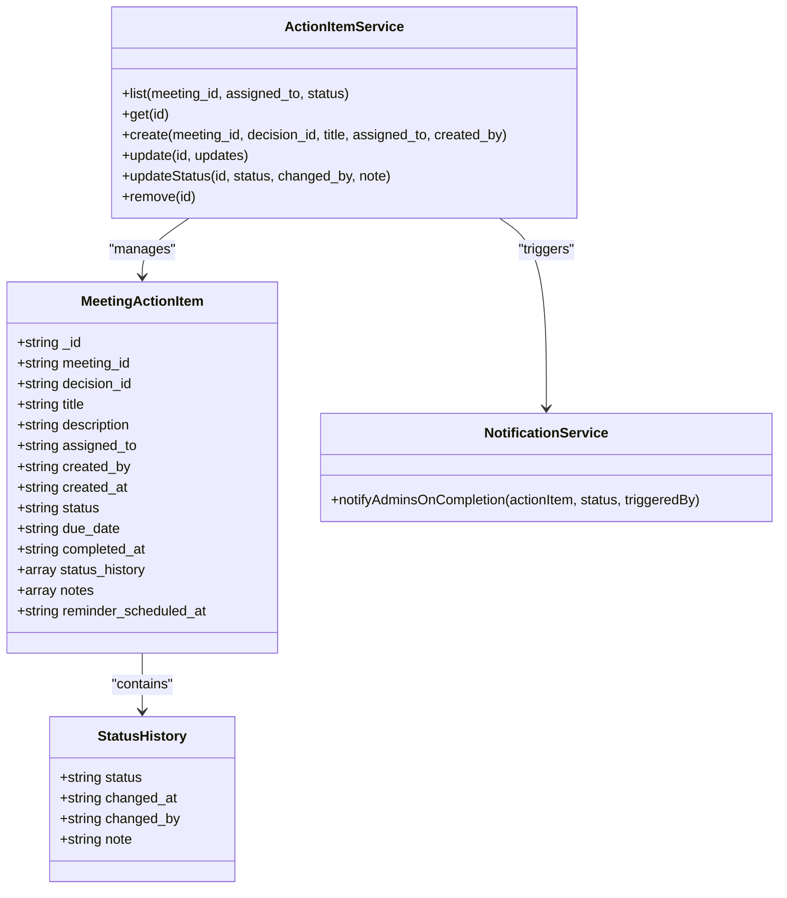
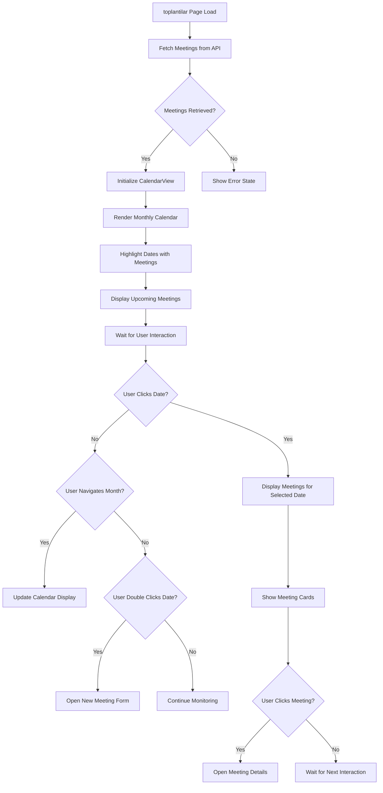
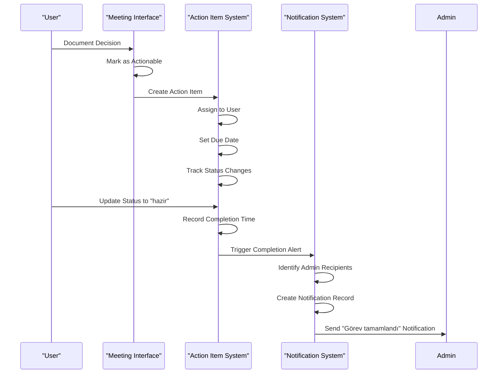

# Meeting Management

<cite>
**Referenced Files in This Document**   
- [meetings.ts](file://convex/meetings.ts)
- [meeting_decisions.ts](file://convex/meeting_decisions.ts)
- [meeting_action_items.ts](file://convex/meeting_action_items.ts)
- [CalendarView.tsx](file://src/components/meetings/CalendarView.tsx)
- [toplantilar/page.tsx](file://src/app/(dashboard)/is/toplantilar/page.tsx)
- [yonetim/page.tsx](file://src/app/(dashboard)/is/yonetim/page.tsx)
- [meeting.ts](file://src/lib/validations/meeting.ts)
- [meetingActionItem.ts](file://src/lib/validations/meetingActionItem.ts)
</cite>

## Table of Contents

1. [Introduction](#introduction)
2. [Meeting Data Model](#meeting-data-model)
3. [Meeting Scheduling Implementation](#meeting-scheduling-implementation)
4. [Decision Tracking System](#decision-tracking-system)
5. [Action Item Management](#action-item-management)
6. [toplantilar Calendar Interface](#toplantilar-calendar-interface)
7. [yonetim Meeting Minutes System](#yonetim-meeting-minutes-system)
8. [Integration with Task Management](#integration-with-task-management)
9. [User Management Integration](#user-management-integration)
10. [Meeting Templates and Reporting](#meeting-templates-and-reporting)

## Introduction

The Meeting Management module provides a comprehensive solution for organizing, tracking, and following up on meetings within the organization. This system enables users to schedule meetings, document decisions, assign action items, and ensure accountability through integrated task management and notifications. The implementation leverages Convex as the backend database and real-time data layer, with a React-based frontend interface for user interaction.

The core functionality revolves around three interconnected Convex modules: meetings.ts, meeting_decisions.ts, and meeting_action_items.ts, which work together to create a seamless meeting lifecycle management system. The module supports various meeting types including general, committee, and board meetings, with appropriate access controls and workflows.

**Section sources**

- [meetings.ts](file://convex/meetings.ts#L1-L124)
- [meeting_decisions.ts](file://convex/meeting_decisions.ts#L1-L114)
- [meeting_action_items.ts](file://convex/meeting_action_items.ts#L1-L267)

## Meeting Data Model

The meeting data model is designed to capture all essential aspects of a meeting, including scheduling information, participants, agenda, and outcomes. The primary meeting document structure includes the following fields:

- **title**: The meeting title with a minimum of 3 characters
- **description**: Optional meeting description (up to 2000 characters)
- **meeting_date**: Scheduled date and time of the meeting
- **location**: Physical or virtual meeting location
- **organizer**: The user who created the meeting
- **participants**: Array of user IDs attending the meeting
- **status**: Current status (scheduled, ongoing, completed, cancelled)
- **meeting_type**: Type of meeting (general, committee, board, other)
- **agenda**: Meeting agenda (up to 2000 characters)
- **notes**: Meeting notes or minutes

The data model enforces business rules such as requiring the organizer to be included in the participants list and validating that meeting dates are in the future for new meetings. Decision tracking extends this model with meeting_decisions, which are linked to specific meetings and include decision titles, summaries, owners, and statuses (acik, devam, kapatildi). Action items are similarly linked to meetings and optionally to specific decisions, creating a traceable workflow from discussion to execution.

**Diagram sources**

- [meetings.ts](file://convex/meetings.ts#L54-L74)
- [meeting_decisions.ts](file://convex/meeting_decisions.ts#L53-L60)
- [meeting_action_items.ts](file://convex/meeting_action_items.ts#L55-L65)

**Section sources**

- [meetings.ts](file://convex/meetings.ts#L52-L77)
- [meeting_decisions.ts](file://convex/meeting_decisions.ts#L52-L61)
- [meeting_action_items.ts](file://convex/meeting_action_items.ts#L54-L66)

## Meeting Scheduling Implementation

The meeting scheduling system provides a robust API for creating, updating, and retrieving meetings through the meetings.ts Convex module. The implementation includes comprehensive validation rules to ensure data integrity and business logic compliance. When creating a new meeting, the system validates that the meeting date is at least one hour in the future and that the organizer is included in the participants list.

The scheduling interface supports filtering meetings by status, organizer, or date, allowing users to quickly find relevant meetings. The list query uses indexed database queries for optimal performance, with separate indexes for status, organizer, and meeting date. Meetings can be retrieved individually by ID or paginated in bulk for display in calendar and list views.

The frontend validation in meeting.ts uses Zod schemas to enforce client-side validation before submitting to the API, providing immediate feedback to users. The meetingSchema includes rules for minimum title length, required fields, and proper date formatting. For editing existing meetings, the meetingEditSchema relaxes the future date requirement while maintaining other validation rules.

**Diagram sources**

- [meetings.ts](file://convex/meetings.ts#L52-L77)
- [src/app/api/meetings/route.ts](file://src/app/api/meetings/route.ts#L75-L137)
- [src/lib/validations/meeting.ts](file://src/lib/validations/meeting.ts#L58-L94)

**Section sources**

- [meetings.ts](file://convex/meetings.ts#L52-L77)
- [src/app/api/meetings/route.ts](file://src/app/api/meetings/route.ts#L75-L137)
- [src/lib/validations/meeting.ts](file://src/lib/validations/meeting.ts#L58-L94)

## Decision Tracking System

The decision tracking system, implemented in meeting_decisions.ts, provides a structured approach to documenting and following up on meeting outcomes. Each decision is linked to a specific meeting and includes metadata such as title, summary, owner, creation details, status, and optional due date. The system supports three status states: "acik" (open), "devam" (in progress), and "kapatildi" (closed), allowing teams to track the lifecycle of decisions from inception to resolution.

The implementation includes query methods to retrieve decisions by meeting, owner, or status, enabling focused views for meeting participants and decision owners. When a decision is created, it automatically records the creator and timestamp, establishing an audit trail. The update functionality allows decision owners to modify details and change status as progress is made.

The validation rules ensure that each decision is associated with a valid meeting and has a meaningful title. The system integrates with user management to properly attribute decisions to specific users and supports filtering decisions by user role, which is particularly useful for administrative oversight.

**Diagram sources**

- [meeting_decisions.ts](file://convex/meeting_decisions.ts#L51-L77)
- [src/app/api/meeting-decisions/route.ts](file://src/app/api/meeting-decisions/route.ts#L75-L113)
- [src/lib/validations/meetingActionItem.ts](file://src/lib/validations/meetingActionItem.ts#L21-L25)

**Section sources**

- [meeting_decisions.ts](file://convex/meeting_decisions.ts#L51-L77)
- [src/app/api/meeting-decisions/route.ts](file://src/app/api/meeting-decisions/route.ts#L75-L113)

## Action Item Management

The action item management system, implemented in meeting_action_items.ts, transforms meeting decisions into actionable tasks with clear ownership and tracking. Each action item is linked to a meeting and optionally to a specific decision, creating a traceable workflow from discussion to execution. Action items have four status states: "beklemede" (pending), "devam" (in progress), "hazir" (completed), and "iptal" (cancelled).

The system maintains a comprehensive status history for each action item, recording every status change with timestamp and user information. This audit trail provides transparency into the progress of tasks and helps identify bottlenecks. When an action item is marked as completed, the system automatically notifies administrators through the workflow_notifications system.

The implementation includes specialized mutation functions for updating action items, with updateStatus providing a streamlined interface for changing only the status while maintaining other fields. The notification system specifically targets ADMIN and SUPER_ADMIN users, ensuring that leadership is aware of task completions without overwhelming all users with notifications.

**Diagram sources**

- [meeting_action_items.ts](file://convex/meeting_action_items.ts#L53-L93)
- [meeting_action_items.ts](file://convex/meeting_action_items.ts#L95-L139)
- [meeting_action_items.ts](file://convex/meeting_action_items.ts#L189-L252)

**Section sources**

- [meeting_action_items.ts](file://convex/meeting_action_items.ts#L53-L93)
- [meeting_action_items.ts](file://convex/meeting_action_items.ts#L95-L139)

## toplantilar Calendar Interface

The toplantilar calendar interface provides a visual representation of scheduled meetings, allowing users to easily view, navigate, and interact with meeting data. Implemented in the toplantilar/page.tsx component, this interface uses the CalendarView component to display meetings in a monthly calendar format with intuitive navigation controls.

The calendar highlights dates with scheduled meetings through underlined text and color-coding based on meeting type: blue for general meetings, purple for committee meetings, red for board meetings, and gray for other meetings. Users can navigate between months using arrow buttons or jump to the current date with the "Today" button. Clicking on a specific date displays all meetings scheduled for that day, while double-clicking allows creating a new meeting for that date.

The interface integrates with the meeting API to fetch and display meeting data, using the list query with appropriate filters. Meeting cards show essential information including time, title, location, participant count, and status, with visual indicators for quick identification. The responsive design adapts to different screen sizes, displaying meetings in a grid layout on larger screens and a stacked layout on mobile devices.

**Diagram sources**

- [toplantilar/page.tsx](<file://src/app/(dashboard)/is/toplantilar/page.tsx#L55-L776>)
- [CalendarView.tsx](file://src/components/meetings/CalendarView.tsx#L22-L284)

**Section sources**

- [toplantilar/page.tsx](<file://src/app/(dashboard)/is/toplantilar/page.tsx#L55-L776>)
- [CalendarView.tsx](file://src/components/meetings/CalendarView.tsx#L22-L284)

## yonetim Meeting Minutes System

The yonetim meeting minutes system, accessible through the yonetim/page.tsx component, provides a comprehensive interface for documenting and reviewing meeting outcomes. This system is specifically designed for formal meetings such as board meetings, where detailed minutes and decision tracking are essential.

The interface allows users to create and edit meeting minutes, linking them directly to the corresponding meeting record. It provides dedicated sections for recording decisions (meeting_decisions) and action items (meeting_action_items), ensuring that all outcomes are properly documented and assigned. The system supports rich text editing for detailed notes and integrates with the validation rules to ensure completeness and accuracy.

For completed meetings, the yonetim interface displays a summary of all decisions and action items, allowing reviewers to quickly assess outcomes and follow-up requirements. The system also provides export functionality for generating official meeting minutes documents, which can be shared with stakeholders or stored in the organization's records.

**Section sources**

- [yonetim/page.tsx](<file://src/app/(dashboard)/is/yonetim/page.tsx#L67-L67>)

## Integration with Task Management

The meeting management system seamlessly integrates with the organization's task management system through automated action item creation. When a decision is documented in a meeting, users can convert it into an action item that automatically becomes a tracked task in the system. This integration ensures that meeting outcomes are not lost and that accountability is established for follow-up actions.

The integration is implemented through the meeting_action_items.ts module, which creates task records in the database with all necessary details including title, description, assignee, due date, and status. The system maintains the connection between the action item and its parent decision, allowing users to trace tasks back to their origin in meeting discussions.

When an action item is completed, the system automatically notifies administrators through the workflow_notifications module, creating a notification with category "gorev" (task) and including metadata about the associated meeting and decision. This ensures that leadership is aware of task completions without requiring manual reporting.

**Diagram sources**

- [meeting_action_items.ts](file://convex/meeting_action_items.ts#L189-L252)
- [workflow_notifications.ts](file://convex/workflow_notifications.ts#L1-L10)

**Section sources**

- [meeting_action_items.ts](file://convex/meeting_action_items.ts#L189-L252)

## User Management Integration

The meeting management system is tightly integrated with the user management system to ensure proper participant tracking and notifications. All meeting participants, organizers, decision owners, and action item assignees are referenced by their user IDs, creating a direct link to the user directory.

The system enforces that the meeting organizer must be included in the participants list, ensuring that someone is always responsible for the meeting. When action items are completed, the notification system queries the user database to identify all users with ADMIN or SUPER_ADMIN roles, ensuring that appropriate personnel receive completion alerts.

The integration also supports role-based access control, where users can only access meeting data based on their permissions. The requireModuleAccess('workflow') function in the API routes ensures that only authorized users can create, update, or delete meeting records, decisions, and action items.

**Section sources**

- [users.ts](file://convex/users.ts#L1-L10)
- [meeting_action_items.ts](file://convex/meeting_action_items.ts#L211-L225)
- [auth.ts](file://convex/auth.ts#L1-L10)

## Meeting Templates and Reporting

The system supports meeting templates and reporting capabilities to streamline recurring meetings and track meeting outcomes over time. While specific template implementation details are not visible in the provided code, the data model supports the concept through the meeting_type field, which distinguishes between general, committee, and board meetings.

Reporting on meeting outcomes is facilitated through the query interfaces in each module, allowing aggregation of data across meetings, decisions, and action items. Administrators can generate reports on decision completion rates, action item status distribution, and meeting participation patterns. The status history fields in action items and decisions provide valuable data for analyzing workflow efficiency and identifying bottlenecks.

The system could be extended to support custom meeting templates with predefined agendas, participant lists, and decision categories, reducing setup time for recurring meetings. Reporting dashboards could visualize key metrics such as average decision resolution time, action item completion rates by team, and meeting frequency by type.

**Section sources**

- [meeting.ts](file://convex/meetings.ts#L66-L71)
- [meeting_decisions.ts](file://convex/meeting_decisions.ts#L4-L8)
- [meeting_action_items.ts](file://convex/meeting_action_items.ts#L5-L10)
