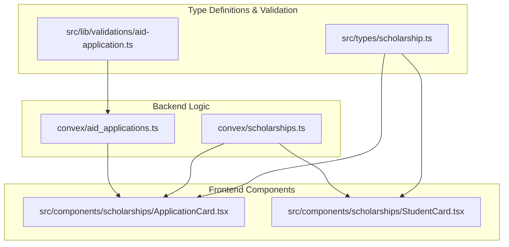
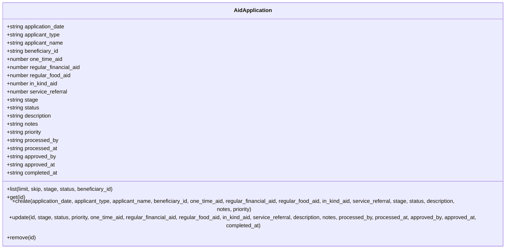
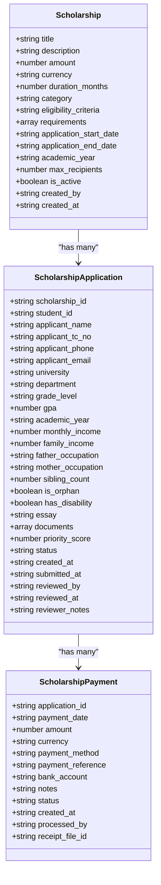
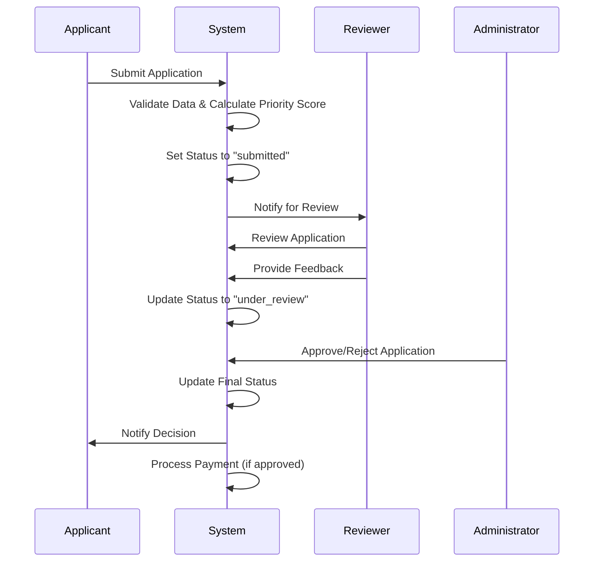
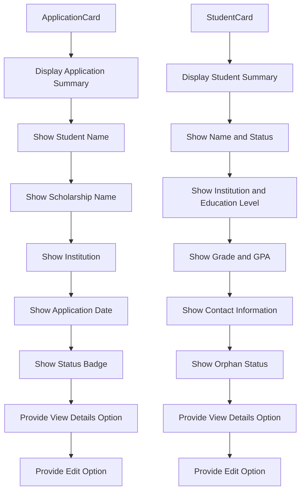
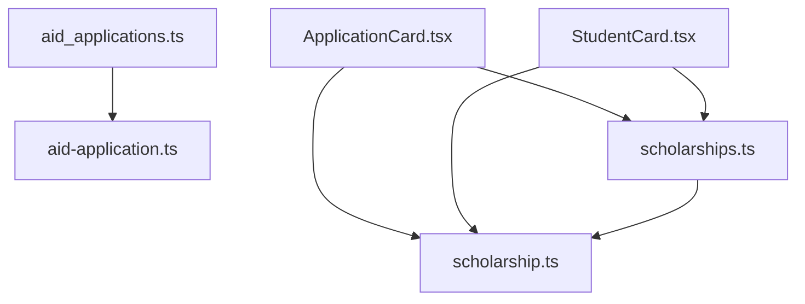

# Scholarship Management

<cite>
**Referenced Files in This Document**   
- [aid_applications.ts](file://convex/aid_applications.ts)
- [scholarships.ts](file://convex/scholarships.ts)
- [aid-application.ts](file://src/lib/validations/aid-application.ts)
- [scholarship.ts](file://src/types/scholarship.ts)
- [ApplicationCard.tsx](file://src/components/scholarships/ApplicationCard.tsx)
- [StudentCard.tsx](file://src/components/scholarships/StudentCard.tsx)
</cite>

## Table of Contents

1. [Introduction](#introduction)
2. [Project Structure](#project-structure)
3. [Core Components](#core-components)
4. [Architecture Overview](#architecture-overview)
5. [Detailed Component Analysis](#detailed-component-analysis)
6. [Dependency Analysis](#dependency-analysis)
7. [Performance Considerations](#performance-considerations)
8. [Troubleshooting Guide](#troubleshooting-guide)
9. [Conclusion](#conclusion)

## Introduction

The Scholarship Management module provides a comprehensive system for handling scholarship applications, reviews, and student tracking. It supports end-to-end workflows from application submission to award disbursement, integrating with beneficiary management and financial systems. The module enables administrators to configure application periods, eligibility criteria, and approval workflows while providing user interfaces for managing applications on the basvurular page and tracking awarded students on the ogrenciler page.

## Project Structure

The Scholarship Management module is organized across multiple directories with clear separation of concerns. Core business logic resides in the convex directory, while frontend components are located in src/components/scholarships. Type definitions and validation schemas are maintained in src/types and src/lib/validations respectively.

**Diagram sources**

- [aid_applications.ts](file://convex/aid_applications.ts)
- [scholarships.ts](file://convex/scholarships.ts)
- [ApplicationCard.tsx](file://src/components/scholarships/ApplicationCard.tsx)
- [StudentCard.tsx](file://src/components/scholarships/StudentCard.tsx)
- [scholarship.ts](file://src/types/scholarship.ts)
- [aid-application.ts](file://src/lib/validations/aid-application.ts)

**Section sources**

- [aid_applications.ts](file://convex/aid_applications.ts)
- [scholarships.ts](file://convex/scholarships.ts)

## Core Components

The Scholarship Management module consists of two primary components: aid applications and scholarship programs. The aid_applications.ts file handles the lifecycle of aid requests including creation, updating, and deletion, while scholarships.ts manages scholarship programs, applications, and payments. These components work together to provide a complete scholarship management solution with proper validation rules and data models.

**Section sources**

- [aid_applications.ts](file://convex/aid_applications.ts#L1-L162)
- [scholarships.ts](file://convex/scholarships.ts#L1-L429)

## Architecture Overview

The Scholarship Management module follows a clean architecture pattern with separation between data access, business logic, and presentation layers. The backend logic is implemented using Convex functions that provide query and mutation operations for scholarship data. These functions are consumed by frontend components through API routes, enabling a decoupled architecture that supports scalability and maintainability.

**Diagram sources**

- [aid_applications.ts](file://convex/aid_applications.ts#L1-L162)
- [scholarships.ts](file://convex/scholarships.ts#L1-L429)

## Detailed Component Analysis

### Aid Applications Analysis

The aid_applications.ts module provides comprehensive functionality for managing aid applications through a set of well-defined query and mutation operations. It supports listing applications with various filters, retrieving individual applications, creating new applications, updating existing ones, and removing applications when necessary.

**Diagram sources**

- [aid_applications.ts](file://convex/aid_applications.ts#L1-L162)

**Section sources**

- [aid_applications.ts](file://convex/aid_applications.ts#L1-L162)
- [aid-application.ts](file://src/lib/validations/aid-application.ts#L1-L70)

### Scholarship Programs Analysis

The scholarships.ts module implements a comprehensive scholarship management system with support for multiple scholarship types, application processing, and payment tracking. It includes functionality for managing scholarship programs, handling applications, calculating priority scores, and processing payments.

**Diagram sources**

- [scholarships.ts](file://convex/scholarships.ts#L1-L429)

**Section sources**

- [scholarships.ts](file://convex/scholarships.ts#L1-L429)
- [scholarship.ts](file://src/types/scholarship.ts#L1-L408)

### Application Workflow Analysis

The scholarship application workflow follows a structured process from submission to awarding. Applicants submit their information which is then reviewed by administrators. The system automatically calculates a priority score based on various factors including GPA, income level, and special circumstances such as orphan status or disabilities.

**Diagram sources**

- [scholarships.ts](file://convex/scholarships.ts#L189-L277)
- [aid_applications.ts](file://convex/aid_applications.ts#L55-L92)

**Section sources**

- [scholarships.ts](file://convex/scholarships.ts#L189-L277)
- [aid_applications.ts](file://convex/aid_applications.ts#L55-L92)

### Frontend Components Analysis

The frontend components provide user-friendly interfaces for managing scholarship applications and tracking students. The ApplicationCard component displays application information in a compact format with status indicators, while the StudentCard component shows detailed student information including academic and personal details.

**Diagram sources**

- [ApplicationCard.tsx](file://src/components/scholarships/ApplicationCard.tsx#L1-L123)
- [StudentCard.tsx](file://src/components/scholarships/StudentCard.tsx#L1-L202)

**Section sources**

- [ApplicationCard.tsx](file://src/components/scholarships/ApplicationCard.tsx#L1-L123)
- [StudentCard.tsx](file://src/components/scholarships/StudentCard.tsx#L1-L202)

## Dependency Analysis

The Scholarship Management module has well-defined dependencies between its components. The frontend components depend on type definitions from the scholarship.ts file, while the backend logic in aid_applications.ts and scholarships.ts depends on validation schemas and business rules.

**Diagram sources**

- [aid_applications.ts](file://convex/aid_applications.ts)
- [scholarships.ts](file://convex/scholarships.ts)
- [aid-application.ts](file://src/lib/validations/aid-application.ts)
- [scholarship.ts](file://src/types/scholarship.ts)
- [ApplicationCard.tsx](file://src/components/scholarships/ApplicationCard.tsx)
- [StudentCard.tsx](file://src/components/scholarships/StudentCard.tsx)

**Section sources**

- [aid_applications.ts](file://convex/aid_applications.ts)
- [scholarships.ts](file://convex/scholarships.ts)

## Performance Considerations

The Scholarship Management module is designed with performance in mind. The use of indexed queries in both aid_applications.ts and scholarships.ts ensures efficient data retrieval even with large datasets. Pagination is implemented in all list operations to prevent performance degradation when dealing with numerous records. The system also includes automatic timestamp management to reduce the need for additional database operations.

## Troubleshooting Guide

When encountering issues with the Scholarship Management module, consider the following common problems and solutions:

- Application submission failures: Verify that all required fields are filled and that the TC number format is valid (11 digits)
- Missing applications in lists: Check that the appropriate filters are applied and that the user has sufficient permissions
- Payment processing issues: Ensure that the application status is approved before attempting to create payments
- Data validation errors: Confirm that all input data conforms to the defined validation rules in the schema files

**Section sources**

- [aid_applications.ts](file://convex/aid_applications.ts)
- [scholarships.ts](file://convex/scholarships.ts)
- [aid-application.ts](file://src/lib/validations/aid-application.ts)

## Conclusion

The Scholarship Management module provides a robust and comprehensive solution for managing scholarship programs from application through awarding. Its well-structured architecture, clear separation of concerns, and comprehensive feature set make it suitable for organizations of various sizes. The integration with beneficiary management and financial systems ensures data consistency across the platform, while the configurable application periods, eligibility criteria, and approval workflows provide flexibility to meet diverse organizational needs.
