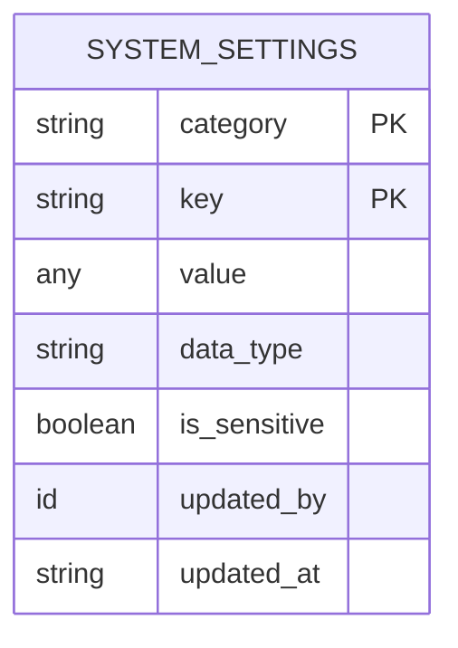
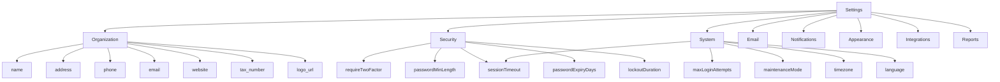
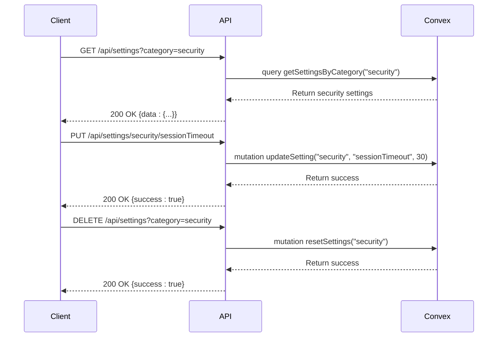
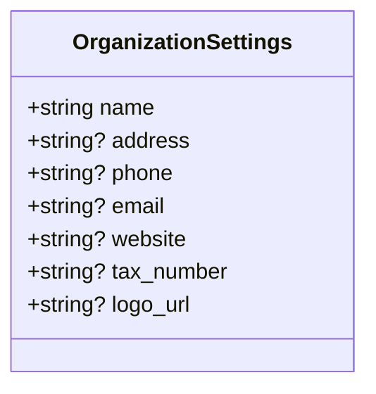
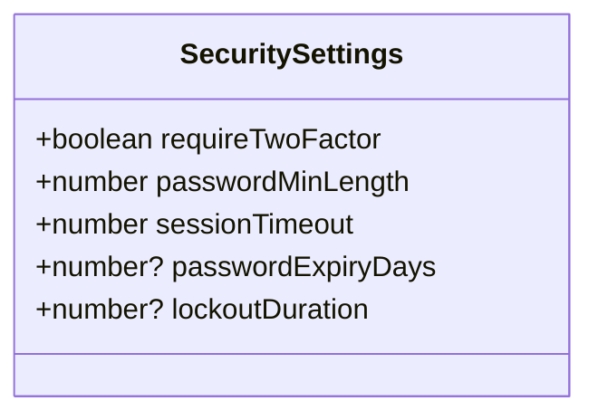
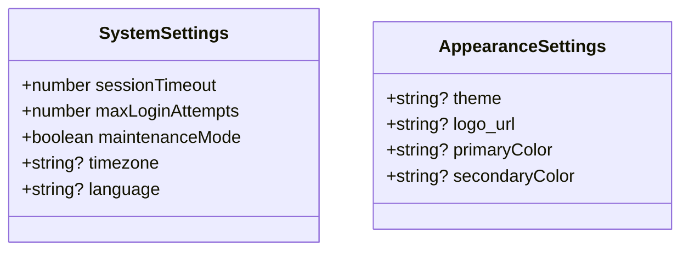
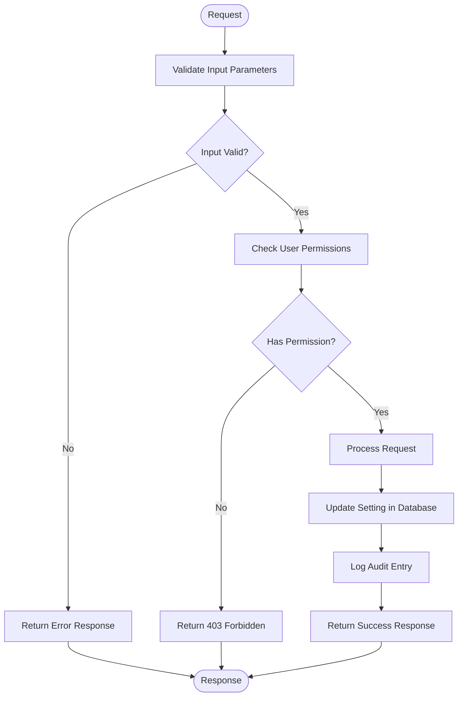
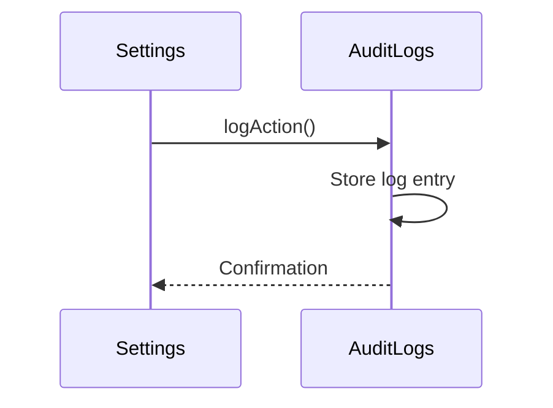
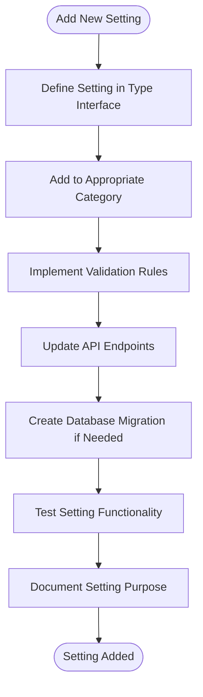

# System Settings

<cite>
**Referenced Files in This Document**   
- [system_settings.ts](file://convex/system_settings.ts)
- [settings/route.ts](file://src/app/api/settings/route.ts)
- [settings/[category]/[key]/route.ts](file://src/app/api/settings/[category]/[key]/route.ts)
- [settings.ts](file://src/lib/api/settings.ts)
- [audit_logs.ts](file://convex/audit_logs.ts)
</cite>

## Table of Contents

1. [Introduction](#introduction)
2. [Settings Data Model](#settings-data-model)
3. [Hierarchical Structure](#hierarchical-structure)
4. [API Endpoints](#api-endpoints)
5. [Organization Configuration](#organization-configuration)
6. [Security Settings](#security-settings)
7. [User Preferences](#user-preferences)
8. [Settings Management in ayarlar Interface](#settings-management-in-ayarlar-interface)
9. [Validation and Access Controls](#validation-and-access-controls)
10. [Audit Logging](#audit-logging)
11. [Environment-Specific Configurations](#environment-specific-configurations)
12. [Adding New Settings](#adding-new-settings)

## Introduction

The System Settings module provides a comprehensive configuration framework for managing organizational parameters, security policies, and user preferences. This document details the implementation of settings management through the system_settings.ts file and associated API routes. The system supports hierarchical organization of settings into categories and keys, with robust validation, access controls, and audit logging capabilities.

**Section sources**

- [system_settings.ts](file://convex/system_settings.ts#L1-L244)
- [settings/route.ts](file://src/app/api/settings/route.ts#L1-L128)

## Settings Data Model

The settings system uses a flexible data model that supports various data types and metadata. Each setting is stored with its category, key, value, data type, sensitivity flag, and audit information.

**Diagram sources**

- [system_settings.ts](file://convex/system_settings.ts#L75-L79)

The data model includes the following key attributes:

- **category**: The organizational category (e.g., organization, security, system)
- **key**: The specific setting identifier within the category
- **value**: The setting value, which can be string, number, boolean, object, or array
- **data_type**: Automatically determined type of the value
- **is_sensitive**: Flag indicating if the setting contains sensitive information
- **updated_by**: Reference to the user who last modified the setting
- **updated_at**: Timestamp of the last modification

**Section sources**

- [system_settings.ts](file://convex/system_settings.ts#L87-L92)
- [system_settings.ts](file://convex/system_settings.ts#L117-L119)

## Hierarchical Structure

Settings are organized in a two-level hierarchy with categories and keys. This structure enables logical grouping of related configuration options.

**Diagram sources**

- [settings.ts](file://src/lib/api/settings.ts#L6-L14)
- [settings.ts](file://src/lib/api/settings.ts#L23-L31)

The hierarchical structure supports:

- **Category-based organization**: Settings are grouped into logical categories
- **Key-based identification**: Each setting has a unique key within its category
- **Bulk operations**: Settings can be retrieved or updated by category
- **Granular access**: Fine-grained control over individual settings

**Section sources**

- [settings.ts](file://src/lib/api/settings.ts#L6-L14)
- [system_settings.ts](file://convex/system_settings.ts#L5-L21)

## API Endpoints

The settings module exposes a comprehensive REST API for managing configuration data. The endpoints follow a consistent pattern for different operations.

**Diagram sources**

- [settings/route.ts](file://src/app/api/settings/route.ts#L5-L32)
- [settings/[category]/[key]/route.ts](file://src/app/api/settings/[category]/[key]/route.ts#L5-L30)

The API provides the following endpoints:

- **GET /api/settings**: Retrieve all settings or settings by category
- **POST /api/settings/[category]**: Create or update settings for a category
- **PUT /api/settings/[category]/[key]**: Update a single setting
- **PUT /api/settings**: Update all settings (bulk)
- **DELETE /api/settings**: Reset settings to defaults

**Section sources**

- [settings/route.ts](file://src/app/api/settings/route.ts#L5-L126)
- [settings/[category]/[key]/route.ts](file://src/app/api/settings/[category]/[key]/route.ts#L5-L67)

## Organization Configuration

The organization category manages core organizational information and branding elements. These settings define the organization's identity and contact information.

**Diagram sources**

- [settings.ts](file://src/lib/api/settings.ts#L23-L31)

Key organization settings include:

- **name**: The official name of the organization
- **address**: Physical address for correspondence
- **phone**: Primary contact phone number
- **email**: Official email address
- **website**: Organization's website URL
- **tax_number**: Tax identification number
- **logo_url**: URL to the organization's logo

These settings are typically configured during system initialization and may require administrative privileges to modify.

**Section sources**

- [settings.ts](file://src/lib/api/settings.ts#L23-L31)
- [system_settings.ts](file://convex/system_settings.ts#L72-L125)

## Security Settings

The security category manages authentication policies and access control parameters. These settings are critical for maintaining system security and compliance.

**Diagram sources**

- [settings.ts](file://src/lib/api/settings.ts#L58-L64)

Key security settings include:

- **requireTwoFactor**: Whether two-factor authentication is mandatory
- **passwordMinLength**: Minimum required password length
- **sessionTimeout**: Session inactivity timeout in minutes
- **passwordExpiryDays**: Password expiration period in days
- **lockoutDuration**: Account lockout duration after failed attempts

Sensitive settings containing "password", "secret", or "key" in their key name are automatically flagged as sensitive and subject to additional security measures.

**Section sources**

- [settings.ts](file://src/lib/api/settings.ts#L58-L64)
- [system_settings.ts](file://convex/system_settings.ts#L117-L119)

## User Preferences

User preferences settings manage system-wide defaults and user interface configurations. These settings affect the user experience and system behavior.

**Diagram sources**

- [settings.ts](file://src/lib/api/settings.ts#L49-L56)
- [settings.ts](file://src/lib/api/settings.ts#L66-L71)

Key user preference settings include:

- **sessionTimeout**: Default session timeout duration
- **maxLoginAttempts**: Maximum failed login attempts before lockout
- **maintenanceMode**: Whether the system is in maintenance mode
- **timezone**: Default timezone for date/time operations
- **language**: Default language for the user interface
- **theme**: UI theme (light, dark, etc.)
- **primaryColor**: Primary brand color
- **secondaryColor**: Secondary brand color

**Section sources**

- [settings.ts](file://src/lib/api/settings.ts#L49-L71)
- [system_settings.ts](file://convex/system_settings.ts#L50-L56)

## Settings Management in ayarlar Interface

The ayarlar interface provides a user-friendly way to configure system parameters. The interface follows a tabbed navigation pattern, with each tab representing a settings category.

When configuring system parameters in the ayarlar interface:

1. Users navigate to the settings page
2. Select the appropriate category tab
3. Modify the desired settings
4. Click save to persist changes

The interface validates input before submission and provides feedback on successful operations or validation errors. For example, when setting the session timeout, the interface validates that the value is within acceptable limits (typically 1-1440 minutes).

**Section sources**

- [settings/route.ts](file://src/app/api/settings/route.ts#L67-L90)
- [e2e/settings.spec.ts](file://e2e/settings.spec.ts#L106-L149)

## Validation and Access Controls

The settings system implements comprehensive validation and access controls to ensure data integrity and security.

**Diagram sources**

- [settings/route.ts](file://src/app/api/settings/route.ts#L39-L44)
- [settings/[category]/[key]/route.ts](file://src/app/api/settings/[category]/[key]/route.ts#L42-L46)

Validation rules include:

- Required fields validation (category and settings for POST requests)
- Data type validation for setting values
- Range validation for numeric settings
- Format validation for email and URL fields

Access controls ensure that only authorized users can modify settings, with different permission levels for viewing and editing.

**Section sources**

- [settings/route.ts](file://src/app/api/settings/route.ts#L39-L44)
- [settings/[category]/[key]/route.ts](file://src/app/api/settings/[category]/[key]/route.ts#L42-L46)

## Audit Logging

All settings changes are tracked through the audit logging system to ensure accountability and compliance. The audit logs capture critical information about configuration changes.

**Diagram sources**

- [audit_logs.ts](file://convex/audit_logs.ts#L11-L34)
- [system_settings.ts](file://convex/system_settings.ts#L74-L125)

Audit log entries for settings changes include:

- **userId**: The ID of the user making the change
- **userName**: The name of the user making the change
- **action**: The action performed (UPDATE, CREATE, DELETE)
- **resource**: "system_settings"
- **resourceId**: The category and key of the setting
- **changes**: Details of the changes made
- **ipAddress**: The IP address of the requesting client
- **userAgent**: The user agent string of the requesting client
- **timestamp**: When the change occurred

This comprehensive audit trail enables tracking of all configuration changes for security and compliance purposes.

**Section sources**

- [audit_logs.ts](file://convex/audit_logs.ts#L11-L34)
- [system_settings.ts](file://convex/system_settings.ts#L107-L109)

## Environment-Specific Configurations

The settings system supports environment-specific configurations through conditional logic and deployment practices. This allows different settings for development, staging, and production environments.

Best practices for environment-specific configurations include:

- Using environment variables for deployment-specific settings
- Implementing configuration profiles for different environments
- Using feature flags to enable/disable functionality
- Maintaining separate settings for sensitive production data

The system can be configured to load default settings based on the current environment, ensuring appropriate configurations are applied automatically during deployment.

**Section sources**

- [settings.ts](file://src/lib/api/settings.ts#L104-L105)
- [system_settings.ts](file://convex/system_settings.ts#L81-L82)

## Adding New Settings

Adding new settings to the system involves several steps to ensure proper integration and functionality.

**Diagram sources**

- [settings.ts](file://src/lib/api/settings.ts#L23-L71)
- [system_settings.ts](file://convex/system_settings.ts#L72-L125)

To add a new setting:

1. Define the setting in the appropriate type interface in settings.ts
2. Add the setting to the relevant category interface
3. Implement any necessary validation rules
4. Ensure the API endpoints can handle the new setting
5. If the setting is sensitive, ensure proper security measures are in place
6. Update documentation to include the new setting
7. Write tests to verify the setting works as expected

New settings are automatically handled by the existing CRUD operations, requiring minimal changes to the core settings management logic.

**Section sources**

- [settings.ts](file://src/lib/api/settings.ts#L23-L71)
- [system_settings.ts](file://convex/system_settings.ts#L72-L125)
