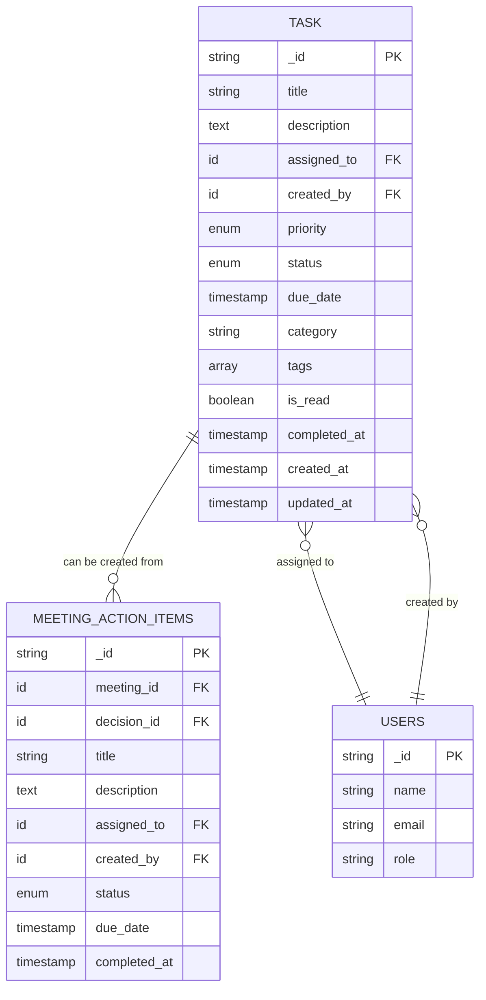
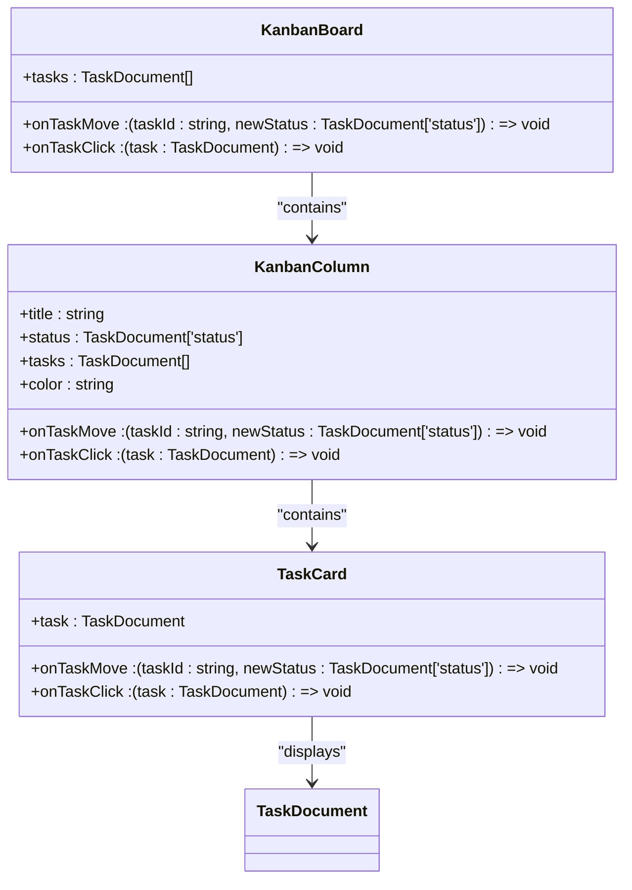
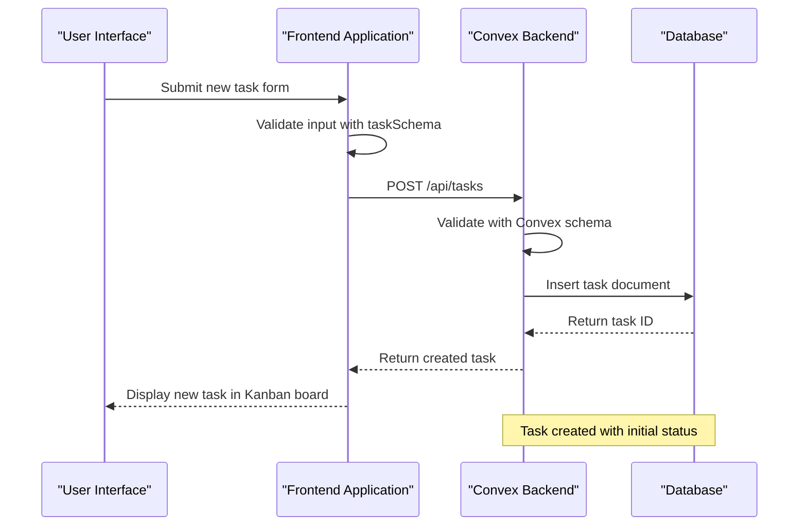
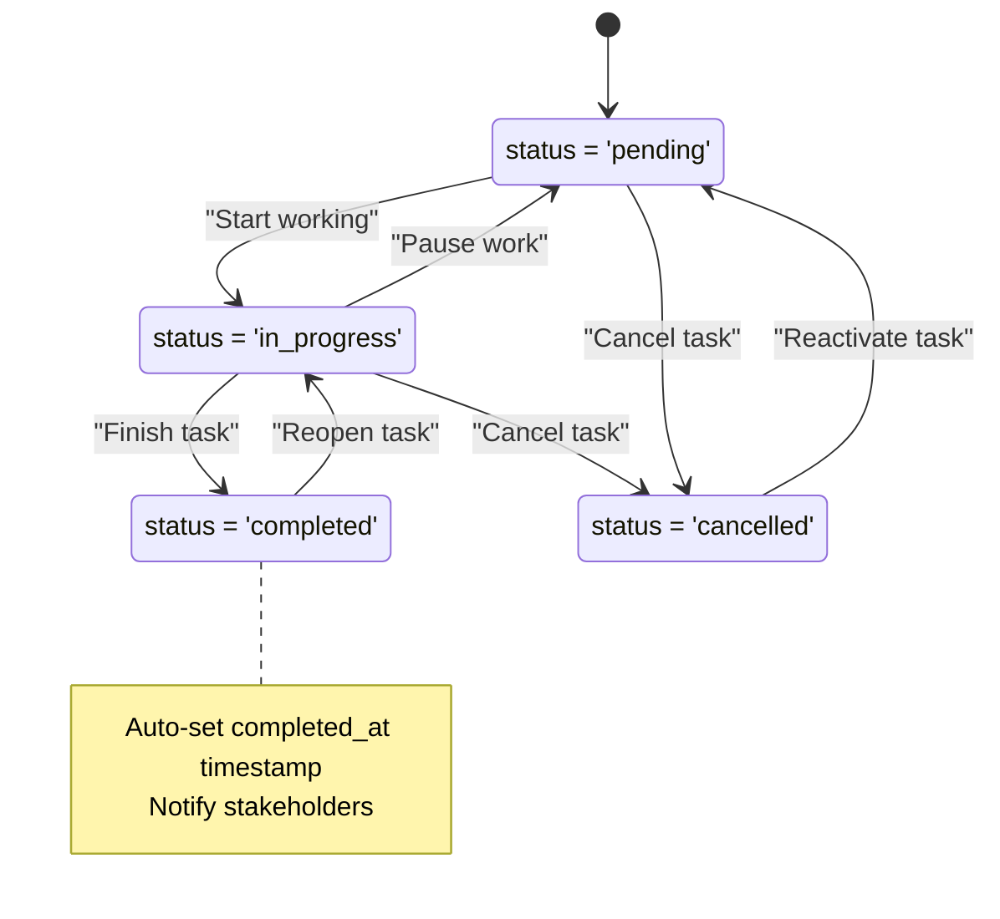
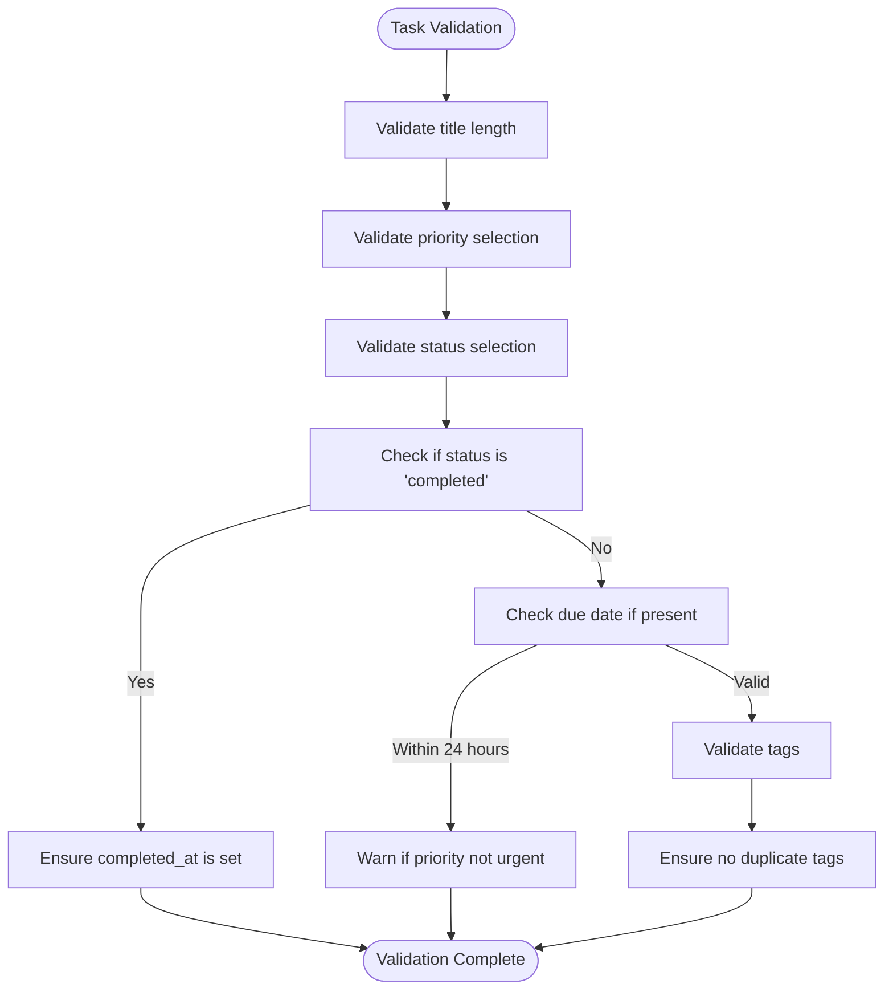
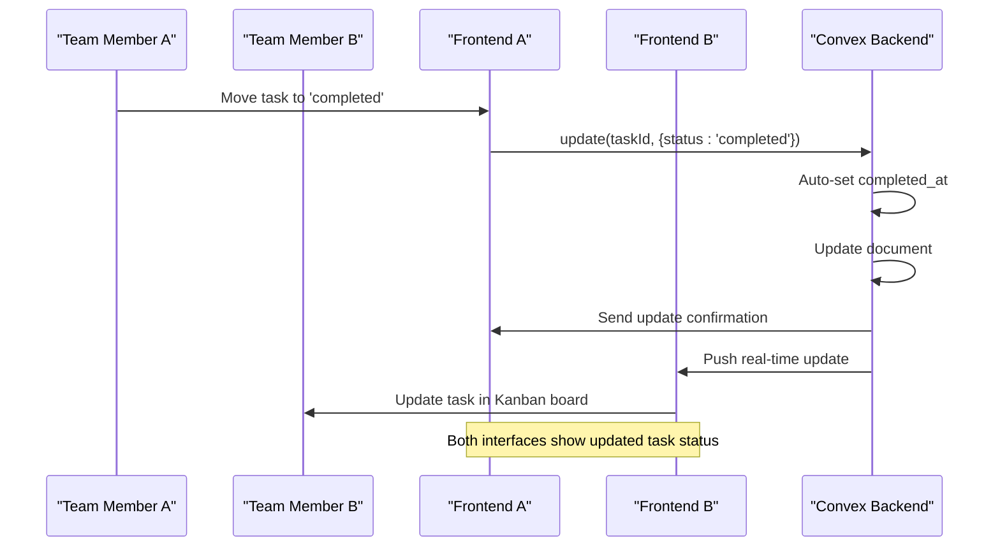
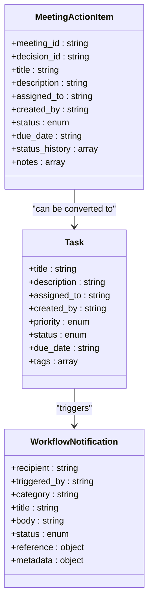
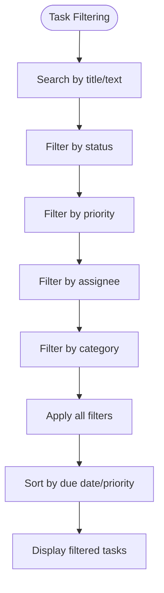

# Task Management

<cite>
**Referenced Files in This Document**   
- [KanbanBoard.tsx](file://src/components/tasks/KanbanBoard.tsx)
- [tasks.ts](file://convex/tasks.ts)
- [task.ts](file://src/lib/validations/task.ts)
- [meeting_action_items.ts](file://convex/meeting_action_items.ts)
</cite>

## Table of Contents

1. [Introduction](#introduction)
2. [Data Model](#data-model)
3. [Kanban Board Implementation](#kanban-board-implementation)
4. [Task Lifecycle Management](#task-lifecycle-management)
5. [Validation Rules](#validation-rules)
6. [Real-time Synchronization](#real-time-synchronization)
7. [Meeting Action Item Integration](#meeting-action-item-integration)
8. [Workflow Customization](#workflow-customization)
9. [Practical Usage Examples](#practical-usage-examples)

## Introduction

The Task Management module provides a comprehensive solution for team task coordination through a Kanban-style interface. Built with React and Convex, the system enables teams to create, assign, prioritize, and track tasks efficiently. The gorevler dashboard serves as the central hub for task management, integrating seamlessly with meeting management to track action items and decisions. This document details the implementation, data model, validation rules, and practical usage patterns for the task management system.

## Data Model

The task management system uses a structured data model with the following fields:

**Task Document Structure**

- **title**: String (3-100 characters) - Task title
- **description**: String (optional, up to 1000 characters) - Detailed task description
- **assigned_to**: User ID (optional) - User responsible for the task
- **created_by**: User ID - User who created the task
- **priority**: Enum (low, normal, high, urgent) - Task priority level
- **status**: Enum (pending, in_progress, completed, cancelled) - Current task status
- **due_date**: ISO string (optional) - Task deadline
- **category**: String (optional, up to 50 characters) - Task category
- **tags**: Array of strings (up to 10) - Task tags for organization
- **is_read**: Boolean - Read status for notifications
- **completed_at**: ISO string (optional) - Timestamp when task was completed

**Diagram sources**

- [tasks.ts](file://convex/tasks.ts#L54-L80)
- [meeting_action_items.ts](file://convex/meeting_action_items.ts#L52-L92)

**Section sources**

- [tasks.ts](file://convex/tasks.ts#L54-L80)
- [task.ts](file://src/lib/validations/task.ts#L40-L124)

## Kanban Board Implementation

The KanbanBoard component provides a visual interface for managing tasks across different workflow stages. The implementation uses React with drag-and-drop functionality to enable intuitive task management.

**Diagram sources**

- [KanbanBoard.tsx](file://src/components/tasks/KanbanBoard.tsx#L16-L20)

**Section sources**

- [KanbanBoard.tsx](file://src/components/tasks/KanbanBoard.tsx#L219-L236)

The Kanban board displays four workflow columns:

- **Pending**: Tasks awaiting action (yellow)
- **In Progress**: Tasks currently being worked on (blue)
- **Completed**: Finished tasks (green)
- **Cancelled**: Tasks that were cancelled (gray)

Each task card displays the title, description, assignee, priority badge, due date, and tags. The cards support drag-and-drop functionality to move tasks between columns, with visual feedback during drag operations.

## Task Lifecycle Management

The task management system supports a complete lifecycle from creation to completion, with appropriate backend handling for each stage.

### Creation Process

Tasks can be created through the Convex backend with required fields including title, creator, priority, and status. The system automatically validates all inputs against defined rules before creation.

**Diagram sources**

- [tasks.ts](file://convex/tasks.ts#L54-L80)
- [task.ts](file://src/lib/validations/task.ts#L40-L124)

### Status Transitions

The system manages task status transitions with appropriate business logic:

**Diagram sources**

- [tasks.ts](file://convex/tasks.ts#L83-L124)

When a task's status is changed to "completed", the system automatically sets the `completed_at` timestamp to the current time. This ensures accurate tracking of task completion times without requiring manual input.

**Section sources**

- [tasks.ts](file://convex/tasks.ts#L83-L124)

## Validation Rules

The task management system implements comprehensive validation rules to ensure data integrity and consistency.

### Field-Level Validation

Each field has specific validation requirements:

**Task Field Validation Rules**
| Field | Validation Rules | Error Messages |
|-------|------------------|---------------|
| title | 3-100 characters, trimmed | "Title must be 3-100 characters" |
| description | Optional, up to 1000 characters | "Description cannot exceed 1000 characters" |
| priority | Required, one of: low, normal, high, urgent | "Please select priority" |
| status | Required, one of: pending, in_progress, completed, cancelled | "Please select status" |
| due_date | Optional, must be today or future date | "Due date must be today or in the future" |
| tags | Optional, up to 10 tags, no duplicates | "Maximum 10 tags", "Duplicate tags not allowed" |
| assigned_to | Optional, valid user ID | N/A |
| category | Optional, up to 50 characters | "Category cannot exceed 50 characters" |

### Cross-Field Validation

The system implements cross-field validation rules:

**Diagram sources**

- [task.ts](file://src/lib/validations/task.ts#L40-L124)

Special validation rules include:

- Automatic warning when a task with a due date within 24 hours has a non-urgent priority
- Prevention of duplicate tags within a single task
- Automatic setting of completion timestamp when status changes to "completed"

**Section sources**

- [task.ts](file://src/lib/validations/task.ts#L40-L124)

## Real-time Synchronization

The system ensures real-time synchronization between team members through the Convex real-time database.

### Update Propagation

When a task is modified, changes are immediately propagated to all connected clients:

**Diagram sources**

- [tasks.ts](file://convex/tasks.ts#L83-L124)

The real-time synchronization ensures that all team members see the same task state, preventing conflicts and improving collaboration efficiency.

**Section sources**

- [tasks.ts](file://convex/tasks.ts#L83-L124)

## Meeting Action Item Integration

The task management system integrates with meeting management to track action items from meetings.

### Action Item Creation

Meeting action items can be converted to tasks, maintaining the connection between the meeting and the task:

**Diagram sources**

- [meeting_action_items.ts](file://convex/meeting_action_items.ts#L52-L92)
- [tasks.ts](file://convex/tasks.ts#L54-L80)

When an action item is marked as "completed" (hazir), the system automatically notifies administrators and relevant stakeholders through workflow notifications.

**Section sources**

- [meeting_action_items.ts](file://convex/meeting_action_items.ts#L190-L252)

## Workflow Customization

The system provides flexibility for teams to customize their workflow stages and filtering views.

### Customizable Workflow Stages

While the default Kanban board uses four standard columns, the system can be extended to support custom workflow stages by modifying the COLUMNS constant in the KanbanBoard component.

### Filtering and Views

The system supports multiple filtering options to help users focus on relevant tasks:

The filtering system allows teams to create custom views based on their specific needs, such as:

- All high-priority tasks
- Tasks assigned to a specific team member
- Tasks due within the next 24 hours
- Tasks in a specific category

**Section sources**

- [task.ts](file://src/lib/validations/task.ts#L142-L148)

## Practical Usage Examples

The gorevler dashboard provides practical tools for team task coordination.

### Team Task Coordination

Teams can use the Kanban board for daily stand-ups and task assignments:

1. **Morning Planning**: Team members review pending tasks and assign themselves to appropriate items
2. **Progress Tracking**: As work progresses, tasks are moved from "Pending" to "In Progress"
3. **Completion Verification**: Completed tasks are reviewed and moved to "Completed" status
4. **Retrospective Analysis**: Cancelled tasks are reviewed to understand why they were not completed

### Meeting Action Item Follow-up

After meetings, action items are created and tracked:

1. **Create Action Items**: During or after the meeting, action items are created with assigned owners and due dates
2. **Convert to Tasks**: Important action items are converted to formal tasks in the Kanban board
3. **Monitor Progress**: Team leads can monitor the progress of action items through the dashboard
4. **Completion Notification**: When action items are completed, relevant stakeholders are automatically notified

The integration between meeting action items and the task management system ensures that decisions made in meetings are properly tracked and executed.

**Section sources**

- [meeting_action_items.ts](file://convex/meeting_action_items.ts#L52-L92)
- [KanbanBoard.tsx](file://src/components/tasks/KanbanBoard.tsx#L219-L236)
