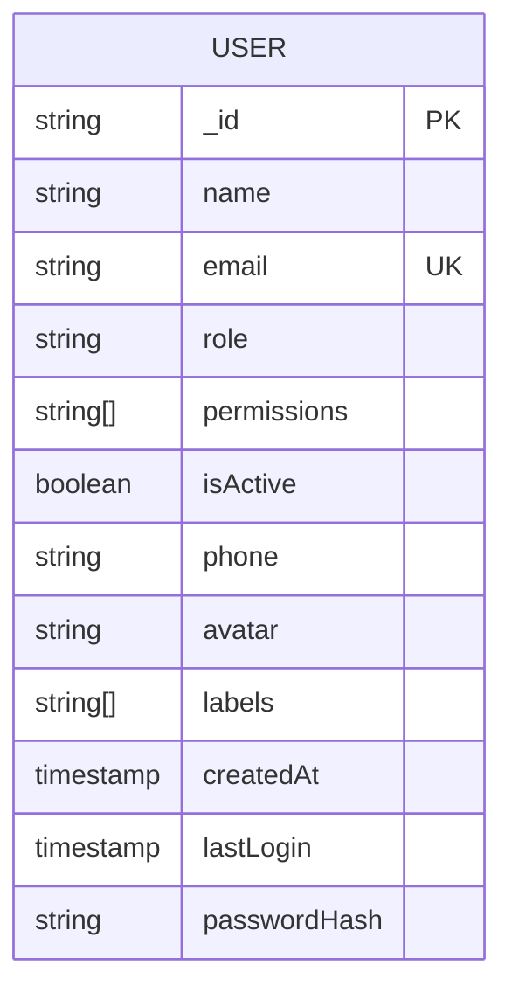
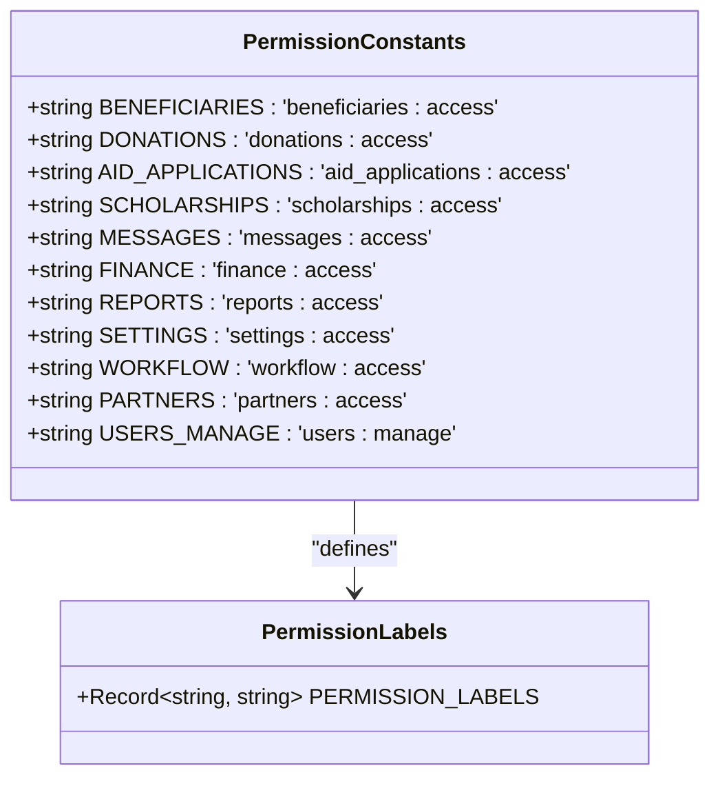
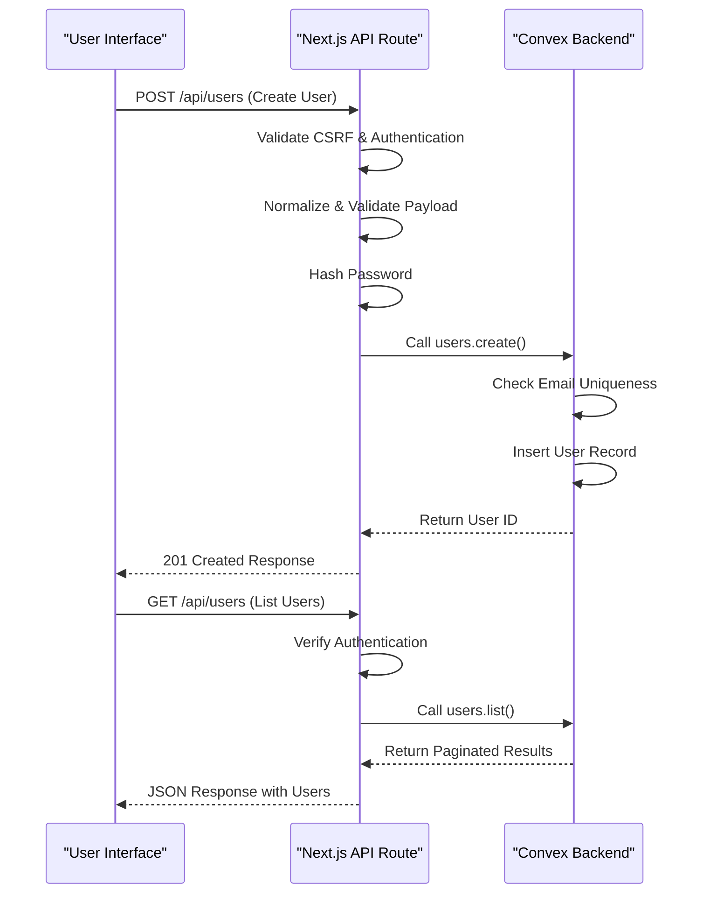
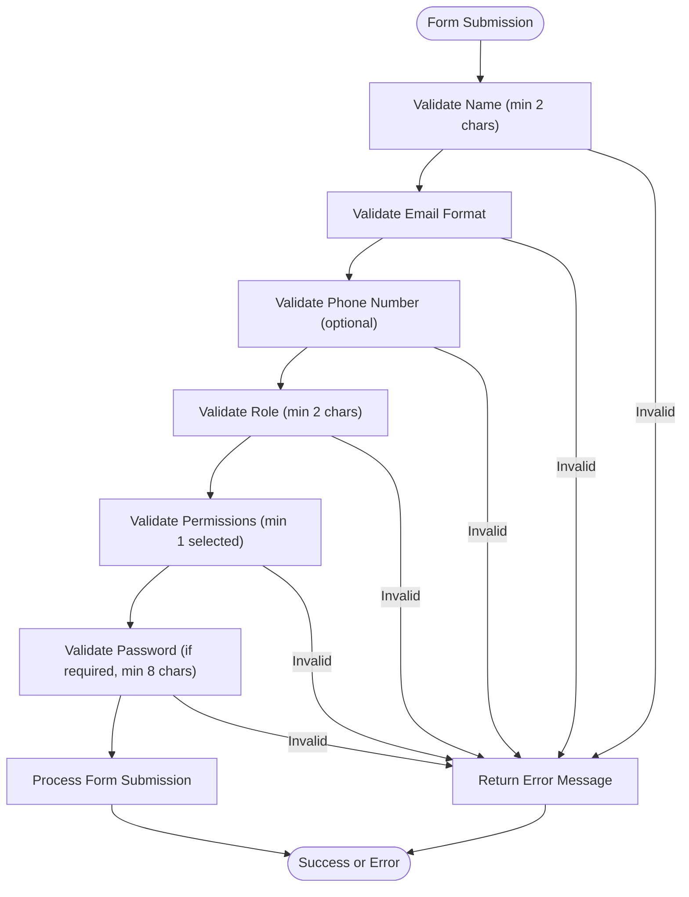
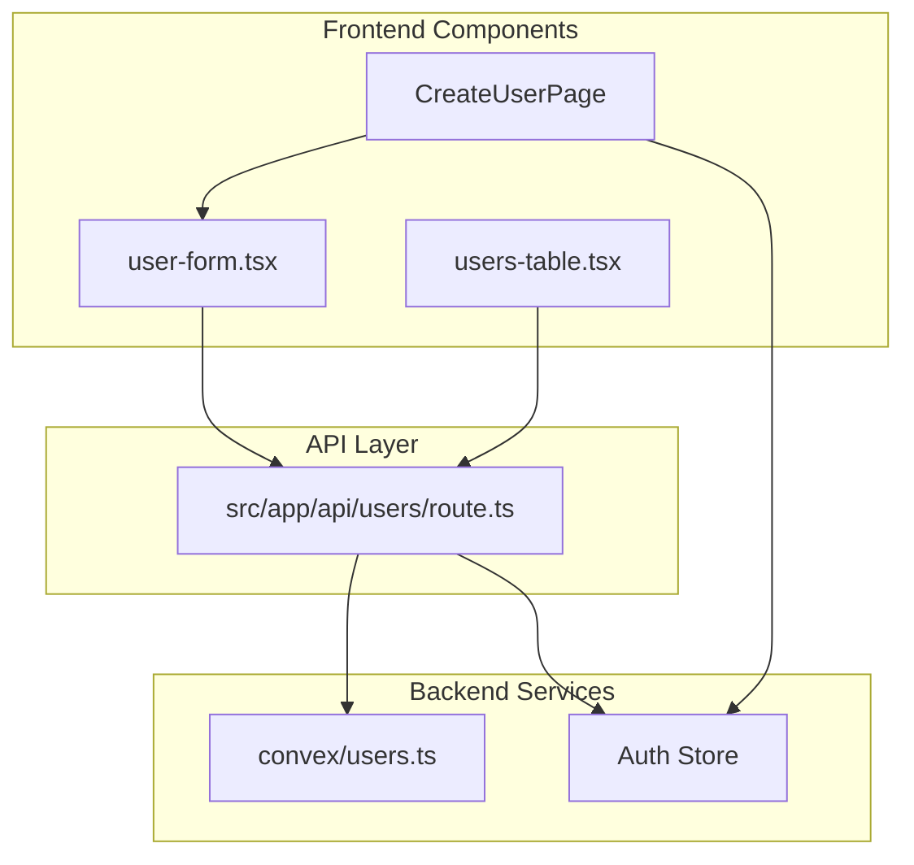
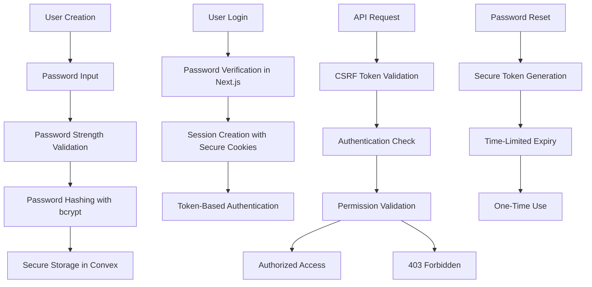
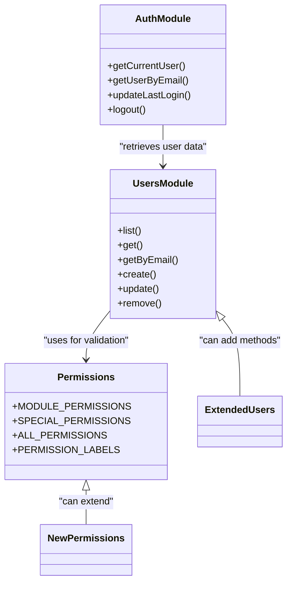

# User Management

<cite>
**Referenced Files in This Document**   
- [users.ts](file://convex/users.ts)
- [auth.ts](file://convex/auth.ts)
- [user-form.tsx](file://src/components/forms/user-form.tsx)
- [users-table.tsx](file://src/components/tables/users-table.tsx)
- [permissions.ts](file://src/types/permissions.ts)
- [page.tsx](file://src/app/(dashboard)/kullanici/yeni/page.tsx)
- [route.ts](file://src/app/api/users/route.ts)
</cite>

## Table of Contents

1. [Introduction](#introduction)
2. [Data Model](#data-model)
3. [Role-Based Access Control](#role-based-access-control)
4. [User CRUD Operations](#user-crud-operations)
5. [Profile Management](#profile-management)
6. [Frontend Integration](#frontend-integration)
7. [Security Considerations](#security-considerations)
8. [Extensibility Guidelines](#extensibility-guidelines)

## Introduction

The User Management module provides comprehensive functionality for managing organizational users with role-based access control (RBAC). It enables administrators to create, read, update, and delete user accounts while managing permissions across six distinct modules. The system integrates Convex backend functions with React frontend components to provide a seamless administrative interface for user management tasks.

**Section sources**

- [users.ts](file://convex/users.ts#L1-L220)
- [user-form.tsx](file://src/components/forms/user-form.tsx#L1-L258)

## Data Model

The user data model includes comprehensive fields for personal information, role assignments, and status tracking. Each user record contains essential attributes that support both operational functionality and security requirements.

### User Schema

**Diagram sources**

- [users.ts](file://convex/users.ts#L84-L121)
- [route.ts](file://src/app/api/users/route.ts#L15-L25)

**Section sources**

- [users.ts](file://convex/users.ts#L84-L121)
- [route.ts](file://src/app/api/users/route.ts#L15-L25)

## Role-Based Access Control

The RBAC system implements a flexible permission model with six distinct roles that control access to various application modules. Permissions are managed through a combination of module-level access and special administrative capabilities.

### Permission Structure

**Diagram sources**

- [permissions.ts](file://src/types/permissions.ts#L1-L39)

**Section sources**

- [permissions.ts](file://src/types/permissions.ts#L1-L39)
- [user-form.tsx](file://src/components/forms/user-form.tsx#L19)

## User CRUD Operations

The system provides complete CRUD (Create, Read, Update, Delete) operations for user management through Convex functions that are exposed via Next.js API routes. These operations follow a secure pattern with proper validation and error handling.

### CRUD Workflow

**Diagram sources**

- [users.ts](file://convex/users.ts#L6-L64)
- [route.ts](file://src/app/api/users/route.ts#L106-L152)

**Section sources**

- [users.ts](file://convex/users.ts#L6-L219)
- [route.ts](file://src/app/api/users/route.ts#L106-L230)

## Profile Management

User profile management is facilitated through a dedicated form component that handles both creation and editing workflows. The interface provides intuitive controls for managing user information, permissions, and account status.

### Form Validation Rules

**Diagram sources**

- [user-form.tsx](file://src/components/forms/user-form.tsx#L27-L40)

**Section sources**

- [user-form.tsx](file://src/components/forms/user-form.tsx#L27-L113)
- [users-table.tsx](file://src/components/tables/users-table.tsx#L19-L28)

## Frontend Integration

The frontend components integrate seamlessly with the backend Convex functions through a well-defined API layer. The user interface provides both table-based listing and form-based editing capabilities that follow consistent design patterns.

### Component Integration

**Diagram sources**

- [user-form.tsx](file://src/components/forms/user-form.tsx#L1-L258)
- [users-table.tsx](file://src/components/tables/users-table.tsx#L1-L156)
- [page.tsx](<file://src/app/(dashboard)/kullanici/yeni/page.tsx#L1-L81>)

**Section sources**

- [user-form.tsx](file://src/components/forms/user-form.tsx#L1-L258)
- [users-table.tsx](file://src/components/tables/users-table.tsx#L1-L156)
- [page.tsx](<file://src/app/(dashboard)/kullanici/yeni/page.tsx#L1-L81>)

## Security Considerations

The user management system implements multiple security layers to protect sensitive user data and prevent unauthorized access. These measures include password hashing, session management, and comprehensive permission validation.

### Security Architecture

**Diagram sources**

- [auth.ts](file://convex/auth.ts#L1-L82)
- [route.ts](file://src/app/api/users/route.ts#L4-L9)
- [password.ts](file://src/lib/auth/password.ts)

**Section sources**

- [auth.ts](file://convex/auth.ts#L1-L82)
- [route.ts](file://src/app/api/users/route.ts#L4-L9)

## Extensibility Guidelines

The user management system is designed to be extensible, allowing for modifications to the user model and role permissions without requiring major architectural changes.

### Extension Points

**Diagram sources**

- [users.ts](file://convex/users.ts#L6-L219)
- [permissions.ts](file://src/types/permissions.ts#L1-L39)
- [auth.ts](file://convex/auth.ts#L9-L82)

**Section sources**

- [users.ts](file://convex/users.ts#L6-L219)
- [permissions.ts](file://src/types/permissions.ts#L1-L39)
- [auth.ts](file://convex/auth.ts#L9-L82)
