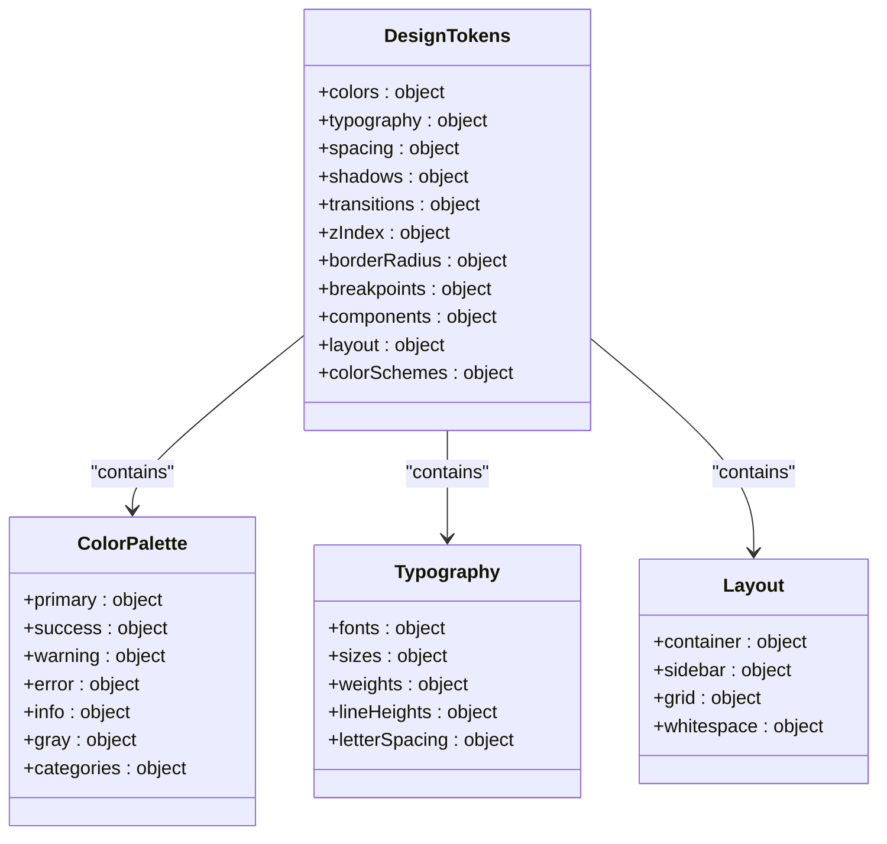
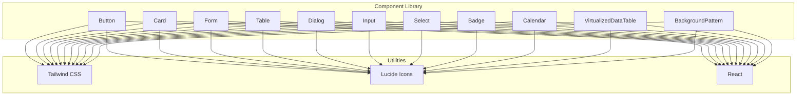
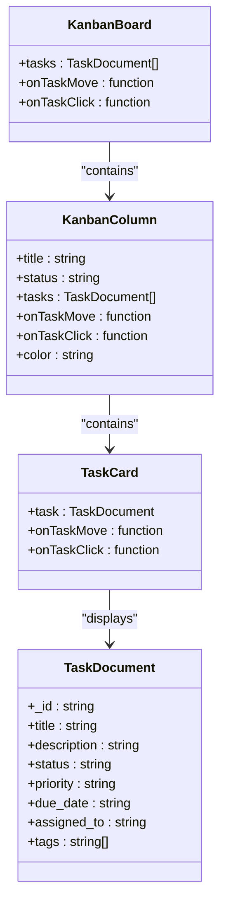
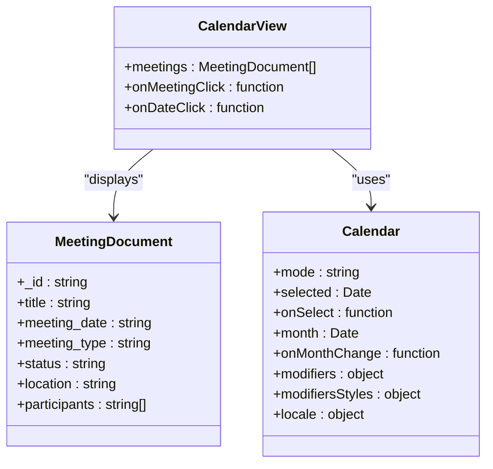
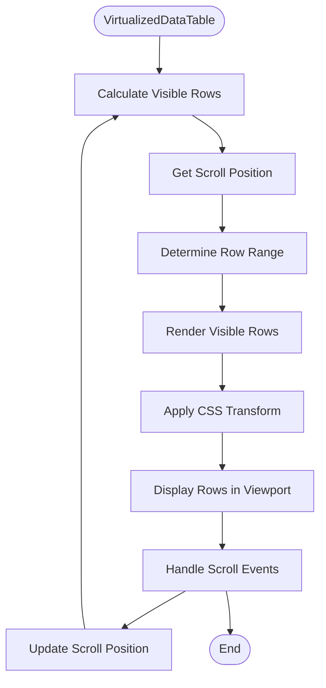
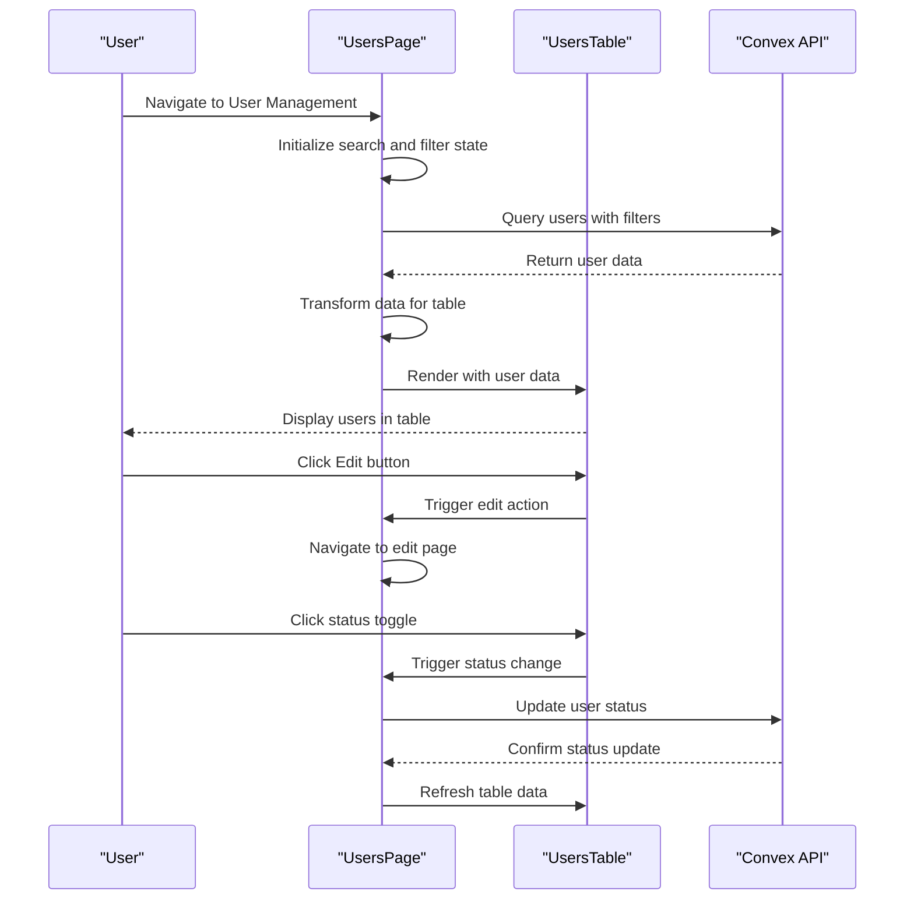

# Component Architecture

<cite>
**Referenced Files in This Document**   
- [components.json](file://components.json)
- [design-tokens.ts](file://src/config/design-tokens.ts)
- [tailwind.config.js](file://tailwind.config.js)
- [users-table.tsx](file://src/components/tables/users-table.tsx)
- [KanbanBoard.tsx](file://src/components/tasks/KanbanBoard.tsx)
- [CalendarView.tsx](file://src/components/meetings/CalendarView.tsx)
- [virtualized-data-table.tsx](file://src/components/ui/virtualized-data-table.tsx)
- [background-pattern.tsx](file://src/components/ui/background-pattern.tsx)
- [financial-dashboard/page.tsx](file://src/app/(dashboard)/financial-dashboard/page.tsx)
- [kullanici/page.tsx](file://src/app/(dashboard)/kullanici/page.tsx)
</cite>

## Table of Contents

1. [Introduction](#introduction)
2. [Design System and Tokens](#design-system-and-tokens)
3. [shadcn/ui-Inspired Component Library](#shadcnuin-inspired-component-library)
4. [Complex Component Composition Patterns](#complex-component-composition-patterns)
5. [Usage in Key Application Pages](#usage-in-key-application-pages)
6. [Accessibility Implementation](#accessibility-implementation)
7. [Responsive Design Patterns](#responsive-design-patterns)
8. [State Management and Performance Optimization](#state-management-and-performance-optimization)
9. [Component Creation Guidelines](#component-creation-guidelines)
10. [Conclusion](#conclusion)

## Introduction

The PORTAL application implements a comprehensive component architecture based on modern React patterns and the shadcn/ui design system. This documentation details the reusable UI component design patterns, composition strategies for complex components, and implementation principles across the application. The architecture emphasizes consistency, accessibility, and performance, particularly for data-intensive interfaces like financial dashboards and user management systems.

## Design System and Tokens

The PORTAL application maintains a centralized design system through the `design-tokens.ts` configuration file, which defines all visual properties including colors, typography, spacing, shadows, and component-specific styling. This ensures consistency across the application and enables easy theme modifications.

The design system includes a comprehensive color palette with primary, success, warning, error, and info categories, along with category-specific colors for donations, aid, scholarships, meetings, and tasks. Typography follows a structured hierarchy with defined font families, sizes, weights, and line heights. The layout system incorporates responsive breakpoints and grid configurations that adapt to different screen sizes.

**Diagram sources**

- [design-tokens.ts](file://src/config/design-tokens.ts#L1-L390)

**Section sources**

- [design-tokens.ts](file://src/config/design-tokens.ts#L1-L390)
- [components.json](file://components.json#L1-L25)

## shadcn/ui-Inspired Component Library

The PORTAL application leverages a component library inspired by shadcn/ui, as indicated by the `components.json` configuration file. This configuration specifies the use of the "new-york" style, React Server Components (RSC), TypeScript (TSX), and Tailwind CSS integration.

The component library in the `ui/` directory contains over 20 reusable components including buttons, cards, forms, tables, and navigation elements. These components follow consistent design principles and are built with accessibility in mind. The library uses aliases defined in `components.json` to simplify imports, with `@/components/ui` pointing to the UI component directory.

Key components include accessible form fields, alert dialogs, data tables, and responsive layouts. The components are designed to be composable and extensible, allowing for consistent styling while enabling customization through props. The library also includes specialized components like `BackgroundPattern` for decorative elements and `VirtualizedDataTable` for performance optimization with large datasets.

**Diagram sources**

- [components.json](file://components.json#L1-L25)
- [tailwind.config.js](file://tailwind.config.js#L1-L13)
- [ui/](file://src/components/ui/)

**Section sources**

- [components.json](file://components.json#L1-L25)
- [tailwind.config.js](file://tailwind.config.js#L1-L13)
- [src/components/ui/](file://src/components/ui/)

## Complex Component Composition Patterns

### Kanban Board Implementation

The KanbanBoard component provides a drag-and-drop interface for task management, allowing users to move tasks between different status columns. The component is composed of multiple sub-components including KanbanColumn and TaskCard, following a clear composition pattern.

The KanbanBoard uses React's HTML5 drag-and-drop API to enable task reordering between columns. Each task card displays key information including title, description, assigned user, priority level, due date, and tags. The component implements visual indicators for overdue tasks and those due soon, using color-coded badges for priority and status.

**Diagram sources**

- [KanbanBoard.tsx](file://src/components/tasks/KanbanBoard.tsx#L1-L238)

**Section sources**

- [KanbanBoard.tsx](file://src/components/tasks/KanbanBoard.tsx#L1-L238)

### Calendar View Implementation

The CalendarView component provides a comprehensive meeting scheduling interface with both calendar and list views. It uses the `react-day-picker` library for calendar rendering and implements custom modifiers to highlight dates with scheduled meetings.

The component groups meetings by date and displays them in a structured format, showing meeting time, title, type, location, and participant count. It includes navigation controls for moving between months and a "Today" button for quick navigation. The calendar uses visual indicators (underlined dates) to show days with meetings, and a legend explains the color coding for different meeting types.

**Diagram sources**

- [CalendarView.tsx](file://src/components/meetings/CalendarView.tsx#L1-L284)

**Section sources**

- [CalendarView.tsx](file://src/components/meetings/CalendarView.tsx#L1-L284)

### Virtualized Data Tables

The VirtualizedDataTable component addresses performance challenges when rendering large datasets by implementing virtual scrolling. Instead of rendering all rows at once, it only renders the visible portion of the table plus a small buffer, significantly improving performance and memory usage.

The component calculates which rows should be visible based on the scroll position and container dimensions, rendering only those rows. It maintains a fixed row height and uses CSS transforms to position the visible rows correctly within the scrollable container. This approach allows the table to handle thousands of rows without performance degradation.

**Diagram sources**

- [virtualized-data-table.tsx](file://src/components/ui/virtualized-data-table.tsx#L1-L313)

**Section sources**

- [virtualized-data-table.tsx](file://src/components/ui/virtualized-data-table.tsx#L1-L313)

## Usage in Key Application Pages

### Financial Dashboard

The financial dashboard page serves as a placeholder for future financial analytics functionality. While currently implemented as a placeholder component, it is designed to incorporate various data visualization components and performance-optimized tables for displaying financial metrics.

The placeholder indicates planned features including real-time financial indicators, income-expense charts, budget comparisons, trend analyses, and customizable widgets. When fully implemented, this page will likely leverage the virtualized data table component for displaying transaction data and various chart components for visualizing financial trends.

**Section sources**

- [financial-dashboard/page.tsx](<file://src/app/(dashboard)/financial-dashboard/page.tsx#L1-L21>)

### User Management Interface

The user management interface demonstrates the practical application of the component architecture in a real-world scenario. It uses the UsersTable component to display a list of users with their details, status, and action buttons.

The interface implements search and filtering functionality, allowing users to search by name, email, or phone, and filter by role and status. It integrates with the application's permission system to conditionally render action buttons based on the current user's permissions. The table displays user information including name, email, role, permissions, status, phone, and creation date.

**Diagram sources**

- [kullanici/page.tsx](<file://src/app/(dashboard)/kullanici/page.tsx#L1-L276>)
- [users-table.tsx](file://src/components/tables/users-table.tsx#L1-L156)

**Section sources**

- [kullanici/page.tsx](<file://src/app/(dashboard)/kullanici/page.tsx#L1-L276>)
- [users-table.tsx](file://src/components/tables/users-table.tsx#L1-L156)

## Accessibility Implementation

The PORTAL application prioritizes accessibility across all components, following WCAG guidelines and implementing proper ARIA attributes. Components include appropriate semantic HTML elements, keyboard navigation support, and screen reader compatibility.

Key accessibility features include proper labeling of form elements, ARIA roles for interactive components, keyboard event handling for navigation, and focus management. The virtualized data table implements ARIA attributes for rows and cells, ensuring screen readers can properly interpret the table structure. Interactive elements include visible focus states and appropriate contrast ratios for text and background colors.

The application also implements error handling with accessible alerts and notifications, ensuring users are informed of issues regardless of their interaction method. Form components provide clear error messages and validation feedback, helping users correct input errors efficiently.

**Section sources**

- [src/components/ui/](file://src/components/ui/)
- [users-table.tsx](file://src/components/tables/users-table.tsx#L1-L156)
- [virtualized-data-table.tsx](file://src/components/ui/virtualized-data-table.tsx#L1-L313)

## Responsive Design Patterns

The component architecture implements responsive design patterns to ensure optimal user experience across different device sizes. The design system includes breakpoints for mobile, tablet, and desktop views, with components adapting their layout and behavior accordingly.

The layout system uses a flexible grid with responsive column counts and spacing. On mobile devices, the sidebar is hidden and accessed via a drawer, while on larger screens it remains visible with a fixed width. Tables adapt to smaller screens by either scrolling horizontally or reorganizing content into stacked cards.

Components like the KanbanBoard adjust their column layout based on screen width, displaying one column on mobile, two on tablet, and four on desktop. The CalendarView component maintains usability on smaller screens by focusing on essential information and simplifying the interface while preserving core functionality.

**Section sources**

- [design-tokens.ts](file://src/config/design-tokens.ts#L1-L390)
- [KanbanBoard.tsx](file://src/components/tasks/KanbanBoard.tsx#L1-L238)
- [CalendarView.tsx](file://src/components/meetings/CalendarView.tsx#L1-L284)

## State Management and Performance Optimization

The component architecture addresses state management and performance optimization through several strategies. For complex components like the KanbanBoard and CalendarView, local component state is used for UI interactions, while application-level state is managed through React Query for data fetching and caching.

The virtualized data table implements performance optimization by only rendering visible rows, reducing the number of DOM nodes and improving rendering performance. This is particularly important for large datasets where rendering all rows would cause significant performance degradation.

React's memoization hooks (useMemo and useCallback) are used extensively to prevent unnecessary re-renders and calculations. The UsersTable component uses React.memo to prevent re-rendering when props haven't changed. Data fetching is optimized through query-based caching, reducing the number of API calls and improving response times.

For large datasets, the application implements pagination in addition to virtualization, allowing users to navigate through data in manageable chunks. Error boundaries are implemented to prevent component failures from crashing the entire application, and loading states provide feedback during data fetching operations.

**Section sources**

- [virtualized-data-table.tsx](file://src/components/ui/virtualized-data-table.tsx#L1-L313)
- [kullanici/page.tsx](<file://src/app/(dashboard)/kullanici/page.tsx#L1-L276>)
- [KanbanBoard.tsx](file://src/components/tasks/KanbanBoard.tsx#L1-L238)

## Component Creation Guidelines

When creating new components for the PORTAL application, developers should follow established conventions to maintain consistency and quality. New components should be placed in appropriate directories based on their purpose, with reusable UI elements going into the `ui/` directory and application-specific components in feature-specific directories.

Components should follow the atomic design principles, being composed of smaller, reusable parts when possible. They should accept props for customization rather than hardcoding values, and implement proper TypeScript interfaces for type safety. All components should be tested for accessibility and responsive behavior across different screen sizes.

Performance considerations should be addressed from the beginning, especially for components that may handle large datasets. Virtualization, memoization, and efficient rendering patterns should be implemented as needed. Components should include proper documentation and examples to facilitate reuse by other developers.

New components should adhere to the design system tokens for colors, spacing, typography, and other visual properties. They should use the established icon library (Lucide) and follow the same interaction patterns as existing components to ensure a consistent user experience.

**Section sources**

- [design-tokens.ts](file://src/config/design-tokens.ts#L1-L390)
- [components.json](file://components.json#L1-L25)
- [src/components/ui/](file://src/components/ui/)

## Conclusion

The PORTAL application's component architecture demonstrates a well-structured approach to building reusable, accessible, and performant UI components. By leveraging the shadcn/ui design system and implementing thoughtful composition patterns, the application achieves consistency across its interfaces while maintaining flexibility for specific use cases.

The architecture effectively addresses challenges related to complex data visualization, large datasets, and responsive design, providing a solid foundation for future development. The emphasis on accessibility, performance optimization, and clear component guidelines ensures that the application can scale while maintaining high quality and usability.

As the application evolves, continued adherence to these architectural principles will be essential for maintaining code quality and user experience. The documented patterns and guidelines provide a clear roadmap for developers creating new components or enhancing existing ones.
