# Data Display Components

<cite>
**Referenced Files in This Document**   
- [responsive-table.tsx](file://src/components/ui/responsive-table.tsx)
- [virtualized-data-table.tsx](file://src/components/ui/virtualized-data-table.tsx)
- [stat-card.tsx](file://src/components/ui/stat-card.tsx)
- [progress.tsx](file://src/components/ui/progress.tsx)
- [AidHistoryChart.tsx](file://src/components/beneficiary-analytics/AidHistoryChart.tsx)
- [KumbaraCharts.tsx](file://src/components/kumbara/KumbaraCharts.tsx)
- [skeleton-optimized.tsx](file://src/components/ui/skeleton-optimized.tsx)
- [column-visibility-toggle.tsx](file://src/components/ui/column-visibility-toggle.tsx)
- [financial-dashboard/page.tsx](file://src/app/(dashboard)/financial-dashboard/page.tsx)
- [ihtiyac-sahipleri/page.tsx](file://src/app/(dashboard)/yardim/ihtiyac-sahipleri/page.tsx)
</cite>

## Table of Contents

1. [Introduction](#introduction)
2. [Responsive and Virtualized Tables](#responsive-and-virtualized-tables)
3. [Statistical and Progress Components](#statistical-and-progress-components)
4. [Charting Components](#charting-components)
5. [Performance Optimization Techniques](#performance-optimization-techniques)
6. [Usage Examples](#usage-examples)
7. [Accessibility and Responsive Behavior](#accessibility-and-responsive-behavior)
8. [Customization Options](#customization-options)

## Introduction

This document provides comprehensive documentation for the data display components in the PORTAL application. It covers responsive and virtualized tables for efficient handling of large datasets, statistical and progress components for dashboard metrics, charting components for visualizing beneficiary and donation data, and various performance optimization techniques. The documentation also includes usage examples, accessibility considerations, and customization options.

## Responsive and Virtualized Tables

### Responsive Table Implementation

The `ResponsiveTable` component adapts its layout based on screen size, providing an optimal viewing experience across different devices. It supports three distinct layouts: traditional table for desktop, card-based for tablet, and stacked card for mobile.

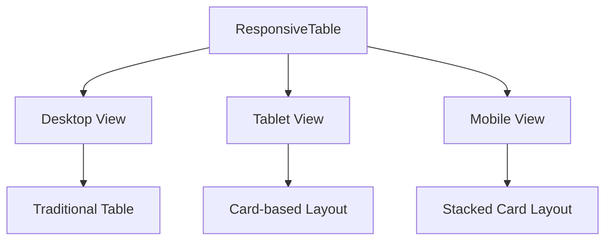

**Diagram sources**

- [responsive-table.tsx](file://src/components/ui/responsive-table.tsx#L58-L162)

**Section sources**

- [responsive-table.tsx](file://src/components/ui/responsive-table.tsx#L1-L213)

### Virtualized Data Table with Infinite Scrolling

The `VirtualizedDataTable` component implements virtual scrolling to efficiently handle large datasets. It only renders visible rows, significantly improving performance when dealing with thousands of records.

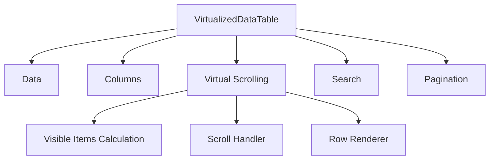

**Diagram sources**

- [virtualized-data-table.tsx](file://src/components/ui/virtualized-data-table.tsx#L39-L312)

**Section sources**

- [virtualized-data-table.tsx](file://src/components/ui/virtualized-data-table.tsx#L1-L313)

### Column Visibility Toggle

The `ColumnVisibilityToggle` component allows users to control which columns are displayed in a table, enhancing usability when dealing with tables that have many columns.

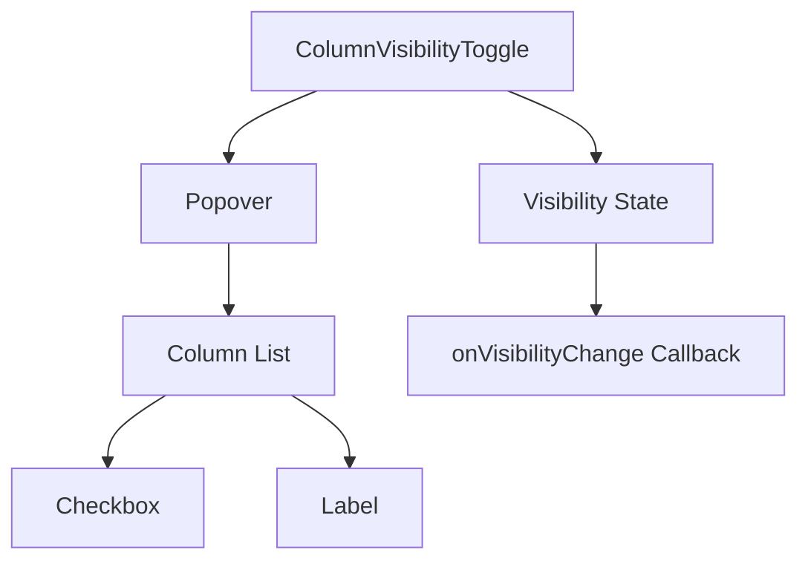

**Diagram sources**

- [column-visibility-toggle.tsx](file://src/components/ui/column-visibility-toggle.tsx#L26-L133)

**Section sources**

- [column-visibility-toggle.tsx](file://src/components/ui/column-visibility-toggle.tsx#L1-L134)

## Statistical and Progress Components

### Stat Card Component

The `StatCard` component displays key metrics with optional trend indicators and icons. It supports various variants for different visual styles and includes a skeleton version for loading states.

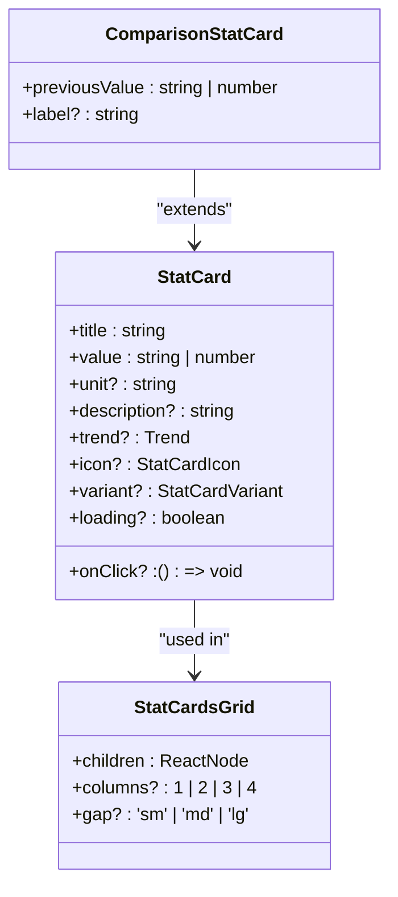

**Diagram sources**

- [stat-card.tsx](file://src/components/ui/stat-card.tsx#L121-L247)

**Section sources**

- [stat-card.tsx](file://src/components/ui/stat-card.tsx#L1-L370)

### Progress Component

The `Progress` component displays progress indicators with different variants for various use cases. It uses Radix UI's progress primitive for accessibility and smooth animations.

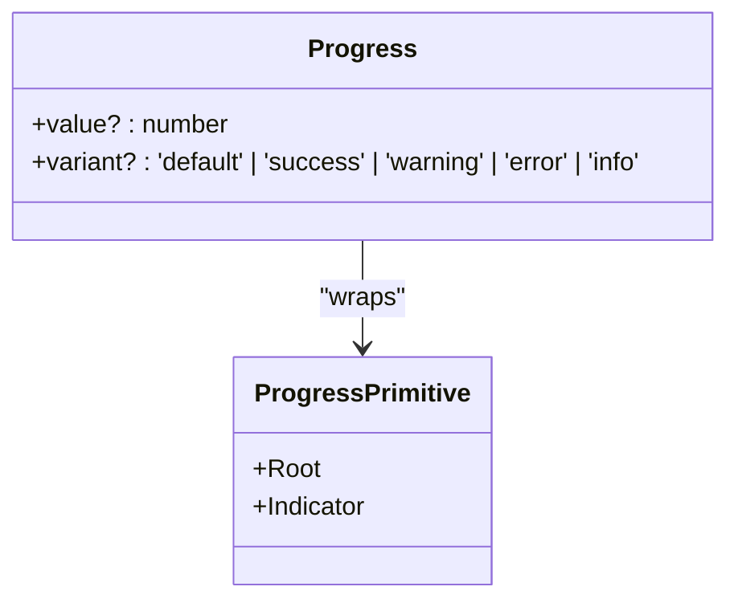

**Diagram sources**

- [progress.tsx](file://src/components/ui/progress.tsx#L30-L43)

**Section sources**

- [progress.tsx](file://src/components/ui/progress.tsx#L1-L47)

## Charting Components

### Aid History Chart

The `AidHistoryChart` component visualizes the aid history of beneficiaries, showing key metrics such as total aid, number of aid instances, average aid amount, and trend analysis.

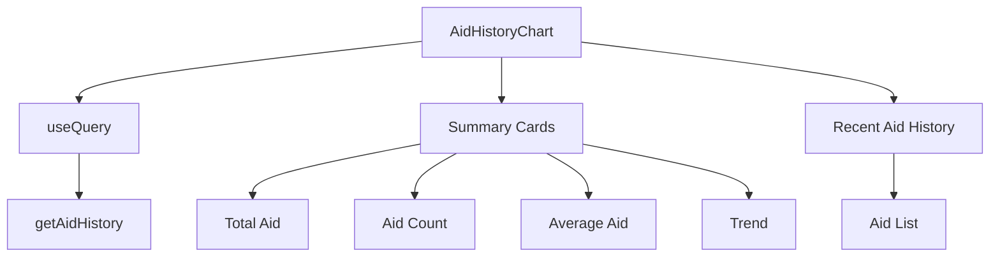

**Diagram sources**

- [AidHistoryChart.tsx](file://src/components/beneficiary-analytics/AidHistoryChart.tsx#L13-L179)

**Section sources**

- [AidHistoryChart.tsx](file://src/components/beneficiary-analytics/AidHistoryChart.tsx#L1-L181)

### Kumbara Charts

The `KumbaraCharts` component displays various charts for donation data, including monthly trends, location-based distribution, and payment method distribution.

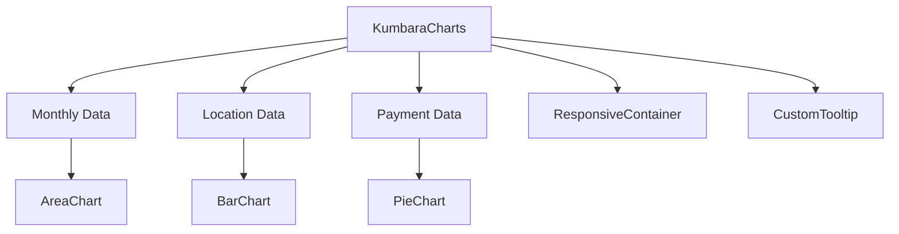

**Diagram sources**

- [KumbaraCharts.tsx](file://src/components/kumbara/KumbaraCharts.tsx#L42-L238)

**Section sources**

- [KumbaraCharts.tsx](file://src/components/kumbara/KumbaraCharts.tsx#L1-L240)

## Performance Optimization Techniques

### Skeleton Loading States

The `skeleton-optimized.tsx` file contains high-performance loading skeleton components that use optimized animations and rendering techniques to provide a smooth user experience during data loading.

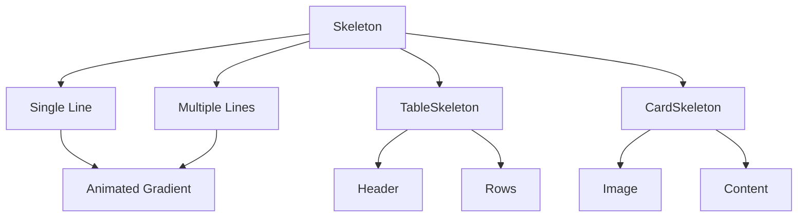

**Diagram sources**

- [skeleton-optimized.tsx](file://src/components/ui/skeleton-optimized.tsx#L16-L118)

**Section sources**

- [skeleton-optimized.tsx](file://src/components/ui/skeleton-optimized.tsx#L1-L172)

### Optimized Rendering

The data display components implement various performance optimization techniques, including memoization, virtual scrolling, and efficient state management.

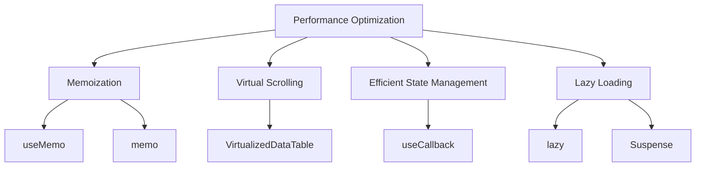

**Section sources**

- [virtualized-data-table.tsx](file://src/components/ui/virtualized-data-table.tsx#L60-L70)
- [ihtiyac-sahipleri/page.tsx](<file://src/app/(dashboard)/yardim/ihtiyac-sahipleri/page.tsx#L30-L34>)
- [skeleton-optimized.tsx](file://src/components/ui/skeleton-optimized.tsx#L4-L6)

## Usage Examples

### Financial Dashboard

The financial dashboard page serves as a placeholder for future implementation, outlining the planned features for financial data visualization.

```mermaid
graph TD
A[FinancialDashboardPage] --> B[PlaceholderPage]
B --> C[title: "Financial Dashboard"]
B --> D[description: "Monitor financial status visually"]
B --> E[estimatedDate: "April 2025"]
B --> F[features]
F --> G[Real-time financial indicators]
F --> H[Income-expense graphs]
F --> I[Budget comparisons]
F --> J[Trend analysis]
F --> K[Customizable widgets]
```

**Diagram sources**

- [financial-dashboard/page.tsx](<file://src/app/(dashboard)/financial-dashboard/page.tsx#L5-L18>)

**Section sources**

- [financial-dashboard/page.tsx](<file://src/app/(dashboard)/financial-dashboard/page.tsx#L1-L21>)

### Beneficiary Management

The beneficiary management page demonstrates the use of virtualized data tables for handling large datasets of beneficiary information.

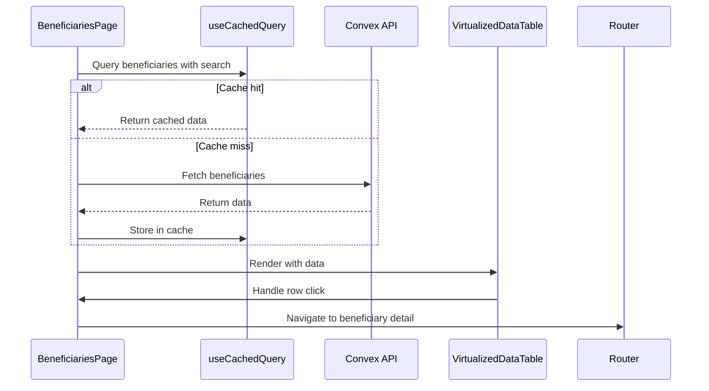

**Diagram sources**

- [ihtiyac-sahipleri/page.tsx](<file://src/app/(dashboard)/yardim/ihtiyac-sahipleri/page.tsx#L49-L236>)

**Section sources**

- [ihtiyac-sahipleri/page.tsx](<file://src/app/(dashboard)/yardim/ihtiyac-sahipleri/page.tsx#L1-L240>)

## Accessibility and Responsive Behavior

The data display components are designed with accessibility and responsive behavior in mind. They support keyboard navigation, screen readers, and adapt to different screen sizes and device capabilities.

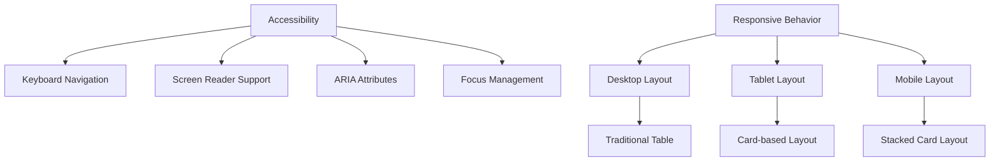

**Section sources**

- [responsive-table.tsx](file://src/components/ui/responsive-table.tsx#L58-L162)
- [virtualized-data-table.tsx](file://src/components/ui/virtualized-data-table.tsx#L212-L265)

## Customization Options

The data display components offer various customization options for colors, formats, and interactions to meet different design requirements and user preferences.

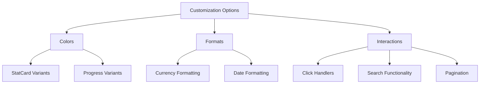

**Section sources**

- [stat-card.tsx](file://src/components/ui/stat-card.tsx#L15-L24)
- [progress.tsx](file://src/components/ui/progress.tsx#L9-L22)
- [virtualized-data-table.tsx](file://src/components/ui/virtualized-data-table.tsx#L22-L31)
