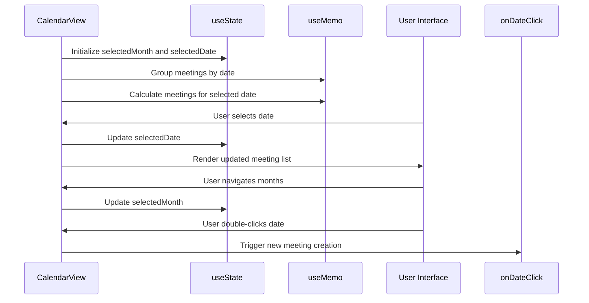
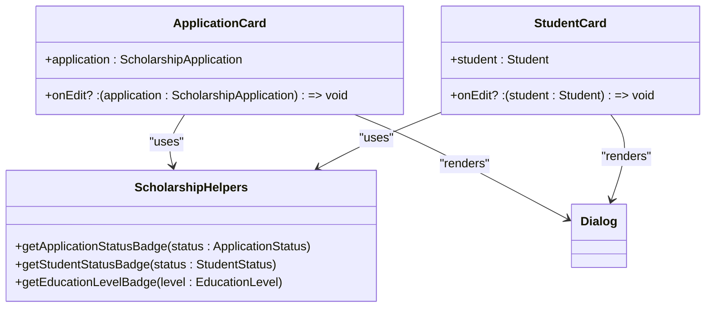
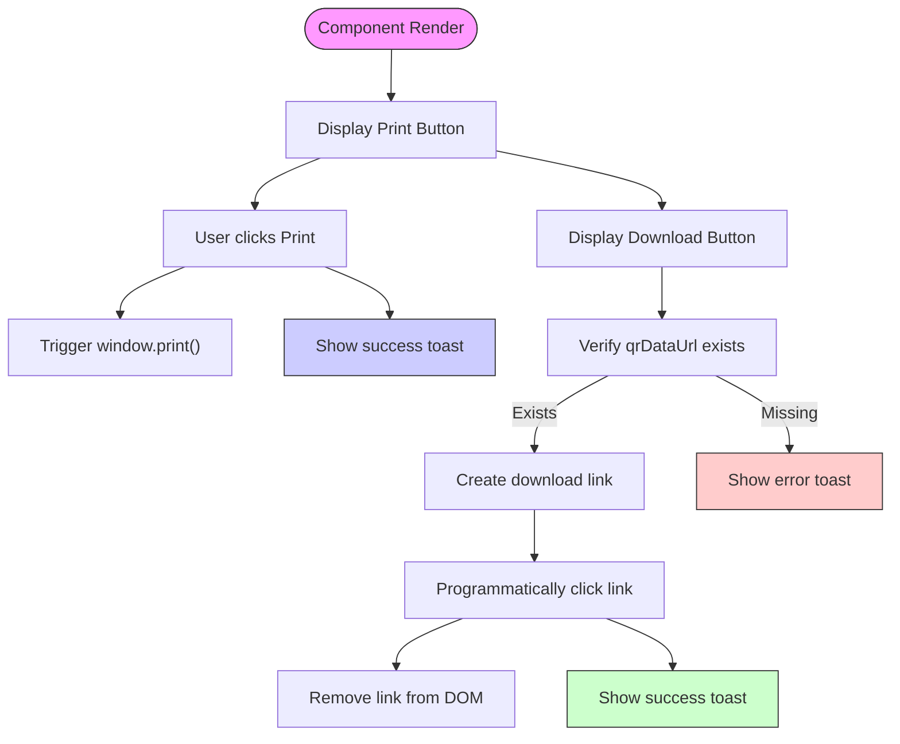

# Feature-Specific Components

<cite>
**Referenced Files in This Document**   
- [KanbanBoard.tsx](file://src/components/tasks/KanbanBoard.tsx)
- [CalendarView.tsx](file://src/components/meetings/CalendarView.tsx)
- [ApplicationCard.tsx](file://src/components/scholarships/ApplicationCard.tsx)
- [StudentCard.tsx](file://src/components/scholarships/StudentCard.tsx)
- [KumbaraPrintQR.tsx](file://src/components/kumbara/KumbaraPrintQR.tsx)
- [task.ts](file://src/lib/validations/task.ts)
- [meeting.ts](file://src/lib/validations/meeting.ts)
- [scholarship-helpers.tsx](file://src/lib/utils/scholarship-helpers.tsx)
- [tasks.ts](file://convex/tasks.ts)
- [meetings.ts](file://convex/meetings.ts)
- [aid_applications.ts](file://convex/aid_applications.ts)
</cite>

## Table of Contents

1. [Kanban Board Implementation](#kanban-board-implementation)
2. [Calendar View for Meeting Scheduling](#calendar-view-for-meeting-scheduling)
3. [Scholarship Management Components](#scholarship-management-components)
4. [Kumbara Print QR Component](#kumbara-print-qr-component)
5. [Analytics Components](#analytics-components)
6. [Performance Considerations](#performance-considerations)
7. [Component Extension Guidelines](#component-extension-guidelines)

## Kanban Board Implementation

The KanbanBoard component provides a visual task management interface with drag-and-drop functionality for task reorganization. It implements a four-column workflow system with distinct status states: "pending" (Beklemede), "in_progress" (Devam Ediyor), "completed" (Tamamlandı), and "cancelled" (İptal Edildi). The component accepts tasks as a prop and uses callback functions for task movement and click interactions.

The implementation leverages HTML5 drag-and-drop API to enable interactive task repositioning between columns. Each task card displays key information including title, description, assigned user, priority level, due date, and tags. Visual indicators highlight overdue tasks with a destructive color and tasks due within 24 hours with a warning indicator. Priority levels are color-coded according to their urgency, with low, normal, high, and urgent priorities having distinct visual treatments.

The board maintains real-time synchronization with the Convex backend through the parent component's onTaskMove callback, which triggers a mutation to update the task's status in the database. The component is designed to be responsive, adapting its layout from a single column on mobile devices to four columns on larger screens using Tailwind CSS grid system.

```mermaid
classDiagram
class KanbanBoard {
+tasks : TaskDocument[]
+onTaskMove : (taskId : string, newStatus : TaskDocument['status']) => void
+onTaskClick : (task : TaskDocument) => void
}
class KanbanColumn {
+title : string
+status : TaskDocument['status']
+tasks : TaskDocument[]
+onTaskMove : (taskId : string, newStatus : TaskDocument['status']) => void
+onTaskClick : (task : TaskDocument) => void
+color : string
}
class TaskCard {
+task : TaskDocument
+onTaskMove : (taskId : string, newStatus : TaskDocument['status']) => void
+onTaskClick : (task : TaskDocument) => void
}
KanbanBoard --> KanbanColumn : "renders multiple"
KanbanColumn --> TaskCard : "renders multiple"
TaskCard --> "drag events" : "handles"
KanbanColumn --> "drop events" : "handles"
```

**Diagram sources**

- [KanbanBoard.tsx](file://src/components/tasks/KanbanBoard.tsx#L1-L238)

**Section sources**

- [KanbanBoard.tsx](file://src/components/tasks/KanbanBoard.tsx#L1-L238)
- [task.ts](file://src/lib/validations/task.ts#L156-L205)
- [tasks.ts](file://convex/tasks.ts#L1-L140)

## Calendar View for Meeting Scheduling

The CalendarView component provides a comprehensive meeting scheduling interface with date-picker integration and visual indicators for scheduled events. It displays a monthly calendar with special styling for dates containing meetings, using underline decoration to highlight these days. The component supports navigation between months through intuitive arrow buttons and includes a "Today" button for quick navigation to the current month.

The implementation uses the react-day-picker library for calendar rendering and integrates with date-fns for date formatting and manipulation. Meetings are grouped by date using a Map data structure for efficient lookup. The component displays two main sections: the calendar itself and a list of meetings for the selected date or upcoming meetings within the next seven days if no specific date is selected.

Meeting cards display essential information including time, title, type, location, and participant count. Different meeting types (general, committee, board) are visually distinguished by color-coded indicators. The component supports double-click events on dates to trigger the creation of new meetings, facilitating a smooth user workflow. It also implements responsive design principles, displaying meetings in a grid layout on larger screens and a single column on mobile devices.



**Diagram sources**

- [CalendarView.tsx](file://src/components/meetings/CalendarView.tsx#L1-L284)

**Section sources**

- [CalendarView.tsx](file://src/components/meetings/CalendarView.tsx#L1-L284)
- [meeting.ts](file://src/lib/validations/meeting.ts#L1-L171)
- [meetings.ts](file://convex/meetings.ts#L1-L124)

## Scholarship Management Components

The scholarship management system consists of two primary components: ApplicationCard and StudentCard, which provide specialized interfaces for handling scholarship applications and student information respectively. Both components follow a consistent design pattern with compact summary views and detailed modal dialogs accessible through eye and edit icons.

The ApplicationCard displays key information about scholarship applications including student name, scholarship name, institution, and application date. It uses status badges to visually indicate the application's current stage in the workflow. The component includes a detailed view accessible via a dialog that reveals additional information such as personal statements and family situation. An edit button is conditionally rendered based on the onEdit callback prop, enabling inline editing functionality.

The StudentCard provides a comprehensive overview of student information with multiple data points organized in a grid layout. It displays educational information, contact details, and special status indicators such as orphan status. The detailed view in the dialog reveals additional personal and financial information. Both components use responsive grid layouts that adapt to screen size, showing different numbers of columns on different device sizes.



**Diagram sources**

- [ApplicationCard.tsx](file://src/components/scholarships/ApplicationCard.tsx#L1-L123)
- [StudentCard.tsx](file://src/components/scholarships/StudentCard.tsx#L1-L202)

**Section sources**

- [ApplicationCard.tsx](file://src/components/scholarships/ApplicationCard.tsx#L1-L123)
- [StudentCard.tsx](file://src/components/scholarships/StudentCard.tsx#L1-L202)
- [scholarship-helpers.tsx](file://src/lib/utils/scholarship-helpers.tsx#L1-L86)
- [aid_applications.ts](file://convex/aid_applications.ts#L1-L162)

## Kumbara Print QR Component

The KumbaraPrintQR component enables the generation and management of printable QR codes for donation tracking. It provides both printing and download functionality for QR codes associated with donation containers (kumbara). The component renders a print button that triggers the browser's print dialog, allowing users to print QR codes on specialized 40mm x 30mm labels.

The implementation includes a hidden print layout styled with CSS for precise physical dimensions and optimal print quality. The print layout contains the organization name, donor information, location, institution, amount, collection date, and receipt number arranged in a compact format suitable for small labels. When printed, only the print layout is visible, ensuring clean output without interface elements.

The component also supports QR code download as PNG files with filenames that include the receipt number for easy identification. Error handling is implemented to notify users when QR code data is unavailable. The styling ensures that printed output is optimized for readability and scanning, with appropriate font sizes and spacing for the small physical format.



**Diagram sources**

- [KumbaraPrintQR.tsx](file://src/components/kumbara/KumbaraPrintQR.tsx#L1-L165)

**Section sources**

- [KumbaraPrintQR.tsx](file://src/components/kumbara/KumbaraPrintQR.tsx#L1-L165)

## Analytics Components

The analytics components in PORTAL include GoogleAnalytics and WebVitalsTracker, which provide comprehensive usage tracking and performance monitoring. The GoogleAnalytics component integrates with Google Analytics 4 to track page views and user interactions, requiring the NEXT_PUBLIC_GA_MEASUREMENT_ID environment variable for configuration.

The WebVitalsTracker component monitors Core Web Vitals metrics including Largest Contentful Paint (LCP), First Input Delay (FID), Cumulative Layout Shift (CLS), and other performance indicators. It leverages the web-vitals library to collect these metrics and can be extended to send data to various analytics backends. The implementation follows best practices for client-side analytics by using Next.js Script component for optimal loading strategy.

Both components are designed to be unobtrusive, with GoogleAnalytics returning null when the measurement ID is not configured, preventing errors in development or staging environments. The WebVitalsTracker component does not render any UI elements, functioning purely as a background monitoring service that executes when the component mounts.

**Section sources**

- [GoogleAnalytics.tsx](file://src/components/analytics/GoogleAnalytics.tsx#L1-L42)
- [WebVitalsTracker.tsx](file://src/components/analytics/WebVitalsTracker.tsx#L1-L19)

## Performance Considerations

The interactive components in PORTAL are optimized for performance through several strategies. The KanbanBoard uses React.memo and useMemo hooks to prevent unnecessary re-renders, particularly in the task grouping and filtering operations. The CalendarView implements memoization for meeting grouping by date, reducing computational overhead when the component re-renders.

All components leverage React's built-in optimization techniques, including proper prop usage and avoiding inline function definitions in render methods. The use of virtualized lists is recommended for components that may display large datasets, though not currently implemented in the analyzed components. Event handlers are properly cleaned up to prevent memory leaks, particularly in components with timers or subscriptions.

For drag-and-drop functionality in the KanbanBoard, the implementation minimizes DOM manipulations by using CSS transitions and opacity changes to indicate drag states rather than repositioning elements during drag operations. The CalendarView optimizes date calculations by caching results with useMemo, preventing redundant computations when navigating between months.

## Component Extension Guidelines

When extending existing components or creating new ones for similar features, follow these guidelines:

1. **Consistent Prop Interface**: Maintain a consistent pattern for callback props (onAction, onEvent) and data props (items, data)
2. **Responsive Design**: Implement mobile-first responsive layouts using Tailwind CSS grid and flexbox utilities
3. **Accessibility**: Ensure all interactive elements are keyboard accessible and have appropriate ARIA labels
4. **Error Boundaries**: Wrap components that fetch data with error boundaries to handle failures gracefully
5. **Loading States**: Implement skeleton loaders for components that retrieve data asynchronously
6. **Internationalization**: Design components to support multiple languages, particularly for date formatting and status labels
7. **Performance**: Use React.memo, useMemo, and useCallback to optimize rendering performance
8. **Testing**: Include comprehensive unit tests for component logic and integration tests for user interactions

When creating new components that interact with Convex, follow the established pattern of separating data fetching from presentation by using Convex hooks in parent components and passing data and callbacks as props to presentational components. This separation of concerns enhances testability and reusability.
