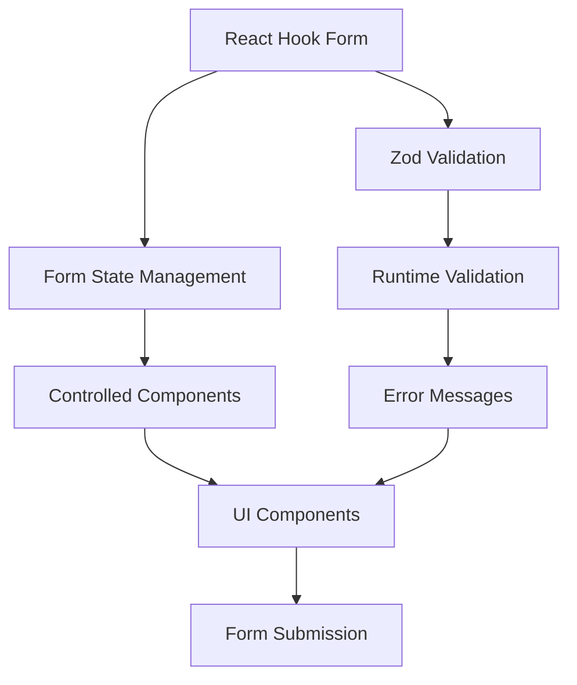
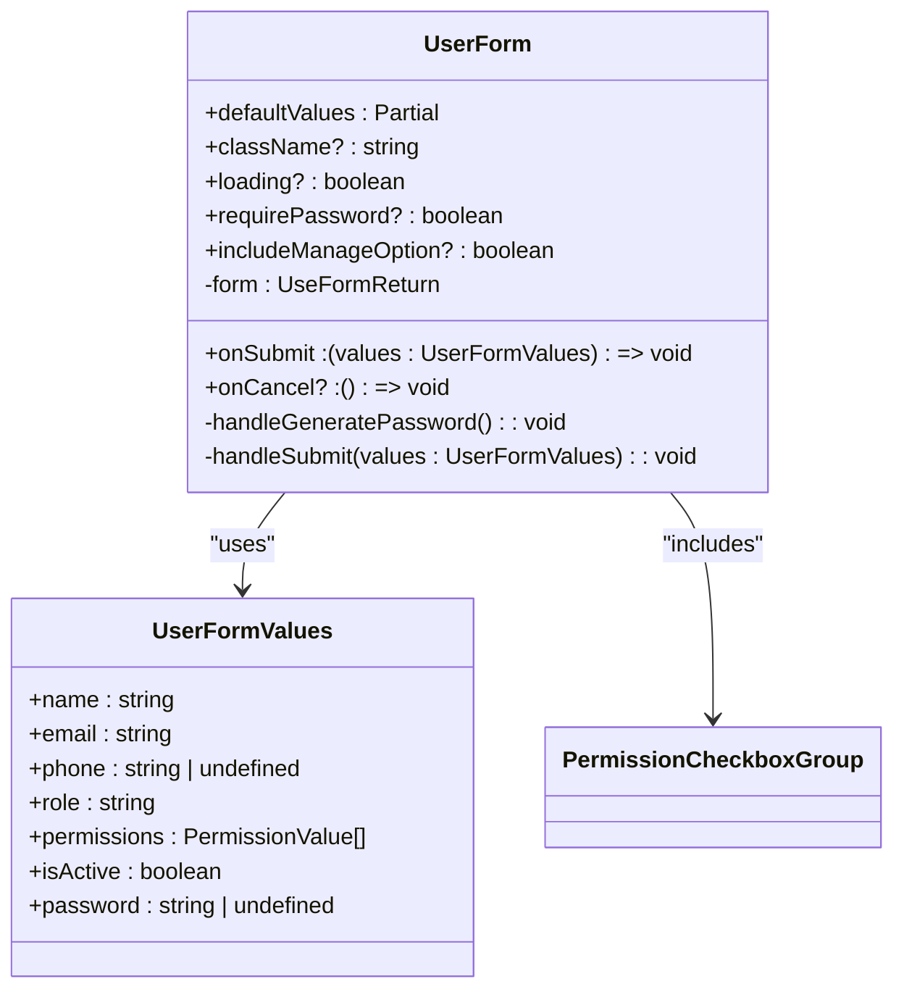
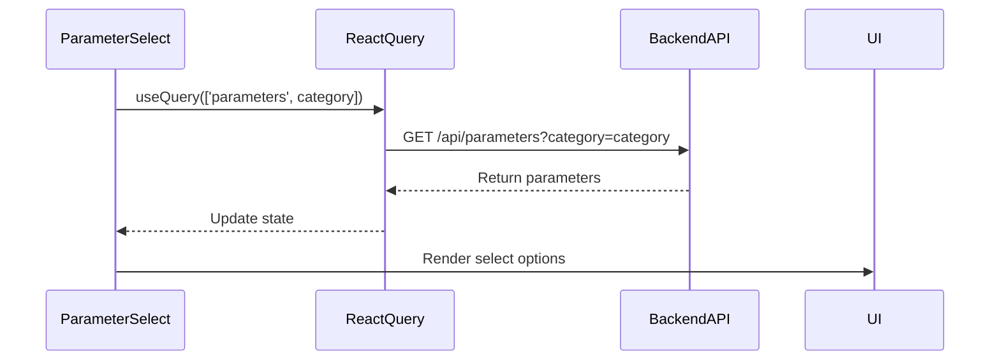
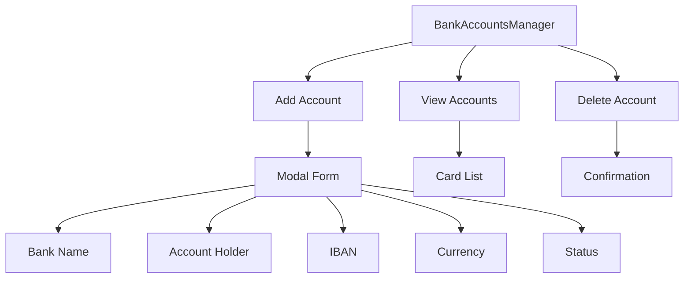
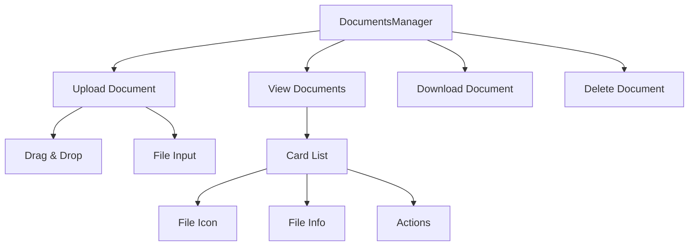
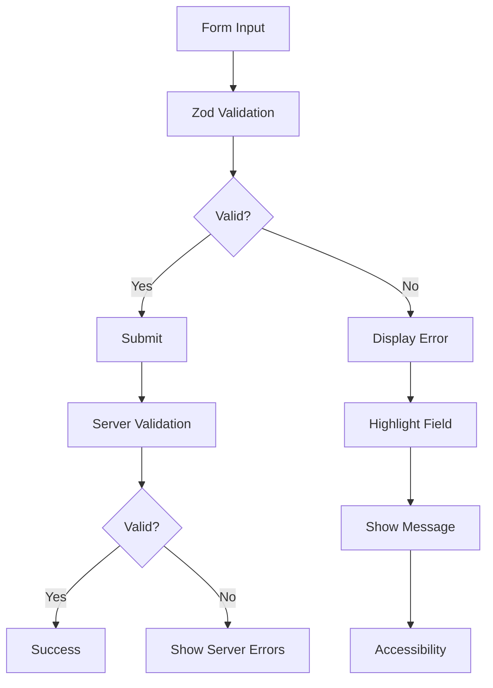
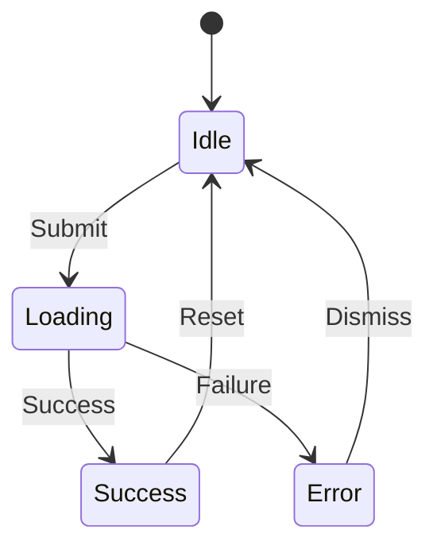
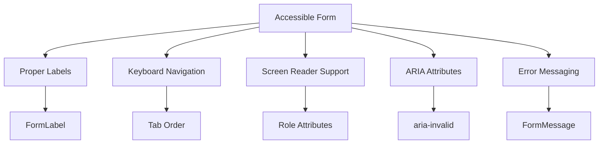

# Form Components

<cite>
**Referenced Files in This Document**   
- [user-form.tsx](file://src/components/forms/user-form.tsx)
- [ParameterSelect.tsx](file://src/components/forms/ParameterSelect.tsx)
- [bank-accounts/BankAccountsManager.tsx](file://src/components/bank-accounts/BankAccountsManager.tsx)
- [documents/DocumentsManager.tsx](file://src/components/documents/DocumentsManager.tsx)
- [ui/form.tsx](file://src/components/ui/form.tsx)
- [validations/aid-application.ts](file://src/lib/validations/aid-application.ts)
- [useFormMutation.ts](file://src/hooks/useFormMutation.ts)
</cite>

## Table of Contents

1. [Introduction](#introduction)
2. [Core Form Architecture](#core-form-architecture)
3. [User Form Implementation](#user-form-implementation)
4. [Dynamic Parameter Selection](#dynamic-parameter-selection)
5. [Complex Form Compositions](#complex-form-compositions)
6. [Validation and Error Handling](#validation-and-error-handling)
7. [Form Submission and State Management](#form-submission-and-state-management)
8. [Accessibility and Responsive Design](#accessibility-and-responsive-design)
9. [Usage Examples](#usage-examples)
10. [Best Practices for New Forms](#best-practices-for-new-forms)

## Introduction

This document provides comprehensive documentation for the form components in PORTAL, focusing on the implementation of user forms, dynamic parameter selection, and complex nested data management. The documentation covers the integration of Zod validation with React Hook Form, reusable components for dynamic form fields, and complex form compositions for managing bank accounts and documents. It also details the form architecture including error handling, submission states, and real-time validation, with examples of form usage in user creation and beneficiary registration workflows.

## Core Form Architecture

The form architecture in PORTAL is built on React Hook Form for efficient form state management and Zod for robust validation. The integration is facilitated through the `@hookform/resolvers/zod` resolver, providing type-safe form validation with real-time feedback. The architecture follows a component-based approach with reusable form elements and standardized error handling patterns.

**Diagram sources**

- [user-form.tsx](file://src/components/forms/user-form.tsx#L1-L258)
- [ui/form.tsx](file://src/components/ui/form.tsx#L1-L179)

**Section sources**

- [user-form.tsx](file://src/components/forms/user-form.tsx#L1-L258)
- [ui/form.tsx](file://src/components/ui/form.tsx#L1-L179)

## User Form Implementation

The UserForm component implements a comprehensive user management form with integrated Zod validation and React Hook Form. It handles user creation and editing workflows with support for permissions management, password generation, and account status control. The form includes real-time validation, error messaging, and accessibility features.

**Diagram sources**

- [user-form.tsx](file://src/components/forms/user-form.tsx#L53-L255)

**Section sources**

- [user-form.tsx](file://src/components/forms/user-form.tsx#L1-L258)
- [users.ts](file://convex/users.ts#L84-L174)

## Dynamic Parameter Selection

The ParameterSelect component provides a reusable solution for dynamic form fields that load options from the backend. It uses React Query for data fetching with caching, enabling efficient parameter selection across different form contexts. The component supports loading states, error handling, and accessibility features.

**Diagram sources**

- [ParameterSelect.tsx](file://src/components/forms/ParameterSelect.tsx#L25-L73)

**Section sources**

- [ParameterSelect.tsx](file://src/components/forms/ParameterSelect.tsx#L1-L75)
- [api.ts](file://src/lib/api/index.ts)

## Complex Form Compositions

PORTAL includes specialized form components for managing complex nested data structures. The BankAccountsManager and DocumentsManager components provide comprehensive interfaces for handling financial and document data with support for CRUD operations, file uploads, and real-time updates.

### Bank Accounts Management

The BankAccountsManager component handles bank account information for beneficiaries with support for multiple accounts, currency selection, and status management. It uses React Query for data synchronization and provides a modal interface for account creation.

**Diagram sources**

- [BankAccountsManager.tsx](file://src/components/bank-accounts/BankAccountsManager.tsx#L35-L267)

### Documents Management

The DocumentsManager component provides a file upload and management interface for beneficiary documents. It supports drag-and-drop uploads, file type detection, download functionality, and deletion with confirmation.

**Diagram sources**

- [DocumentsManager.tsx](file://src/components/documents/DocumentsManager.tsx#L27-L278)

**Section sources**

- [BankAccountsManager.tsx](file://src/components/bank-accounts/BankAccountsManager.tsx#L1-L267)
- [DocumentsManager.tsx](file://src/components/documents/DocumentsManager.tsx#L1-L278)

## Validation and Error Handling

The form validation system in PORTAL combines Zod schemas with React Hook Form for comprehensive client-side validation. The system includes real-time validation, error messaging, and server-side validation alignment. Error handling follows a standardized pattern across all forms with consistent user feedback.

**Diagram sources**

- [user-form.tsx](file://src/components/forms/user-form.tsx#L27-L41)
- [aid-application.ts](file://src/lib/validations/aid-application.ts#L8-L45)

**Section sources**

- [user-form.tsx](file://src/components/forms/user-form.tsx#L27-L41)
- [aid-application.ts](file://src/lib/validations/aid-application.ts#L1-L70)

## Form Submission and State Management

Form submission in PORTAL is managed through a standardized pattern using React Query mutations and the useFormMutation hook. This approach provides consistent loading states, error handling, and success notifications across all forms. The system handles form submission states including idle, loading, success, and error states.

**Diagram sources**

- [useFormMutation.ts](file://src/hooks/useFormMutation.ts#L1-L58)

**Section sources**

- [useFormMutation.ts](file://src/hooks/useFormMutation.ts#L1-L140)
- [user-form.tsx](file://src/components/forms/user-form.tsx#L92-L113)

## Accessibility and Responsive Design

The form components in PORTAL follow accessibility best practices with proper labeling, keyboard navigation, and screen reader support. The design is responsive across different screen sizes with adaptive layouts for mobile, tablet, and desktop views. All form elements include proper ARIA attributes and error messaging.

**Diagram sources**

- [ui/form.tsx](file://src/components/ui/form.tsx#L89-L167)
- [accessible-form-field.tsx](file://src/components/ui/accessible-form-field.tsx#L1-L225)

**Section sources**

- [ui/form.tsx](file://src/components/ui/form.tsx#L1-L179)
- [accessible-form-field.tsx](file://src/components/ui/accessible-form-field.tsx#L1-L225)

## Usage Examples

The form components are used throughout PORTAL in various workflows including user creation, beneficiary registration, and settings management. The UserForm is used in user management pages, while the ParameterSelect component is used in forms requiring dynamic parameter selection.

### User Creation Workflow

The user creation workflow uses the UserForm component with required password input and permission selection. The form is integrated with the user management API for creating new users with proper validation and error handling.

**Section sources**

- [user-form.tsx](file://src/components/forms/user-form.tsx#L63-L255)
- [page.tsx](<file://src/app/(dashboard)/kullanici/yeni/page.tsx>)

### Beneficiary Registration

Beneficiary registration uses complex form compositions including the BankAccountsManager and DocumentsManager components. These components allow for comprehensive beneficiary information collection with support for financial and document data.

**Section sources**

- [BankAccountsManager.tsx](file://src/components/bank-accounts/BankAccountsManager.tsx#L35-L267)
- [DocumentsManager.tsx](file://src/components/documents/DocumentsManager.tsx#L27-L278)

## Best Practices for New Forms

When creating new forms in PORTAL, follow these best practices to maintain consistency with existing patterns:

1. Use React Hook Form with Zod validation for all new forms
2. Implement reusable components for common form elements
3. Follow the standardized error handling pattern
4. Ensure accessibility compliance with proper labeling and ARIA attributes
5. Implement responsive design for all screen sizes
6. Use React Query for data fetching and mutation
7. Include loading states and user feedback
8. Validate both client-side and server-side
9. Use consistent styling and layout patterns
10. Document form usage and validation rules

**Section sources**

- [user-form.tsx](file://src/components/forms/user-form.tsx#L1-L258)
- [useFormMutation.ts](file://src/hooks/useFormMutation.ts#L1-L140)
- [ui/form.tsx](file://src/components/ui/form.tsx#L1-L179)
