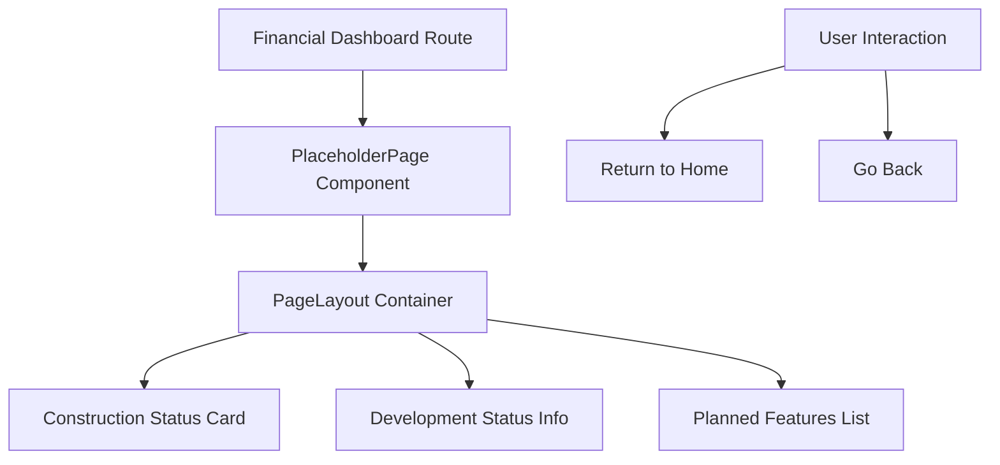
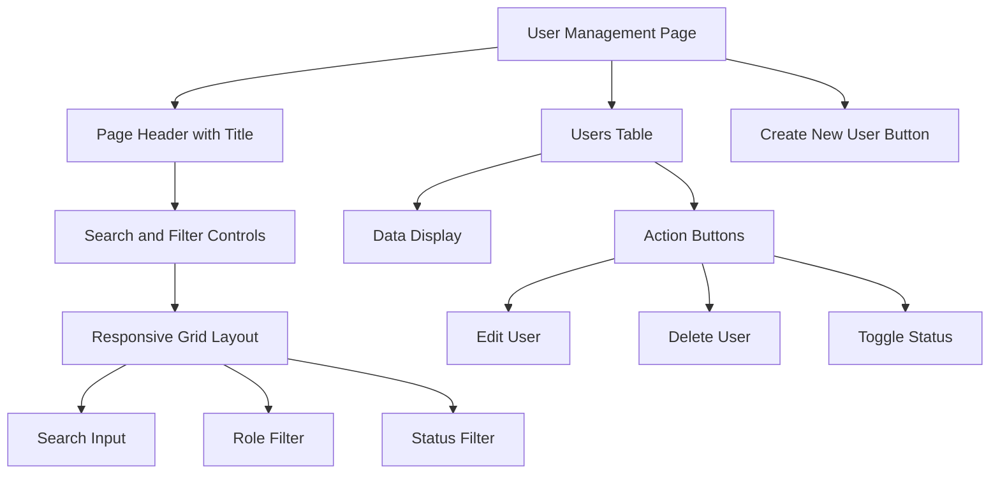

# Layout Components

<cite>
**Referenced Files in This Document**   
- [PageLayout.tsx](file://src/components/layouts/PageLayout.tsx)
- [PlaceholderPage.tsx](file://src/components/PlaceholderPage.tsx)
- [background-pattern.tsx](file://src/components/ui/background-pattern.tsx)
- [modern-sidebar.tsx](file://src/components/ui/modern-sidebar.tsx)
- [financial-dashboard/page.tsx](file://src/app/(dashboard)/financial-dashboard/page.tsx)
- [kullanici/page.tsx](file://src/app/(dashboard)/kullanici/page.tsx)
</cite>

## Table of Contents

1. [Introduction](#introduction)
2. [PageLayout: Primary Layout Container](#pagelayout-primary-layout-container)
3. [PlaceholderPage: Route Scaffolding and Empty States](#placeholderpage-route-scaffolding-and-empty-states)
4. [Structural UI Elements](#structural-ui-elements)
5. [Usage in Dashboard Pages](#usage-in-dashboard-pages)
6. [Responsive Design and Accessibility](#responsive-design-and-accessibility)
7. [Performance Considerations](#performance-considerations)
8. [Extensibility Guidelines](#extensibility-guidelines)

## Introduction

The PORTAL application utilizes a structured layout system to ensure consistency, usability, and scalability across its interface. This document details the implementation and usage of core layout components including PageLayout, PlaceholderPage, modern sidebar, and background-pattern elements. These components work together to create a cohesive application shell that supports responsive behavior, accessibility, and performance optimization while enabling flexible extension for future features.

## PageLayout: Primary Layout Container

PageLayout serves as the primary layout container for all dashboard pages in PORTAL. It provides a standardized structure for page headers, content organization, and navigation controls. The component integrates with the modern sidebar and supports responsive behavior across device sizes.

The layout includes animated entry transitions using Framer Motion for improved user experience. It accepts configurable props such as title, description, icon, badge, and action buttons, allowing consistent presentation while accommodating page-specific requirements. The showBackButton prop enables navigation history control, enhancing usability in multi-step workflows.

PageLayout's implementation ensures proper spacing, typography hierarchy, and alignment according to the application's design system. It uses Tailwind CSS utility classes through the cn helper for conditional styling and maintains accessibility standards with appropriate ARIA labels and semantic HTML structure.

**Section sources**

- [PageLayout.tsx](file://src/components/layouts/PageLayout.tsx#L9-L90)

## PlaceholderPage: Route Scaffolding and Empty States

PlaceholderPage provides a standardized approach for route scaffolding and empty states during development. It wraps the PageLayout component to maintain visual consistency while indicating that a page is under development.

The component displays a construction-themed interface with status information, estimated completion date, and planned features. It includes interactive elements that allow users to navigate back or return to the homepage, maintaining usability even for incomplete pages.

PlaceholderPage accepts props for title, description, estimated completion date, and feature list, enabling teams to communicate development progress effectively. The implementation uses motion animations to enhance visual appeal and includes responsive grid layout for optimal presentation across screen sizes.

This pattern supports agile development by allowing routes to be created early in the development cycle while providing meaningful feedback to users and stakeholders about upcoming functionality.

**Section sources**

- [PlaceholderPage.tsx](file://src/components/PlaceholderPage.tsx#L10-L144)

## Structural UI Elements

### Modern Sidebar Implementation

The modern sidebar provides primary navigation for the PORTAL application. It features collapsible behavior with persistent state stored in localStorage, allowing users to customize their workspace. The sidebar supports both desktop and mobile layouts with responsive transitions.

The implementation includes permission-based filtering, ensuring users only see navigation options for which they have appropriate access rights. It uses Next.js navigation hooks for efficient routing and includes animated transitions for module expansion and collapse.

Tooltip integration enhances usability in collapsed mode by providing hover-based label display. The sidebar maintains visual hierarchy through color coding and indentation, clearly distinguishing between main modules and sub-pages.

**Section sources**

- [modern-sidebar.tsx](file://src/components/ui/modern-sidebar.tsx#L17-L217)

### Background Pattern System

The background-pattern component provides subtle visual texture to the application interface through SVG-based patterns. It supports multiple variants including dots, grid, waves, circuit, and topography, each implemented as scalable vector graphics.

The component uses React's useId hook to ensure unique pattern identifiers, preventing rendering conflicts when multiple instances are present. Patterns are rendered as absolute-positioned elements with pointer-events disabled to avoid interference with interactive components.

Configurable properties include opacity, color, and variant selection, allowing the pattern to adapt to different contexts while maintaining performance through efficient SVG rendering. The implementation prioritizes accessibility by setting aria-hidden="true" on decorative elements.

**Section sources**

- [background-pattern.tsx](file://src/components/ui/background-pattern.tsx#L4-L252)

## Usage in Dashboard Pages

### Financial Dashboard Implementation

The financial-dashboard page utilizes PlaceholderPage to indicate its development status. It demonstrates the component's ability to communicate planned features such as real-time financial indicators, income-expense graphs, budget comparisons, trend analysis, and customizable widgets.

The implementation shows how PlaceholderPage effectively manages user expectations for upcoming functionality while maintaining navigational consistency with the rest of the application. The estimated completion date provides transparency about development timelines.

**Diagram sources**

- [financial-dashboard/page.tsx](<file://src/app/(dashboard)/financial-dashboard/page.tsx#L1-L21>)

### User Management Page

The user management page (kullanici) demonstrates a fully implemented layout using the standard PageLayout structure without placeholder components. It showcases the integration of search functionality, filtering controls, and data tables within the established layout system.

The page implements responsive grid layouts for filter controls and uses Card components to organize content sections. It demonstrates proper handling of user permissions, showing or hiding management actions based on the current user's authorization level.

The implementation includes client-side state management for search terms, role filters, and status filters, with URL synchronization to enable bookmarking of filtered views. This represents a mature usage pattern of the layout system for complex data management interfaces.

**Diagram sources**

- [kullanici/page.tsx](<file://src/app/(dashboard)/kullanici/page.tsx#L1-L276>)

## Responsive Design and Accessibility

The layout components in PORTAL implement comprehensive responsive design principles. PageLayout uses flexbox with conditional sm:flex-row classes to adapt header layout on larger screens. The modern sidebar collapses to a compact icon-based navigation on smaller devices, with mobile-specific overlay behavior.

All components follow accessibility best practices, including proper ARIA labeling, keyboard navigation support, and semantic HTML structure. The sidebar implements focus management during expansion/collapse animations, and all interactive elements maintain visible focus states.

Color contrast meets WCAG standards, and text scaling is handled through relative units to support user preferences. Motion preferences are respected where applicable, with animations disabled when users have requested reduced motion.

The responsive system uses a mobile-first approach with breakpoints aligned to Tailwind CSS defaults, ensuring consistent behavior across devices. Touch targets are appropriately sized for mobile interaction, and form controls include proper labeling for screen readers.

**Section sources**

- [PageLayout.tsx](file://src/components/layouts/PageLayout.tsx#L37-L90)
- [modern-sidebar.tsx](file://src/components/ui/modern-sidebar.tsx#L75-L217)

## Performance Considerations

The layout components are optimized for performance through several strategies. The modern sidebar implements React.memo patterns and efficient state management to minimize re-renders. Navigation modules are statically defined in configuration files to avoid runtime computation.

The background-pattern component uses SVG patterns instead of image assets, reducing network payload and enabling infinite tiling without performance degradation. Pattern generation is encapsulated within a useMemo-like pattern to prevent unnecessary re-creation.

Client-side navigation with Next.js Link components enables prefetching and fast transitions between pages. The layout system avoids unnecessary wrapper divs and uses efficient CSS containment where appropriate.

For complex pages like user management, the implementation uses React Query for data fetching with caching and background updates, preventing layout thrashing during data loading. Skeleton states are managed through dedicated components to maintain perceived performance.

The overall bundle impact of layout components is minimized through tree-shaking and code splitting, with non-essential animations and effects loaded conditionally.

**Section sources**

- [PageLayout.tsx](file://src/components/layouts/PageLayout.tsx#L3-L90)
- [modern-sidebar.tsx](file://src/components/ui/modern-sidebar.tsx#L3-L217)
- [background-pattern.tsx](file://src/components/ui/background-pattern.tsx#L1-L252)

## Extensibility Guidelines

### Navigation Pattern Extension

To extend navigation patterns, developers should modify the navigation configuration in src/config/navigation.ts rather than directly editing the sidebar component. New modules should follow the NavigationModule interface and include appropriate permission checks.

Custom navigation behaviors can be implemented through the onMobileToggle prop, allowing integration with custom state management systems. The sidebar's modular design supports the addition of new interaction patterns such as drag-and-drop reordering or context menus.

### Visual Theme Customization

Visual themes can be extended by adding new variants to the background-pattern component or by creating theme-specific CSS variables. The design system in src/config/design-tokens.ts provides the foundation for theme customization.

New layout variants can be created by composing existing components rather than modifying core implementations. For example, alternative page layouts can wrap PageLayout with additional structural elements while preserving its core functionality.

### Component Composition

Developers should favor composition over inheritance when extending layout functionality. Custom layout wrappers can be created to provide specialized behavior for specific sections of the application while maintaining consistency with the overall design language.

Third-party integrations should be wrapped in adapter components that translate their APIs to match the existing layout system's patterns. This ensures that external dependencies do not compromise the consistency and maintainability of the layout architecture.

**Section sources**

- [PageLayout.tsx](file://src/components/layouts/PageLayout.tsx)
- [modern-sidebar.tsx](file://src/components/ui/modern-sidebar.tsx)
- [config/navigation.ts](file://src/config/navigation.ts)
