# UI Primitive Components

<cite>
**Referenced Files in This Document**   
- [accessible-form-field.tsx](file://src/components/ui/accessible-form-field.tsx)
- [form-field-group.tsx](file://src/components/ui/form-field-group.tsx)
- [button.tsx](file://src/components/ui/button.tsx)
- [dialog.tsx](file://src/components/ui/dialog.tsx)
- [tabs.tsx](file://src/components/ui/tabs.tsx)
- [form.tsx](file://src/components/ui/form.tsx)
- [user-form.tsx](file://src/components/forms/user-form.tsx)
- [DonationForm.tsx](file://src/components/forms/DonationForm.tsx)
- [design-tokens.ts](file://src/config/design-tokens.ts)
</cite>

## Table of Contents

1. [Introduction](#introduction)
2. [Core Form Components](#core-form-components)
3. [Interactive Elements](#interactive-elements)
4. [Form Composition and Workflow Integration](#form-composition-and-workflow-integration)
5. [Accessibility and ARIA Compliance](#accessibility-and-aria-compliance)
6. [Styling and Theming](#styling-and-theming)
7. [Component Composition Guidelines](#component-composition-guidelines)

## Introduction

This documentation provides comprehensive guidance on the UI primitive components within PORTAL's design system, following a shadcn/ui-inspired pattern. The components are designed to ensure accessibility, consistency, and seamless integration with React Hook Form for robust form handling. This document details the implementation of accessible form controls, interactive elements, and their usage across key workflows such as user management and donation processing. The design system leverages Tailwind CSS and a structured design tokens system to maintain visual harmony and support theming.

## Core Form Components

The foundation of PORTAL's form system consists of accessible, composable components that ensure proper labeling, error handling, and user feedback. These components are built with accessibility in mind, providing appropriate ARIA attributes and keyboard navigation support.

### Accessible Form Field

The `AccessibleFormField` component serves as a wrapper for form inputs, ensuring proper association between labels, inputs, hints, and error messages. It manages the accessibility tree by generating unique IDs and setting appropriate ARIA attributes.

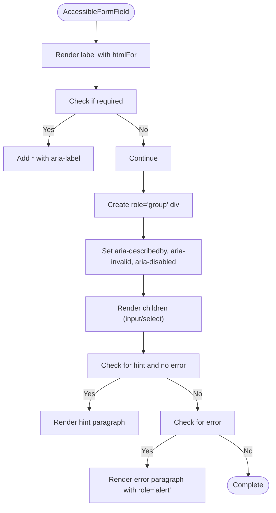

**Diagram sources**

- [accessible-form-field.tsx](file://src/components/ui/accessible-form-field.tsx#L20-L87)

**Section sources**

- [accessible-form-field.tsx](file://src/components/ui/accessible-form-field.tsx#L5-L14)
- [accessible-form-field.tsx](file://src/components/ui/accessible-form-field.tsx#L20-L87)

### Form Field Group

The `FormFieldGroup` component organizes related form fields into logical sections with optional icons and visual separators. It supports multiple presentation variants including default, bordered, and card layouts.

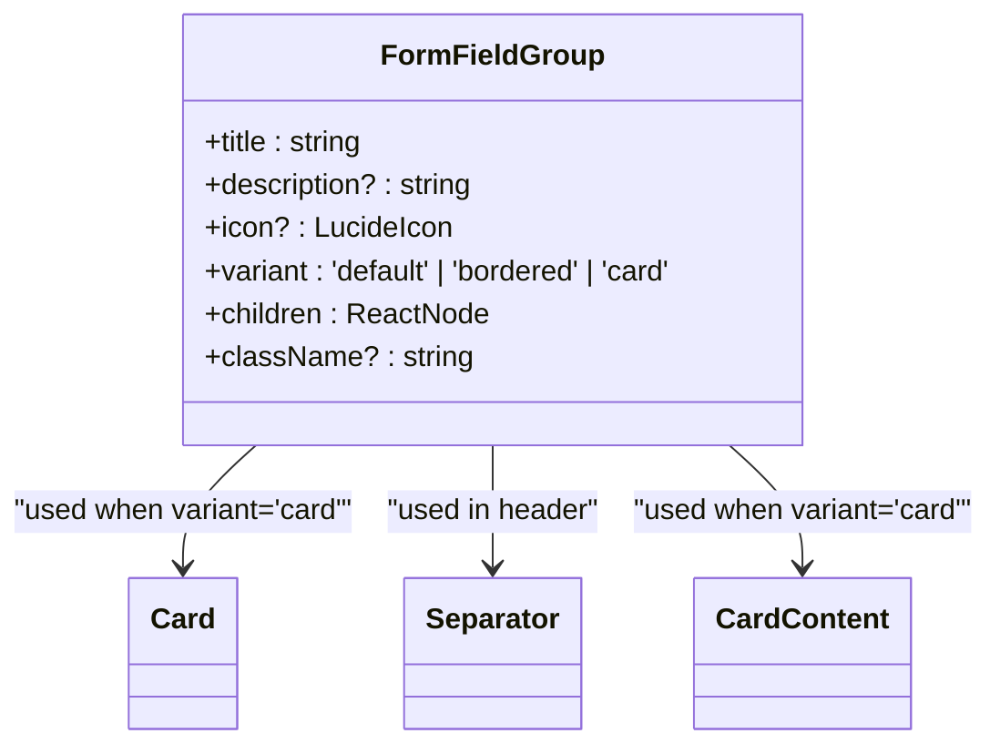

**Diagram sources**

- [form-field-group.tsx](file://src/components/ui/form-field-group.tsx#L7-L14)
- [form-field-group.tsx](file://src/components/ui/form-field-group.tsx#L16-L63)

**Section sources**

- [form-field-group.tsx](file://src/components/ui/form-field-group.tsx#L7-L14)
- [form-field-group.tsx](file://src/components/ui/form-field-group.tsx#L16-L63)

### Form Integration with React Hook Form

PORTAL's form components are designed to work seamlessly with React Hook Form, providing a structured approach to form state management, validation, and submission. The `form.tsx` file exports a suite of components that integrate with React Hook Form's context.

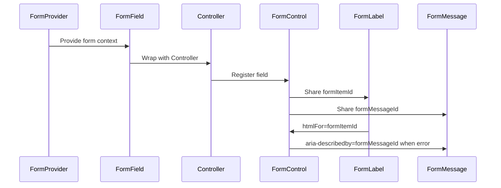

**Diagram sources**

- [form.tsx](file://src/components/ui/form.tsx#L1-L179)

**Section sources**

- [form.tsx](file://src/components/ui/form.tsx#L1-L179)
- [user-form.tsx](file://src/components/forms/user-form.tsx#L3-L43)
- [DonationForm.tsx](file://src/components/forms/DonationForm.tsx#L27-L40)

## Interactive Elements

### Button Component

The Button component is a versatile primitive that supports multiple variants and sizes, designed to provide consistent styling and interaction patterns across the application.

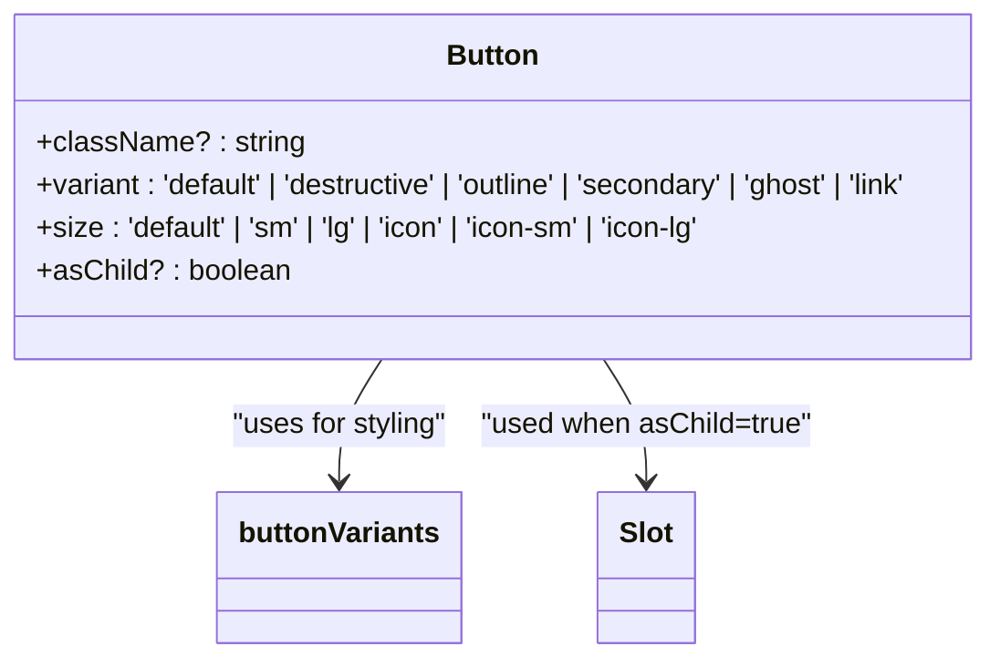

**Diagram sources**

- [button.tsx](file://src/components/ui/button.tsx#L6-L34)
- [button.tsx](file://src/components/ui/button.tsx#L36-L55)

**Section sources**

- [button.tsx](file://src/components/ui/button.tsx#L6-L34)
- [button.tsx](file://src/components/ui/button.tsx#L36-L55)
- [user-form.tsx](file://src/components/forms/user-form.tsx#L223-L232)
- [DonationForm.tsx](file://src/components/forms/DonationForm.tsx#L498-L519)

### Dialog Component

The Dialog component provides a modal interface for user interactions, with proper accessibility features including focus trapping and ARIA attributes.

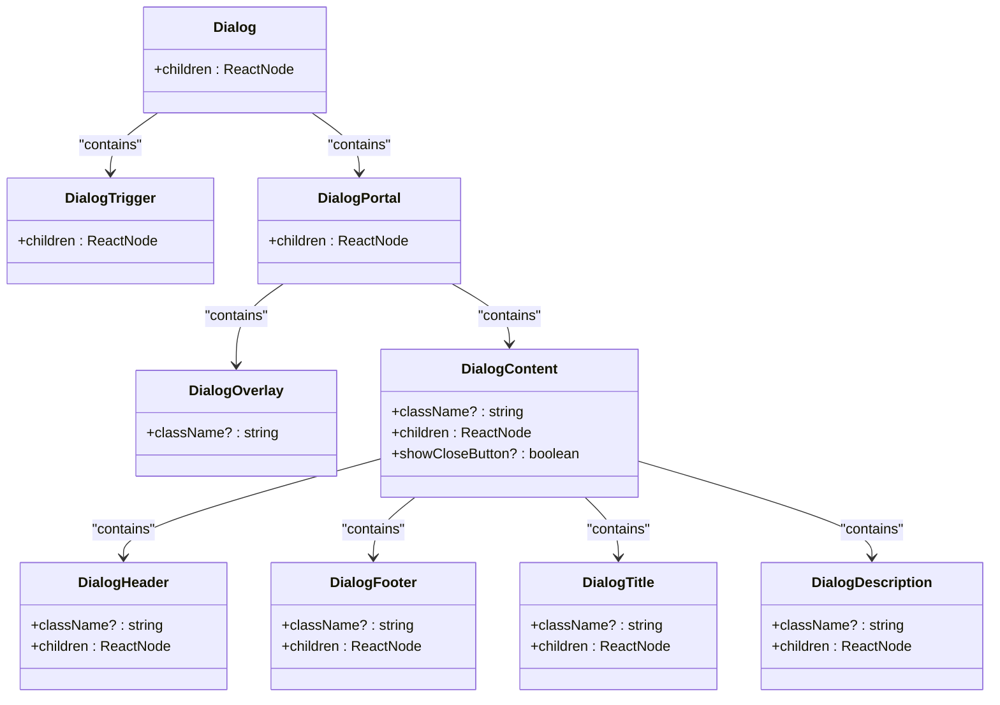

**Diagram sources**

- [dialog.tsx](file://src/components/ui/dialog.tsx#L8-L10)
- [dialog.tsx](file://src/components/ui/dialog.tsx#L20-L22)
- [dialog.tsx](file://src/components/ui/dialog.tsx#L48-L91)
- [dialog.tsx](file://src/components/ui/dialog.tsx#L24-L46)
- [dialog.tsx](file://src/components/ui/dialog.tsx#L16-L18)
- [dialog.tsx](file://src/components/ui/dialog.tsx#L12-L14)
- [dialog.tsx](file://src/components/ui/dialog.tsx#L93-L101)
- [dialog.tsx](file://src/components/ui/dialog.tsx#L123-L134)
- [dialog.tsx](file://src/components/ui/dialog.tsx#L103-L111)
- [dialog.tsx](file://src/components/ui/dialog.tsx#L113-L121)

**Section sources**

- [dialog.tsx](file://src/components/ui/dialog.tsx#L8-L10)
- [dialog.tsx](file://src/components/ui/dialog.tsx#L20-L22)
- [dialog.tsx](file://src/components/ui/dialog.tsx#L48-L91)
- [dialog.tsx](file://src/components/ui/dialog.tsx#L24-L46)
- [dialog.tsx](file://src/components/ui/dialog.tsx#L16-L18)
- [dialog.tsx](file://src/components/ui/dialog.tsx#L12-L14)
- [dialog.tsx](file://src/components/ui/dialog.tsx#L93-L101)
- [dialog.tsx](file://src/components/ui/dialog.tsx#L123-L134)
- [dialog.tsx](file://src/components/ui/dialog.tsx#L103-L111)
- [dialog.tsx](file://src/components/ui/dialog.tsx#L113-L121)

### Tabs Component

The Tabs component enables content organization through tabbed interfaces, supporting keyboard navigation and proper ARIA roles for accessibility.

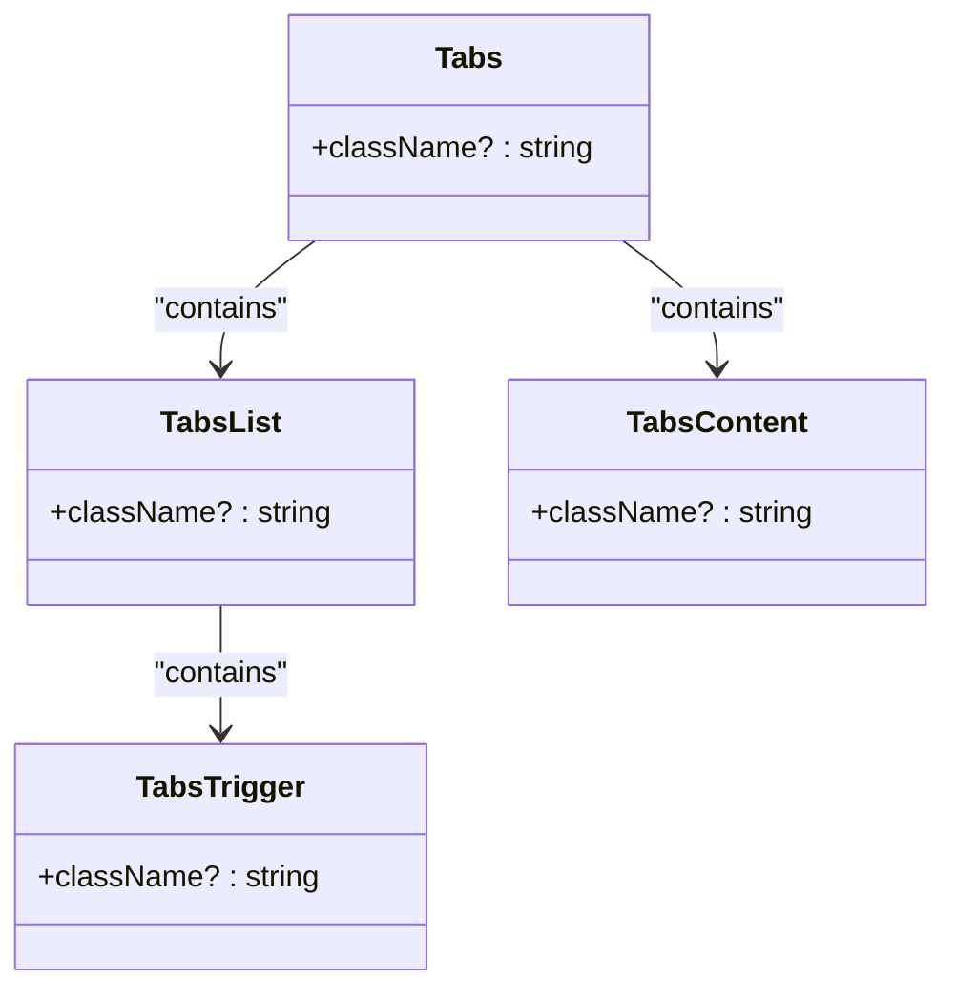

**Diagram sources**

- [tabs.tsx](file://src/components/ui/tabs.tsx#L7-L15)
- [tabs.tsx](file://src/components/ui/tabs.tsx#L18-L28)
- [tabs.tsx](file://src/components/ui/tabs.tsx#L31-L41)
- [tabs.tsx](file://src/components/ui/tabs.tsx#L44-L51)

**Section sources**

- [tabs.tsx](file://src/components/ui/tabs.tsx#L7-L15)
- [tabs.tsx](file://src/components/ui/tabs.tsx#L18-L28)
- [tabs.tsx](file://src/components/ui/tabs.tsx#L31-L41)
- [tabs.tsx](file://src/components/ui/tabs.tsx#L44-L51)

## Form Composition and Workflow Integration

### User Form Implementation

The user form demonstrates the composition of primitive components into a complex form for user management. It integrates with React Hook Form for validation and state management, using zod for schema validation.

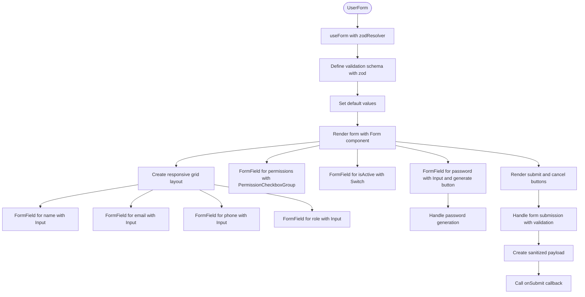

**Diagram sources**

- [user-form.tsx](file://src/components/forms/user-form.tsx#L27-L40)
- [user-form.tsx](file://src/components/forms/user-form.tsx#L73-L84)
- [user-form.tsx](file://src/components/forms/user-form.tsx#L116-L253)

**Section sources**

- [user-form.tsx](file://src/components/forms/user-form.tsx#L27-L40)
- [user-form.tsx](file://src/components/forms/user-form.tsx#L73-L84)
- [user-form.tsx](file://src/components/forms/user-form.tsx#L116-L253)

### Donation Form Implementation

The donation form showcases a more complex workflow with real-time field validation, file upload capabilities, and integration with React Query for data mutation.

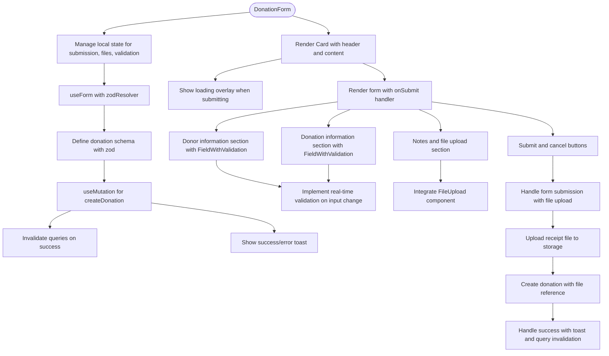

**Diagram sources**

- [DonationForm.tsx](file://src/components/forms/DonationForm.tsx#L27-L40)
- [DonationForm.tsx](file://src/components/forms/DonationForm.tsx#L125-L132)
- [DonationForm.tsx](file://src/components/forms/DonationForm.tsx#L134-L146)
- [DonationForm.tsx](file://src/components/forms/DonationForm.tsx#L188-L523)

**Section sources**

- [DonationForm.tsx](file://src/components/forms/DonationForm.tsx#L27-L40)
- [DonationForm.tsx](file://src/components/forms/DonationForm.tsx#L125-L132)
- [DonationForm.tsx](file://src/components/forms/DonationForm.tsx#L134-L146)
- [DonationForm.tsx](file://src/components/forms/DonationForm.tsx#L188-L523)

## Accessibility and ARIA Compliance

PORTAL's UI components adhere to WCAG 2.1 guidelines, ensuring accessibility for all users. The components implement proper ARIA attributes, keyboard navigation, and screen reader support.

### Keyboard Navigation

All interactive components support keyboard navigation:

- Buttons and links are focusable and activatable with Enter/Space
- Form fields are navigable with Tab/Shift+Tab
- Dialogs trap focus and can be closed with Escape
- Tabs support arrow key navigation between tabs

### ARIA Attributes Implementation

The components use ARIA attributes to enhance accessibility:

- `aria-label` and `aria-labelledby` for labeling elements
- `aria-describedby` to associate hints and error messages
- `aria-invalid` to indicate invalid form fields
- `aria-disabled` for disabled elements
- `role="alert"` for error messages
- `role="group"` for grouping related form elements

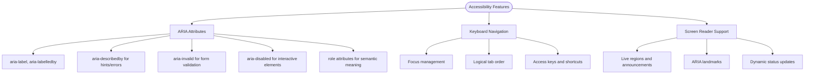

**Section sources**

- [accessible-form-field.tsx](file://src/components/ui/accessible-form-field.tsx#L37-L38)
- [accessible-form-field.tsx](file://src/components/ui/accessible-form-field.tsx#L66-L70)
- [accessible-form-field.tsx](file://src/components/ui/accessible-form-field.tsx#L81-L83)
- [dialog.tsx](file://src/components/ui/dialog.tsx#L80-L87)
- [tabs.tsx](file://src/components/ui/tabs.tsx#L36-L37)

## Styling and Theming

### Design Tokens System

PORTAL uses a comprehensive design tokens system to maintain consistency across the UI. The tokens are organized into logical categories and exported for use throughout the application.

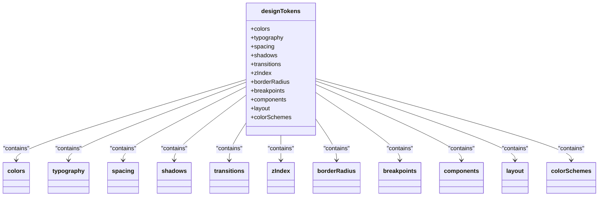

**Diagram sources**

- [design-tokens.ts](file://src/config/design-tokens.ts#L8-L106)
- [design-tokens.ts](file://src/config/design-tokens.ts#L110-L157)
- [design-tokens.ts](file://src/config/design-tokens.ts#L161-L178)
- [design-tokens.ts](file://src/config/design-tokens.ts#L182-L189)
- [design-tokens.ts](file://src/config/design-tokens.ts#L193-L197)
- [design-tokens.ts](file://src/config/design-tokens.ts#L201-L209)
- [design-tokens.ts](file://src/config/design-tokens.ts#L213-L220)
- [design-tokens.ts](file://src/config/design-tokens.ts#L224-L231)
- [design-tokens.ts](file://src/config/design-tokens.ts#L235-L293)
- [design-tokens.ts](file://src/config/design-tokens.ts#L301-L347)
- [design-tokens.ts](file://src/config/design-tokens.ts#L351-L370)

**Section sources**

- [design-tokens.ts](file://src/config/design-tokens.ts#L8-L106)
- [design-tokens.ts](file://src/config/design-tokens.ts#L110-L157)
- [design-tokens.ts](file://src/config/design-tokens.ts#L161-L178)
- [design-tokens.ts](file://src/config/design-tokens.ts#L182-L189)
- [design-tokens.ts](file://src/config/design-tokens.ts#L193-L197)
- [design-tokens.ts](file://src/config/design-tokens.ts#L201-L209)
- [design-tokens.ts](file://src/config/design-tokens.ts#L213-L220)
- [design-tokens.ts](file://src/config/design-tokens.ts#L224-L231)
- [design-tokens.ts](file://src/config/design-tokens.ts#L235-L293)
- [design-tokens.ts](file://src/config/design-tokens.ts#L301-L347)
- [design-tokens.ts](file://src/config/design-tokens.ts#L351-L370)

### Tailwind CSS Integration

The components leverage Tailwind CSS utility classes for styling, with a focus on responsive design and consistent spacing. The `cn` utility function is used to conditionally apply classes.

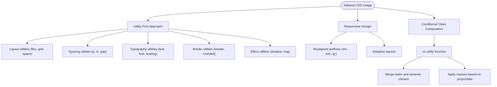

**Section sources**

- [accessible-form-field.tsx](file://src/components/ui/accessible-form-field.tsx#L42-L43)
- [accessible-form-field.tsx](file://src/components/ui/accessible-form-field.tsx#L120-L129)
- [form-field-group.tsx](file://src/components/ui/form-field-group.tsx#L40-L41)
- [button.tsx](file://src/components/ui/button.tsx#L52-L53)
- [dialog.tsx](file://src/components/ui/dialog.tsx#L62-L71)
- [tabs.tsx](file://src/components/ui/tabs.tsx#L22-L25)

## Component Composition Guidelines

When composing components in PORTAL's design system, follow these guidelines to ensure consistency and maintainability:

1. **Use Primitive Components**: Always use the primitive components (AccessibleFormField, Button, Dialog, etc.) rather than building custom implementations.
2. **Follow Accessibility Patterns**: Ensure all forms use proper labeling, error handling, and ARIA attributes.
3. **Leverage Design Tokens**: Use the design tokens system for colors, spacing, typography, and other visual properties.
4. **Integrate with React Hook Form**: For forms, use the Form, FormField, FormItem, FormLabel, FormControl, and FormMessage components with React Hook Form.
5. **Handle Loading States**: Implement loading states for async operations using appropriate visual feedback.
6. **Provide Error Feedback**: Use consistent error messaging patterns with appropriate ARIA roles.
7. **Support Keyboard Navigation**: Ensure all interactive elements are keyboard accessible.
8. **Use Responsive Layouts**: Design components to work across different screen sizes using Tailwind's responsive utilities.

**Section sources**

- [user-form.tsx](file://src/components/forms/user-form.tsx)
- [DonationForm.tsx](file://src/components/forms/DonationForm.tsx)
- [accessible-form-field.tsx](file://src/components/ui/accessible-form-field.tsx)
- [form-field-group.tsx](file://src/components/ui/form-field-group.tsx)
- [form.tsx](file://src/components/ui/form.tsx)
