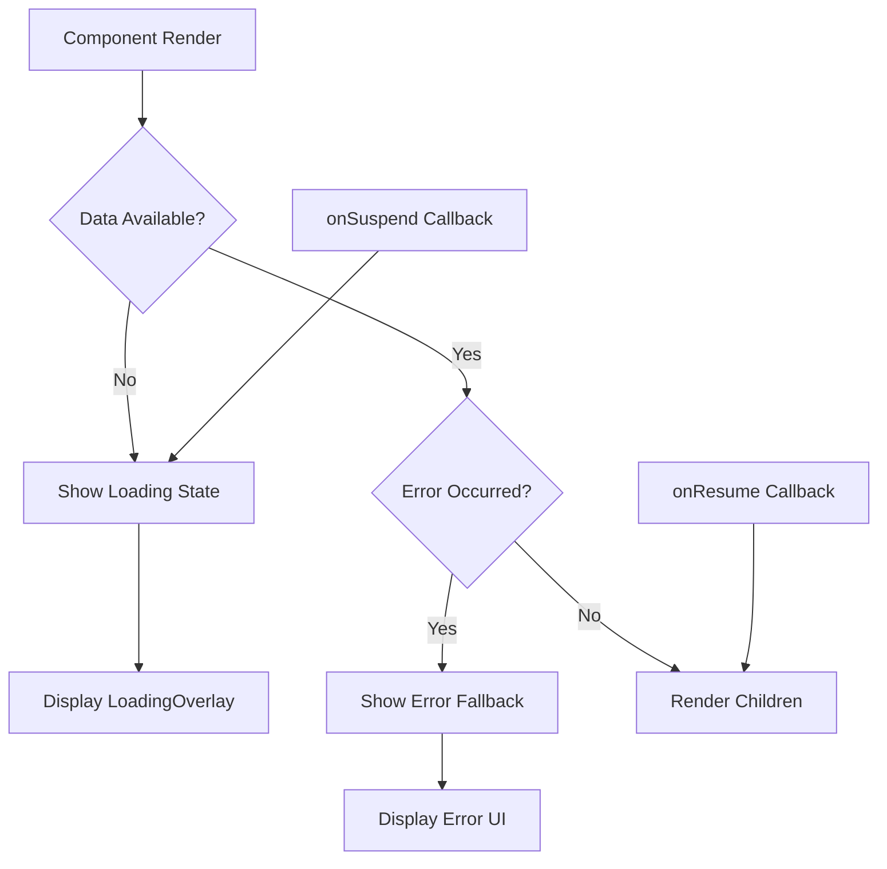

# Utility Components

<cite>
**Referenced Files in This Document**   
- [loading-overlay.tsx](file://src/components/ui/loading-overlay.tsx)
- [page-loader.tsx](file://src/components/ui/page-loader.tsx)
- [error-boundary.tsx](file://src/components/ui/error-boundary.tsx)
- [suspense-boundary.tsx](file://src/components/ui/suspense-boundary.tsx)
- [enhanced-toast.tsx](file://src/components/ui/enhanced-toast.tsx)
- [export-buttons.tsx](file://src/components/ui/export-buttons.tsx)
- [filter-panel.tsx](file://src/components/ui/filter-panel.tsx)
- [keyboard-shortcuts.tsx](file://src/components/ui/keyboard-shortcuts.tsx)
- [providers.tsx](file://src/app/providers.tsx)
</cite>

## Table of Contents

1. [Introduction](#introduction)
2. [Loading States and Overlay Components](#loading-states-and-overlay-components)
   - [Loading Overlay](#loading-overlay)
   - [Page Loader](#page-loader)
3. [Error Handling Components](#error-handling-components)
   - [Error Boundary](#error-boundary)
   - [Suspense Boundary](#suspense-boundary)
4. [User Notification Components](#user-notification-components)
   - [Enhanced Toast](#enhanced-toast)
5. [Data Export Components](#data-export-components)
   - [Export Buttons](#export-buttons)
6. [Search and Filtering Components](#search-and-filtering-components)
   - [Filter Panel](#filter-panel)
7. [Accessibility and Productivity Components](#accessibility-and-productivity-components)
   - [Keyboard Shortcuts](#keyboard-shortcuts)
8. [Integration with TanStack Query](#integration-with-tanstack-query)
9. [Usage Guidelines](#usage-guidelines)
10. [Conclusion](#conclusion)

## Introduction

The PORTAL application implements a comprehensive suite of utility components designed to enhance user experience through consistent loading feedback, graceful error handling, user notifications, data export capabilities, search functionality, and accessibility features. These components are built with React and integrated with modern frontend patterns including React Query for data fetching. This documentation provides a detailed overview of each utility component, its implementation, integration points, and usage guidelines.

## Loading States and Overlay Components

### Loading Overlay

The `LoadingOverlay` component provides visual feedback during data loading operations. It supports multiple animation variants including spinner, dots, pulse, bars, and ripple, with configurable size, text, and fullscreen options. The component uses Framer Motion for smooth entrance and exit animations and includes accessibility attributes like `aria-live="polite"` and `aria-busy="true"` to communicate loading state to assistive technologies.

The overlay can be blurred with a backdrop for fullscreen loading states and is designed to be used as a direct component or through higher-level abstractions. It is implemented as a standalone component that can be easily integrated into any part of the application requiring loading feedback.

**Section sources**

- [loading-overlay.tsx](file://src/components/ui/loading-overlay.tsx#L6-L139)

### Page Loader

The `PageLoader` component offers three variants for different loading scenarios: overlay, skeleton, and simple. The overlay variant displays a fullscreen loading spinner, the skeleton variant provides content-aware skeleton screens that mimic the final layout, and the simple variant shows a basic spinner with text.

Additional specialized loaders include `DashboardLoader`, `FormLoader`, and `DetailLoader`, each tailored to specific page types with appropriate skeleton layouts. These loaders create a perceived performance improvement by providing immediate visual feedback and maintaining layout stability during content loading.

**Section sources**

- [page-loader.tsx](file://src/components/ui/page-loader.tsx#L8-L205)

## Error Handling Components

### Error Boundary

The `ErrorBoundary` component implements React's error boundary pattern to catch JavaScript errors in the component tree and display a fallback UI instead of crashing the application. It includes both a class-based `ErrorBoundary` and an `AsyncErrorBoundary` for handling errors in asynchronous operations.

The default fallback UI displays an error message with retry and navigation options, while development mode shows additional stack trace information. The component integrates with the application's logging system to capture and report errors. It also provides a `useErrorHandler` hook for programmatic error throwing to the nearest boundary.

**Section sources**

- [error-boundary.tsx](file://src/components/ui/error-boundary.tsx#L24-L241)

### Suspense Boundary

The `SuspenseBoundary` component combines React's Suspense functionality with error handling to manage both loading and error states in a single wrapper. It automatically displays a loading overlay during suspense and catches any errors that occur during data fetching or component rendering.

The component provides lifecycle callbacks (`onSuspend` and `onResume`) for tracking suspension duration and includes development-time logging to monitor performance. Convenience wrappers like `SuspenseWithSpinner`, `SuspenseWithDots`, and `SuspenseFullscreen` provide preset configurations for common use cases.

**Diagram sources**

- [suspense-boundary.tsx](file://src/components/ui/suspense-boundary.tsx#L7-L116)
- [loading-overlay.tsx](file://src/components/ui/loading-overlay.tsx#L15-L139)

**Section sources**

- [suspense-boundary.tsx](file://src/components/ui/suspense-boundary.tsx#L7-L116)
- [providers.tsx](file://src/app/providers.tsx#L96-L143)

## User Notification Components

### Enhanced Toast

The `enhancedToast` utility provides a comprehensive notification system with support for success, error, warning, and info messages. Each toast type has distinct styling with appropriate icons and colors. The system supports rich content including titles, descriptions, and action buttons that can perform custom operations.

The `EnhancedToaster` component configures the toast container with application-specific settings like position, theming, and visibility limits. The toast system integrates with Sonner library and provides promise-based notifications that automatically handle loading, success, and error states for asynchronous operations.

**Section sources**

- [enhanced-toast.tsx](file://src/components/ui/enhanced-toast.tsx#L6-L288)

## Data Export Components

### Export Buttons

The `ExportButtons` component provides a unified interface for exporting data in multiple formats including CSV, JSON, HTML, and printable views. It includes both a compact dropdown version and an expanded button group layout. The component validates data presence before rendering and disables when no data is available.

The `SimpleExportButton` offers a streamlined version for single-format exports. Both components integrate with the application's export utilities and support column mapping for field name customization in exported files. The export functionality handles large datasets efficiently and provides user feedback during the export process.

**Section sources**

- [export-buttons.tsx](file://src/components/ui/export-buttons.tsx#L8-L189)

## Search and Filtering Components

### Filter Panel

The `FilterPanel` component provides a reusable interface for filtering data in list views. It supports multiple filter types including text search, select dropdowns, checkboxes, and date ranges. Filters are organized in collapsible sections that can be expanded or collapsed individually.

The component displays active filter counts and provides a reset button to clear all filters. It includes complementary components like `QuickFilters` for common filter presets and `ActiveFilters` for displaying currently applied filters with removal options. The filter state is managed internally and propagated to parent components through callback functions.

**Section sources**

- [filter-panel.tsx](file://src/components/ui/filter-panel.tsx#L8-L267)

## Accessibility and Productivity Components

### Keyboard Shortcuts

The `KeyboardShortcuts` component implements a global keyboard shortcut system with built-in help dialog. It supports modifier keys (Ctrl, Shift, Alt, Meta) and provides a standardized interface for defining application-wide shortcuts. The help dialog is accessible via standard shortcuts like "?" or "Ctrl+/" and displays all available shortcuts with their descriptions.

The component prevents default browser behavior for registered shortcuts and includes a `useKeyboardShortcuts` hook for programmatic access. Shortcuts are automatically registered and unregistered based on component lifecycle, preventing memory leaks and ensuring consistent behavior.

**Section sources**

- [keyboard-shortcuts.tsx](file://src/components/ui/keyboard-shortcuts.tsx#L24-L194)

## Integration with TanStack Query

The utility components are designed to work seamlessly with TanStack Query for data fetching operations. The `SuspenseBoundary` component integrates directly with React Query's suspense mode, automatically displaying loading states during queries and handling errors through the error boundary system.

Components like `useInfiniteScroll` hook leverage React Query's `useInfiniteQuery` to provide infinite scrolling with built-in loading and error states that are automatically reflected in the UI through the utility components. The loading states from React Query are propagated through the component tree and visualized using the loading overlay and skeleton components.

Error states from failed queries are caught by error boundaries and displayed with appropriate fallback UI, while the toast system provides user-friendly notifications for specific query outcomes. This integration creates a cohesive experience where data loading, success, and failure states are consistently represented throughout the application.

## Usage Guidelines

When implementing utility components in PORTAL, follow these guidelines:

1. **Loading States**: Use `SuspenseBoundary` as the primary wrapper for data-fetching components. Choose `PageLoader` variants based on context: overlay for full-page loading, skeleton for content placeholders, and simple for minimal feedback.

2. **Error Handling**: Wrap major application sections with `ErrorBoundary` components. Use the async variant for components that handle promises. Always provide meaningful fallback UI and recovery options.

3. **Notifications**: Use `enhancedToast` for user-facing messages. Prefer specific types (success, error, warning) over generic info messages. Include actionable buttons when appropriate, such as "Undo" for destructive operations.

4. **Data Export**: Implement `ExportButtons` on all data tables and lists. Use the compact version when space is limited and the expanded version when exports are a primary feature. Ensure exported data is properly formatted and includes appropriate headers.

5. **Filtering**: Use `FilterPanel` for complex filtering needs with multiple criteria. Combine with `QuickFilters` for common filter presets. Always display active filters and provide easy reset options.

6. **Accessibility**: Implement keyboard shortcuts for power users but ensure all functionality is accessible via mouse. Document shortcuts in the help dialog and use standard key combinations when possible.

7. **Performance**: Be mindful of the performance impact of utility components. Avoid unnecessary re-renders and ensure loading states are shown promptly to maintain perceived performance.

## Conclusion

The utility components in PORTAL provide a robust foundation for creating a consistent and user-friendly experience across the application. By standardizing loading feedback, error handling, notifications, and other common UI patterns, these components reduce development time and ensure a cohesive user experience. Their integration with TanStack Query creates a seamless data-fetching experience where loading and error states are automatically handled. When used according to the guidelines, these components significantly enhance both developer productivity and end-user satisfaction.
