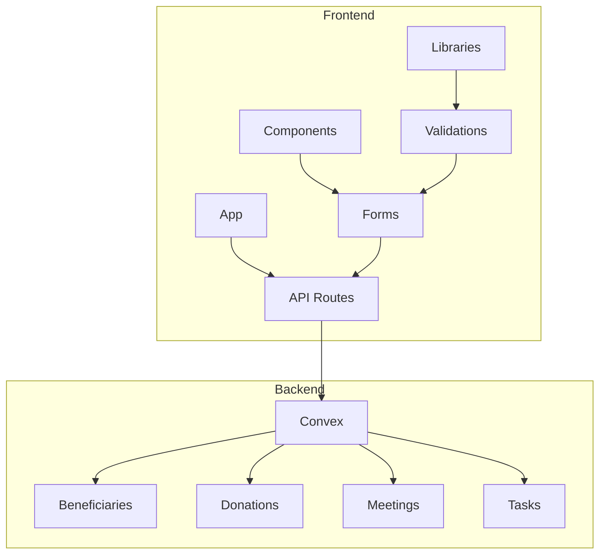
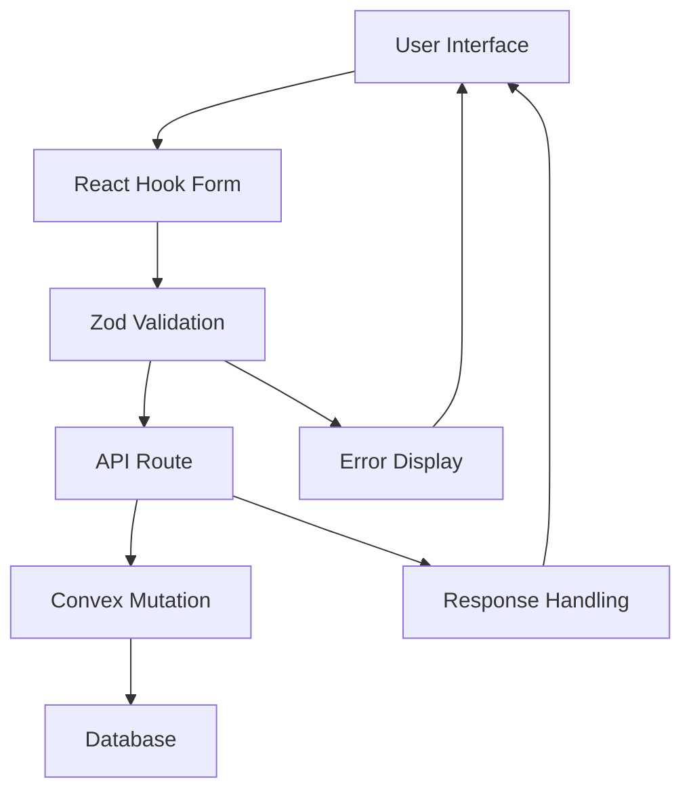
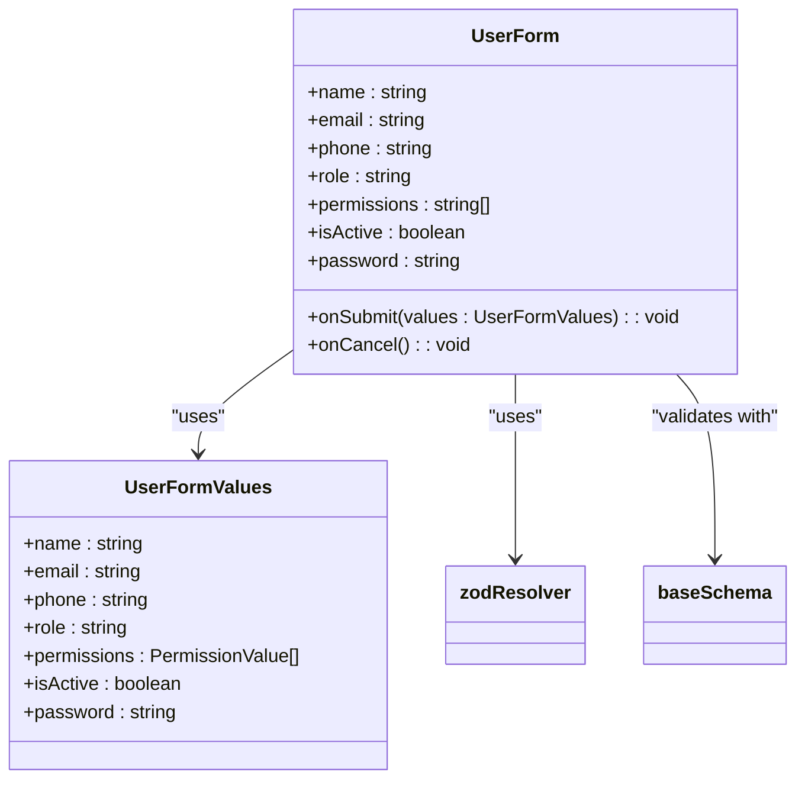
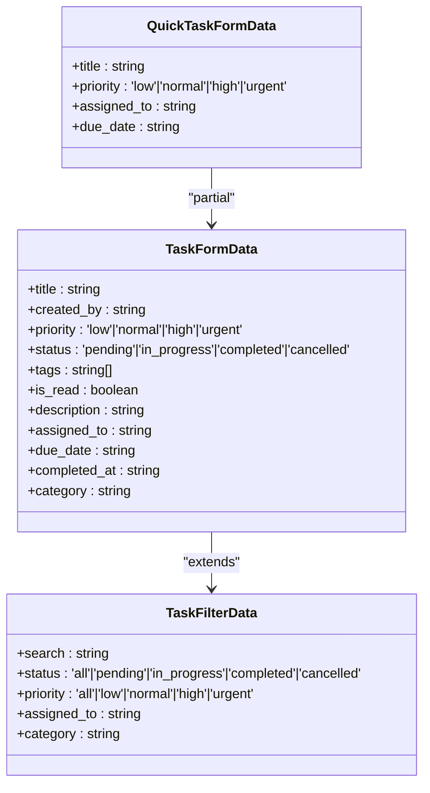
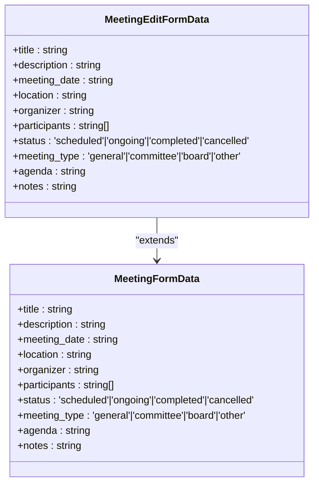
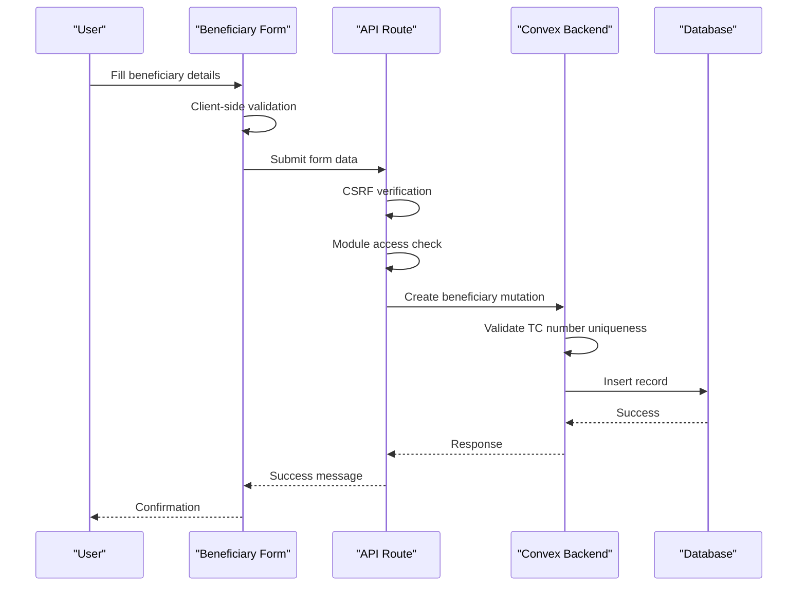
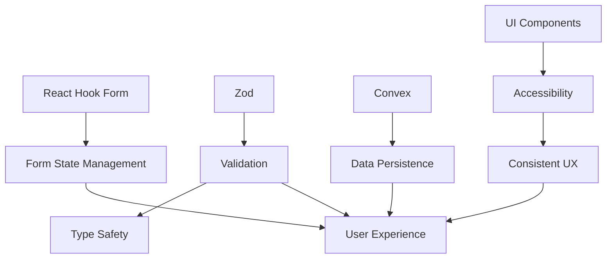

# Form Handling

<cite>
**Referenced Files in This Document**   
- [user-form.tsx](file://src/components/forms/user-form.tsx)
- [task.ts](file://src/lib/validations/task.ts)
- [meeting.ts](file://src/lib/validations/meeting.ts)
- [aid-application.ts](file://src/lib/validations/aid-application.ts)
- [beneficiaries.ts](file://convex/beneficiaries.ts)
- [route.ts](file://src/app/api/beneficiaries/route.ts)
- [beneficiary.test.ts](file://src/__tests__/lib/validations/beneficiary.test.ts)
</cite>

## Table of Contents

1. [Introduction](#introduction)
2. [Project Structure](#project-structure)
3. [Core Components](#core-components)
4. [Architecture Overview](#architecture-overview)
5. [Detailed Component Analysis](#detailed-component-analysis)
6. [Dependency Analysis](#dependency-analysis)
7. [Performance Considerations](#performance-considerations)
8. [Troubleshooting Guide](#troubleshooting-guide)
9. [Conclusion](#conclusion)

## Introduction

This document provides comprehensive documentation on form handling in the PORTAL application, focusing on the implementation of React Hook Form with Zod validation schemas. It covers key form components for beneficiary registration, donation processing, meeting scheduling, and task management. The document explains the validation strategy using Zod schemas for both client and server validation, addresses common issues such as error handling and form state persistence, and provides guidance on creating new forms that follow existing patterns and accessibility requirements.

## Project Structure

The form handling system in PORTAL is organized across several key directories in the project structure. The main components are located in the `src/components/forms` directory, while validation schemas are centralized in `src/lib/validations`. API routes for form submissions are structured under `src/app/api`, following a consistent pattern for each entity type. The convex directory contains the backend mutation and query definitions that handle form data persistence.

**Diagram sources**

- [user-form.tsx](file://src/components/forms/user-form.tsx)
- [task.ts](file://src/lib/validations/task.ts)
- [beneficiaries.ts](file://convex/beneficiaries.ts)

**Section sources**

- [user-form.tsx](file://src/components/forms/user-form.tsx)
- [task.ts](file://src/lib/validations/task.ts)
- [meeting.ts](file://src/lib/validations/meeting.ts)

## Core Components

The form handling system in PORTAL is built around React Hook Form with Zod validation, providing a robust foundation for all data entry operations. Key components include form fields, validation schemas, and submission handlers that work together to ensure data integrity and user experience. The system supports complex forms with dynamic fields and file uploads, particularly in beneficiary registration and donation processing workflows.

**Section sources**

- [user-form.tsx](file://src/components/forms/user-form.tsx)
- [task.ts](file://src/lib/validations/task.ts)
- [aid-application.ts](file://src/lib/validations/aid-application.ts)

## Architecture Overview

The form handling architecture in PORTAL follows a layered approach with clear separation between presentation, validation, and data persistence layers. React Hook Form manages the form state and user interactions, while Zod schemas provide type-safe validation on both client and server sides. The architecture ensures consistent validation rules across the application and prevents invalid data from reaching the database.

**Diagram sources**

- [user-form.tsx](file://src/components/forms/user-form.tsx)
- [route.ts](file://src/app/api/beneficiaries/route.ts)
- [beneficiaries.ts](file://convex/beneficiaries.ts)

## Detailed Component Analysis

### User Form Component

The UserForm component demonstrates the implementation of React Hook Form with Zod validation for user management operations. It includes fields for name, email, phone, role, permissions, and password, with appropriate validation rules for each field. The form supports both creation and editing workflows, with conditional validation based on the operation type.

**Diagram sources**

- [user-form.tsx](file://src/components/forms/user-form.tsx)

### Task Management Forms

The task management forms utilize Zod schemas to validate task data, including title, priority, status, tags, and due dates. The validation schema includes custom refinements to ensure business rules are enforced, such as preventing duplicate tags and validating that completed tasks have appropriate timestamps. The system also includes a quick task schema for simplified task creation.

**Diagram sources**

- [task.ts](file://src/lib/validations/task.ts)

### Meeting Scheduling Forms

The meeting scheduling forms implement comprehensive validation for meeting data, including title, description, date, location, organizer, participants, and agenda. The system includes separate schemas for creating new meetings and editing existing ones, with different validation rules for meeting dates. New meetings require a minimum one-hour buffer, while existing meetings can have past dates for editing purposes.

**Diagram sources**

- [meeting.ts](file://src/lib/validations/meeting.ts)

### Beneficiary Registration Forms

The beneficiary registration system implements robust validation for beneficiary data, including personal information, family details, financial status, and health information. The validation ensures data quality and prevents duplicate entries, particularly through TC number validation. The system also handles dependent information and consent management for beneficiaries.

**Diagram sources**

- [route.ts](file://src/app/api/beneficiaries/route.ts)
- [beneficiaries.ts](file://convex/beneficiaries.ts)

## Dependency Analysis

The form handling system in PORTAL has well-defined dependencies between components, ensuring maintainability and testability. The core dependencies include React Hook Form for form state management, Zod for validation, and Convex for data persistence. The system also depends on UI components from the component library for consistent styling and accessibility.

**Diagram sources**

- [user-form.tsx](file://src/components/forms/user-form.tsx)
- [task.ts](file://src/lib/validations/task.ts)
- [beneficiaries.ts](file://convex/beneficiaries.ts)

**Section sources**

- [user-form.tsx](file://src/components/forms/user-form.tsx)
- [task.ts](file://src/lib/validations/task.ts)
- [beneficiaries.ts](file://convex/beneficiaries.ts)

## Performance Considerations

The form handling system is designed with performance in mind, minimizing re-renders through React Hook Form's efficient state management. Validation is performed synchronously for immediate feedback, while server-side validation occurs during form submission. The system implements proper error handling and loading states to provide a smooth user experience, even with network latency.

## Troubleshooting Guide

Common issues in the form handling system include validation errors, submission failures, and state persistence problems. The system includes comprehensive error handling with descriptive messages for users and detailed logging for developers. When creating new forms, ensure validation schemas are consistent with existing patterns and accessibility requirements are met for all form elements.

**Section sources**

- [route.ts](file://src/app/api/beneficiaries/route.ts)
- [beneficiary.test.ts](file://src/__tests__/lib/validations/beneficiary.test.ts)

## Conclusion

The form handling system in PORTAL provides a robust foundation for data entry operations across the application. By leveraging React Hook Form and Zod validation, the system ensures data integrity while providing a good user experience. The architecture supports complex forms with dynamic fields and file uploads, and the validation strategy works consistently across client and server environments. When creating new forms, follow the established patterns for validation, error handling, and accessibility to maintain consistency across the application.
