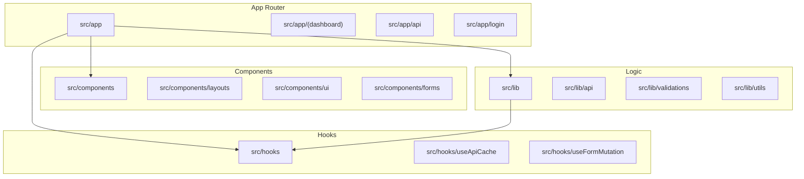
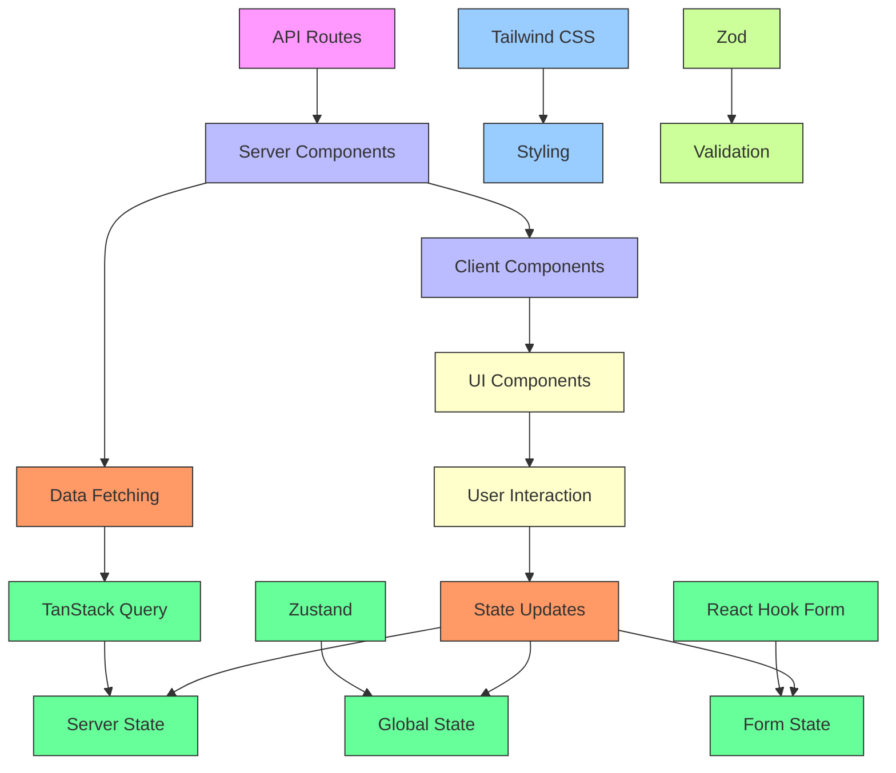
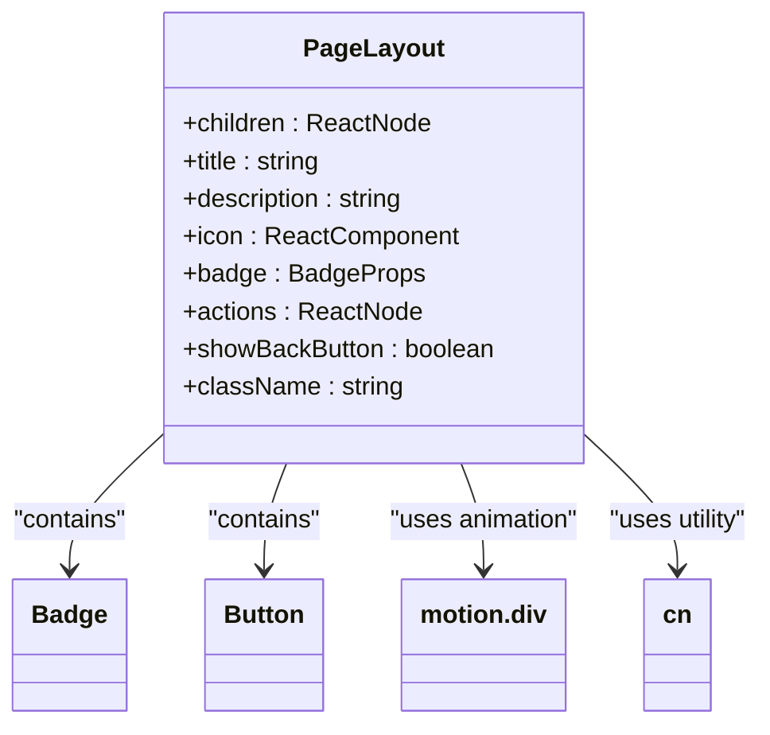
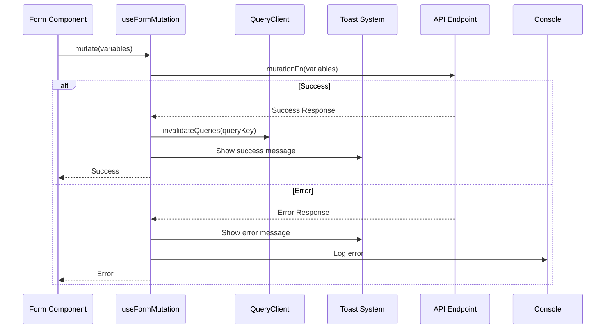
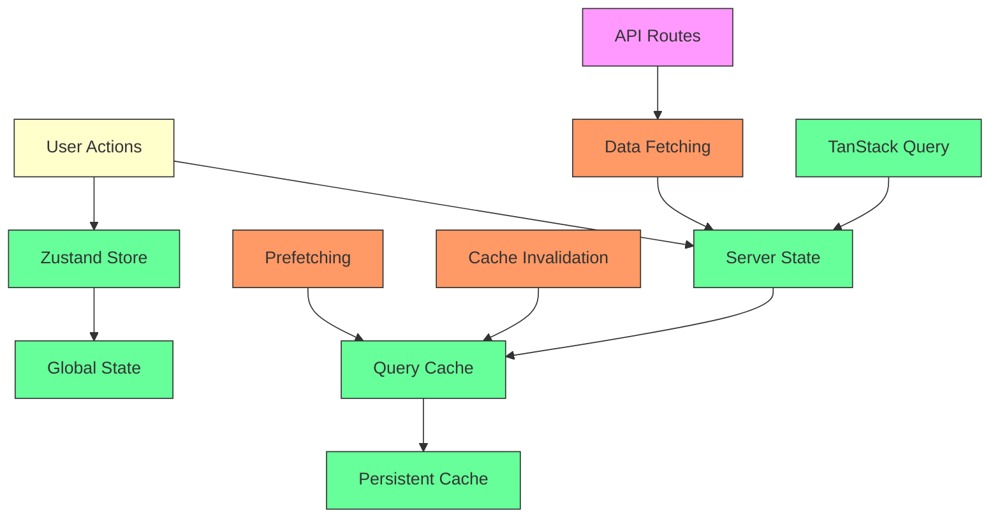
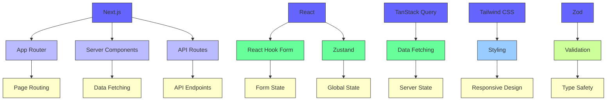
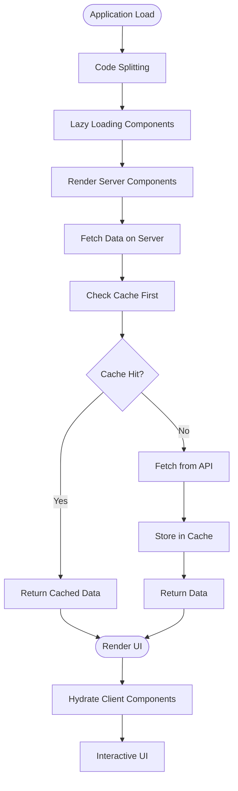

# Frontend Architecture

<cite>
**Referenced Files in This Document**   
- [PageLayout.tsx](file://src/components/layouts/PageLayout.tsx)
- [useFormMutation.ts](file://src/hooks/useFormMutation.ts)
- [GoogleAnalytics.tsx](file://src/components/analytics/GoogleAnalytics.tsx)
- [form.tsx](file://src/components/ui/form.tsx)
- [api-cache.ts](file://src/lib/api-cache.ts)
- [useApiCache.ts](file://src/hooks/useApiCache.ts)
- [providers.tsx](file://src/app/providers.tsx)
- [format.ts](file://src/lib/utils/format.ts)
- [pdf-strings.ts](file://src/lib/constants/pdf-strings.ts)
- [tailwind.config.js](file://tailwind.config.js)
</cite>

## Table of Contents

1. [Introduction](#introduction)
2. [Project Structure](#project-structure)
3. [Core Components](#core-components)
4. [Architecture Overview](#architecture-overview)
5. [Detailed Component Analysis](#detailed-component-analysis)
6. [Dependency Analysis](#dependency-analysis)
7. [Performance Considerations](#performance-considerations)
8. [Troubleshooting Guide](#troubleshooting-guide)
9. [Conclusion](#conclusion)

## Introduction

This document provides comprehensive architectural documentation for the frontend component of PORTAL, a system designed for Turkish non-profit organizations. The frontend is built using Next.js with the App Router pattern, leveraging React Server Components for optimized rendering. The architecture emphasizes reusable UI components, effective state management, robust form handling, and internationalization support for Turkish language.

## Project Structure

The frontend project follows a well-organized structure based on functional and technical domains. The core application resides in the `src/app` directory using the Next.js App Router pattern, with server components and API routes. Reusable UI components are organized in `src/components` with a logical grouping by feature and utility. Shared logic and utilities are located in `src/lib`, while custom hooks are isolated in `src/hooks`. The structure supports scalability and maintainability through clear separation of concerns.

**Diagram sources**

- [app](file://src/app)
- [components](file://src/components)
- [lib](file://src/lib)
- [hooks](file://src/hooks)

**Section sources**

- [src](file://src)

## Core Components

The frontend architecture is built around several core components that provide the foundation for the application's functionality. The PageLayout component standardizes page structure across the application with consistent headers, actions, and responsive design. Form components leverage React Hook Form for efficient form state management with Zod validation. The analytics components integrate Google Analytics and Web Vitals tracking for performance monitoring. UI components follow a design system approach with reusable primitives.

**Section sources**

- [PageLayout.tsx](file://src/components/layouts/PageLayout.tsx)
- [GoogleAnalytics.tsx](file://src/components/analytics/GoogleAnalytics.tsx)
- [form.tsx](file://src/components/ui/form.tsx)

## Architecture Overview

The frontend architecture follows a modern React application pattern with Next.js App Router, utilizing both server and client components strategically. Server components handle data fetching and initial rendering, while client components manage interactive elements and state. The architecture implements a layered approach with clear separation between presentation, state management, and data access layers.

**Diagram sources**

- [app](file://src/app)
- [api](file://src/app/api)
- [components](file://src/components)
- [lib](file://src/lib)

## Detailed Component Analysis

### Page Layout Component

The PageLayout component provides a consistent structure for all pages in the application, implementing responsive design patterns and accessibility features. It includes motion animations for improved user experience and supports customizable actions and badges.

**Diagram sources**

- [PageLayout.tsx](file://src/components/layouts/PageLayout.tsx#L9-L90)

**Section sources**

- [PageLayout.tsx](file://src/components/layouts/PageLayout.tsx#L9-L90)

### Form Management System

The form management system is built on React Hook Form with Zod validation, providing an efficient and type-safe approach to form handling. The useFormMutation hook standardizes form submissions with automatic query invalidation and user feedback.

**Diagram sources**

- [useFormMutation.ts](file://src/hooks/useFormMutation.ts#L9-L102)
- [form.tsx](file://src/components/ui/form.tsx)

**Section sources**

- [useFormMutation.ts](file://src/hooks/useFormMutation.ts#L9-L102)
- [form.tsx](file://src/components/ui/form.tsx)

### State Management Architecture

The state management architecture combines Zustand for global application state and TanStack Query for server state management. This hybrid approach provides optimal performance and data consistency across the application.

**Diagram sources**

- [useApiCache.ts](file://src/hooks/useApiCache.ts)
- [api-cache.ts](file://src/lib/api-cache.ts)
- [providers.tsx](file://src/app/providers.tsx)

**Section sources**

- [useApiCache.ts](file://src/hooks/useApiCache.ts)
- [api-cache.ts](file://src/lib/api-cache.ts)
- [providers.tsx](file://src/app/providers.tsx)

## Dependency Analysis

The frontend architecture has well-defined dependencies between components and libraries. The application relies on Next.js for routing and server components, React for UI rendering, and various specialized libraries for specific functionality.

**Diagram sources**

- [package.json](file://package.json)
- [tailwind.config.js](file://tailwind.config.js)
- [tsconfig.json](file://tsconfig.json)

**Section sources**

- [package.json](file://package.json)

## Performance Considerations

The application implements several performance optimization techniques, including code splitting, lazy loading, and aggressive caching strategies. The use of React Server Components reduces client-side JavaScript payload, while TanStack Query provides intelligent data caching and background refetching.

**Diagram sources**

- [api-cache.ts](file://src/lib/api-cache.ts)
- [useApiCache.ts](file://src/hooks/useApiCache.ts)
- [performance.ts](file://src/lib/performance.ts)

**Section sources**

- [api-cache.ts](file://src/lib/api-cache.ts)
- [useApiCache.ts](file://src/hooks/useApiCache.ts)
- [performance.ts](file://src/lib/performance.ts)

## Troubleshooting Guide

The application includes several debugging and troubleshooting utilities to assist with development and production issues. These include development-only debug tools exposed on the window object, comprehensive logging, and cache management utilities.

**Section sources**

- [providers.tsx](file://src/app/providers.tsx#L31-L67)
- [logger.ts](file://src/lib/logger.ts)
- [cache-config.test.ts](file://src/__tests__/lib/cache-config.test.ts)

## Conclusion

The PORTAL frontend architecture demonstrates a modern, well-structured approach to building React applications with Next.js. By leveraging the App Router pattern, React Server Components, and a thoughtful combination of state management solutions, the application achieves excellent performance and developer experience. The consistent use of reusable components, proper form handling, and internationalization support for Turkish language make it well-suited for its target non-profit organization users. The architecture balances innovation with practicality, providing a solid foundation for future growth and maintenance.
