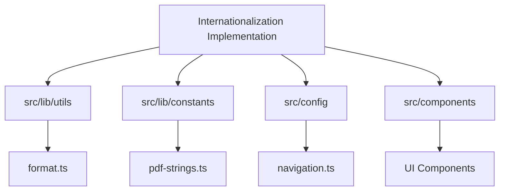
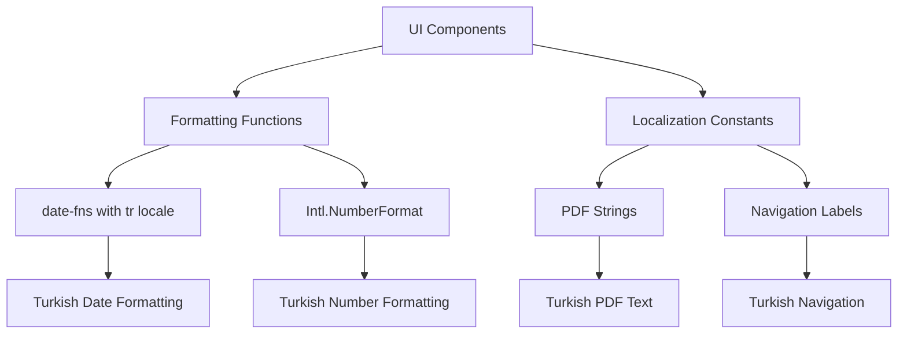
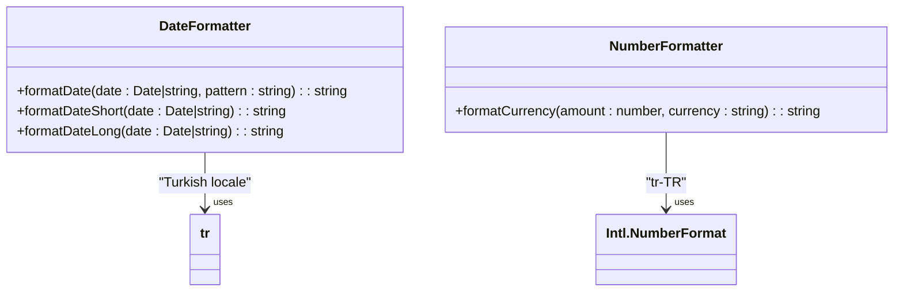
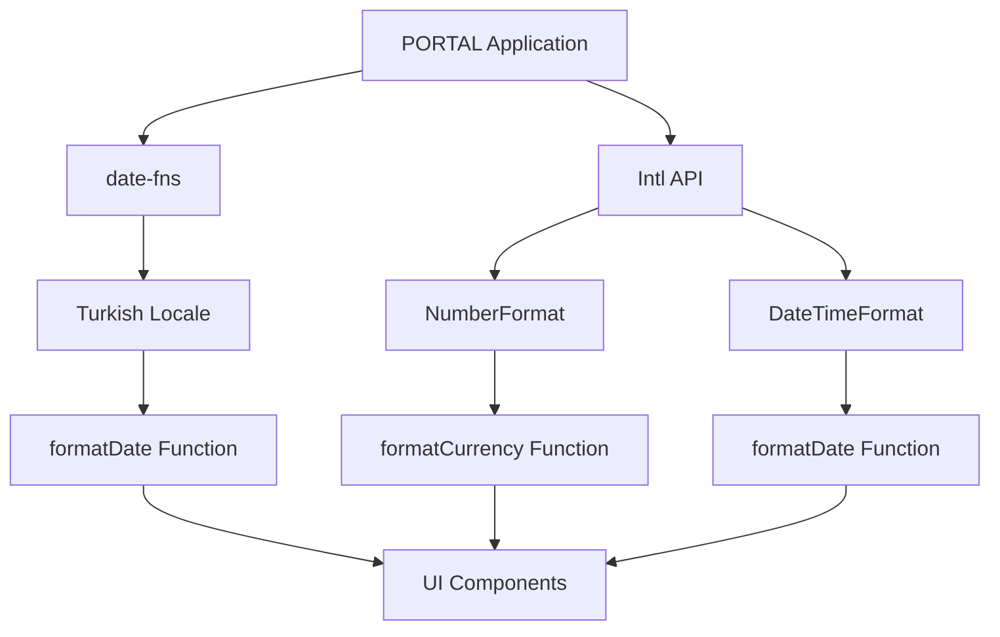

# Internationalization

<cite>
**Referenced Files in This Document**   
- [format.ts](file://src/lib/utils/format.ts)
- [pdf-strings.ts](file://src/lib/constants/pdf-strings.ts)
- [navigation.ts](file://src/config/navigation.ts)
- [date-picker.tsx](file://src/components/ui/date-picker.tsx)
- [users-table.tsx](file://src/components/tables/users-table.tsx)
- [user-form.tsx](file://src/components/forms/user-form.tsx)
- [KumbaraStats.tsx](file://src/components/kumbara/KumbaraStats.tsx)
- [AidHistoryChart.tsx](file://src/components/beneficiary-analytics/AidHistoryChart.tsx)
</cite>

## Table of Contents

1. [Introduction](#introduction)
2. [Project Structure](#project-structure)
3. [Core Components](#core-components)
4. [Architecture Overview](#architecture-overview)
5. [Detailed Component Analysis](#detailed-component-analysis)
6. [Dependency Analysis](#dependency-analysis)
7. [Performance Considerations](#performance-considerations)
8. [Troubleshooting Guide](#troubleshooting-guide)
9. [Conclusion](#conclusion)
10. [Appendices](#appendices) (if necessary)

## Introduction

The PORTAL application has been designed with comprehensive Turkish language support to serve Turkish non-profit organizations effectively. This documentation details the internationalization implementation, focusing on UI text localization, date/time formatting, number formatting, and cultural considerations. The system uses a combination of internationalization libraries and custom localization functions to ensure accurate representation of Turkish language and cultural norms throughout the application.

## Project Structure

The internationalization implementation is distributed across several key directories in the PORTAL application. Localization utilities are primarily located in the `src/lib/utils` directory, while UI components with localized text are organized within the `src/components` directory. Configuration files containing navigation labels and constants are stored in the `src/config` and `src/lib/constants` directories respectively.



**Diagram sources**

- [format.ts](file://src/lib/utils/format.ts)
- [pdf-strings.ts](file://src/lib/constants/pdf-strings.ts)
- [navigation.ts](file://src/config/navigation.ts)

**Section sources**

- [format.ts](file://src/lib/utils/format.ts)
- [pdf-strings.ts](file://src/lib/constants/pdf-strings.ts)
- [navigation.ts](file://src/config/navigation.ts)

## Core Components

The internationalization system in PORTAL consists of several core components that work together to provide Turkish language support. These include formatting utilities for dates and currency, constants for UI text, and components that implement right-to-left text considerations. The system leverages the `date-fns` library with Turkish locale support and the `Intl.NumberFormat` API for proper number formatting according to Turkish conventions.

**Section sources**

- [format.ts](file://src/lib/utils/format.ts)
- [pdf-strings.ts](file://src/lib/constants/pdf-strings.ts)

## Architecture Overview

The internationalization architecture in PORTAL follows a layered approach where formatting functions are centralized in utility modules, while localized text constants are maintained in dedicated configuration files. This separation of concerns allows for consistent formatting across the application while enabling easy maintenance of UI text. The architecture supports both client-side and server-side rendering of localized content, ensuring that Turkish language content is properly displayed regardless of the rendering context.



**Diagram sources**

- [format.ts](file://src/lib/utils/format.ts)
- [pdf-strings.ts](file://src/lib/constants/pdf-strings.ts)
- [navigation.ts](file://src/config/navigation.ts)

## Detailed Component Analysis

### Localization Implementation

The Turkish localization implementation in PORTAL addresses multiple aspects of language and cultural representation. The system uses the Turkish locale ('tr-TR') for all formatting operations, ensuring that dates, numbers, and currency values are displayed according to Turkish conventions. This includes the use of Turkish Lira (₺) as the default currency and the DD.MM.YYYY date format for short dates.

#### Date and Time Formatting

The application implements comprehensive date formatting functions that support Turkish language conventions. The `formatDate` function in `format.ts` utilizes the `date-fns` library with the Turkish locale to properly format dates with Turkish month and day names. The system provides multiple formatting options, including short format (dd/MM/yyyy) and long format (dd MMMM yyyy) to accommodate different UI requirements.



**Diagram sources**

- [format.ts](file://src/lib/utils/format.ts)

**Section sources**

- [format.ts](file://src/lib/utils/format.ts)
- [date-picker.tsx](file://src/components/ui/date-picker.tsx)

#### Number and Currency Formatting

Number formatting in PORTAL follows Turkish conventions, with the `formatCurrency` function using the `Intl.NumberFormat` API configured for the 'tr-TR' locale. This ensures proper formatting of currency values with the Turkish Lira symbol (₺) and appropriate decimal and thousand separators according to Turkish standards. The system consistently applies this formatting across financial reports, donation displays, and other monetary values throughout the application.

### UI Text Localization

The application implements UI text localization through dedicated constants files and component-level text definitions. The `PDF_STRINGS` constant in `pdf-strings.ts` contains all user-facing text for PDF exports in Turkish, ensuring that official documents maintain linguistic consistency. Navigation labels in `navigation.ts` are also defined in Turkish, providing a fully localized navigation experience.

#### Navigation Localization

The navigation system in PORTAL is fully localized with Turkish labels for all menu items and sections. The `navigationModules` configuration in `navigation.ts` defines all navigation elements with Turkish names and descriptions, creating an intuitive interface for Turkish-speaking users. This includes module names like "Ana Sayfa" (Home), "Bağış Yönetimi" (Donation Management), and "Yardım Programları" (Aid Programs).

**Section sources**

- [navigation.ts](file://src/config/navigation.ts)
- [pdf-strings.ts](file://src/lib/constants/pdf-strings.ts)

#### Form and Table Localization

UI components such as forms and tables implement Turkish localization through both hardcoded text and dynamic formatting. The `user-form.tsx` component displays form labels in Turkish, including "Ad Soyad" (Name), "E-posta" (Email), and "Telefon" (Phone). Table components like `users-table.tsx` format dates using the Turkish locale and display status indicators with Turkish text such as "Aktif" (Active) and "Pasif" (Inactive).

```mermaid
flowchart TD
A[User Input] --> B{Form Component}
B --> C[Label Translation]
B --> D[Placeholder Translation]
B --> E[Validation Message Translation]
C --> F["Ad Soyad", "E-posta", "Telefon"]
D --> G["Örn. Ahmet Yılmaz", "personel@dernek.org", "+90 5XX XXX XX XX"]
E --> H["Ad Soyad en az 2 karakter olmalıdır", "Geçerli bir e-posta adresi giriniz"]
F --> I[Turkish Interface]
G --> I
H --> I
```

**Diagram sources**

- [user-form.tsx](file://src/components/forms/user-form.tsx)

**Section sources**

- [user-form.tsx](file://src/components/forms/user-form.tsx)
- [users-table.tsx](file://src/components/tables/users-table.tsx)

### Right-to-Left Text Considerations

While Turkish is written left-to-right, the application architecture considers potential future support for right-to-left languages. The UI components are designed with flexible layouts that could accommodate RTL text direction if needed in the future. The CSS framework and component styling use relative positioning rather than absolute left/right positioning, allowing for easier adaptation to RTL layouts.

### Cultural Considerations in Date Formatting

The date formatting implementation in PORTAL respects Turkish cultural conventions, including the use of Turkish month names and the preferred date format of DD.MM.YYYY. The system also handles special cases such as the Turkish-specific date formatting requirements for official documents and reports. The `date-picker.tsx` component displays dates in the Turkish format and uses Turkish month names in the calendar interface.

**Section sources**

- [format.ts](file://src/lib/utils/format.ts)
- [date-picker.tsx](file://src/components/ui/date-picker.tsx)

### Localized PDF Generation

The application implements comprehensive localized PDF generation for official documents. The `PDF_STRINGS` constant contains all text elements needed for PDF reports in Turkish, including report titles, column headers, and status indicators. This ensures that exported documents maintain linguistic consistency with the application interface. The system also handles proper formatting of numbers, dates, and currency values in PDF exports according to Turkish conventions.

The `sanitizeFilename` function in `pdf-export.ts` specifically addresses Turkish character handling by normalizing Turkish characters (such as 'ı' and 'İ') during filename generation, ensuring compatibility across different file systems while preserving the integrity of Turkish text.

**Section sources**

- [pdf-strings.ts](file://src/lib/constants/pdf-strings.ts)
- [pdf-export.ts](file://src/lib/utils/pdf-export.ts)

### Adding New Translations

To add new translations to the application, developers should follow the established pattern of centralizing text constants in appropriate configuration files. For UI text that appears in multiple components, new constants should be added to the relevant file in `src/lib/constants`. For navigation elements, new translations should be added to `navigation.ts`. All date and number formatting should utilize the existing functions in `format.ts` to maintain consistency.

When adding new Turkish text, developers should ensure that:

1. All user-facing text is properly translated
2. Date and number formatting follows Turkish conventions
3. Currency values are displayed with the Turkish Lira symbol (₺)
4. Cultural considerations are respected in all text representations

**Section sources**

- [pdf-strings.ts](file://src/lib/constants/pdf-strings.ts)
- [navigation.ts](file://src/config/navigation.ts)
- [format.ts](file://src/lib/utils/format.ts)

## Dependency Analysis

The internationalization implementation in PORTAL relies on several key dependencies to provide Turkish language support. The primary dependencies include the `date-fns` library for date formatting with Turkish locale support and the native `Intl` API for number and currency formatting. These dependencies are integrated through utility functions that abstract the formatting logic, providing a consistent interface for components throughout the application.



**Diagram sources**

- [format.ts](file://src/lib/utils/format.ts)

**Section sources**

- [format.ts](file://src/lib/utils/format.ts)

## Performance Considerations

The internationalization implementation in PORTAL is designed with performance in mind. Formatting functions are optimized to minimize computational overhead, and locale data is efficiently loaded only when needed. The use of centralized formatting utilities reduces code duplication and ensures consistent performance across different components. For frequently displayed values such as currency amounts and dates, the application leverages React's memoization features to prevent unnecessary reformatting during component re-renders.

## Troubleshooting Guide

When encountering issues with Turkish language support in PORTAL, consider the following common problems and solutions:

1. **Incorrect date formatting**: Verify that the Turkish locale ('tr') is properly imported from `date-fns/locale` and passed to formatting functions.

2. **Currency symbol issues**: Ensure that the `formatCurrency` function is called with the correct currency code ('TRY') and that the 'tr-TR' locale is used.

3. **Missing translations**: Check that all new UI elements have corresponding Turkish text in the appropriate constants file.

4. **PDF generation problems**: Verify that the `PDF_STRINGS` constant contains all required text elements and that special Turkish characters are properly encoded.

**Section sources**

- [format.ts](file://src/lib/utils/format.ts)
- [pdf-strings.ts](file://src/lib/constants/pdf-strings.ts)

## Conclusion

The internationalization implementation in PORTAL provides comprehensive Turkish language support across all aspects of the application. By leveraging established internationalization libraries and implementing a consistent architecture for localization, the system ensures that Turkish non-profit organizations can effectively use the platform in their native language. The approach to localization covers UI text, date/time formatting, number formatting, and official document generation, while also considering cultural nuances and potential future requirements for additional language support.
