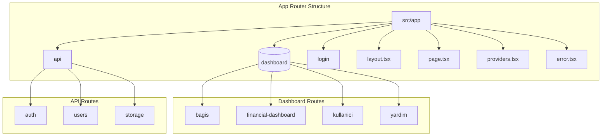
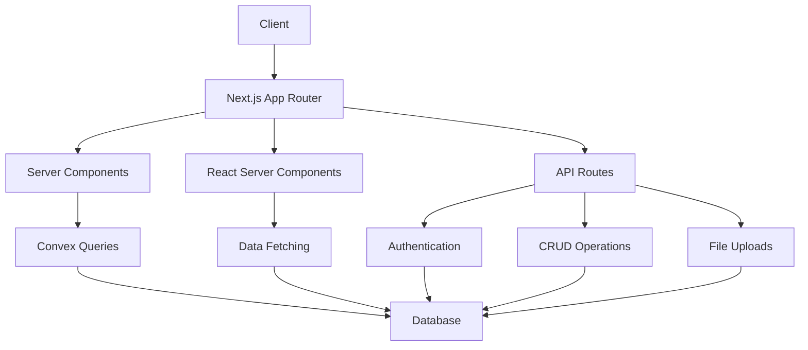
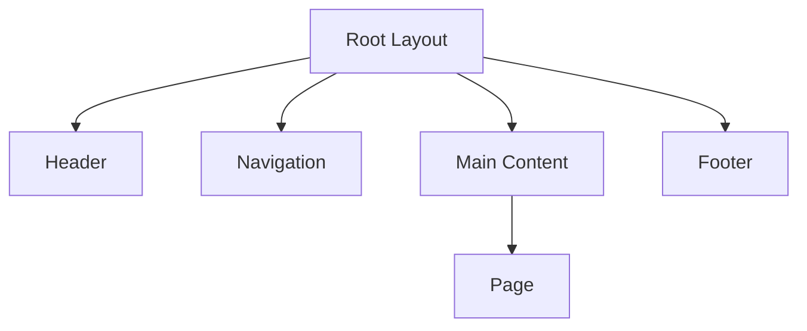
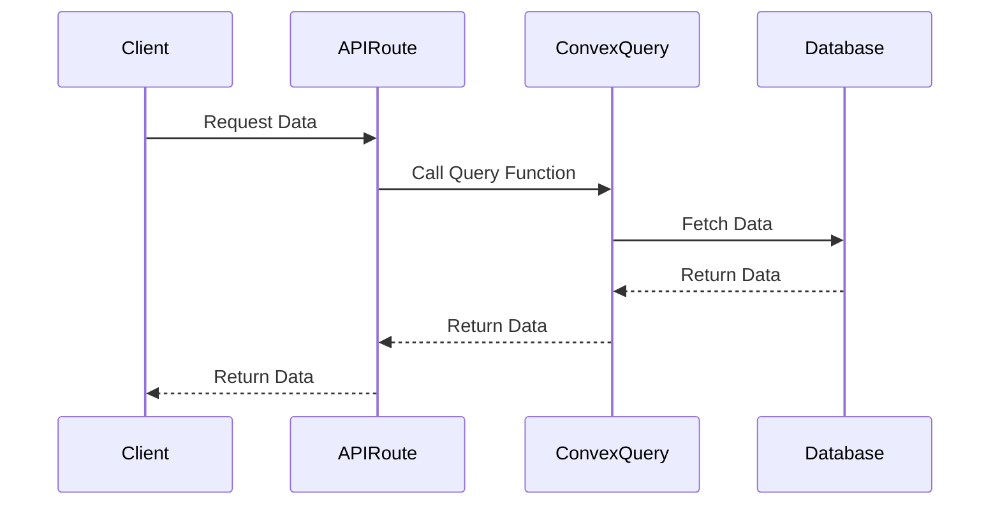
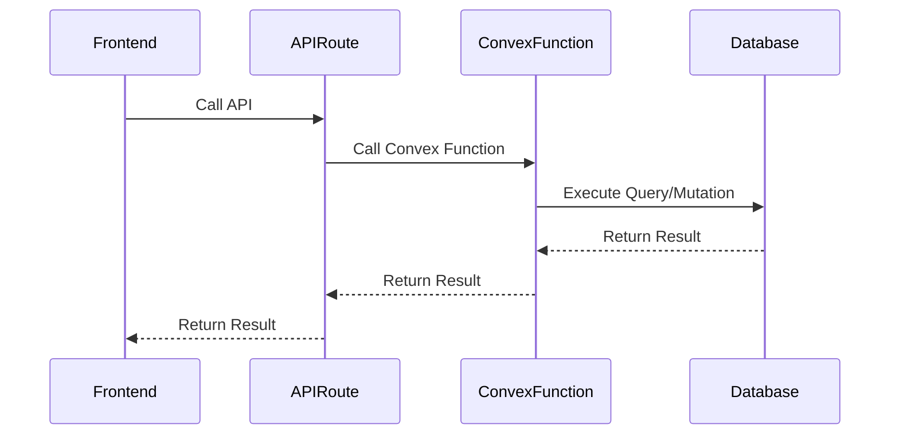
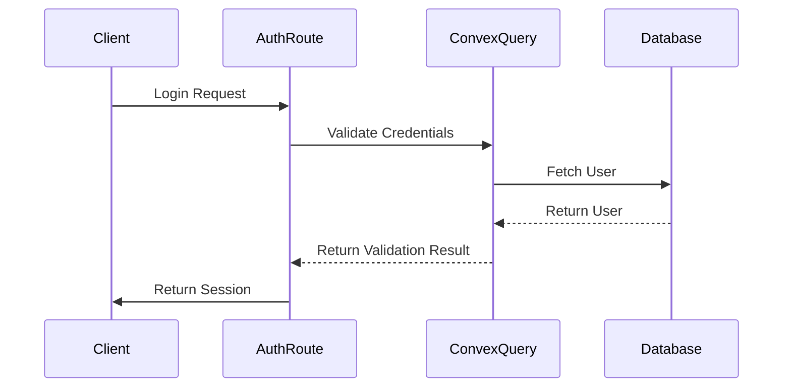
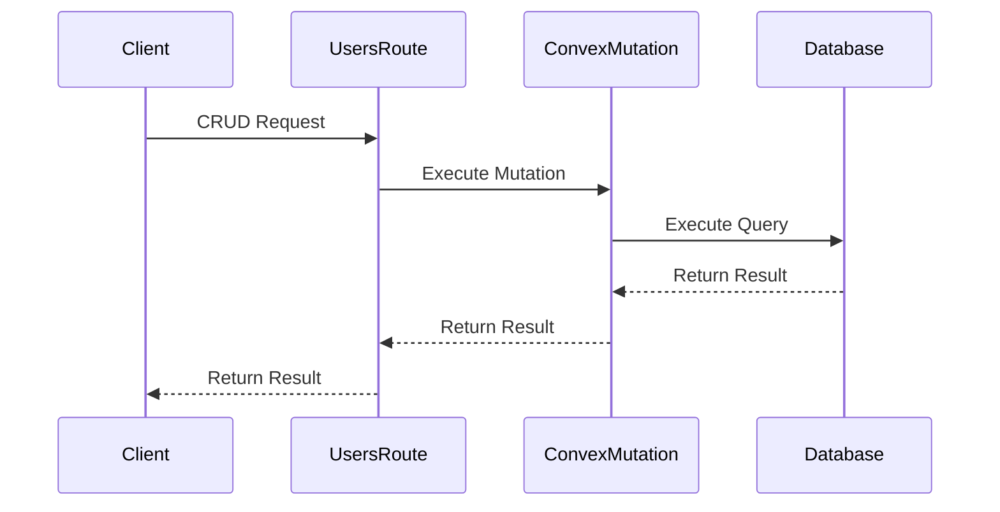
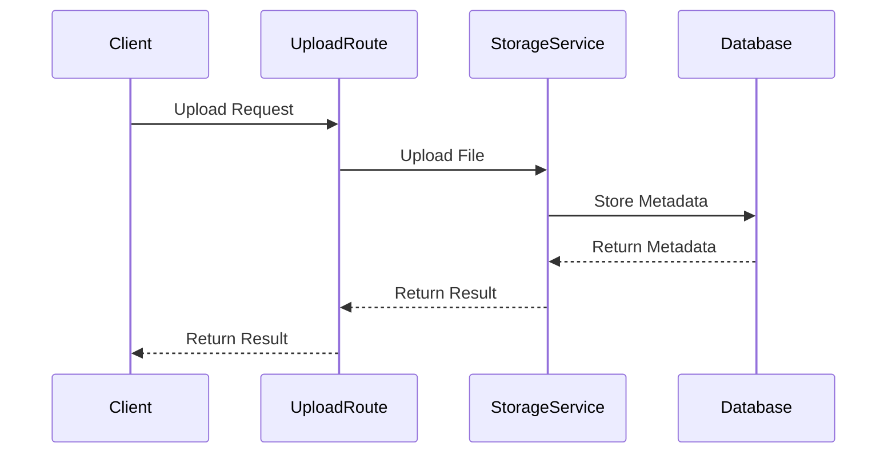
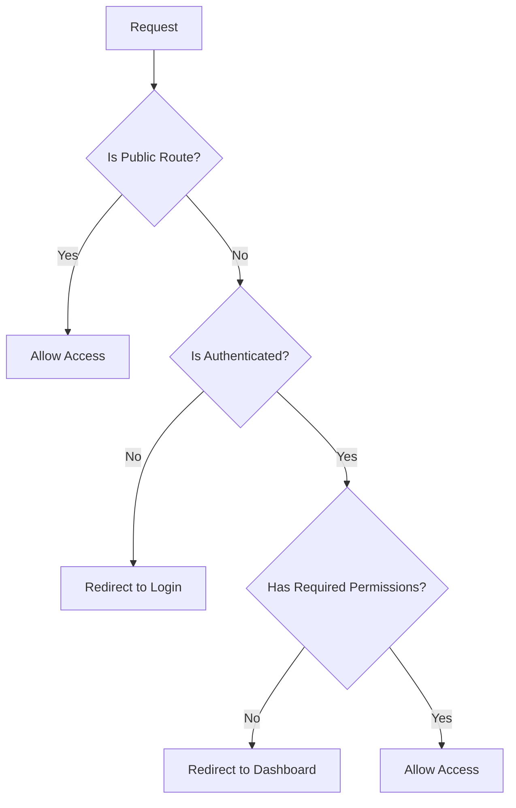
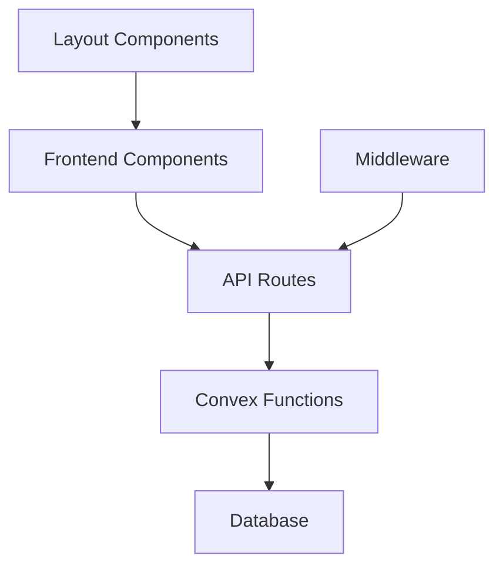

# Next.js App Router

<cite>
**Referenced Files in This Document**   
- [layout.tsx](file://src/app/layout.tsx)
- [middleware.ts](file://src/middleware.ts)
- [page.tsx](file://src/app/page.tsx)
- [providers.tsx](file://src/app/providers.tsx)
- [login/page.tsx](file://src/app/login/page.tsx)
- [error.tsx](file://src/app/error.tsx)
- [(dashboard)/kullanici/page.tsx](file://src/app/(dashboard)/kullanici/page.tsx)
- [(dashboard)/yardim/ihtiyac-sahipleri/page.tsx](file://src/app/(dashboard)/yardim/ihtiyac-sahipleri/page.tsx)
- [api/auth/login/route.ts](file://src/app/api/auth/login/route.ts)
- [api/users/route.ts](file://src/app/api/users/route.ts)
- [api/storage/upload/route.ts](file://src/app/api/storage/upload/route.ts)
</cite>

## Table of Contents

1. [Introduction](#introduction)
2. [Project Structure](#project-structure)
3. [Core Components](#core-components)
4. [Architecture Overview](#architecture-overview)
5. [Detailed Component Analysis](#detailed-component-analysis)
6. [Dependency Analysis](#dependency-analysis)
7. [Performance Considerations](#performance-considerations)
8. [Troubleshooting Guide](#troubleshooting-guide)
9. [Conclusion](#conclusion)

## Introduction

This document provides comprehensive architectural documentation for the Next.js App Router implementation in PORTAL. It details the routing structure using the App Router pattern with server components and React Server Components. The document covers layout and page composition patterns, including nested layouts in the (dashboard) route group. It explains data fetching patterns using server-side functions and Convex queries, the integration between API routes and frontend components, and provides examples of route handlers for authentication, CRUD operations, and file uploads. The document also addresses middleware implementation for authentication and routing protection and provides guidance on optimizing server components for performance and SEO.

## Project Structure

The project structure follows the Next.js App Router pattern, with a clear separation of concerns between different components and modules. The main application components are located in the `src/app` directory, which includes the (dashboard) route group, API routes, and shared components.



**Diagram sources**

- [src/app](file://src/app)
- [src/app/(dashboard)](<file://src/app/(dashboard)>)
- [src/app/api](file://src/app/api)

**Section sources**

- [src/app](file://src/app)

## Core Components

The core components of the application include the layout, page, and provider components that form the foundation of the user interface. These components are designed to be reusable and composable, allowing for consistent styling and behavior across the application.

**Section sources**

- [layout.tsx](file://src/app/layout.tsx)
- [page.tsx](file://src/app/page.tsx)
- [providers.tsx](file://src/app/providers.tsx)

## Architecture Overview

The architecture of the application is based on the Next.js App Router pattern, which provides a flexible and scalable way to organize the application's routes and components. The architecture includes server components, React Server Components, and API routes that work together to provide a seamless user experience.



**Diagram sources**

- [src/app](file://src/app)
- [convex](file://convex)
- [src/lib/convex](file://src/lib/convex)

## Detailed Component Analysis

### Layout and Page Composition

The layout and page composition in the application follow the App Router pattern, with a root layout that provides a consistent structure for all pages. The layout includes shared components such as the header, footer, and navigation, which are rendered on every page.



**Diagram sources**

- [layout.tsx](file://src/app/layout.tsx)
- [page.tsx](file://src/app/page.tsx)

**Section sources**

- [layout.tsx](file://src/app/layout.tsx)
- [page.tsx](file://src/app/page.tsx)

### Nested Layouts in (dashboard) Route Group

The (dashboard) route group includes nested layouts that provide a consistent structure for dashboard pages. These layouts include shared components such as the sidebar and breadcrumb navigation, which are rendered on every dashboard page.

```mermaid
graph TD
A[(dashboard) Layout] --> B[Sidebar]
A --> C[Breadcrumb Navigation]
A --> D[Main Content]
D --> E[Dashboard Page]
```

**Diagram sources**

- [src/app/(dashboard)](<file://src/app/(dashboard)>)
- [src/app/(dashboard)/kullanici/page.tsx](<file://src/app/(dashboard)/kullanici/page.tsx>)
- [src/app/(dashboard)/yardim/ihtiyac-sahipleri/page.tsx](<file://src/app/(dashboard)/yardim/ihtiyac-sahipleri/page.tsx>)

**Section sources**

- [src/app/(dashboard)](<file://src/app/(dashboard)>)
- [src/app/(dashboard)/kullanici/page.tsx](<file://src/app/(dashboard)/kullanici/page.tsx>)
- [src/app/(dashboard)/yardim/ihtiyac-sahipleri/page.tsx](<file://src/app/(dashboard)/yardim/ihtiyac-sahipleri/page.tsx>)

### Data Fetching Patterns

The application uses server-side functions and Convex queries to fetch data from the database. These functions are called from API routes, which are then consumed by the frontend components.



**Diagram sources**

- [src/app/api/users/route.ts](file://src/app/api/users/route.ts)
- [convex/users.ts](file://convex/users.ts)
- [src/lib/convex/server.ts](file://src/lib/convex/server.ts)

**Section sources**

- [src/app/api/users/route.ts](file://src/app/api/users/route.ts)
- [convex/users.ts](file://convex/users.ts)

### API Integration

The integration between API routes and frontend components is achieved through the use of Convex queries and mutations. These functions are called from the frontend components and are executed on the server.



**Diagram sources**

- [src/app/(dashboard)/kullanici/page.tsx](<file://src/app/(dashboard)/kullanici/page.tsx>)
- [src/app/api/users/route.ts](file://src/app/api/users/route.ts)
- [convex/users.ts](file://convex/users.ts)

**Section sources**

- [src/app/(dashboard)/kullanici/page.tsx](<file://src/app/(dashboard)/kullanici/page.tsx>)
- [src/app/api/users/route.ts](file://src/app/api/users/route.ts)
- [convex/users.ts](file://convex/users.ts)

### Route Handlers

The application includes route handlers for authentication, CRUD operations, and file uploads. These handlers are implemented as API routes and are responsible for processing requests and returning responses.

#### Authentication Route Handler

The authentication route handler is responsible for handling user login and logout requests. It validates the user's credentials and creates a session if the credentials are valid.



**Diagram sources**

- [src/app/api/auth/login/route.ts](file://src/app/api/auth/login/route.ts)
- [convex/auth.ts](file://convex/auth.ts)

**Section sources**

- [src/app/api/auth/login/route.ts](file://src/app/api/auth/login/route.ts)
- [convex/auth.ts](file://convex/auth.ts)

#### CRUD Operations Route Handler

The CRUD operations route handler is responsible for handling create, read, update, and delete requests for users. It validates the request and executes the appropriate Convex mutation.



**Diagram sources**

- [src/app/api/users/route.ts](file://src/app/api/users/route.ts)
- [convex/users.ts](file://convex/users.ts)

**Section sources**

- [src/app/api/users/route.ts](file://src/app/api/users/route.ts)
- [convex/users.ts](file://convex/users.ts)

#### File Upload Route Handler

The file upload route handler is responsible for handling file upload requests. It validates the file and uploads it to the storage service.



**Diagram sources**

- [src/app/api/storage/upload/route.ts](file://src/app/api/storage/upload/route.ts)
- [convex/documents.ts](file://convex/documents.ts)

**Section sources**

- [src/app/api/storage/upload/route.ts](file://src/app/api/storage/upload/route.ts)
- [convex/documents.ts](file://convex/documents.ts)

### Middleware Implementation

The middleware implementation is responsible for authentication and routing protection. It checks if the user is authenticated and has the required permissions to access the requested route.



**Diagram sources**

- [middleware.ts](file://src/middleware.ts)

**Section sources**

- [middleware.ts](file://src/middleware.ts)

## Dependency Analysis

The application has a clear dependency structure, with the frontend components depending on the API routes, which in turn depend on the Convex functions and the database.



**Diagram sources**

- [src/app](file://src/app)
- [src/lib/convex](file://src/lib/convex)
- [convex](file://convex)

**Section sources**

- [src/app](file://src/app)
- [src/lib/convex](file://src/lib/convex)
- [convex](file://convex)

## Performance Considerations

The application is optimized for performance and SEO through the use of server components, lazy loading, and caching. Server components reduce the amount of JavaScript sent to the client, while lazy loading ensures that only the necessary components are loaded. Caching is used to reduce the number of database queries and improve response times.

**Section sources**

- [layout.tsx](file://src/app/layout.tsx)
- [providers.tsx](file://src/app/providers.tsx)
- [src/lib/performance.ts](file://src/lib/performance.ts)

## Troubleshooting Guide

The troubleshooting guide provides guidance on common issues and their solutions. This includes issues with authentication, data fetching, and file uploads.

**Section sources**

- [error.tsx](file://src/app/error.tsx)
- [middleware.ts](file://src/middleware.ts)
- [src/lib/logger.ts](file://src/lib/logger.ts)

## Conclusion

The Next.js App Router implementation in PORTAL provides a robust and scalable architecture for the application. The use of server components, React Server Components, and API routes allows for a seamless user experience and efficient data fetching. The middleware implementation ensures that the application is secure and that users have the required permissions to access the requested routes. The application is optimized for performance and SEO, making it a reliable and efficient solution for the needs of the organization.
