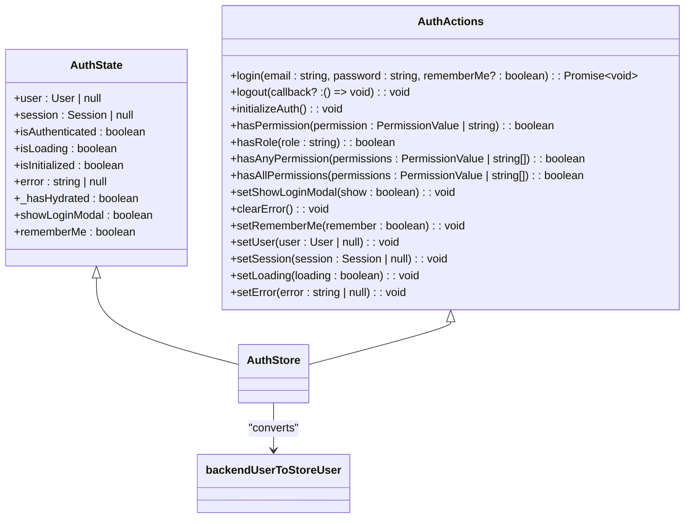
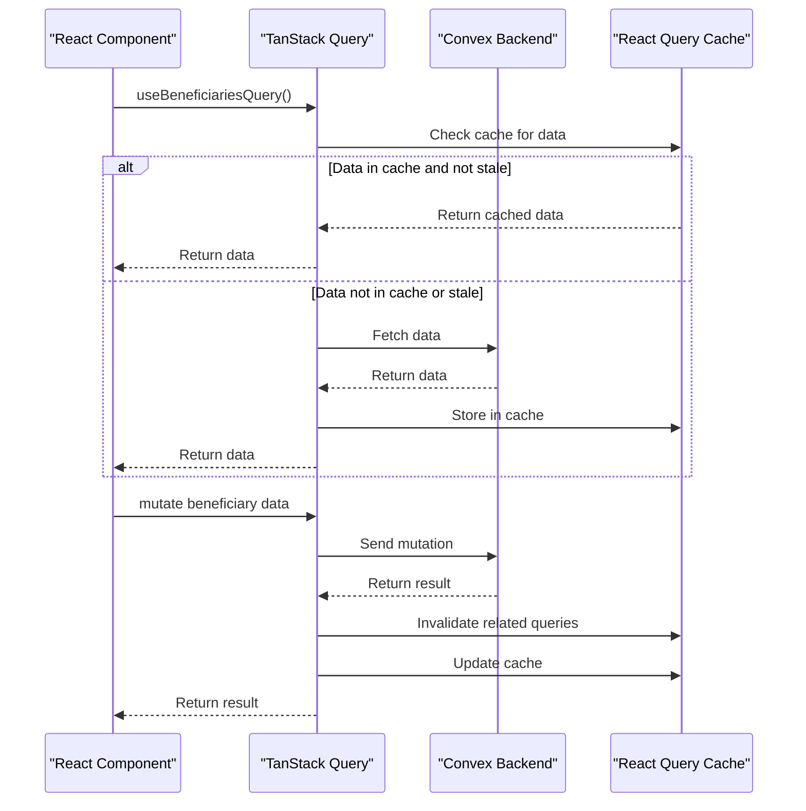
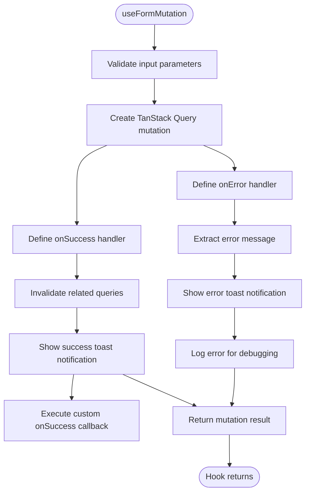
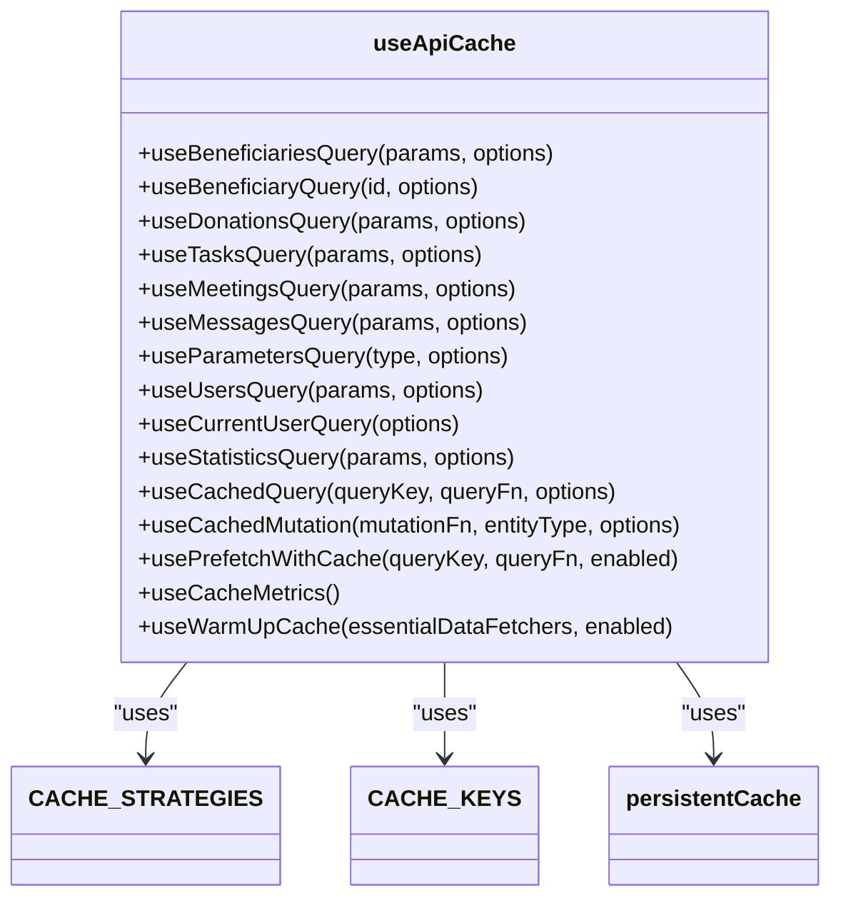
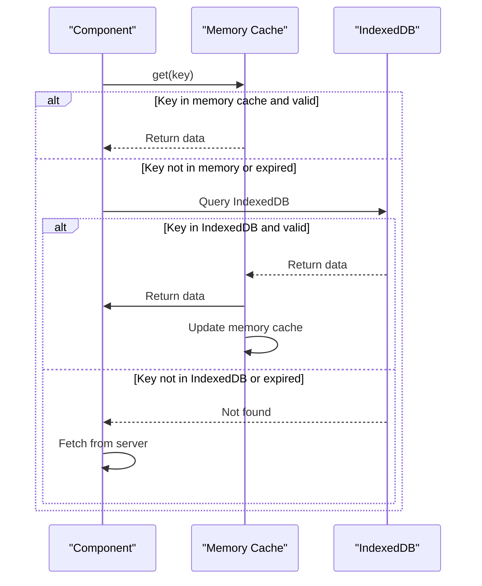
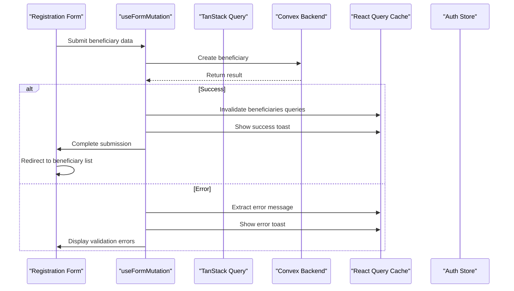
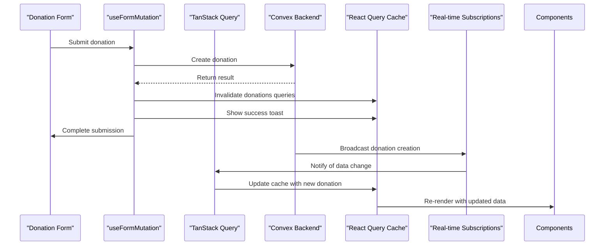
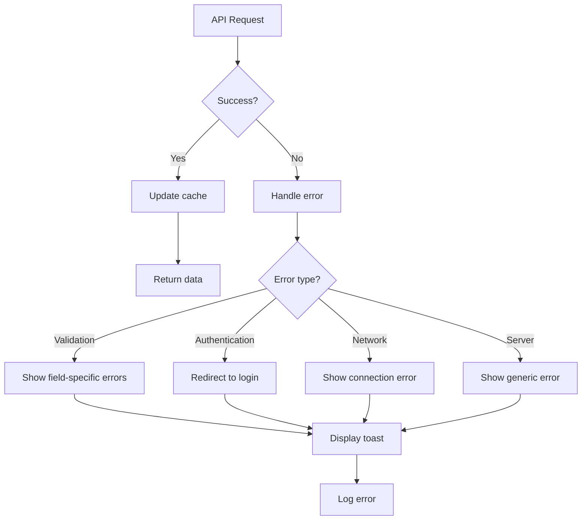
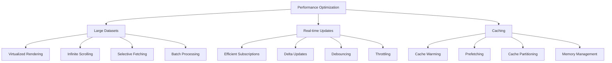

# State Management

<cite>
**Referenced Files in This Document**   
- [useFormMutation.ts](file://src/hooks/useFormMutation.ts)
- [useApiCache.ts](file://src/hooks/useApiCache.ts)
- [authStore.ts](file://src/stores/authStore.ts)
- [cache-config.ts](file://src/lib/cache-config.ts)
- [persistent-cache.ts](file://src/lib/persistent-cache.ts)
- [client.ts](file://src/lib/convex/client.ts)
- [providers.tsx](file://src/app/providers.tsx)
- [beneficiaries.ts](file://convex/beneficiaries.ts)
- [donations.ts](file://convex/donations.ts)
- [route.ts](file://src/app/api/beneficiaries/route.ts)
- [route.ts](file://src/app/api/donations/route.ts)
</cite>

## Table of Contents

1. [Introduction](#introduction)
2. [Hybrid State Management Architecture](#hybrid-state-management-architecture)
3. [Zustand for Global UI State](#zustand-for-global-ui-state)
4. [TanStack Query for Server State](#tanstack-query-for-server-state)
5. [Custom Hooks for Data Management](#custom-hooks-for-data-management)
6. [Caching Strategy](#caching-strategy)
7. [Complex Workflow Examples](#complex-workflow-examples)
8. [Asynchronous Operations Handling](#asynchronous-operations-handling)
9. [Performance Optimization](#performance-optimization)
10. [Conclusion](#conclusion)

## Introduction

PORTAL implements a sophisticated state management system that combines the strengths of multiple libraries to handle both UI state and server state efficiently. The system uses a hybrid approach with Zustand for global UI state management and TanStack Query for server state management through Convex. This documentation provides a comprehensive overview of the state management architecture, custom hooks, caching strategies, and best practices implemented in the PORTAL application.

The state management solution is designed to handle complex workflows such as beneficiary registration and donation processing while addressing common issues like stale data, loading states, and error handling in asynchronous operations. The system also incorporates performance optimization techniques for handling large datasets and real-time updates.

## Hybrid State Management Architecture

PORTAL employs a hybrid state management architecture that separates concerns between UI state and server state. This approach leverages the strengths of different libraries for specific use cases, creating a robust and maintainable system.

```mermaid
graph TB
subgraph "UI State Management"
A[Zustand] --> B[Global UI State]
B --> C[Authentication State]
B --> D[Form State]
B --> E[UI Preferences]
end
subgraph "Server State Management"
F[TanStack Query] --> G[Server State]
G --> H[Data Fetching]
G --> I[Data Caching]
G --> J[Background Sync]
end
K[Convex Backend] < --> F
A < --> L[React Components]
F < --> L
M[Custom Hooks] --> A
M --> F
N[Persistent Cache] --> F
```

**Diagram sources**

- [useFormMutation.ts](file://src/hooks/useFormMutation.ts)
- [useApiCache.ts](file://src/hooks/useApiCache.ts)
- [authStore.ts](file://src/stores/authStore.ts)

**Section sources**

- [useFormMutation.ts](file://src/hooks/useFormMutation.ts)
- [useApiCache.ts](file://src/hooks/useApiCache.ts)
- [authStore.ts](file://src/stores/authStore.ts)

## Zustand for Global UI State

Zustand is used to manage global UI state across the PORTAL application. The primary implementation is the authentication store, which handles user authentication state, permissions, and session management.

The `authStore` is implemented as a Zustand store with several key features:

- **Persistent storage**: The store uses localStorage to persist authentication state across sessions
- **Middleware integration**: It incorporates devtools for debugging, persist for storage, and immer for immutable updates
- **Comprehensive state management**: It manages user information, session data, authentication status, and error states
- **Permission helpers**: The store includes utility functions for checking user permissions and roles



**Diagram sources**

- [authStore.ts](file://src/stores/authStore.ts#L20-L57)

**Section sources**

- [authStore.ts](file://src/stores/authStore.ts)

## TanStack Query for Server State

TanStack Query (formerly React Query) is used for managing server state in PORTAL, providing a robust solution for data fetching, caching, and synchronization with the Convex backend.

The implementation includes:

- **Automatic caching**: Queries are automatically cached with configurable time-to-live (TTL) settings
- **Background refetching**: Data is automatically refreshed in the background
- **Request deduplication**: Identical queries are deduplicated to prevent unnecessary network requests
- **Pagination support**: Built-in support for paginated data through `useInfiniteQuery`
- **Optimistic updates**: Support for optimistic updates to improve user experience

The QueryClient is configured with optimized defaults in `providers.tsx`, including retry logic with exponential backoff, network mode configuration, and structural sharing to minimize re-renders.



**Diagram sources**

- [useApiCache.ts](file://src/hooks/useApiCache.ts)
- [client.ts](file://src/lib/convex/client.ts)
- [providers.tsx](file://src/app/providers.tsx)

**Section sources**

- [useApiCache.ts](file://src/hooks/useApiCache.ts)
- [client.ts](file://src/lib/convex/client.ts)

## Custom Hooks for Data Management

PORTAL implements several custom hooks to standardize data management patterns and reduce code duplication across the application.

### useFormMutation Hook

The `useFormMutation` hook abstracts common mutation patterns for form submissions, providing standardized error handling and notifications.



**Diagram sources**

- [useFormMutation.ts](file://src/hooks/useFormMutation.ts#L47-L102)

**Section sources**

- [useFormMutation.ts](file://src/hooks/useFormMutation.ts)

### useApiCache Hook

The `useApiCache` hook provides a collection of specialized hooks for different entity types, each with optimized caching strategies.



**Diagram sources**

- [useApiCache.ts](file://src/hooks/useApiCache.ts)

**Section sources**

- [useApiCache.ts](file://src/hooks/useApiCache.ts)

## Caching Strategy

PORTAL implements a comprehensive caching strategy that combines client-side caching with HTTP caching mechanisms to optimize performance and enable offline functionality.

### Cache Configuration

The caching strategy is defined in `cache-config.ts` with different cache durations for various data types:

```mermaid
graph TD
A[Cache Strategies] --> B[REAL_TIME: 30 seconds]
A --> C[SHORT: 2 minutes]
A --> D[STANDARD: 5 minutes]
A --> E[MEDIUM: 10 minutes]
A --> F[LONG: 30 minutes]
A --> G[VERY_LONG: 1 hour]
A --> H[SESSION: Infinity]
I[Entity Types] --> J[Parameters: VERY_LONG]
I --> K[Users: STANDARD]
I --> L[Beneficiaries: STANDARD]
I --> M[Donations: STANDARD]
I --> N[Tasks: REAL_TIME]
I --> O[Meetings: STANDARD]
I --> P[Messages: REAL_TIME]
I --> Q[Statistics: STANDARD]
```



**Diagram sources**

- [cache-config.ts](file://src/lib/cache-config.ts)

**Section sources**

- [cache-config.ts](file://src/lib/cache-config.ts)

### Persistent Caching

The application implements persistent caching using IndexedDB with a memory-first approach:

- **Primary storage**: IndexedDB for persistent storage across sessions
- **Fallback**: In-memory cache when IndexedDB is unavailable
- **Automatic cleanup**: Periodic cleanup of expired entries
- **Versioning**: Cache versioning to handle schema changes
- **Metrics tracking**: Comprehensive metrics for cache performance monitoring

The `persistentCache` class provides methods for setting, getting, and managing cached data, with automatic handling of expiration and version compatibility.



**Diagram sources**

- [persistent-cache.ts](file://src/lib/persistent-cache.ts)
- [useApiCache.ts](file://src/hooks/useApiCache.ts)

**Section sources**

- [persistent-cache.ts](file://src/lib/persistent-cache.ts)

## Complex Workflow Examples

### Beneficiary Registration Workflow

The beneficiary registration workflow demonstrates the integration of multiple state management patterns:



**Diagram sources**

- [useFormMutation.ts](file://src/hooks/useFormMutation.ts)
- [beneficiaries.ts](file://convex/beneficiaries.ts)
- [route.ts](file://src/app/api/beneficiaries/route.ts)

**Section sources**

- [useFormMutation.ts](file://src/hooks/useFormMutation.ts)
- [beneficiaries.ts](file://convex/beneficiaries.ts)

### Donation Processing Workflow

The donation processing workflow illustrates real-time data synchronization:



**Diagram sources**

- [donations.ts](file://convex/donations.ts)
- [route.ts](file://src/app/api/donations/route.ts)
- [useFormMutation.ts](file://src/hooks/useFormMutation.ts)

**Section sources**

- [donations.ts](file://convex/donations.ts)
- [route.ts](file://src/app/api/donations/route.ts)

## Asynchronous Operations Handling

PORTAL implements robust handling of asynchronous operations, addressing common issues like stale data, loading states, and error handling.

### Stale Data Management

The system uses several strategies to manage stale data:

- **Automatic refetching**: Configured based on entity type and user activity
- **Query invalidation**: Automatic invalidation of related queries after mutations
- **Background refetching**: Data is refreshed in the background without blocking the UI
- **Stale-while-revalidate**: Serve stale data immediately while fetching fresh data in the background

### Loading States

Comprehensive loading state management is implemented:

- **Initial loading**: Display loading indicators during initial data fetch
- **Background loading**: Show subtle indicators during background refetching
- **Mutation states**: Differentiate between initial submission and background processing
- **Skeleton screens**: Use skeleton components to maintain layout during loading

### Error Handling

The error handling strategy includes:

- **User-friendly messages**: Convert technical errors to user-friendly messages
- **Error logging**: Comprehensive logging for debugging
- **Retry mechanisms**: Automatic retries with exponential backoff
- **Graceful degradation**: Maintain functionality when possible despite errors
- **Toast notifications**: Visual feedback for success and error states



**Diagram sources**

- [useFormMutation.ts](file://src/hooks/useFormMutation.ts)
- [authStore.ts](file://src/stores/authStore.ts)

**Section sources**

- [useFormMutation.ts](file://src/hooks/useFormMutation.ts)
- [authStore.ts](file://src/stores/authStore.ts)

## Performance Optimization

PORTAL implements several performance optimization techniques for handling large datasets and real-time updates.

### Large Dataset Handling

- **Virtualized rendering**: Use virtualized data tables to render only visible items
- **Infinite scrolling**: Implement pagination with `useInfiniteScroll` hook
- **Selective fetching**: Fetch only required fields and data
- **Batch processing**: Process large operations in batches to avoid blocking the UI
- **Web Workers**: Offload intensive computations to web workers when possible

### Real-time Updates

- **Efficient subscriptions**: Use Convex real-time subscriptions for immediate updates
- **Delta updates**: Send only changed data rather than full payloads
- **Debouncing**: Debounce rapid updates to avoid overwhelming the UI
- **Throttling**: Limit the rate of updates to maintain performance
- **Connection management**: Optimize WebSocket connections for reliability and efficiency

### Caching Optimizations

- **Cache warming**: Pre-fetch essential data during application initialization
- **Prefetching**: Predictively fetch data based on user navigation patterns
- **Cache partitioning**: Separate caches by entity type and access patterns
- **Memory management**: Monitor and control cache size to prevent memory issues
- **Cache coordination**: Coordinate between React Query cache and persistent cache



**Diagram sources**

- [useInfiniteScroll.ts](file://src/hooks/useInfiniteScroll.ts)
- [useApiCache.ts](file://src/hooks/useApiCache.ts)
- [cache-config.ts](file://src/lib/cache-config.ts)

**Section sources**

- [useInfiniteScroll.ts](file://src/hooks/useInfiniteScroll.ts)
- [useApiCache.ts](file://src/hooks/useApiCache.ts)

## Conclusion

PORTAL's state management system effectively combines Zustand and TanStack Query to create a robust, scalable solution for managing both UI state and server state. The hybrid approach allows for optimal performance and developer experience by using the right tool for each job.

The implementation of custom hooks like `useFormMutation` and `useApiCache` standardizes data management patterns across the application, reducing code duplication and improving maintainability. The comprehensive caching strategy, combining client-side and persistent caching, optimizes performance and enables offline functionality.

The system effectively handles complex workflows like beneficiary registration and donation processing, with robust error handling and loading state management. Performance optimizations for large datasets and real-time updates ensure a smooth user experience even with substantial data volumes.

By following these patterns and best practices, PORTAL achieves a state management solution that is both powerful and maintainable, providing a solid foundation for the application's functionality and future growth.
