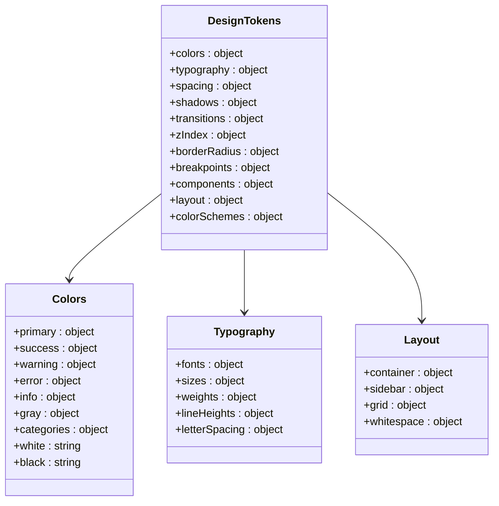
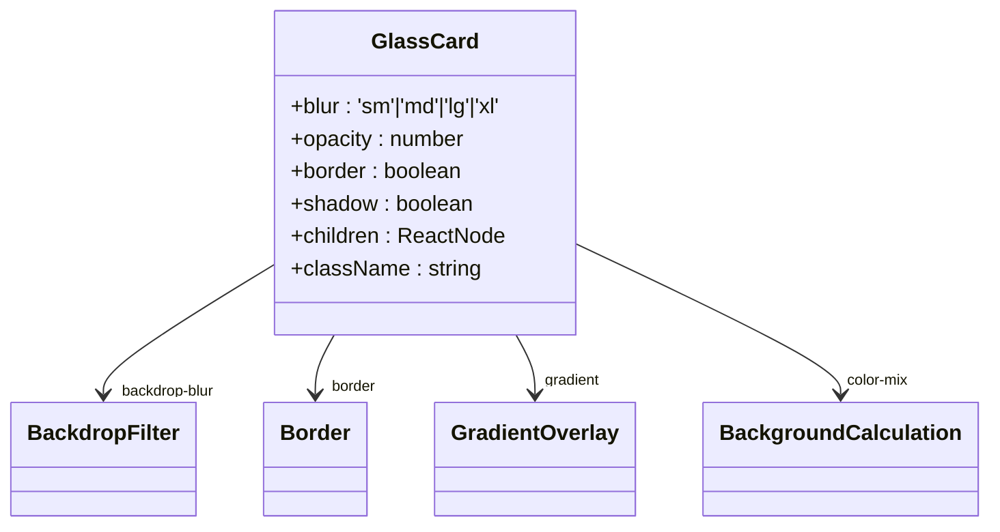
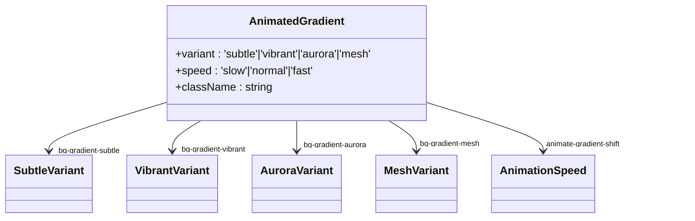
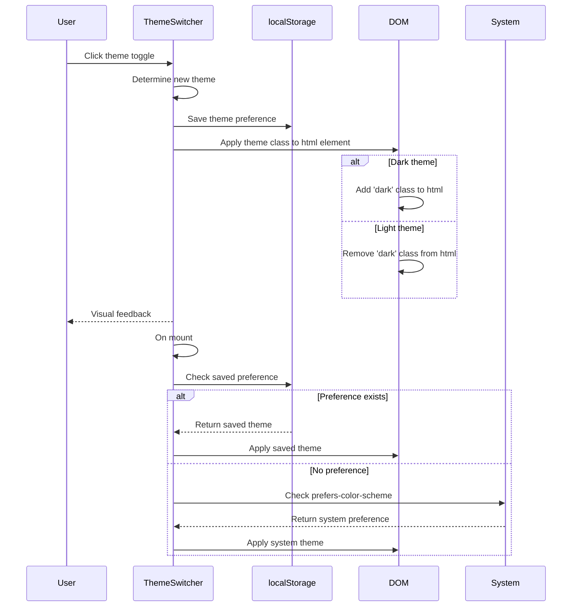
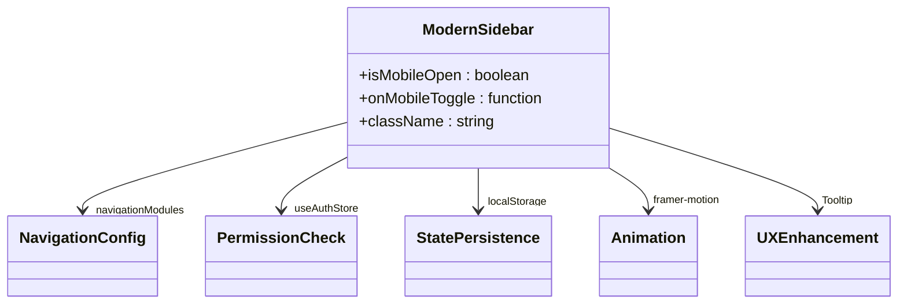

# Styling Approach

<cite>
**Referenced Files in This Document**   
- [tailwind.config.js](file://tailwind.config.js)
- [design-tokens.ts](file://src/config/design-tokens.ts)
- [theme-switcher.tsx](file://src/components/ui/theme-switcher.tsx)
- [glass-card.tsx](file://src/components/ui/glass-card.tsx)
- [animated-gradient.tsx](file://src/components/ui/animated-gradient.tsx)
- [modern-sidebar.tsx](file://src/components/ui/modern-sidebar.tsx)
- [navigation.ts](file://src/config/navigation.ts)
- [AidHistoryChart.tsx](file://src/components/beneficiary-analytics/AidHistoryChart.tsx)
</cite>

## Table of Contents

1. [Utility-First CSS with Tailwind](#utility-first-css-with-tailwind)
2. [Design Tokens System](#design-tokens-system)
3. [Component Styling Patterns](#component-styling-patterns)
4. [Theme System and Dark Mode](#theme-system-and-dark-mode)
5. [Responsive Design](#responsive-design)
6. [Complex Styling Implementations](#complex-styling-implementations)
7. [Creating New Components](#creating-new-components)

## Utility-First CSS with Tailwind

The PORTAL application implements a utility-first CSS methodology using Tailwind CSS, which provides atomic classes for styling elements directly in markup. This approach enables rapid UI development while maintaining consistency across the application. The Tailwind configuration is set up to scan all relevant source files in the project structure, ensuring that all utility classes are properly generated.

The utility-first approach allows developers to compose styles directly in JSX/TSX components using Tailwind's comprehensive class system. This eliminates the need for separate CSS files and reduces context switching between styling and component logic. The configuration includes content paths for all component, page, and app directories, ensuring comprehensive class generation.

**Section sources**

- [tailwind.config.js](file://tailwind.config.js#L3-L7)
- [postcss.config.mjs](file://postcss.config.mjs#L1-L7)

## Design Tokens System

The styling system is built upon a comprehensive design tokens framework defined in `design-tokens.ts`, which serves as the single source of truth for all design decisions. The tokens are organized into logical categories including colors, typography, spacing, shadows, transitions, z-index values, border radius, breakpoints, component-specific properties, layout configurations, and color schemes.

The color system includes a full palette with primary brand colors (corporate blue), success (green), warning (orange), error (red), and info (purple) variants, each with 900-50 shades. Additionally, category-specific colors are defined for different functional areas such as donations (pink), aid (purple), scholarships (cyan), meetings (amber), tasks (green), and messages (indigo). The typography system establishes font families, sizes, weights, line heights, and letter spacing with responsive considerations.

Layout tokens define container maxWidth, sidebar dimensions, grid configurations, and whitespace values for different screen sizes. Component tokens standardize padding, font sizes, border radius, and other properties for buttons, inputs, cards, badges, modals, and tables, ensuring consistent appearance and behavior across the application.

**Diagram sources**

- [design-tokens.ts](file://src/config/design-tokens.ts#L1-L390)

**Section sources**

- [design-tokens.ts](file://src/config/design-tokens.ts#L1-L390)

## Component Styling Patterns

The application implements several distinctive styling patterns that contribute to its modern aesthetic. These patterns are encapsulated in reusable components that can be consistently applied throughout the application.

### Glassmorphism Effects

The glass-card component implements a glassmorphism effect using CSS backdrop filters and gradients. This creates a frosted glass appearance with subtle blur, transparency, and light gradients that enhance depth and visual interest. The component supports configurable blur levels (sm, md, lg, xl), opacity, border visibility, and shadow effects.

The implementation uses `backdrop-blur` classes to create the blur effect, combined with semi-transparent borders that vary between light and dark modes. A pseudo-element with a gradient overlay adds depth and dimension to the glass effect. The background color is dynamically calculated using the `color-mix` function to ensure proper blending with the underlying background while maintaining accessibility.

**Diagram sources**

- [glass-card.tsx](file://src/components/ui/glass-card.tsx#L1-L59)

**Section sources**

- [glass-card.tsx](file://src/components/ui/glass-card.tsx#L1-L59)

### Animated Gradients

The animated-gradient component provides dynamic background effects with multiple variants including subtle, vibrant, aurora, and mesh patterns. These animated backgrounds add visual interest to key sections of the application while maintaining performance through GPU acceleration.

The component supports different animation speeds (slow, normal, fast) and automatically applies the appropriate CSS classes for the selected variant and speed. The implementation uses absolute positioning to create a full-coverage background layer that doesn't interfere with pointer events on underlying content. The animations are optimized for performance using GPU acceleration and are disabled in reduced motion preferences.

**Diagram sources**

- [animated-gradient.tsx](file://src/components/ui/animated-gradient.tsx#L1-L48)

**Section sources**

- [animated-gradient.tsx](file://src/components/ui/animated-gradient.tsx#L1-L48)

## Theme System and Dark Mode

The PORTAL application features a comprehensive theme system with support for light mode, dark mode, and system preference detection. The theme-switcher component provides a user interface for toggling between these modes, with persistent storage of user preferences.

The theme system is built on CSS custom properties and Tailwind's dark mode support, allowing for seamless transitions between themes. The color schemes are defined in the design tokens, with specific values for background, surface, text, borders, and disabled states in both light and dark modes. The implementation respects user system preferences through the `prefers-color-scheme` media query.

The theme switcher component uses localStorage to persist user preferences across sessions. When the system theme option is selected, it automatically responds to changes in the user's system preferences. The component includes accessibility features such as appropriate aria-labels and tooltips, and it uses conditional rendering to avoid hydration issues during server-side rendering.

**Diagram sources**

- [theme-switcher.tsx](file://src/components/ui/theme-switcher.tsx#L13-L106)

**Section sources**

- [theme-switcher.tsx](file://src/components/ui/theme-switcher.tsx#L13-L106)
- [design-tokens.ts](file://src/config/design-tokens.ts#L350-L371)

## Responsive Design

The styling system incorporates comprehensive responsive design principles to ensure optimal user experience across different device sizes. Breakpoints are defined in the design tokens and correspond to standard device categories: xs (320px), sm (640px), md (768px), lg (1024px), xl (1280px), and 2xl (1536px).

Layout components such as the modern-sidebar adapt their appearance based on screen size, collapsing to a compact form on smaller devices. The grid system supports different column counts and gap sizes for desktop, tablet, and mobile views. Container padding and whitespace values are also responsive, providing appropriate spacing for each device category.

The responsive approach extends to component styling, with many components supporting different visual treatments at various breakpoints. This ensures that the user interface remains functional and aesthetically pleasing regardless of the viewing context.

**Section sources**

- [design-tokens.ts](file://src/config/design-tokens.ts#L224-L231)
- [modern-sidebar.tsx](file://src/components/ui/modern-sidebar.tsx#L77-L80)
- [layout.ts](file://src/config/design-tokens.ts#L304-L347)

## Complex Styling Implementations

### Modern Sidebar

The modern-sidebar component implements a sophisticated navigation interface with collapsible sections, permission-based visibility, and responsive behavior. The sidebar supports both expanded and collapsed states, with smooth transitions between them. In the collapsed state, tooltips provide context for navigation items.

The implementation uses framer-motion for animations, providing smooth transitions when expanding and collapsing module sections. Navigation items are filtered based on user permissions, ensuring that users only see functionality they are authorized to access. The sidebar state (collapsed/expanded) is persisted in localStorage and synchronized across tabs using the storage event.

**Diagram sources**

- [modern-sidebar.tsx](file://src/components/ui/modern-sidebar.tsx#L23-L219)
- [navigation.ts](file://src/config/navigation.ts#L39-L198)

**Section sources**

- [modern-sidebar.tsx](file://src/components/ui/modern-sidebar.tsx#L23-L219)
- [navigation.ts](file://src/config/navigation.ts#L39-L198)

### Data Visualization Components

Data visualization components like AidHistoryChart demonstrate the integration of styling with data presentation. These components use the design system tokens to ensure visual consistency while presenting complex information in an accessible format.

The AidHistoryChart component combines multiple card elements with iconography, color-coded indicators, and structured layouts to present beneficiary aid history data. It uses the application's color system to indicate positive (green) and negative (red) trends, and it incorporates loading states with animated indicators. The layout is responsive, adapting from a single column on mobile devices to a multi-column grid on larger screens.

**Section sources**

- [AidHistoryChart.tsx](file://src/components/beneficiary-analytics/AidHistoryChart.tsx#L13-L181)

## Creating New Components

When creating new components that follow the existing design language, developers should adhere to the following guidelines:

1. **Use design tokens**: Reference values from the design-tokens module rather than hardcoding colors, spacing, or other design properties.

2. **Leverage utility classes**: Utilize Tailwind's utility classes for styling, composing them to achieve the desired appearance.

3. **Follow component patterns**: For glassmorphism effects, use the glass-card component; for animated backgrounds, use the animated-gradient component.

4. **Support theme switching**: Ensure components look appropriate in both light and dark modes by using semantic color references rather than fixed colors.

5. **Implement responsive behavior**: Design components to work well at all breakpoints, using Tailwind's responsive prefixes when necessary.

6. **Use the cn utility**: Combine class names using the cn function from lib/utils, which merges Tailwind classes intelligently and handles conditional classes.

7. **Consider accessibility**: Ensure adequate color contrast, provide appropriate aria attributes, and support keyboard navigation.

By following these guidelines, new components will seamlessly integrate with the existing design system and maintain consistency throughout the application.

**Section sources**

- [design-tokens.ts](file://src/config/design-tokens.ts#L1-L390)
- [lib/utils.ts](file://src/lib/utils.ts#L1-L6)
- [theme-switcher.tsx](file://src/components/ui/theme-switcher.tsx#L13-L106)
- [glass-card.tsx](file://src/components/ui/glass-card.tsx#L1-L59)
- [animated-gradient.tsx](file://src/components/ui/animated-gradient.tsx#L1-L48)
