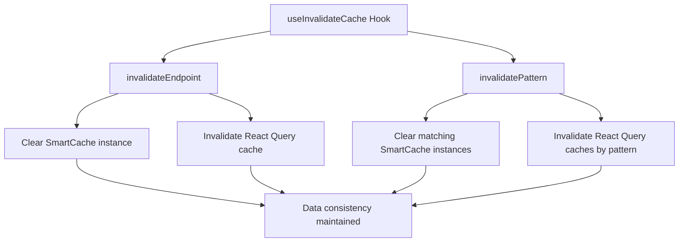
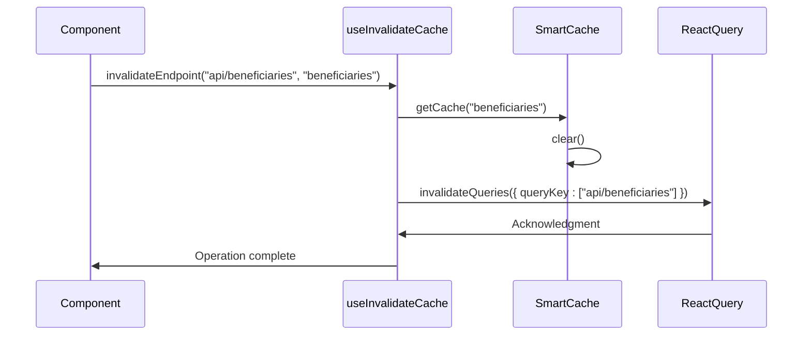
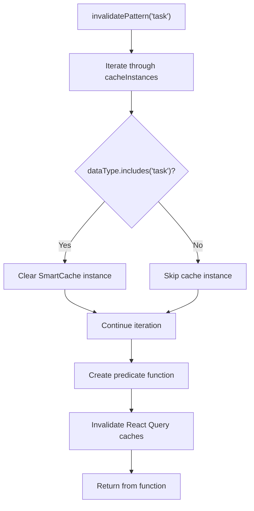
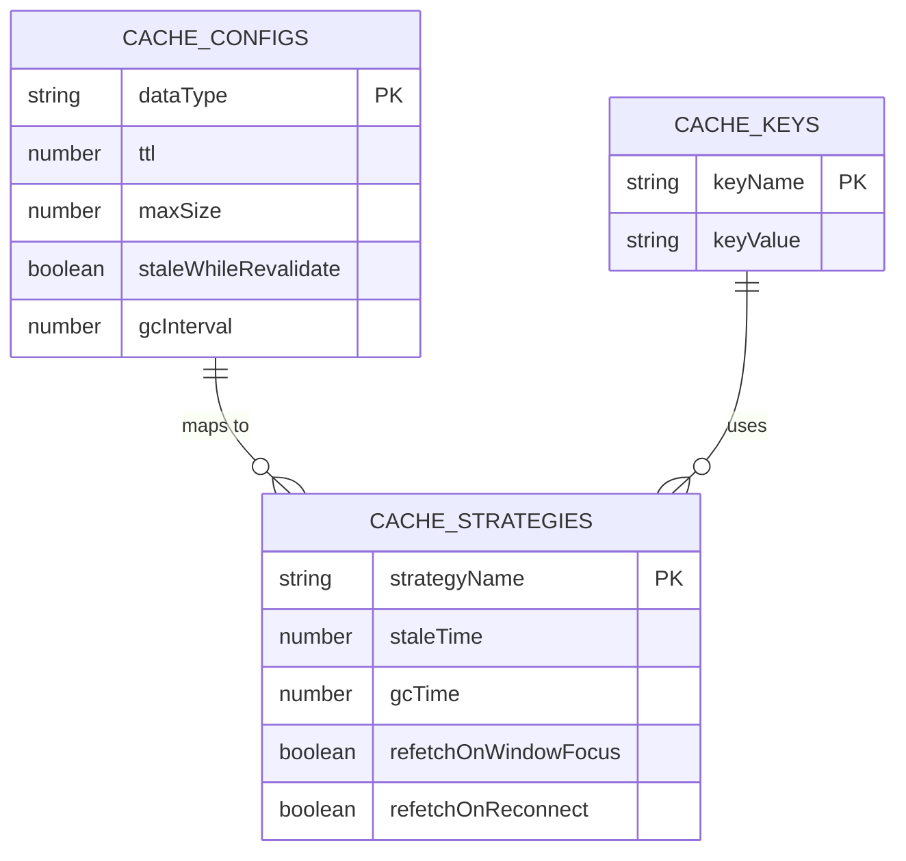
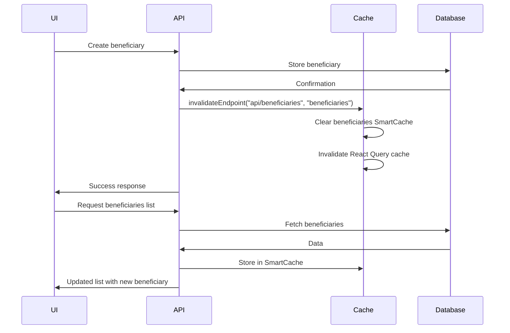
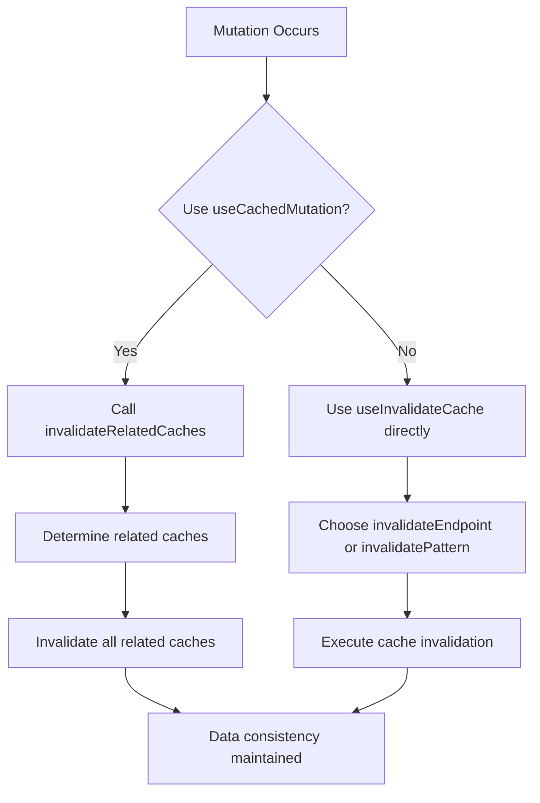

# Cache Invalidation

<cite>
**Referenced Files in This Document**   
- [api-cache.ts](file://src/lib/api-cache.ts)
- [cache-config.ts](file://src/lib/cache-config.ts)
- [useApiCache.ts](file://src/hooks/useApiCache.ts)
- [beneficiaries.ts](file://convex/beneficiaries.ts)
- [route.ts](file://src/app/api/beneficiaries/route.ts)
- [route.ts](file://src/app/api/donations/route.ts)
- [route.ts](file://src/app/api/tasks/route.ts)
</cite>

## Table of Contents

1. [Introduction](#introduction)
2. [Cache Invalidation Mechanisms](#cache-invalidation-mechanisms)
3. [useInvalidateCache Hook](#useinvalidatecache-hook)
4. [invalidateEndpoint Function](#invalidateendpoint-function)
5. [invalidatePattern Function](#invalidatepattern-function)
6. [Cache Configuration and Strategies](#cache-configuration-and-strategies)
7. [CRUD Operations and Cache Invalidation](#crud-operations-and-cache-invalidation)
8. [Data Consistency and Stale Data](#data-consistency-and-stale-data)
9. [Implementation Strategies](#implementation-strategies)
10. [Troubleshooting Common Issues](#troubleshooting-common-issues)
11. [Conclusion](#conclusion)

## Introduction

The PORTAL application implements a sophisticated cache invalidation system to maintain data consistency across the platform. This document details the cache invalidation mechanisms, focusing on the `useInvalidateCache` hook and its two primary functions: `invalidateEndpoint` and `invalidatePattern`. The system is designed to ensure that data displayed to users remains accurate and up-to-date following create, update, and delete operations on key entities such as beneficiaries, donations, and tasks. Proper cache management is critical for preventing stale data issues and ensuring a reliable user experience.

**Section sources**

- [api-cache.ts](file://src/lib/api-cache.ts#L339-L376)

## Cache Invalidation Mechanisms

The PORTAL application employs a dual-layer caching strategy combining SmartCache instances with React Query for optimal performance and data consistency. The cache invalidation system is designed to address the challenges of maintaining fresh data while minimizing unnecessary network requests. The system uses both targeted invalidation for specific endpoints and pattern-based invalidation for broader cache clearing operations. This approach allows developers to choose the most appropriate invalidation strategy based on the scope of data changes and their impact on related entities.

**Section sources**

- [api-cache.ts](file://src/lib/api-cache.ts#L1-L381)

## useInvalidateCache Hook

The `useInvalidateCache` hook provides a centralized interface for cache invalidation operations in the PORTAL application. This custom React hook exposes two main functions—`invalidateEndpoint` and `invalidatePattern`—that enable developers to clear cached data in response to data mutations. The hook leverages React Query's `useQueryClient` to coordinate cache invalidation across both the application's SmartCache instances and React Query's internal cache. This dual invalidation ensures that data is refreshed from the source when needed, preventing stale data from being displayed to users.

**Diagram sources**

- [api-cache.ts](file://src/lib/api-cache.ts#L339-L376)

**Section sources**

- [api-cache.ts](file://src/lib/api-cache.ts#L339-L376)

## invalidateEndpoint Function

The `invalidateEndpoint` function provides targeted cache invalidation for specific API endpoints. When called with an endpoint parameter, it clears both the corresponding SmartCache instance and the React Query cache for that endpoint. The function accepts an optional `dataType` parameter that allows for more granular cache clearing. When `dataType` is specified, only the SmartCache instance associated with that data type is cleared. When omitted, all SmartCache instances are cleared. This function is particularly useful after CRUD operations on specific entities, ensuring that subsequent requests retrieve fresh data from the server.

**Diagram sources**

- [api-cache.ts](file://src/lib/api-cache.ts#L342-L356)

**Section sources**

- [api-cache.ts](file://src/lib/api-cache.ts#L342-L356)

## invalidatePattern Function

The `invalidatePattern` function enables pattern-based cache invalidation, allowing developers to clear multiple caches that match a specific string pattern. This function iterates through all SmartCache instances and clears those whose data type includes the specified pattern. It also invalidates React Query caches using a predicate function that matches query keys containing the pattern. This approach is particularly useful for invalidating related caches when a broad data change occurs, such as clearing all task-related caches when a workflow update affects multiple task types. The pattern matching capability provides flexibility in cache management without requiring explicit knowledge of all affected cache keys.

**Diagram sources**

- [api-cache.ts](file://src/lib/api-cache.ts#L358-L373)

**Section sources**

- [api-cache.ts](file://src/lib/api-cache.ts#L358-L373)

## Cache Configuration and Strategies

The PORTAL application implements differentiated cache configurations for various data types based on their update frequency and importance. The cache configuration system defines specific TTL (time-to-live), maximum size, and garbage collection intervals for different entities. For example, beneficiaries have a 5-minute TTL with a 2-minute garbage collection interval, while tasks have a shorter 2-minute TTL with 1-minute garbage collection, reflecting their more frequent updates. The system also defines cache strategies for different data types, with real-time data like tasks and messages having shorter cache durations and more frequent revalidation compared to relatively stable data like parameters and settings.

**Diagram sources**

- [api-cache.ts](file://src/lib/api-cache.ts#L147-L178)
- [cache-config.ts](file://src/lib/cache-config.ts#L62-L182)

**Section sources**

- [api-cache.ts](file://src/lib/api-cache.ts#L147-L178)
- [cache-config.ts](file://src/lib/cache-config.ts#L13-L182)

## CRUD Operations and Cache Invalidation

The PORTAL application integrates cache invalidation into its CRUD operations to maintain data consistency across the system. After create, update, or delete operations on entities like beneficiaries, donations, and tasks, the appropriate cache invalidation functions are called to ensure that stale data is not displayed to users. For example, when a new beneficiary is created, the system invalidates the beneficiaries endpoint cache to ensure that subsequent list requests retrieve the updated data. Similarly, when a donation is updated, both the specific donation cache and the broader donations list cache are invalidated to reflect the changes.

**Diagram sources**

- [route.ts](file://src/app/api/beneficiaries/route.ts#L129-L247)
- [route.ts](file://src/app/api/donations/route.ts#L89-L147)
- [route.ts](file://src/app/api/tasks/route.ts#L77-L135)

**Section sources**

- [route.ts](file://src/app/api/beneficiaries/route.ts#L129-L247)
- [route.ts](file://src/app/api/donations/route.ts#L89-L147)
- [route.ts](file://src/app/api/tasks/route.ts#L77-L135)

## Data Consistency and Stale Data

Maintaining data consistency is a critical aspect of the PORTAL application's cache invalidation system. The risk of stale data—displaying outdated information to users—is mitigated through timely and appropriate cache invalidation. The system balances performance optimization with data freshness by implementing different cache strategies for various data types. Frequently updated data like tasks and workflow notifications use real-time caching strategies with short TTLs, while less frequently changing data like beneficiary information uses standard caching with longer TTLs. The use of both SmartCache and React Query caches provides multiple layers of protection against stale data, with the invalidation system ensuring that both caches are synchronized when data changes occur.

**Section sources**

- [api-cache.ts](file://src/lib/api-cache.ts#L1-L381)
- [cache-config.ts](file://src/lib/cache-config.ts#L13-L454)

## Implementation Strategies

The PORTAL application employs several strategies for implementing effective cache invalidation. The primary approach uses the `useCachedMutation` hook, which automatically invalidates related caches after successful mutations. This hook leverages the `invalidateRelatedCaches` function to determine which caches need to be invalidated based on the entity type being modified. For example, when beneficiaries are updated, the system invalidates not only the beneficiaries cache but also related caches like statistics and aid applications. This comprehensive approach ensures that all potentially affected data is refreshed, maintaining consistency across the application. Developers can also use the `useInvalidateCache` hook directly when more granular control over cache invalidation is required.

**Diagram sources**

- [useApiCache.ts](file://src/hooks/useApiCache.ts#L182-L207)
- [cache-config.ts](file://src/lib/cache-config.ts#L209-L276)

**Section sources**

- [useApiCache.ts](file://src/hooks/useApiCache.ts#L182-L207)
- [cache-config.ts](file://src/lib/cache-config.ts#L209-L276)

## Troubleshooting Common Issues

Common issues in cache invalidation include over-invalidation, where too many caches are cleared unnecessarily, and missed invalidations, where caches are not cleared when they should be. Over-invalidation can lead to increased network requests and reduced performance, while missed invalidations result in stale data being displayed to users. To address over-invalidation, developers should use the most specific invalidation method possible, such as `invalidateEndpoint` with a specific data type rather than clearing all caches. For missed invalidations, thorough testing of CRUD operations and their impact on related data is essential. The application provides cache metrics and debugging tools through the `useCacheMetrics` hook, allowing developers to monitor cache performance and identify potential issues.

**Section sources**

- [useApiCache.ts](file://src/hooks/useApiCache.ts#L253-L308)
- [api-cache.ts](file://src/lib/api-cache.ts#L322-L336)

## Conclusion

The cache invalidation system in PORTAL provides a robust framework for maintaining data consistency across the application. By combining targeted endpoint invalidation with pattern-based cache clearing, the system offers flexibility in managing cached data while ensuring that users always see up-to-date information. The integration of cache invalidation with CRUD operations through automated mechanisms like `useCachedMutation` reduces the risk of human error and ensures consistent behavior across the application. Proper implementation of these cache invalidation strategies is essential for delivering a reliable user experience and maintaining the integrity of the data displayed in the PORTAL application.
