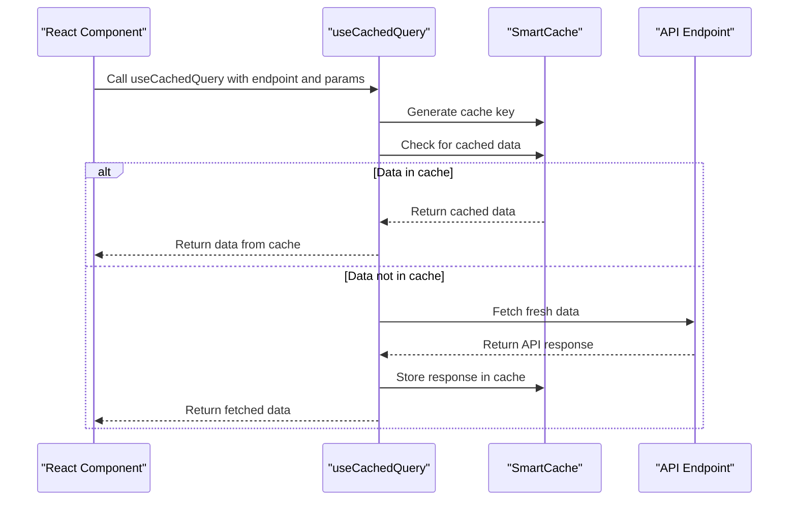
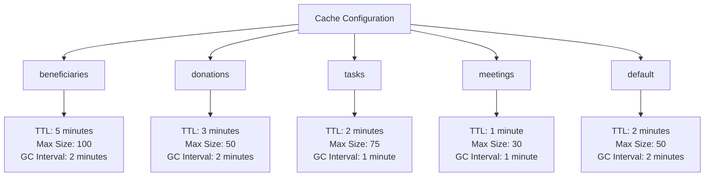
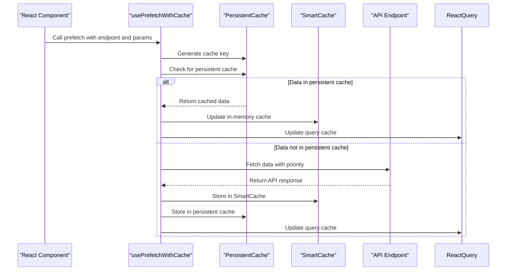
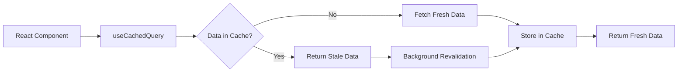
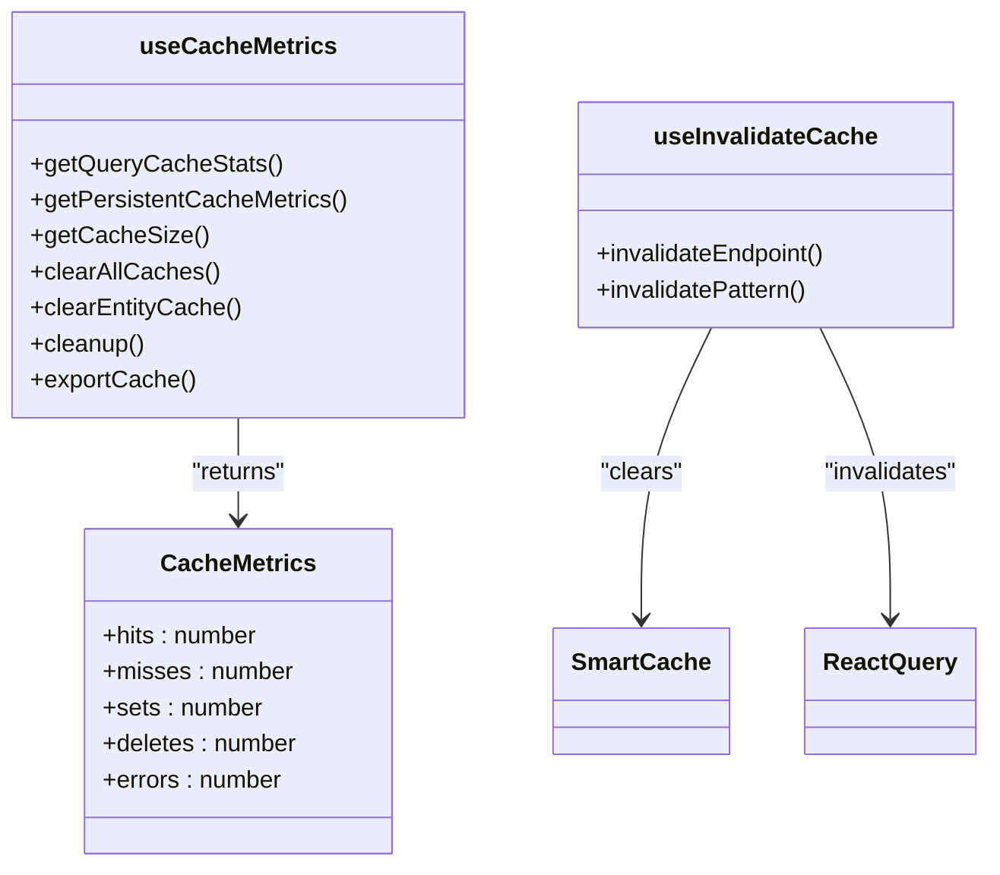

# Client-Side Caching

<cite>
**Referenced Files in This Document**   
- [api-cache.ts](file://src/lib/api-cache.ts)
- [useApiCache.ts](file://src/hooks/useApiCache.ts)
- [cache-config.ts](file://src/lib/cache-config.ts)
- [persistent-cache.ts](file://src/lib/persistent-cache.ts)
</cite>

## Table of Contents

1. [Introduction](#introduction)
2. [SmartCache Implementation](#smartcache-implementation)
3. [useCachedQuery Hook](#usecachedquery-hook)
4. [Cache Configuration Strategy](#cache-configuration-strategy)
5. [Cache Key Generation and Prefetching](#cache-key-generation-and-prefetching)
6. [Integration with TanStack Query](#integration-with-tanstack-query)
7. [Performance Monitoring and Troubleshooting](#performance-monitoring-and-troubleshooting)

## Introduction

The PORTAL application implements a sophisticated client-side caching system to optimize performance, reduce API calls, and enhance user experience. The caching architecture combines in-memory caching with persistent storage, utilizing the SmartCache class for advanced cache management and the useCachedQuery hook for seamless integration with React Query. This document details the implementation of these components, their configuration strategies, and best practices for effective cache utilization.

## SmartCache Implementation

The SmartCache class provides a robust foundation for client-side caching with LRU eviction, TTL-based expiration, and automatic garbage collection. This implementation ensures optimal memory usage while maintaining data freshness.

```mermaid
classDiagram
class SmartCache~T~ {
-cache : Map~string, CacheEntry~T~~
-config : CacheConfig
-stats : {hits : number, misses : number}
-gcTimer : NodeJS.Timeout
+get(key : string) : T | null
+set(key : string, data : T, ttl? : number) : void
+delete(key : string) : void
+clear() : void
+size() : number
+getStats() : {hits : number, misses : number, hitRate : number}
-evictLRU() : void
-startGarbageCollection() : void
-garbageCollect() : void
+destroy() : void
}
class CacheEntry~T~ {
+data : T
+timestamp : number
+expiresAt : number
+accessCount : number
+lastAccessed : number
}
class CacheConfig {
+ttl : number
+maxSize : number
+staleWhileRevalidate : boolean
+gcInterval : number
}
SmartCache~T~ --> CacheEntry~T~ : "contains"
SmartCache~T~ --> CacheConfig : "uses"
```

**Diagram sources**

- [api-cache.ts](file://src/lib/api-cache.ts#L30-L143)

**Section sources**

- [api-cache.ts](file://src/lib/api-cache.ts#L30-L143)

## useCachedQuery Hook

The useCachedQuery hook integrates React Query with custom caching logic, providing a seamless interface for data fetching with intelligent cache management. This hook serves as the primary interface for components to access cached data.



**Diagram sources**

- [api-cache.ts](file://src/lib/api-cache.ts#L197-L252)
- [useApiCache.ts](file://src/hooks/useApiCache.ts#L163-L176)

**Section sources**

- [api-cache.ts](file://src/lib/api-cache.ts#L197-L252)
- [useApiCache.ts](file://src/hooks/useApiCache.ts#L163-L176)

## Cache Configuration Strategy

The caching system employs a strategic configuration approach for different data types, with specific TTLs and size limits tailored to each entity's characteristics and usage patterns.



**Diagram sources**

- [api-cache.ts](file://src/lib/api-cache.ts#L146-L177)

**Section sources**

- [api-cache.ts](file://src/lib/api-cache.ts#L146-L177)

## Cache Key Generation and Prefetching

The caching system implements intelligent cache key generation and prefetching mechanisms to optimize data retrieval and improve application responsiveness.



**Diagram sources**

- [api-cache.ts](file://src/lib/api-cache.ts#L250-L318)
- [useApiCache.ts](file://src/hooks/useApiCache.ts#L211-L247)

**Section sources**

- [api-cache.ts](file://src/lib/api-cache.ts#L191-L194)
- [api-cache.ts](file://src/lib/api-cache.ts#L250-L318)
- [useApiCache.ts](file://src/hooks/useApiCache.ts#L211-L247)

## Integration with TanStack Query

The caching system seamlessly integrates with TanStack Query, implementing a stale-while-revalidate strategy to provide immediate data access while ensuring data freshness.



**Diagram sources**

- [api-cache.ts](file://src/lib/api-cache.ts#L197-L252)
- [cache-config.ts](file://src/lib/cache-config.ts#L61-L181)

**Section sources**

- [api-cache.ts](file://src/lib/api-cache.ts#L197-L252)
- [cache-config.ts](file://src/lib/cache-config.ts#L61-L181)

## Performance Monitoring and Troubleshooting

The caching system includes comprehensive performance monitoring and troubleshooting capabilities to ensure optimal operation and facilitate debugging.



**Diagram sources**

- [persistent-cache.ts](file://src/lib/persistent-cache.ts#L39-L45)
- [useApiCache.ts](file://src/hooks/useApiCache.ts#L252-L308)
- [api-cache.ts](file://src/lib/api-cache.ts#L322-L333)

**Section sources**

- [persistent-cache.ts](file://src/lib/persistent-cache.ts#L30-L453)
- [useApiCache.ts](file://src/hooks/useApiCache.ts#L252-L308)
- [api-cache.ts](file://src/lib/api-cache.ts#L322-L377)
