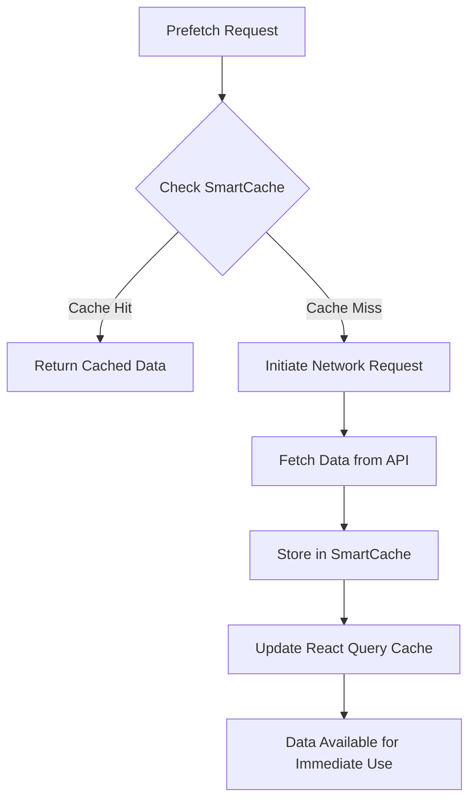
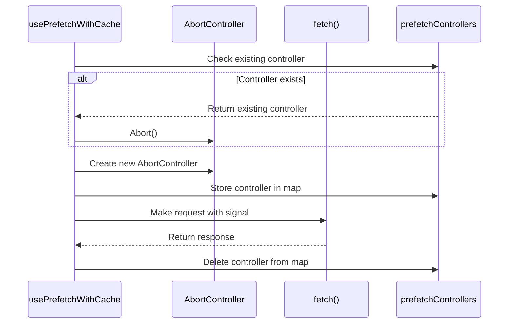
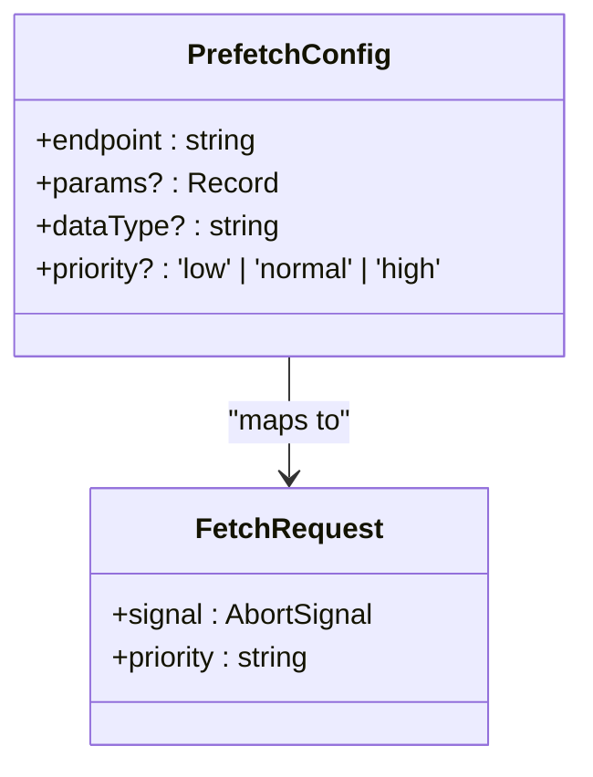
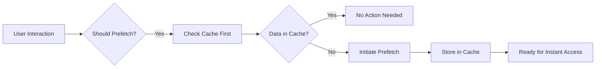
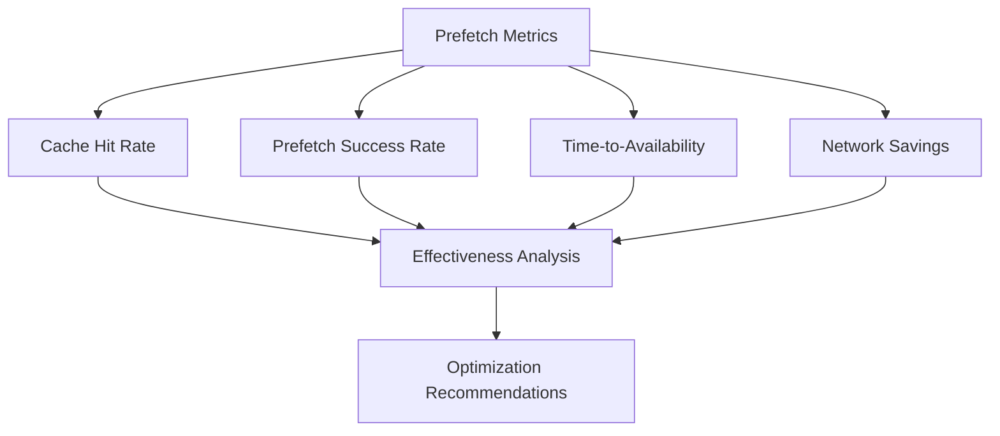

# Prefetching Strategy

<cite>
**Referenced Files in This Document**   
- [api-cache.ts](file://src/lib/api-cache.ts)
- [useApiCache.ts](file://src/hooks/useApiCache.ts)
- [persistent-cache.ts](file://src/lib/persistent-cache.ts)
- [cache-config.ts](file://src/lib/cache-config.ts)
</cite>

## Table of Contents

1. [Introduction](#introduction)
2. [Core Prefetching Implementation](#core-prefetching-implementation)
3. [Cache Integration Strategy](#cache-integration-strategy)
4. [Request Management and Cleanup](#request-management-and-cleanup)
5. [Priority-Based Prefetching](#priority-based-prefetching)
6. [Usage Patterns and Examples](#usage-patterns-and-examples)
7. [Prefetching vs Standard Caching](#prefetching-vs-standard-caching)
8. [Performance Monitoring](#performance-monitoring)
9. [Best Practices](#best-practices)

## Introduction

The PORTAL application implements a sophisticated prefetching strategy designed to enhance user experience by proactively loading data before it's explicitly requested. This document details the implementation of the `usePrefetchWithCache` hook, which combines smart caching with request prioritization and proper cleanup mechanisms to optimize data loading performance while preventing memory leaks.

## Core Prefetching Implementation

The prefetching strategy is implemented through the `usePrefetchWithCache` function in the API cache system. This hook provides a comprehensive solution for prefetching data with intelligent cache checking, ensuring optimal performance and resource utilization.

The implementation follows a systematic approach:

1. First checks for existing cached data before initiating any network requests
2. Utilizes a cache key generation system that combines endpoints with parameters
3. Implements type-safe generic functions for flexible data handling
4. Integrates with both in-memory and persistent caching layers

The prefetching process is designed to be efficient by avoiding redundant requests when data is already available in the cache, thus reducing unnecessary network traffic and improving application responsiveness.

**Section sources**

- [api-cache.ts](file://src/lib/api-cache.ts#L250-L318)

## Cache Integration Strategy

The prefetching system integrates with multiple caching layers to maximize data availability and minimize latency. The architecture combines SmartCache for in-memory caching with React Query's cache system for comprehensive state management.

**Diagram sources**

- [api-cache.ts](file://src/lib/api-cache.ts#L269-L271)
- [api-cache.ts](file://src/lib/api-cache.ts#L295-L298)

The integration works as follows:

- When data is prefetched, it's stored in the SmartCache instance specific to the data type
- Simultaneously, the data is injected into React Query's cache using `setQueryData`
- This dual caching approach ensures data is available both immediately and through the standard query mechanism
- Different data types have specific cache configurations (beneficiaries, donations, tasks, etc.) with appropriate TTL values

This strategy enables seamless data access patterns, where prefetched data can be retrieved instantly through standard query hooks without additional network requests.

**Section sources**

- [api-cache.ts](file://src/lib/api-cache.ts#L146-L178)
- [api-cache.ts](file://src/lib/api-cache.ts#L295-L298)

## Request Management and Cleanup

The prefetching system implements robust request management to prevent memory leaks and ensure proper cleanup of abandoned operations. This is achieved through the strategic use of AbortController and careful state management.

**Diagram sources**

- [api-cache.ts](file://src/lib/api-cache.ts#L274-L278)
- [api-cache.ts](file://src/lib/api-cache.ts#L281-L282)
- [api-cache.ts](file://src/lib/api-cache.ts#L305-L306)

Key aspects of the request management system:

- Uses a Map to track active prefetch controllers by cache key
- Automatically cancels any existing prefetch operation for the same resource
- Creates a new AbortController for each prefetch request
- Attaches the controller's signal to the fetch request
- Properly cleans up by deleting the controller reference in the finally block
- Includes a dedicated `clearPrefetch` function for manual cancellation

The error handling is designed to distinguish between abort errors (which are expected during normal operation) and actual network errors, ensuring that only genuine failures are reported.

**Section sources**

- [api-cache.ts](file://src/lib/api-cache.ts#L274-L306)

## Priority-Based Prefetching

The prefetching system supports priority levels that map directly to the browser's fetch priority feature, allowing fine-grained control over network resource allocation.

**Diagram sources**

- [api-cache.ts](file://src/lib/api-cache.ts#L259-L264)
- [api-cache.ts](file://src/lib/api-cache.ts#L286-L287)

The priority system works as follows:

- Three priority levels are supported: 'low', 'normal', and 'high'
- The priority parameter is passed directly to the fetch request
- Higher priority requests receive preferential treatment from the browser's network scheduler
- This allows critical data to be loaded faster than background or optional data
- The default priority is set to 'low' to avoid impacting user-initiated requests

This feature enables developers to strategically prioritize prefetch operations based on user behavior patterns and application context, ensuring that the most important data is loaded first.

**Section sources**

- [api-cache.ts](file://src/lib/api-cache.ts#L259-L264)

## Usage Patterns and Examples

The prefetching strategy is designed to be triggered by various user interactions and navigation patterns to maximize its effectiveness. Common usage scenarios include:

- **Navigation anticipation**: Prefetching data for likely next pages when users hover over navigation elements
- **Form interactions**: Loading related data when users focus on specific form fields
- **Scroll-based prefetching**: Initiating prefetch operations when users scroll near the end of lists
- **Search suggestions**: Prefetching results for common search terms as users type

**Diagram sources**

- [api-cache.ts](file://src/lib/api-cache.ts#L269-L271)

The system can be integrated into various components:

- Dashboard widgets prefetching summary data
- Navigation menus prefetching target page data
- Search inputs prefetching common query results
- Form elements prefetching dependent data

These patterns ensure that data is available immediately when users navigate to new sections or perform actions, creating a seamless and responsive user experience.

**Section sources**

- [api-cache.ts](file://src/lib/api-cache.ts#L269-L271)

## Prefetching vs Standard Caching

Understanding when to use prefetching versus standard caching is crucial for optimal performance. The two strategies serve different purposes and have distinct characteristics.

| Aspect             | Prefetching                         | Standard Caching              |
| ------------------ | ----------------------------------- | ----------------------------- |
| **Timing**         | Proactive, before data is requested | Reactive, after first request |
| **Purpose**        | Reduce perceived latency            | Reduce actual latency         |
| **Resource Usage** | May fetch unused data               | Only stores requested data    |
| **Network Impact** | Additional requests                 | Reduces total requests        |
| **Best For**       | Predictable navigation patterns     | Frequently accessed data      |

The decision matrix for choosing between prefetching and standard caching:

- Use prefetching when user behavior is predictable and network latency is high
- Use standard caching for all frequently accessed data regardless of prefetching
- Combine both strategies for optimal performance
- Consider data size and user connection quality when deciding

The PORTAL application uses both strategies in concert, with prefetching preparing data for anticipated needs and standard caching handling the normal request-response cycle.

**Section sources**

- [api-cache.ts](file://src/lib/api-cache.ts#L269-L271)
- [useApiCache.ts](file://src/hooks/useApiCache.ts#L211-L247)

## Performance Monitoring

The prefetching system includes comprehensive performance monitoring capabilities to evaluate effectiveness and identify optimization opportunities.

**Diagram sources**

- [persistent-cache.ts](file://src/lib/persistent-cache.ts#L360-L362)
- [cache-config.ts](file://src/lib/cache-config.ts#L375-L384)

Key metrics for evaluating prefetch effectiveness:

- **Cache hit rate**: Percentage of requests served from cache
- **Prefetch success rate**: Percentage of initiated prefetches that complete successfully
- **Time-to-availability**: Reduction in data loading time due to prefetching
- **Network savings**: Bandwidth saved by avoiding duplicate requests
- **Memory usage**: Impact of prefetching on application memory footprint

The system provides tools to monitor these metrics through:

- Cache statistics via the `useCacheMetrics` hook
- Persistent cache metrics including hits, misses, and error rates
- React Query cache statistics for active, stale, and error queries
- Custom performance monitoring components

Regular analysis of these metrics helps optimize prefetching strategies and adjust configurations based on actual usage patterns.

**Section sources**

- [persistent-cache.ts](file://src/lib/persistent-cache.ts#L360-L362)
- [cache-config.ts](file://src/lib/cache-config.ts#L375-L384)

## Best Practices

To maximize the effectiveness of the prefetching strategy in high-latency scenarios and ensure optimal performance, follow these best practices:

### Strategic Prefetching

- Identify high-traffic navigation paths and prioritize prefetching for these routes
- Implement conditional prefetching based on user role and permissions
- Use analytics to identify common user journeys and prefetch accordingly
- Limit concurrent prefetch operations to avoid overwhelming the network

### Resource Management

- Set appropriate TTL values based on data volatility
- Implement size limits for different cache types
- Use the `clearPrefetch` function to cancel unnecessary operations
- Monitor memory usage and adjust prefetching intensity accordingly

### Error Handling and Fallbacks

- Design UI components to handle cases where prefetch fails
- Implement graceful degradation when network conditions are poor
- Provide feedback when prefetched data becomes stale
- Ensure all critical functionality works without prefetching

### Performance Optimization

- Use low priority for non-critical prefetch operations
- Implement throttling for rapid-fire prefetch requests
- Consider connection quality when deciding to prefetch
- Monitor and adjust prefetching strategies based on performance metrics

### Testing and Validation

- Test prefetching behavior under various network conditions
- Validate that cleanup mechanisms prevent memory leaks
- Verify cache invalidation works correctly across all scenarios
- Monitor production metrics to identify unexpected patterns

By following these best practices, developers can ensure that the prefetching strategy enhances user experience without negatively impacting application performance or resource usage.

**Section sources**

- [api-cache.ts](file://src/lib/api-cache.ts#L250-L318)
- [persistent-cache.ts](file://src/lib/persistent-cache.ts#L360-L362)
- [cache-config.ts](file://src/lib/cache-config.ts#L375-L384)
