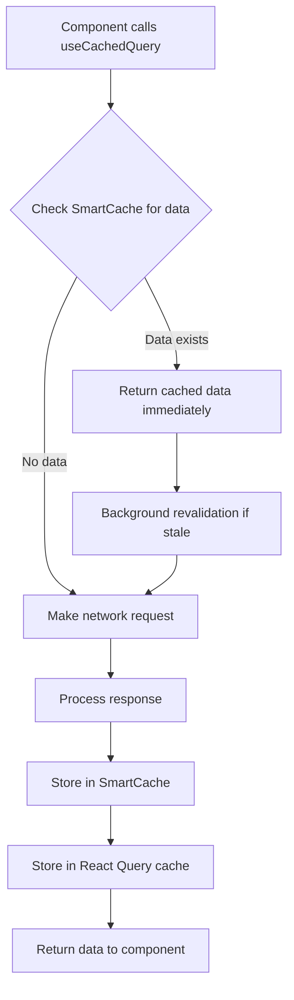

# Query Integration with TanStack Query

<cite>
**Referenced Files in This Document**   
- [useApiCache.ts](file://src/hooks/useApiCache.ts)
- [api-cache.ts](file://src/lib/api-cache.ts)
- [cache-config.ts](file://src/lib/cache-config.ts)
</cite>

## Table of Contents

1. [Introduction](#introduction)
2. [SmartCache and TanStack Query Integration](#smartcache-and-tanstack-query-integration)
3. [Data Flow and Stale-While-Revalidate Strategy](#data-flow-and-stale-while-revalidate-strategy)
4. [Cache Configuration and Parameters](#cache-configuration-and-parameters)
5. [Error Handling and Cache Consistency](#error-handling-and-cache-consistency)
6. [Performance Benefits](#performance-benefits)
7. [Usage Examples](#usage-examples)
8. [Parameter Tuning Guidance](#parameter-tuning-guidance)
9. [Conclusion](#conclusion)

## Introduction

The PORTAL application implements a sophisticated caching strategy that combines a custom SmartCache implementation with TanStack Query (formerly React Query) to optimize data fetching and improve application performance. This integration provides a stale-while-revalidate caching strategy that balances data freshness with responsiveness, reducing network requests while maintaining up-to-date information. The system is designed to handle various data types with different caching requirements, from frequently changing tasks to relatively static configuration parameters.

## SmartCache and TanStack Query Integration

The integration between SmartCache and TanStack Query is implemented through the `useCachedQuery` hook, which combines the strengths of both caching systems. The SmartCache provides persistent, in-memory caching with configurable TTL (time-to-live) and maxSize parameters, while TanStack Query manages the query state, automatic refetching, and cache invalidation.

The `useCachedQuery` function in the `api-cache.ts` file serves as the primary integration point, accepting parameters for endpoint, query parameters, data type, and caching options. It first checks the SmartCache for existing data before making a network request, implementing the stale-while-revalidate pattern. This approach ensures that users receive immediate feedback from the cache while the system silently updates with fresh data in the background.

**Section sources**

- [api-cache.ts](file://src/lib/api-cache.ts#L197-L247)
- [useApiCache.ts](file://src/hooks/useApiCache.ts#L163-L176)

## Data Flow and Stale-While-Revalidate Strategy

The data flow in the SmartCache-TanStack Query integration follows a specific sequence designed to maximize performance while ensuring data consistency. When a component calls `useCachedQuery`, the following steps occur:

1. The hook generates a cache key based on the endpoint and parameters
2. It checks the SmartCache for existing data with that key
3. If cached data exists and hasn't expired, it's returned immediately
4. If no valid cache entry exists, a network request is made to fetch fresh data
5. The response is stored in both SmartCache and TanStack Query's internal cache
6. Subsequent requests serve the cached data while background revalidation occurs

This stale-while-revalidate strategy ensures that users experience minimal loading times while the system maintains data freshness. The implementation uses a combination of TTL (time-to-live) values and garbage collection intervals to manage cache expiration and memory usage.



**Diagram sources**

- [api-cache.ts](file://src/lib/api-cache.ts#L223-L241)

## Cache Configuration and Parameters

The caching system employs different configuration parameters for various data types, optimizing performance based on data volatility and usage patterns. The configuration is defined in the `CACHE_CONFIGS` object in `api-cache.ts`, with specific settings for beneficiaries, donations, tasks, and other data types.

Key parameters include:

- **ttl**: Time-to-live in milliseconds, determining how long data remains valid
- **maxSize**: Maximum number of entries in the cache before LRU (least recently used) eviction
- **staleWhileRevalidate**: Boolean flag enabling stale-while-revalidate behavior
- **gcInterval**: Garbage collection interval for removing expired entries

For example, beneficiary data has a 5-minute TTL with a maximum cache size of 100 entries, while donation data has a 3-minute TTL with a maximum size of 50 entries. These configurations are automatically applied based on the dataType parameter passed to `useCachedQuery`.

**Section sources**

- [api-cache.ts](file://src/lib/api-cache.ts#L146-L177)

## Error Handling and Cache Consistency

The integration includes robust error handling to maintain cache consistency and provide a reliable user experience. When a network request fails, the system preserves any existing cached data rather than clearing the cache, ensuring that users can continue working with the most recent available information.

The system also implements automatic cache invalidation through the `useCachedMutation` hook, which invalidates related caches when data is modified. This ensures that stale data is not served after updates. The `invalidateRelatedCaches` function in `cache-config.ts` defines relationships between different data types, automatically invalidating dependent caches when primary data changes.

For example, when beneficiary data is updated, the system invalidates not only the beneficiary cache but also related statistics and aid application caches. This maintains data consistency across the application without requiring manual cache management.

**Section sources**

- [useApiCache.ts](file://src/hooks/useApiCache.ts#L182-L205)
- [cache-config.ts](file://src/lib/cache-config.ts#L209-L276)

## Performance Benefits

The hybrid caching approach provides significant performance benefits for the PORTAL application:

1. **Reduced network requests**: By serving data from cache when possible, the system minimizes API calls, reducing server load and bandwidth usage
2. **Improved perceived performance**: Users receive immediate responses from the cache, creating a more responsive interface
3. **Optimized memory usage**: The LRU eviction policy and garbage collection ensure efficient memory utilization
4. **Background updates**: Data is silently refreshed in the background, providing up-to-date information without disrupting the user experience

The system also includes cache statistics and monitoring through the `useCacheStats` hook, allowing developers to analyze cache hit rates and optimize configurations. The periodic cleanup process removes expired entries, preventing memory bloat over time.

**Section sources**

- [api-cache.ts](file://src/lib/api-cache.ts#L322-L333)
- [useApiCache.ts](file://src/hooks/useApiCache.ts#L253-L276)

## Usage Examples

The integration supports various data types with specific usage patterns:

### Beneficiaries

```typescript
const { data, isLoading, error } = useCachedQuery({
  endpoint: '/api/beneficiaries',
  params: { status: 'active' },
  dataType: 'beneficiaries',
  staleTime: 5 * 60 * 1000, // 5 minutes
  gcTime: 10 * 60 * 1000, // 10 minutes
});
```

### Donations

```typescript
const { data, isLoading, error } = useCachedQuery({
  endpoint: '/api/donations',
  params: { year: 2023 },
  dataType: 'donations',
  staleTime: 3 * 60 * 1000, // 3 minutes
  gcTime: 10 * 60 * 1000, // 10 minutes,
});
```

### Tasks

```typescript
const { data, isLoading, error } = useCachedQuery({
  endpoint: '/api/tasks',
  params: { assignee: 'current' },
  dataType: 'tasks',
  staleTime: 2 * 60 * 1000, // 2 minutes
  gcTime: 5 * 60 * 1000, // 5 minutes,
});
```

These examples demonstrate how the same hook can be configured differently based on the data type and required freshness.

**Section sources**

- [useApiCache.ts](file://src/hooks/useApiCache.ts#L26-L63)

## Parameter Tuning Guidance

Optimal performance requires careful tuning of caching parameters based on data characteristics:

1. **High-frequency data** (tasks, messages): Use shorter TTL values (30 seconds to 2 minutes) with frequent garbage collection
2. **Moderate-frequency data** (beneficiaries, donations): Use medium TTL values (2-5 minutes) with standard garbage collection
3. **Low-frequency data** (parameters, configuration): Use longer TTL values (10+ minutes) with infrequent garbage collection

The `staleTime` and `gcTime` parameters in TanStack Query should align with the SmartCache TTL and gcInterval settings. Generally, `gcTime` should be longer than `staleTime` to allow for background revalidation. The `maxSize` parameter should be set based on expected data volume and memory constraints.

For critical data, consider enabling `refetchOnWindowFocus` to ensure freshness when users return to the application. For less critical data, disable this option to reduce unnecessary network requests.

**Section sources**

- [cache-config.ts](file://src/lib/cache-config.ts#L62-L182)

## Conclusion

The integration between SmartCache and TanStack Query in PORTAL provides a robust, flexible caching solution that significantly enhances application performance. By combining persistent in-memory caching with sophisticated query management, the system delivers fast response times while maintaining data consistency. The configurable nature of the implementation allows for optimization across different data types and usage patterns, making it adaptable to evolving requirements. This hybrid approach represents a best practice in frontend caching, balancing performance, reliability, and maintainability.
