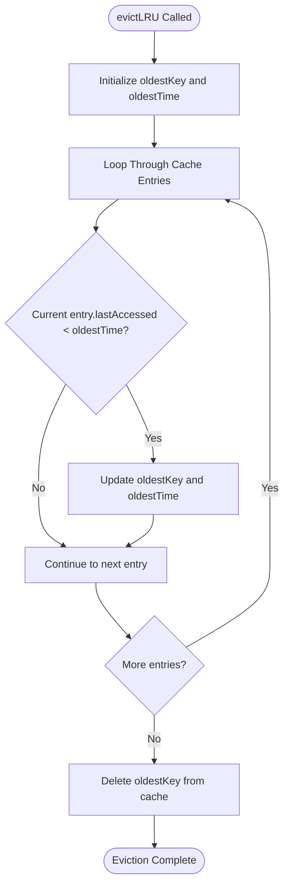
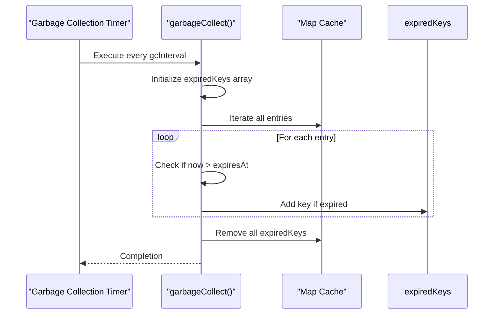
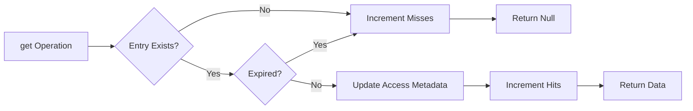

# SmartCache Implementation

<cite>
**Referenced Files in This Document**   
- [api-cache.ts](file://src/lib/api-cache.ts)
- [cache-config.ts](file://src/lib/cache-config.ts)
- [persistent-cache.ts](file://src/lib/persistent-cache.ts)
</cite>

## Table of Contents

1. [Introduction](#introduction)
2. [Core Components](#core-components)
3. [LRU Eviction Strategy](#lru-eviction-strategy)
4. [TTL-Based Expiration](#ttl-based-expiration)
5. [Periodic Garbage Collection](#periodic-garbage-collection)
6. [CacheEntry Interface Structure](#cacheentry-interface-structure)
7. [Cache Statistics Tracking](#cache-statistics-tracking)
8. [Thread Safety and Memory Management](#thread-safety-and-memory-management)
9. [Performance Implications](#performance-implications)
10. [Cache Configuration Guidance](#cache-configuration-guidance)
11. [Troubleshooting Common Issues](#troubleshooting-common-issues)

## Introduction

The SmartCache class in PORTAL provides an advanced in-memory caching solution designed to optimize API response performance through intelligent eviction policies, time-based expiration, and automated garbage collection. This implementation combines Least Recently Used (LRU) eviction with Time-to-Live (TTL) based expiration to ensure optimal cache utilization while maintaining data freshness. The system is designed to handle various data types with configurable cache settings, making it suitable for both frequently changing real-time data and relatively static configuration information.

**Section sources**

- [api-cache.ts](file://src/lib/api-cache.ts#L30-L143)

## Core Components

The SmartCache implementation consists of several key components that work together to provide efficient caching capabilities. At its core, the SmartCache class implements the APIResponseCache interface, providing standard cache operations such as get, set, delete, and clear. The cache uses a Map data structure to store entries with O(1) lookup performance, while maintaining statistics for monitoring cache effectiveness. The system also includes periodic garbage collection to remove expired entries and prevent memory leaks.

```mermaid
classDiagram
class SmartCache~T~ {
-cache : Map~string, CacheEntry~T~~
-config : CacheConfig
-stats : {hits : number, misses : number}
-gcTimer : NodeJS.Timeout
+get(key : string) : T | null
+set(key : string, data : T, ttl? : number) : void
+delete(key : string) : void
+clear() : void
+size() : number
+getStats() : {hits : number, misses : number, hitRate : number}
-evictLRU() : void
-startGarbageCollection() : void
-garbageCollect() : void
+destroy() : void
}
class CacheEntry~T~ {
+data : T
+timestamp : number
+expiresAt : number
+accessCount : number
+lastAccessed : number
}
class CacheConfig {
+ttl : number
+maxSize : number
+staleWhileRevalidate : boolean
+gcInterval : number
}
SmartCache --> CacheEntry : "stores"
SmartCache --> CacheConfig : "uses"
```

**Diagram sources**

- [api-cache.ts](file://src/lib/api-cache.ts#L7-L29)

## LRU Eviction Strategy

The Least Recently Used (LRU) eviction strategy implemented in SmartCache ensures that when the cache reaches its maximum capacity, the least recently accessed entry is removed to make space for new entries. This approach prioritizes keeping frequently accessed data in the cache, improving overall hit rates. The evictLRU method iterates through all cache entries to identify the one with the earliest lastAccessed timestamp, which represents the least recently used entry. This implementation provides O(n) time complexity for eviction, where n is the number of entries in the cache.



**Diagram sources**

- [api-cache.ts](file://src/lib/api-cache.ts#L104-L117)

**Section sources**

- [api-cache.ts](file://src/lib/api-cache.ts#L104-L117)

## TTL-Based Expiration

Time-to-Live (TTL) based expiration ensures that cached data remains fresh by automatically invalidating entries after a specified duration. When an entry is added to the cache via the set method, its expiresAt property is calculated as the current timestamp plus the TTL value (either provided as a parameter or taken from the cache configuration). During subsequent get operations, the system checks whether the current time exceeds the entry's expiresAt value. If so, the entry is considered expired, removed from the cache, and treated as a cache miss. This mechanism prevents stale data from being served to clients.

**Section sources**

- [api-cache.ts](file://src/lib/api-cache.ts#L50-L54)

## Periodic Garbage Collection

To prevent memory leaks from expired entries that are never accessed again, SmartCache implements a periodic garbage collection mechanism. The startGarbageCollection method sets up a timer that invokes the garbageCollect method at regular intervals defined by the gcInterval configuration parameter. The garbageCollect method iterates through all cache entries, identifying those whose expiresAt timestamp has passed. These expired entries are collected into an array and subsequently removed from the cache. This background cleanup process ensures that the cache size remains within reasonable bounds even when expired entries are not accessed.



**Diagram sources**

- [api-cache.ts](file://src/lib/api-cache.ts#L120-L137)

## CacheEntry Interface Structure

The CacheEntry interface defines the structure of each entry stored in the SmartCache. It contains several key properties that enable the cache's functionality: data stores the actual cached value of generic type T; timestamp records when the entry was created; expiresAt specifies when the entry should be considered expired; accessCount tracks how many times the entry has been accessed; and lastAccessed records the most recent access time, which is crucial for the LRU eviction algorithm. These fields work together to support both the TTL expiration and LRU eviction mechanisms.

**Section sources**

- [api-cache.ts](file://src/lib/api-cache.ts#L13-L19)

## Cache Statistics Tracking

SmartCache maintains detailed statistics to monitor cache performance and effectiveness. The stats object tracks hits (successful retrievals) and misses (failed retrievals or expired entries). The getStats method calculates the hit rate as the ratio of hits to total accesses (hits + misses), providing a valuable metric for assessing cache efficiency. These statistics are updated synchronously during get operations—incrementing the misses counter when an entry is not found or has expired, and incrementing the hits counter when a valid entry is successfully retrieved.



**Section sources**

- [api-cache.ts](file://src/lib/api-cache.ts#L95-L102)

## Thread Safety and Memory Management

While JavaScript's single-threaded nature eliminates traditional race conditions, SmartCache employs several memory management practices to ensure stability. The cache uses a Map for O(1) operations and automatically cleans up expired entries through periodic garbage collection. The destroy method properly cleans up the garbage collection timer to prevent memory leaks. For applications requiring concurrent access patterns, the cache operations are designed to be atomic within the JavaScript event loop, ensuring consistent state. The implementation also includes safeguards against unbounded growth through the maxSize limit and automatic expiration of stale entries.

**Section sources**

- [api-cache.ts](file://src/lib/api-cache.ts#L139-L142)

## Performance Implications

The performance characteristics of SmartCache vary based on configuration parameters. Smaller maxSize values reduce memory usage but may result in lower hit rates due to more frequent evictions. Shorter TTL values ensure fresher data but increase the likelihood of cache misses. The gcInterval parameter represents a trade-off between memory efficiency and CPU usage—more frequent garbage collection removes expired entries sooner but consumes more processing time. For high-traffic applications, the O(n) complexity of the LRU eviction and garbage collection processes should be considered, as these operations scale linearly with cache size.

**Section sources**

- [api-cache.ts](file://src/lib/api-cache.ts#L8-L11)

## Cache Configuration Guidance

The SmartCache implementation includes predefined configurations for different data types, balancing freshness and performance requirements. For frequently changing data like tasks and messages, shorter TTL values (2-3 minutes) and more frequent garbage collection (1-2 minute intervals) are recommended. For relatively stable data such as beneficiaries and donations, longer TTL values (5-10 minutes) can improve hit rates. Configuration should consider the data's volatility, access patterns, and business requirements. The staleWhileRevalidate flag can be enabled for critical data to serve stale content while revalidating in the background, improving perceived performance.

**Section sources**

- [api-cache.ts](file://src/lib/api-cache.ts#L146-L177)

## Troubleshooting Common Issues

Common issues with SmartCache typically involve cache thrashing or memory leaks. Cache thrashing occurs when the hit rate is low due to inappropriate TTL settings or insufficient maxSize values; this can be mitigated by analyzing access patterns and adjusting configuration accordingly. Memory leaks may occur if the destroy method is not called when the cache is no longer needed; always ensure proper cleanup in component unmount handlers. Monitoring the hitRate statistic can help identify configuration issues—values below 50% suggest the cache may not be effectively reducing database or API calls. For debugging, the getStats method provides essential metrics for evaluating cache performance.

**Section sources**

- [api-cache.ts](file://src/lib/api-cache.ts#L95-L102)
