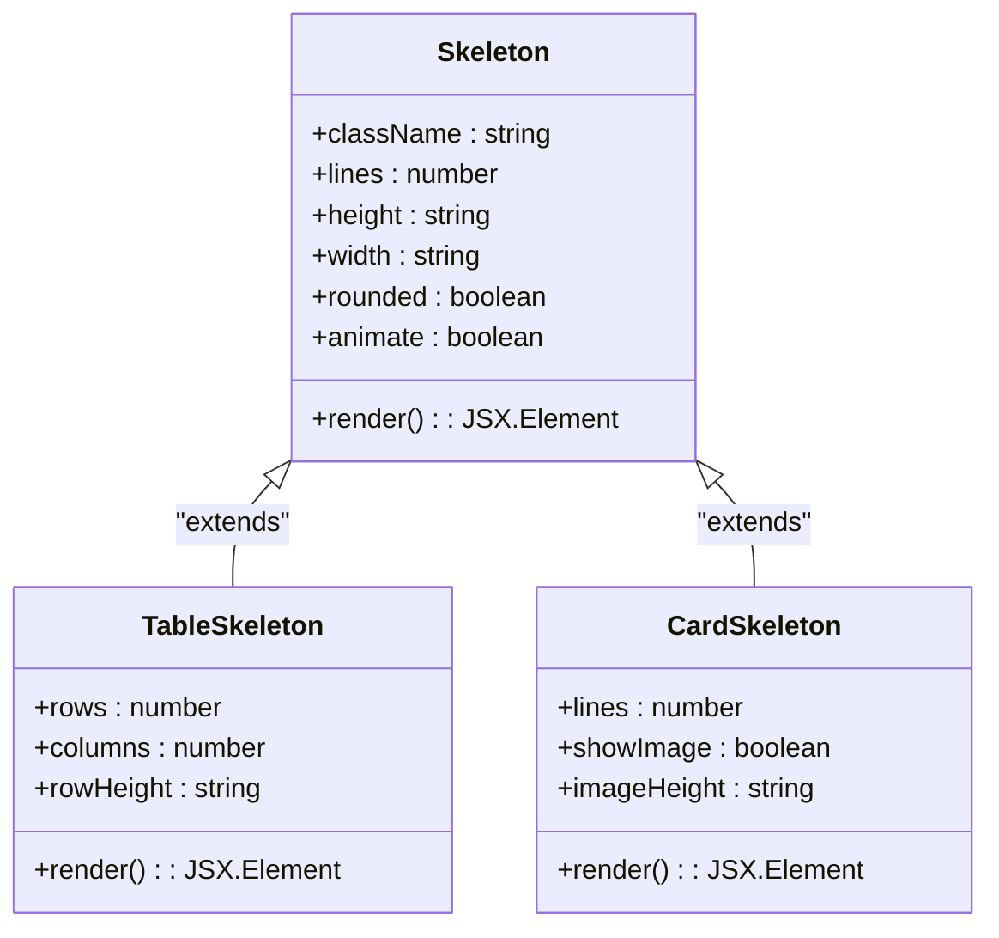
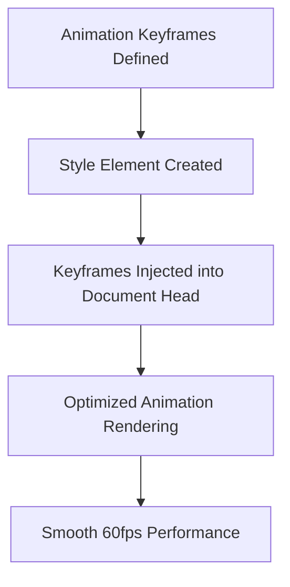
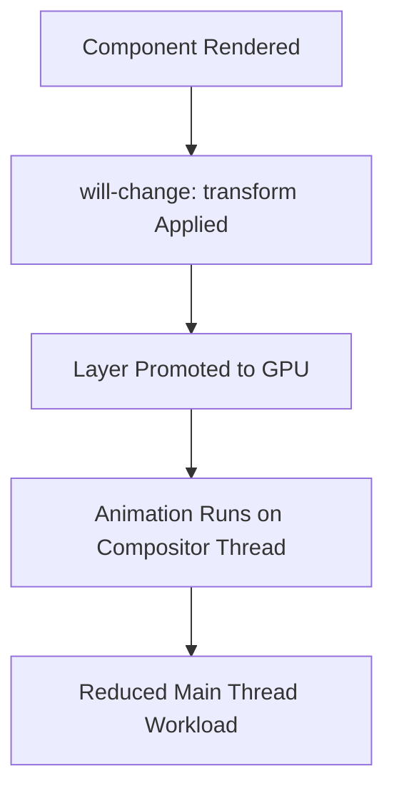
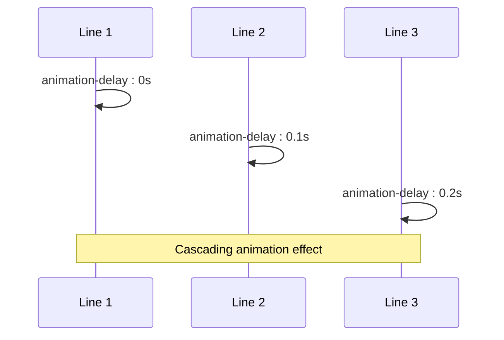
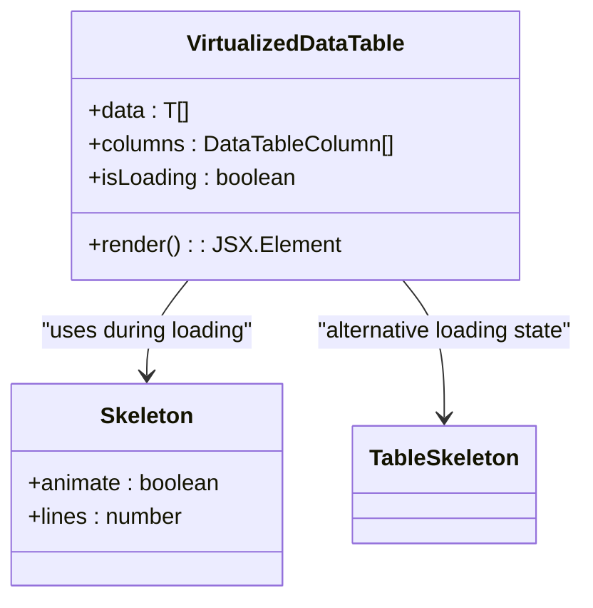
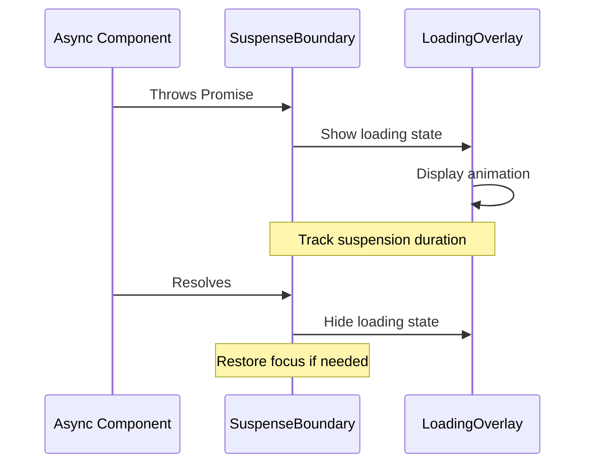
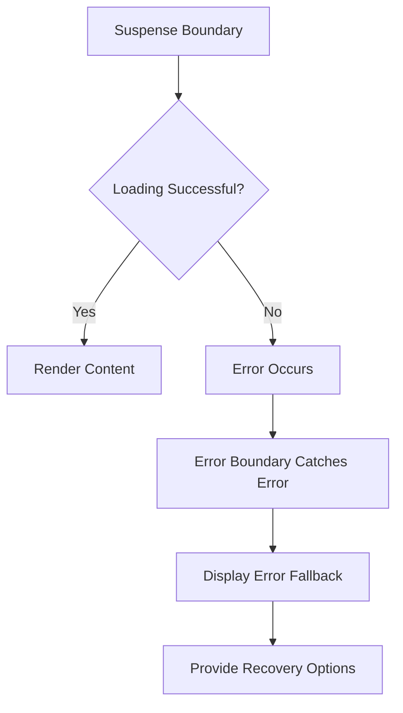

# Loading States and Skeleton Screens

<cite>
**Referenced Files in This Document**   
- [skeleton-optimized.tsx](file://src/components/ui/skeleton-optimized.tsx)
- [suspense-boundary.tsx](file://src/components/ui/suspense-boundary.tsx)
- [virtualized-data-table.tsx](file://src/components/ui/virtualized-data-table.tsx)
- [loading-overlay.tsx](file://src/components/ui/loading-overlay.tsx)
- [error-boundary.tsx](file://src/components/ui/error-boundary.tsx)
- [utils.ts](file://src/lib/utils.ts)
</cite>

## Table of Contents

1. [Introduction](#introduction)
2. [Core Skeleton Components](#core-skeleton-components)
3. [Performance Optimizations](#performance-optimizations)
4. [Integration with Virtualized Components](#integration-with-virtualized-components)
5. [Suspense and Error Boundary Integration](#suspense-and-error-boundary-integration)
6. [Customization and Accessibility](#customization-and-accessibility)
7. [Best Practices](#best-practices)

## Introduction

This document details the implementation of loading states and skeleton screens in PORTAL, focusing on optimized components that enhance perceived performance during data loading. The system leverages React Suspense, error boundaries, and high-performance skeleton components to provide seamless user experiences. The architecture emphasizes performance optimization through CSS animation injection, hardware acceleration, and staggered rendering.

## Core Skeleton Components

The PORTAL application implements three primary skeleton components for different use cases: `Skeleton`, `TableSkeleton`, and `CardSkeleton`. These components provide visual feedback during data loading operations while maintaining optimal performance characteristics.

**Diagram sources**

- [skeleton-optimized.tsx](file://src/components/ui/skeleton-optimized.tsx#L15-L67)
- [skeleton-optimized.tsx](file://src/components/ui/skeleton-optimized.tsx#L70-L119)
- [skeleton-optimized.tsx](file://src/components/ui/skeleton-optimized.tsx#L122-L151)

**Section sources**

- [skeleton-optimized.tsx](file://src/components/ui/skeleton-optimized.tsx#L15-L151)

## Performance Optimizations

The skeleton components implement several performance optimizations to ensure smooth rendering and minimal impact on application performance.

### CSS Animation Injection

The system injects optimized CSS keyframes directly into the document head to ensure animation performance. This approach avoids the overhead of CSS-in-JS solutions and ensures that animations run on the compositor thread.

**Diagram sources**

- [skeleton-optimized.tsx](file://src/components/ui/skeleton-optimized.tsx#L155-L171)

### Hardware Acceleration with will-change

All skeleton components utilize the `will-change` CSS property with `transform` to promote layers to their own compositing layers. This optimization ensures that animations run smoothly by leveraging GPU acceleration.

**Diagram sources**

- [skeleton-optimized.tsx](file://src/components/ui/skeleton-optimized.tsx#L37-L39)
- [skeleton-optimized.tsx](file://src/components/ui/skeleton-optimized.tsx#L60-L62)
- [skeleton-optimized.tsx](file://src/components/ui/skeleton-optimized.tsx#L102-L104)

### Staggered Animation Delays

For multi-line skeletons, staggered animation delays create a more natural loading effect while maintaining performance. Each line animates with a slight delay from the previous line, creating a cascading effect.

**Diagram sources**

- [skeleton-optimized.tsx](file://src/components/ui/skeleton-optimized.tsx#L61)
- [loading-overlay.tsx](file://src/components/ui/loading-overlay.tsx#L56)

**Section sources**

- [skeleton-optimized.tsx](file://src/components/ui/skeleton-optimized.tsx#L15-L67)
- [loading-overlay.tsx](file://src/components/ui/loading-overlay.tsx#L49-L80)

## Integration with Virtualized Components

The skeleton components are designed to work seamlessly with virtualized components like `VirtualizedDataTable`, ensuring consistent loading experiences across different data presentation patterns.

### Virtualized Data Table Integration

When the `VirtualizedDataTable` component is in a loading state, it renders optimized skeleton rows that match the virtualization pattern. This approach maintains the perceived performance benefits of virtualization while providing appropriate loading feedback.

**Diagram sources**

- [virtualized-data-table.tsx](file://src/components/ui/virtualized-data-table.tsx#L119-L127)
- [skeleton-optimized.tsx](file://src/components/ui/skeleton-optimized.tsx#L70-L119)

### Memory Efficiency

The integration between skeleton components and virtualized tables ensures memory efficiency by only rendering skeleton elements for visible rows. This approach prevents unnecessary DOM nodes from being created during loading states.

**Section sources**

- [virtualized-data-table.tsx](file://src/components/ui/virtualized-data-table.tsx#L119-L127)
- [skeleton-optimized.tsx](file://src/components/ui/skeleton-optimized.tsx#L70-L119)

## Suspense and Error Boundary Integration

The loading state system integrates with React Suspense and error boundaries to provide a comprehensive handling solution for asynchronous operations and error conditions.

### Suspense Boundary Implementation

The `SuspenseBoundary` component wraps asynchronous operations and provides appropriate loading feedback through the `LoadingOverlay` component. It also tracks suspension duration for performance monitoring.

**Diagram sources**

- [suspense-boundary.tsx](file://src/components/ui/suspense-boundary.tsx#L75-L102)
- [loading-overlay.tsx](file://src/components/ui/loading-overlay.tsx#L16-L141)

### Error Boundary Integration

Error boundaries work in conjunction with suspense boundaries to handle both loading and error states. When an error occurs during data loading, the error boundary provides appropriate fallback UI and error recovery options.

**Diagram sources**

- [suspense-boundary.tsx](file://src/components/ui/suspense-boundary.tsx#L86-L88)
- [error-boundary.tsx](file://src/components/ui/error-boundary.tsx#L24-L59)

**Section sources**

- [suspense-boundary.tsx](file://src/components/ui/suspense-boundary.tsx#L75-L116)
- [error-boundary.tsx](file://src/components/ui/error-boundary.tsx#L24-L59)

## Customization and Accessibility

The skeleton component system supports customization while maintaining accessibility standards.

### Custom Skeleton Variants

Developers can create custom skeleton variants by combining existing components or extending their functionality. The system provides flexible props for adjusting dimensions, animation behavior, and visual appearance.

**Section sources**

- [skeleton-optimized.tsx](file://src/components/ui/skeleton-optimized.tsx#L15-L151)

### Accessibility Considerations

The loading states implement proper accessibility attributes to ensure screen reader compatibility and keyboard navigation support.

- `aria-live="polite"` on loading overlays to announce loading states
- `aria-busy="true"` to indicate content is being loaded
- `role="status"` to identify loading indicators
- Screen reader only text ("Yükleniyor...") for non-visual users

**Section sources**

- [loading-overlay.tsx](file://src/components/ui/loading-overlay.tsx#L131-L134)

## Best Practices

### Animation Performance Optimization

To maintain optimal animation performance across devices, follow these guidelines:

1. Use the `motion-reduce` media query to disable animations for users who prefer reduced motion
2. Limit the number of simultaneously animating elements
3. Use hardware-accelerated CSS properties (`transform`, `opacity`)
4. Avoid animating properties that trigger layout or paint

### Responsive Skeleton Design

Design skeleton components to be responsive and adapt to different screen sizes and device capabilities. Use relative units (percentages, ems) rather than fixed pixels when possible.

### Testing Loading States

Implement comprehensive testing for loading states, including:

- Visual regression testing
- Performance testing under various network conditions
- Accessibility testing with screen readers
- Cross-browser compatibility testing

**Section sources**

- [skeleton-optimized.tsx](file://src/components/ui/skeleton-optimized.tsx)
- [suspense-boundary.tsx](file://src/components/ui/suspense-boundary.tsx)
- [virtualized-data-table.tsx](file://src/components/ui/virtualized-data-table.tsx)
- [loading-overlay.tsx](file://src/components/ui/loading-overlay.tsx)
- [error-boundary.tsx](file://src/components/ui/error-boundary.tsx)
- [utils.ts](file://src/lib/utils.ts)
