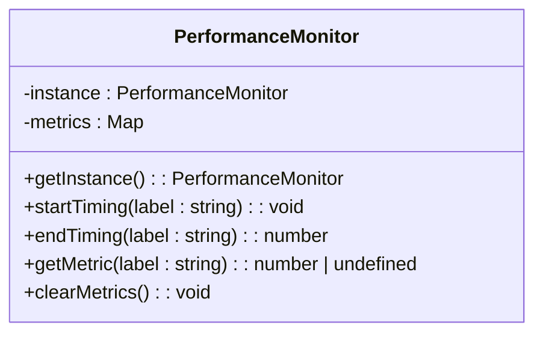
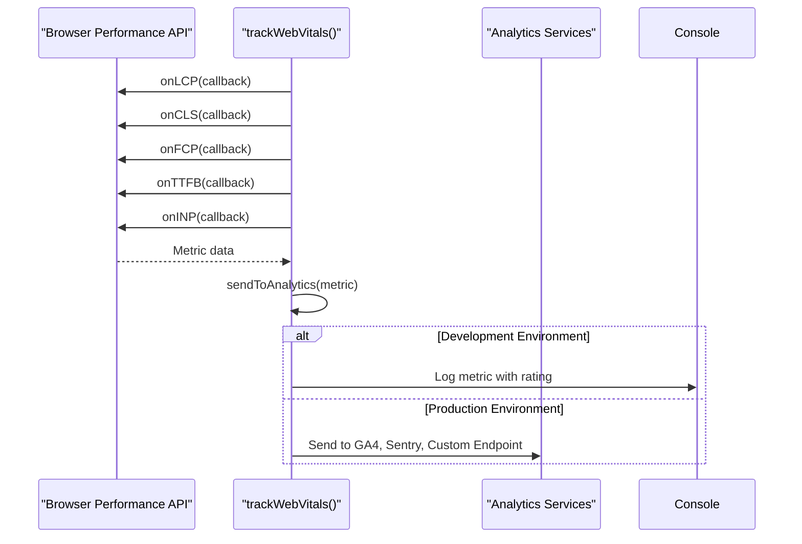
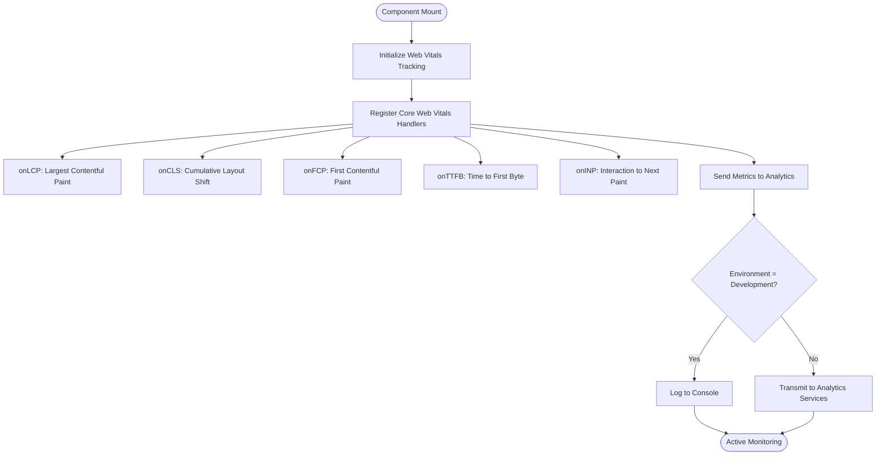
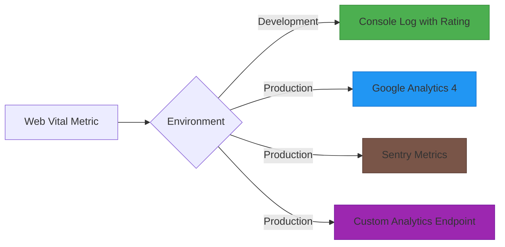

# Performance Monitoring and Analytics

<cite>
**Referenced Files in This Document**   
- [performance.ts](file://src/lib/performance.ts)
- [WebVitalsTracker.tsx](file://src/components/analytics/WebVitalsTracker.tsx)
- [web-vitals.ts](file://src/lib/performance/web-vitals.ts)
- [performance.test.ts](file://src/__tests__/lib/performance.test.ts)
</cite>

## Table of Contents

1. [Introduction](#introduction)
2. [PerformanceMonitor Class Implementation](#performancemonitor-class-implementation)
3. [Web Vitals Reporting System](#web-vitals-reporting-system)
4. [WebVitalsTracker Component](#webvitalstracker-component)
5. [Analytics Integration and Environment Handling](#analytics-integration-and-environment-handling)
6. [Performance Optimization and Monitoring](#performance-optimization-and-monitoring)
7. [Custom Performance Markers and Budgets](#custom-performance-markers-and-budgets)

## Introduction

The PORTAL application implements a comprehensive performance monitoring system to track both custom metrics and Core Web Vitals. This documentation details the implementation of the PerformanceMonitor class, the web vitals reporting system, and the integration between these components. The system enables developers to identify performance bottlenecks, measure optimization impact, and maintain production performance standards through detailed metrics collection and analytics integration.

## PerformanceMonitor Class Implementation

The PerformanceMonitor class provides a singleton pattern implementation for tracking custom performance metrics with start/end timing methods. It serves as a lightweight, reusable utility for measuring the duration of specific operations within the application.



**Diagram sources**

- [performance.ts](file://src/lib/performance.ts#L2-L41)

The class maintains a private Map to store timing data, with methods to:

- Start timing for a labeled operation using `startTiming()`
- End timing and calculate duration using `endTiming()`
- Retrieve specific metric values with `getMetric()`
- Clear all stored metrics with `clearMetrics()`

In development environments, timing results are logged to the console with a stopwatch emoji prefix for easy identification. The singleton pattern ensures consistent metric tracking across the application without creating multiple instances.

**Section sources**

- [performance.ts](file://src/lib/performance.ts#L2-L41)
- [performance.test.ts](file://src/__tests__/lib/performance.test.ts#L17-L64)

## Web Vitals Reporting System

The web vitals reporting system captures and logs Core Web Vitals metrics including LCP, FID, CLS, TTFB, and INP. Implemented in the `web-vitals.ts` file, this system uses the web-vitals library to measure key user experience indicators.



**Diagram sources**

- [web-vitals.ts](file://src/lib/performance/web-vitals.ts#L108-L135)

The system tracks the following metrics:

- **LCP (Largest Contentful Paint)**: Measures loading performance, should be < 2.5s
- **CLS (Cumulative Layout Shift)**: Measures visual stability, should be < 0.1
- **FCP (First Contentful Paint)**: Measures initial loading speed, should be < 1.8s
- **TTFB (Time to First Byte)**: Measures server responsiveness, should be < 800ms
- **INP (Interaction to Next Paint)**: Measures responsiveness, should be < 200ms

Each metric is evaluated against performance thresholds to determine a rating of "good", "needs-improvement", or "poor" based on established web performance guidelines.

**Section sources**

- [web-vitals.ts](file://src/lib/performance/web-vitals.ts#L7-L165)
- [performance.test.ts](file://src/__tests__/lib/performance.test.ts#L1-L169)

## WebVitalsTracker Component

The WebVitalsTracker component is a client-side React component that integrates the web vitals tracking system into the application's rendering tree. Implemented as a zero-render component, it activates performance monitoring when mounted.



**Diagram sources**

- [WebVitalsTracker.tsx](file://src/components/analytics/WebVitalsTracker.tsx#L10-L16)

The component uses the `useEffect` hook to call `trackWebVitals()` when the component mounts, ensuring that performance monitoring begins as soon as the component is rendered. Since the component returns null, it does not produce any visible UI elements, serving purely as a functional wrapper for performance instrumentation.

**Section sources**

- [WebVitalsTracker.tsx](file://src/components/analytics/WebVitalsTracker.tsx#L1-L19)
- [web-vitals.ts](file://src/lib/performance/web-vitals.ts#L108-L135)

## Analytics Integration and Environment Handling

The performance monitoring system implements environment-specific behavior for logging and analytics integration. In development environments, metrics are logged to the console with detailed formatting, while in production they are transmitted to configured analytics services.

The system supports multiple analytics destinations:

- **Google Analytics 4**: Metrics are sent as events with appropriate categories and labels
- **Sentry**: Performance metrics are sent as distribution metrics for monitoring
- **Custom Analytics Endpoint**: Configurable via NEXT_PUBLIC_ANALYTICS_ENDPOINT environment variable



**Diagram sources**

- [web-vitals.ts](file://src/lib/performance/web-vitals.ts#L20-L84)
- [performance.ts](file://src/lib/performance.ts#L28-L30)

The `sendToAnalytics` function handles the routing of metrics based on environment and configuration, using the `keepalive` option for fetch requests to ensure metrics are transmitted even during page navigation or unloading.

**Section sources**

- [web-vitals.ts](file://src/lib/performance/web-vitals.ts#L20-L84)
- [performance.ts](file://src/lib/performance.ts#L28-L30)

## Performance Optimization and Monitoring

The implemented performance monitoring system enables teams to identify bottlenecks, track optimization impact, and maintain production performance standards. By collecting both Core Web Vitals and custom metrics, the system provides comprehensive insights into application performance.

For bottleneck identification, developers can use the PerformanceMonitor class to wrap suspected slow operations:

```typescript
const monitor = PerformanceMonitor.getInstance();
monitor.startTiming('data-processing');
// ... potentially slow operation
const duration = monitor.endTiming('data-processing');
```

To measure optimization impact, teams can compare metrics before and after implementing changes, using the consistent naming and storage mechanisms provided by the system. Production monitoring is enhanced by the transmission of metrics to external analytics services, enabling long-term trend analysis and alerting.

**Section sources**

- [performance.ts](file://src/lib/performance.ts#L14-L33)
- [web-vitals.ts](file://src/lib/performance/web-vitals.ts#L87-L103)

## Custom Performance Markers and Budgets

The system supports the creation of custom performance markers and measurements through the `createPerformanceMark`, `measurePerformance`, and `getPerformanceMarks` functions. These utilities allow developers to define custom performance checkpoints and measure durations between them.

To add custom performance markers:

1. Create marks at key points in the code flow:

```typescript
createPerformanceMark('component-start');
// ... code execution
createPerformanceMark('component-end');
```

2. Measure the duration between marks:

```typescript
const duration = measurePerformance('component-load', 'component-start', 'component-end');
```

Performance budgets can be established by setting thresholds for key metrics and monitoring compliance through the analytics dashboard. The rating system already implemented for Core Web Vitals (good, needs-improvement, poor) can serve as a model for establishing custom budget categories for application-specific metrics.

**Section sources**

- [web-vitals.ts](file://src/lib/performance/web-vitals.ts#L141-L164)
- [performance.ts](file://src/lib/performance.ts#L14-L33)
