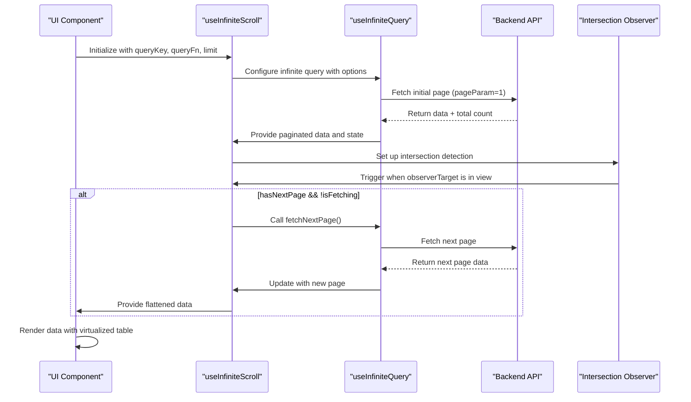
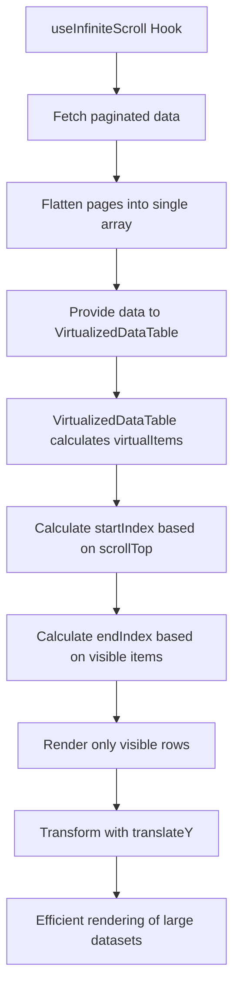

# Infinite Scroll Integration

<cite>
**Referenced Files in This Document**   
- [useInfiniteScroll.ts](file://src/hooks/useInfiniteScroll.ts)
- [virtualized-data-table.tsx](file://src/components/ui/virtualized-data-table.tsx)
- [page.tsx](file://src/app/(dashboard)/yardim/ihtiyac-sahipleri/page.tsx)
- [page.tsx](file://src/app/(dashboard)/bagis/liste/page.tsx)
</cite>

## Table of Contents

1. [Introduction](#introduction)
2. [Core Components](#core-components)
3. [Architecture Overview](#architecture-overview)
4. [Detailed Component Analysis](#detailed-component-analysis)
5. [Integration with VirtualizedDataTable](#integration-with-virtualizeddatatable)
6. [Performance Considerations](#performance-considerations)
7. [Troubleshooting Guide](#troubleshooting-guide)

## Introduction

The infinite scroll integration in PORTAL provides a seamless user experience for browsing large datasets without traditional pagination controls. This implementation leverages TanStack Query's `useInfiniteQuery` hook through a custom `useInfiniteScroll` abstraction, combined with Intersection Observer API for automatic page loading. The system is designed to efficiently handle large datasets by progressively loading data as users scroll, reducing initial load times and memory consumption while maintaining responsive UI performance.

## Core Components

The infinite scroll functionality in PORTAL is built around two primary components: the `useInfiniteScroll` custom hook that manages data fetching and pagination logic, and the `VirtualizedDataTable` component that renders large datasets efficiently. These components work together to provide a smooth scrolling experience with automatic data loading, proper state management, and performance optimizations for handling extensive datasets.

**Section sources**

- [useInfiniteScroll.ts](file://src/hooks/useInfiniteScroll.ts#L1-L124)
- [virtualized-data-table.tsx](file://src/components/ui/virtualized-data-table.tsx#L1-L313)

## Architecture Overview



**Diagram sources**

- [useInfiniteScroll.ts](file://src/hooks/useInfiniteScroll.ts#L34-L84)

## Detailed Component Analysis

### useInfiniteScroll Hook Analysis

The `useInfiniteScroll` hook serves as a wrapper around TanStack Query's `useInfiniteQuery`, providing a simplified interface for infinite scroll functionality with built-in Intersection Observer integration. The hook accepts configuration options including `limit` (default 20), `queryKey`, `queryFn`, and `initialPageParam` (default 1), making it reusable across different data types and views.

```mermaid
classDiagram
class UseInfiniteScrollOptions {
+limit : number
+queryKey : (string | number | Record)[]
+queryFn : (pageParam : number) => Promise<{ data : unknown[], total : number }>
+initialPageParam : number
}
class UseInfiniteScrollReturn {
+data : unknown[]
+total : number
+hasMore : boolean
+isLoading : boolean
+isFetchingNextPage : boolean
+ref : RefObject<HTMLDivElement>
+fetchNextPage : () => void
}
class UseInfiniteQuery {
+data : { pages : Page[] }
+fetchNextPage : () => void
+hasNextPage : boolean
+isFetching : boolean
+isFetchingNextPage : boolean
+isLoading : boolean
}
UseInfiniteScrollOptions <.. UseInfiniteScroll : "configures"
UseInfiniteScroll ..> UseInfiniteQuery : "wraps"
UseInfiniteQuery ..> UseInfiniteScrollReturn : "transforms to"
UseInfiniteScroll --> IntersectionObserver : "utilizes"
```

**Diagram sources**

- [useInfiniteScroll.ts](file://src/hooks/useInfiniteScroll.ts#L6-L11)
- [useInfiniteScroll.ts](file://src/hooks/useInfiniteScroll.ts#L76-L84)

#### Data Fetching and Pagination Logic

The hook leverages TanStack Query's `useInfiniteQuery` to manage the paginated data fetching process. The `queryFn` receives a `pageParam` and returns a promise with data and total count. The `getNextPageParam` function determines whether additional pages should be fetched by comparing the total fetched items (calculated as `lastPageParam * limit`) against the `lastPage.total`. When the total fetched is less than the total available, the next page parameter is returned; otherwise, it returns undefined, indicating no more pages are available.

The hook transforms the paginated response by flattening all pages into a single array using `flatMap` on `data.pages`, making it easier for components to iterate over all available data without managing pagination state directly. The total count is extracted from the first page's response, providing a consistent reference for the complete dataset size.

**Section sources**

- [useInfiniteScroll.ts](file://src/hooks/useInfiniteScroll.ts#L42-L55)
- [useInfiniteScroll.ts](file://src/hooks/useInfiniteScroll.ts#L73-L75)

#### Intersection Observer Integration

The hook implements automatic loading through the Intersection Observer API, which detects when a target element comes into the viewport. The `observerTarget` ref is provided as a return value, allowing parent components to attach it to a sentinel element at the end of the list. When this element becomes visible and there are more pages to load (`hasNextPage`) while not currently fetching (`!isFetching`), the `fetchNextPage` function is triggered automatically.

This implementation eliminates the need for manual "Load More" buttons while ensuring that additional data is only fetched when necessary, optimizing network usage and preventing unnecessary requests. The effect cleanup ensures proper observer disconnection when the component unmounts, preventing memory leaks.

**Section sources**

- [useInfiniteScroll.ts](file://src/hooks/useInfiniteScroll.ts#L58-L71)

#### Return Values and State Management

The hook returns a simplified interface that abstracts away the complexity of TanStack Query's infinite query response. Key return values include:

- `data`: Flattened array of all fetched items across pages
- `total`: Total count of available items from the first page response
- `hasMore`: Boolean indicating whether additional pages are available
- `isLoading`: Loading state for the initial fetch
- `isFetchingNextPage`: Loading state specifically for subsequent page fetches
- `ref`: Ref object for the intersection observer target
- `fetchNextPage`: Function to manually trigger next page fetch

This abstraction provides a clean API for components to consume, hiding the underlying pagination mechanics while exposing essential state for rendering loading indicators and determining scroll behavior.

**Section sources**

- [useInfiniteScroll.ts](file://src/hooks/useInfiniteScroll.ts#L76-L84)

## Integration with VirtualizedDataTable

The `useInfiniteScroll` hook integrates with the `VirtualizedDataTable` component to efficiently render large datasets. While the current implementation examples show direct use of `useQuery` with large limits, the infinite scroll pattern could be combined with virtualization for optimal performance with extremely large datasets.



**Diagram sources**

- [useInfiniteScroll.ts](file://src/hooks/useInfiniteScroll.ts#L73-L74)
- [virtualized-data-table.tsx](file://src/components/ui/virtualized-data-table.tsx#L59-L70)

The `VirtualizedDataTable` implements virtual scrolling by calculating which rows should be visible based on the current scroll position (`scrollTop`), container height, and row height. It determines a `startIndex` and `endIndex` to slice the data array, rendering only the visible items plus a buffer for smooth scrolling. The visible container is positioned using CSS transform with `translateY`, creating the illusion of a full table while only rendering a small subset of rows at any given time.

When integrated with infinite scroll, the flattened data from `useInfiniteScroll` would serve as the input to `VirtualizedDataTable`, allowing for progressive loading of additional data as the user scrolls near the end of the currently loaded dataset. This combination provides optimal performance for large datasets by minimizing both network payload and DOM nodes.

**Section sources**

- [virtualized-data-table.tsx](file://src/components/ui/virtualized-data-table.tsx#L59-L70)
- [virtualized-data-table.tsx](file://src/components/ui/virtualized-data-table.tsx#L246-L264)

## Performance Considerations

The infinite scroll implementation offers significant performance benefits over loading entire datasets at once, particularly for large collections. By fetching data in smaller chunks (default 20 items), the initial page load is faster, requiring less network bandwidth and reducing memory usage in the browser. This approach also improves perceived performance, as users can begin interacting with the first page of data immediately while subsequent pages load in the background.

Compared to traditional pagination, infinite scroll provides a more seamless user experience without disruptive page transitions or the need to click through multiple pages. However, it may lead to increased memory usage over time as more pages are loaded into memory, and users may find it difficult to navigate to specific records without search functionality.

The combination of infinite scroll with virtualized rendering represents the optimal approach for extremely large datasets, as it limits both the amount of data transferred over the network and the number of DOM elements rendered at any given time. This dual optimization ensures responsive performance even with tens of thousands of records.

**Section sources**

- [useInfiniteScroll.ts](file://src/hooks/useInfiniteScroll.ts#L7-L8)
- [virtualized-data-table.tsx](file://src/components/ui/virtualized-data-table.tsx#L35-L36)

## Troubleshooting Guide

Common issues with the infinite scroll implementation and their solutions include:

**Observer not triggering**: Ensure the `ref` from `useInfiniteScroll` is properly attached to a DOM element at the end of the list. Verify that the element has sufficient height to become visible in the viewport. Check that `hasNextPage` is true and `isFetching` is false when the observer should trigger.

**Stale data**: The hook relies on TanStack Query's caching mechanism. Ensure proper `queryKey` dependencies are included to invalidate the cache when relevant parameters change. Use the `refetch` function when manual refresh is needed.

**Performance issues with large datasets**: While infinite scroll reduces initial load, consider implementing virtualization for the rendered list when dealing with thousands of records. The current `VirtualizedDataTable` implementation already addresses this concern.

**TypeScript integration**: The hook uses generic types to ensure type safety across different data structures. When implementing, ensure the `queryFn` return type matches the expected data structure to maintain proper type inference throughout the component tree.

**Section sources**

- [useInfiniteScroll.ts](file://src/hooks/useInfiniteScroll.ts#L40-L41)
- [useInfiniteScroll.ts](file://src/hooks/useInfiniteScroll.ts#L59-L71)
- [virtualized-data-table.tsx](file://src/components/ui/virtualized-data-table.tsx#L57-L76)
