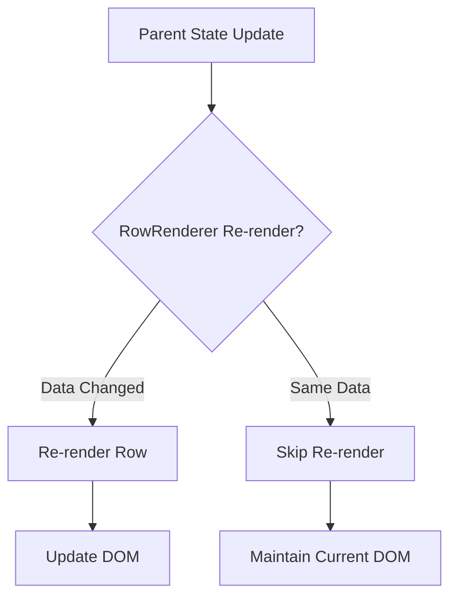
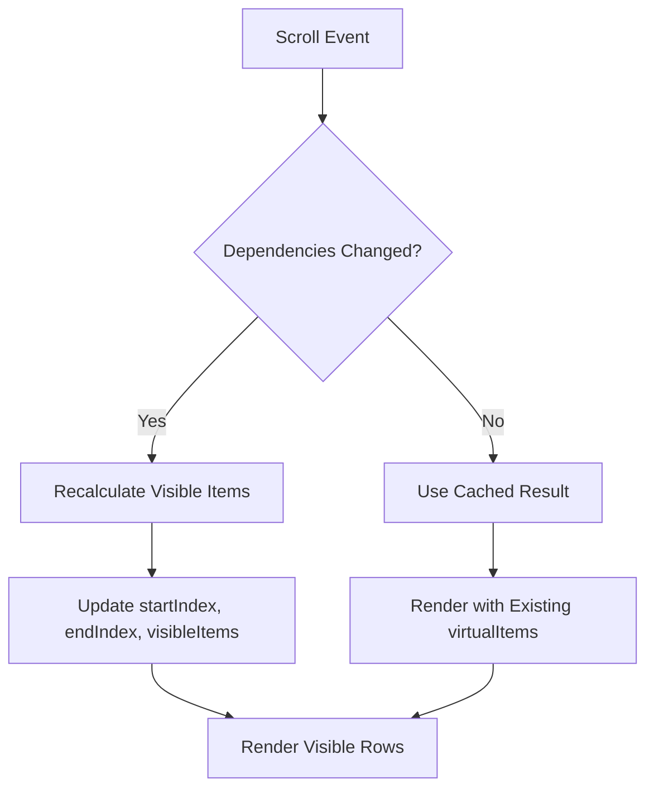
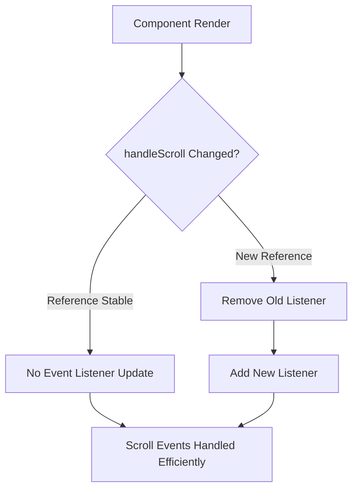
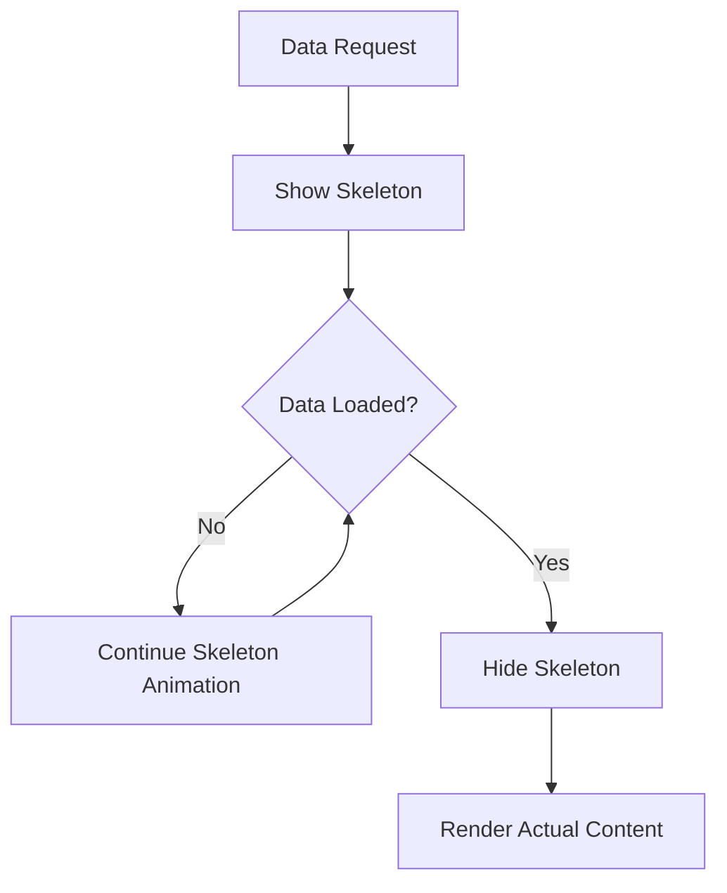
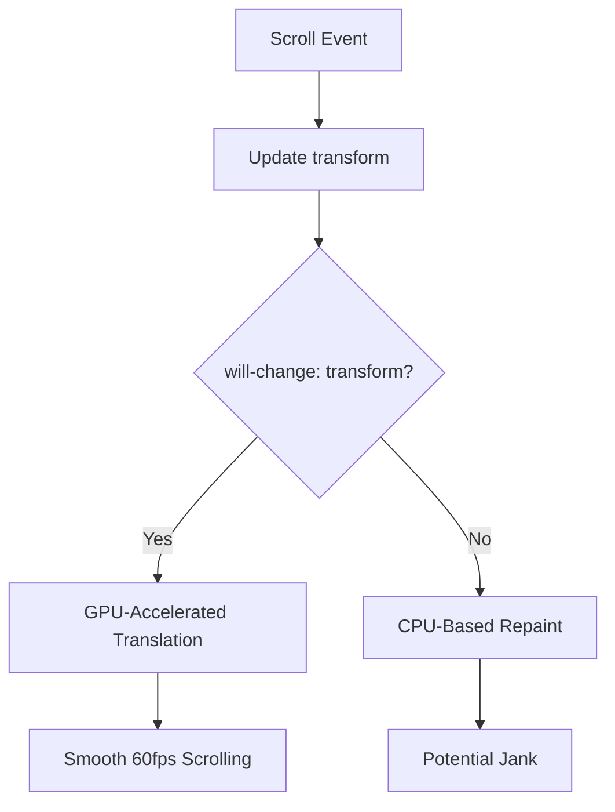
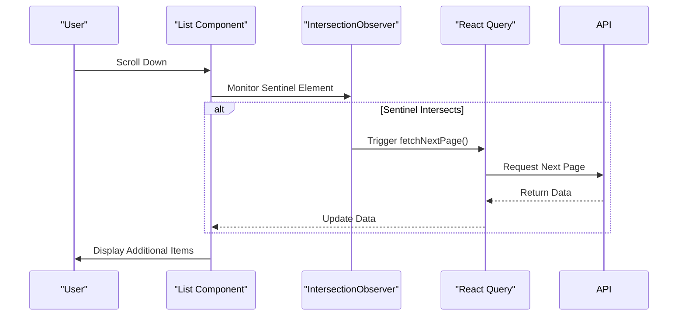
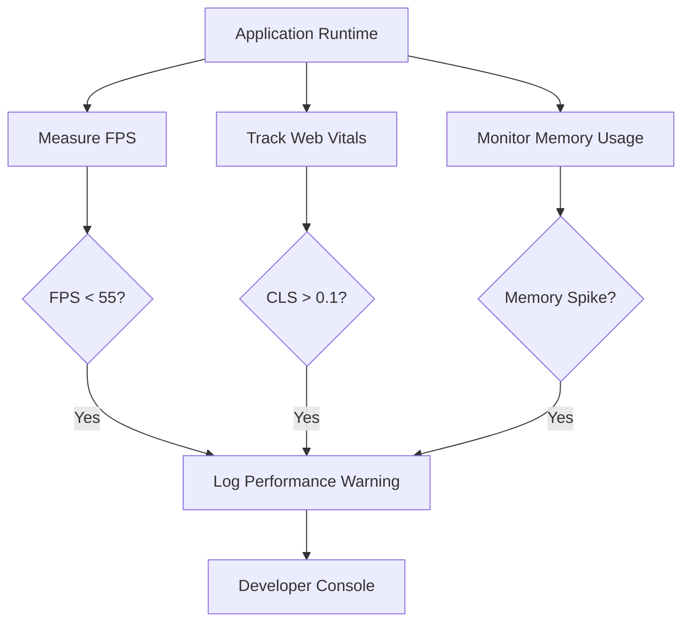

# Performance Optimizations

<cite>
**Referenced Files in This Document**   
- [virtualized-data-table.tsx](file://src/components/ui/virtualized-data-table.tsx)
- [useInfiniteScroll.ts](file://src/hooks/useInfiniteScroll.ts)
- [skeleton-optimized.tsx](file://src/components/ui/skeleton-optimized.tsx)
- [performance-monitor.tsx](file://src/lib/performance-monitor.tsx)
</cite>

## Table of Contents

1. [Virtualized Rendering System](#virtualized-rendering-system)
2. [React.memo for Row Optimization](#reactmemo-for-row-optimization)
3. [useMemo for Virtual Items Calculation](#usememo-for-virtual-items-calculation)
4. [useCallback for Scroll Handlers](#usecallback-for-scroll-handlers)
5. [Skeleton Loading States](#skeleton-loading-states)
6. [CSS Performance Optimizations](#css-performance-optimizations)
7. [Infinite Scroll Implementation](#infinite-scroll-implementation)
8. [Performance Monitoring](#performance-monitoring)
9. [Optimization Guidelines](#optimization-guidelines)

## Virtualized Rendering System

The PORTAL application implements a high-performance virtualized rendering system to handle large datasets efficiently. The virtualization strategy renders only visible table rows within the viewport, dramatically reducing DOM nodes and improving scroll performance. This approach calculates which rows are visible based on scroll position and renders only those items, maintaining smooth 60fps scrolling even with thousands of records. The system uses a buffer of additional rows above and below the visible area to prevent content flashing during rapid scrolling.

**Section sources**

- [virtualized-data-table.tsx](file://src/components/ui/virtualized-data-table.tsx#L59-L76)

## React.memo for Row Optimization

The virtualized data table implements React.memo to prevent unnecessary re-renders of table rows. The RowRenderer component is wrapped with React.memo, ensuring that individual rows only re-render when their specific data changes rather than on every parent state update. This optimization is critical for maintaining performance when scrolling through large datasets, as it prevents the entire visible subset of rows from being re-processed on each render cycle. The memoization compares props deeply to determine if a re-render is necessary, focusing specifically on the row data and index.

**Diagram sources**

- [virtualized-data-table.tsx](file://src/components/ui/virtualized-data-table.tsx#L79-L116)

**Section sources**

- [virtualized-data-table.tsx](file://src/components/ui/virtualized-data-table.tsx#L79-L116)

## useMemo for Virtual Items Calculation

The virtualized data table uses useMemo to optimize the calculation of visible items during scrolling. The virtualItems object, which determines which data elements should be rendered based on the current scroll position, is memoized to prevent recalculation on every render. This optimization is essential for scroll performance, as it avoids expensive array slicing and mathematical operations during scroll events. The memoization dependency array includes data, scrollTop, rowHeight, and containerHeight, ensuring recalculations only occur when these values change.

**Diagram sources**

- [virtualized-data-table.tsx](file://src/components/ui/virtualized-data-table.tsx#L59-L76)

**Section sources**

- [virtualized-data-table.tsx](file://src/components/ui/virtualized-data-table.tsx#L59-L76)

## useCallback for Scroll Handlers

The scroll event handler is optimized using useCallback to maintain a stable function reference across renders. This prevents unnecessary re-subscriptions to the scroll event and ensures consistent event handling behavior. The handleScroll function, which updates the scrollTop state based on the container's scroll position, is wrapped with useCallback with an empty dependency array since it only relies on the setScrollTop state setter. This optimization prevents the creation of new function instances on each render, reducing memory allocation and garbage collection overhead during scrolling.

**Diagram sources**

- [virtualized-data-table.tsx](file://src/components/ui/virtualized-data-table.tsx#L73-L76)

**Section sources**

- [virtualized-data-table.tsx](file://src/components/ui/virtualized-data-table.tsx#L73-L76)

## Skeleton Loading States

The application implements optimized skeleton loading states to maintain layout stability during data fetching. The loading state uses animated skeleton placeholders with the animate-pulse effect to provide visual feedback while content loads. These skeletons preserve the exact dimensions of the final content, preventing layout shifts when data arrives. The skeleton components are themselves optimized with memoization and efficient CSS animations to minimize performance impact during loading states. The table skeleton renders a fixed number of placeholder rows that match the expected row height and column structure.

**Diagram sources**

- [skeleton-optimized.tsx](file://src/components/ui/skeleton-optimized.tsx#L70-L120)
- [virtualized-data-table.tsx](file://src/components/ui/virtualized-data-table.tsx#L119-L129)

**Section sources**

- [skeleton-optimized.tsx](file://src/components/ui/skeleton-optimized.tsx#L70-L120)
- [virtualized-data-table.tsx](file://src/components/ui/virtualized-data-table.tsx#L119-L129)

## CSS Performance Optimizations

The virtualized container implements the will-change: transform CSS property to enable GPU acceleration of scrolling operations. This optimization instructs the browser to promote the container to its own compositor layer, allowing transform-based positioning to be handled by the GPU rather than the main thread. The transform property is used in conjunction with translateY to position the visible rows container, leveraging hardware acceleration for smooth scrolling performance. This approach minimizes layout recalculations and paint operations during scroll events, maintaining high frame rates even on lower-powered devices.

**Diagram sources**

- [virtualized-data-table.tsx](file://src/components/ui/virtualized-data-table.tsx#L251-L253)

**Section sources**

- [virtualized-data-table.tsx](file://src/components/ui/virtualized-data-table.tsx#L251-L253)

## Infinite Scroll Implementation

The infinite scroll functionality is implemented through the useInfiniteScroll hook, which combines Intersection Observer with React Query for efficient data fetching. The hook monitors a sentinel element at the bottom of the list and triggers data loading when it enters the viewport. This approach eliminates the need for pagination controls while ensuring data is fetched only when needed. The Intersection Observer API provides better performance than scroll event listeners by operating at the browser level with native optimizations, reducing JavaScript execution during scroll operations.

**Diagram sources**

- [useInfiniteScroll.ts](file://src/hooks/useInfiniteScroll.ts#L58-L71)

**Section sources**

- [useInfiniteScroll.ts](file://src/hooks/useInfiniteScroll.ts#L58-L71)

## Performance Monitoring

The application includes comprehensive performance monitoring tools to track and optimize rendering performance. The useFPSMonitor hook provides real-time frames-per-second tracking to identify performance bottlenecks during user interactions. Performance metrics are logged using the perfLog utility, which conditionally outputs to the console only in development mode to avoid production overhead. The PerformanceMonitor component tracks Core Web Vitals including Largest Contentful Paint, First Input Delay, and Cumulative Layout Shift, providing insights into user experience quality.

**Diagram sources**

- [performance-monitor.tsx](file://src/lib/performance-monitor.tsx#L234-L281)

**Section sources**

- [performance-monitor.tsx](file://src/lib/performance-monitor.tsx#L234-L281)

## Optimization Guidelines

For optimal performance with complex cell content in the virtualized table, follow these guidelines:

1. Keep cell rendering simple and avoid deeply nested components
2. Use React.memo for any custom cell components
3. Implement virtualization for images with lazy loading
4. Avoid inline functions and objects in cell renderers
5. Use CSS transforms rather than changing layout properties during scroll
6. Implement debounced search and filtering operations
7. Use windowing for extremely large datasets beyond what virtualization handles
8. Monitor FPS during development using the built-in performance tools
9. Test on lower-powered devices to ensure acceptable performance
10. Use the browser's Performance tab to identify specific bottlenecks

**Section sources**

- [virtualized-data-table.tsx](file://src/components/ui/virtualized-data-table.tsx)
- [performance-monitor.tsx](file://src/lib/performance-monitor.tsx)
