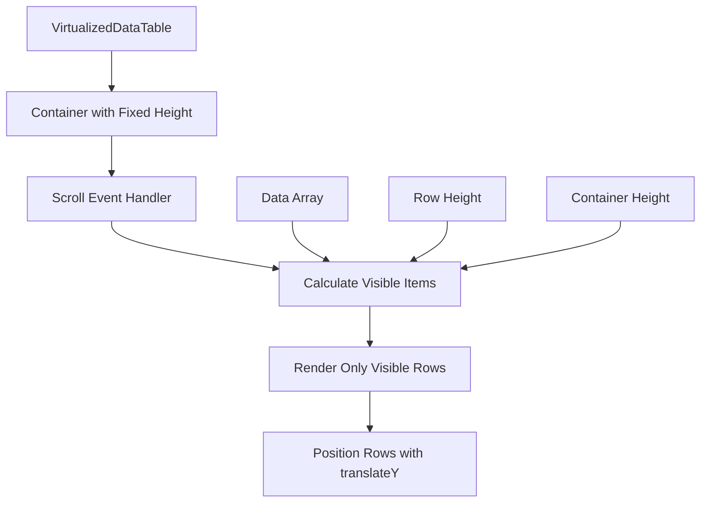
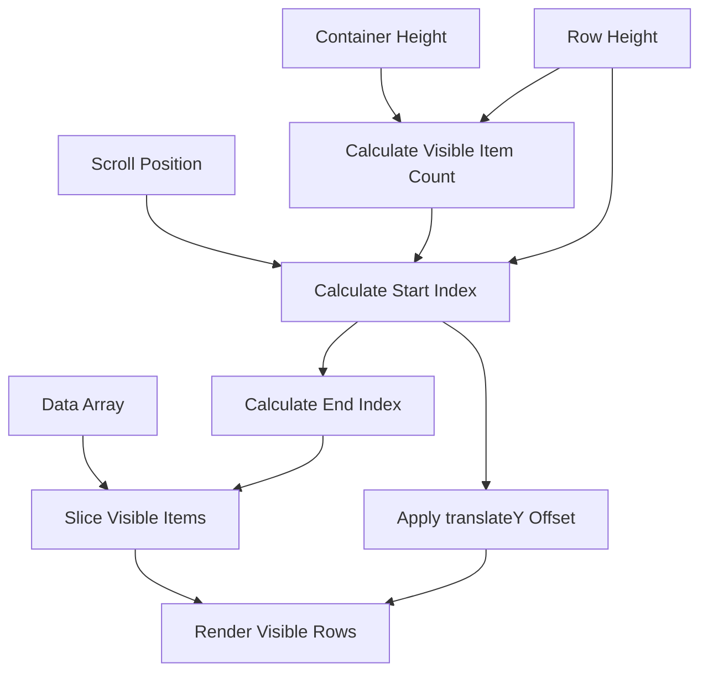
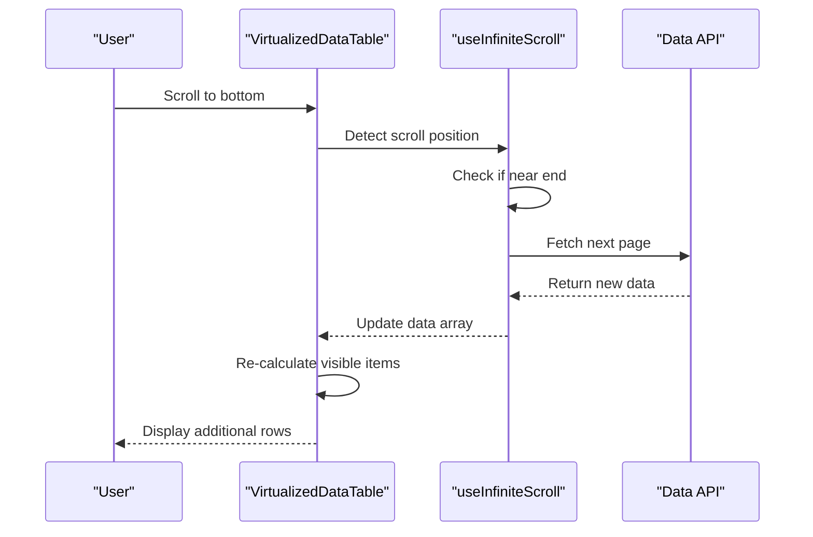

# Virtualized Rendering

<cite>
**Referenced Files in This Document**   
- [virtualized-data-table.tsx](file://src/components/ui/virtualized-data-table.tsx)
- [useInfiniteScroll.ts](file://src/hooks/useInfiniteScroll.ts)
</cite>

## Table of Contents

1. [Introduction](#introduction)
2. [VirtualizedDataTable Implementation](#virtualizeddatatable-implementation)
3. [Virtualization Algorithm](#virtualization-algorithm)
4. [Infinite Scrolling Integration](#infinite-scrolling-integration)
5. [Accessibility and Responsive Design](#accessibility-and-responsive-design)
6. [Performance Optimization](#performance-optimization)
7. [Configuration Guidelines](#configuration-guidelines)

## Introduction

The VirtualizedDataTable component in PORTAL implements windowing techniques to efficiently render large datasets by only displaying visible rows. This approach significantly improves performance by reducing the number of DOM elements and minimizing re-renders. The component combines virtual scrolling with infinite loading capabilities through the useInfiniteScroll hook, providing a seamless user experience when working with extensive data collections.

## VirtualizedDataTable Implementation

The VirtualizedDataTable component uses React's memoization and virtualization techniques to optimize rendering performance. It accepts a generic data array and column configuration to create a highly performant table that only renders visible rows based on the current scroll position.

**Diagram sources**

- [virtualized-data-table.tsx](file://src/components/ui/virtualized-data-table.tsx#L39-L312)

**Section sources**

- [virtualized-data-table.tsx](file://src/components/ui/virtualized-data-table.tsx#L39-L312)

## Virtualization Algorithm

The virtualization algorithm calculates which rows should be visible based on three key parameters: scroll position, container height, and row height. The implementation uses memoized calculations to prevent unnecessary recalculations during scrolling.

The algorithm works as follows:

1. Calculate the number of visible items: `Math.ceil(containerHeight / rowHeight)`
2. Determine the start index: `Math.max(0, Math.floor(scrollTop / rowHeight) - 5)`
3. Determine the end index: `Math.min(data.length - 1, startIndex + visibleItemCount + 10)`
4. Slice the data array to get only visible items
5. Apply a translateY transformation to position the visible rows correctly

This approach renders a buffer of rows above and below the visible area to prevent blank spaces during rapid scrolling, while still maintaining excellent performance.

**Diagram sources**

- [virtualized-data-table.tsx](file://src/components/ui/virtualized-data-table.tsx#L59-L76)

**Section sources**

- [virtualized-data-table.tsx](file://src/components/ui/virtualized-data-table.tsx#L59-L76)

## Infinite Scrolling Integration

The VirtualizedDataTable integrates with the useInfiniteScroll hook to support infinite scrolling functionality. This allows for loading additional data as the user scrolls, creating a seamless experience for large datasets.

The useInfiniteScroll hook uses Intersection Observer to detect when the user has scrolled near the end of the current dataset, automatically triggering the loading of additional pages. This integration allows the VirtualizedDataTable to handle datasets of any size efficiently.

**Diagram sources**

- [useInfiniteScroll.ts](file://src/hooks/useInfiniteScroll.ts#L33-L84)
- [virtualized-data-table.tsx](file://src/components/ui/virtualized-data-table.tsx#L39-L312)

**Section sources**

- [useInfiniteScroll.ts](file://src/hooks/useInfiniteScroll.ts#L33-L84)

## Accessibility and Responsive Design

The VirtualizedDataTable component includes comprehensive accessibility features and responsive design considerations to ensure usability across different devices and for users with various needs.

### Accessibility Features

- ARIA roles for table, row, column header, and cell elements
- Proper aria-rowcount and aria-colcount attributes
- aria-rowindex for each row
- aria-colindex for each column
- Keyboard navigation support
- Screen reader compatibility

### Responsive Design

- Flexible container that adapts to available space
- Configurable row height and container dimensions
- Mobile-friendly touch targets
- Proper text overflow handling
- Consistent visual hierarchy across screen sizes

The component uses semantic HTML elements and ARIA attributes to ensure that screen readers can properly interpret the table structure and content, making it accessible to users with visual impairments.

**Section sources**

- [virtualized-data-table.tsx](file://src/components/ui/virtualized-data-table.tsx#L101-L110)
- [virtualized-data-table.tsx](file://src/components/ui/virtualized-data-table.tsx#L218-L243)

## Performance Optimization

The VirtualizedDataTable implements several performance optimization techniques to ensure smooth rendering and scrolling, even with large datasets.

### Memoization Strategies

- useMemo for virtual items calculation
- useCallback for scroll handler
- memo for row renderer component
- Stable dependencies array to prevent unnecessary recalculations

### Rendering Optimizations

- Virtual scrolling to limit DOM elements
- Transform-based positioning for smooth scrolling
- CSS will-change property for performance hints
- Efficient event handling with throttled scroll events
- Batched updates to minimize re-renders

### Memory Management

- Limited row buffer to balance performance and memory usage
- Proper cleanup of event listeners
- Efficient data slicing to avoid copying entire arrays
- Garbage collection optimization through stable references

These optimizations work together to create a highly performant table component that can handle thousands of rows without impacting application responsiveness.

**Section sources**

- [virtualized-data-table.tsx](file://src/components/ui/virtualized-data-table.tsx#L59-L76)
- [virtualized-data-table.tsx](file://src/components/ui/virtualized-data-table.tsx#L72-L76)
- [virtualized-data-table.tsx](file://src/components/ui/virtualized-data-table.tsx#L78-L116)

## Configuration Guidelines

### Row Height Configuration

The row height can be configured via the `rowHeight` prop (default: 60px). Optimal values depend on content complexity:

- Simple text content: 40-50px
- Moderate content with icons: 60px
- Complex content with multiple elements: 80px+

### Container Dimensions

The container height is set via the `containerHeight` prop (default: 600px). Consider these guidelines:

- Desktop applications: 500-700px
- Dashboard widgets: 300-400px
- Full-screen views: 80% of viewport height

### Performance for Complex Content

When rendering complex cell content:

- Use memoized render functions
- Implement lazy loading for images
- Limit animations in cells
- Consider placeholder content during initial render
- Use virtualization in combination with code splitting

### Best Practices

- Always provide stable data keys
- Use the onRowClick callback for row interactions
- Implement proper loading and error states
- Configure appropriate row height for content
- Test with realistic dataset sizes
- Monitor performance with React DevTools

Following these guidelines ensures optimal performance and user experience when implementing the VirtualizedDataTable component.

**Section sources**

- [virtualized-data-table.tsx](file://src/components/ui/virtualized-data-table.tsx#L34-L35)
- [virtualized-data-table.tsx](file://src/components/ui/virtualized-data-table.tsx#L52-L53)
- [virtualized-data-table.tsx](file://src/components/ui/virtualized-data-table.tsx#L60-L64)
