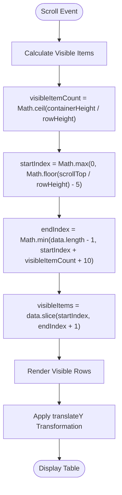
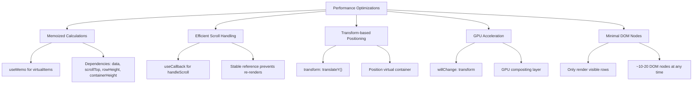
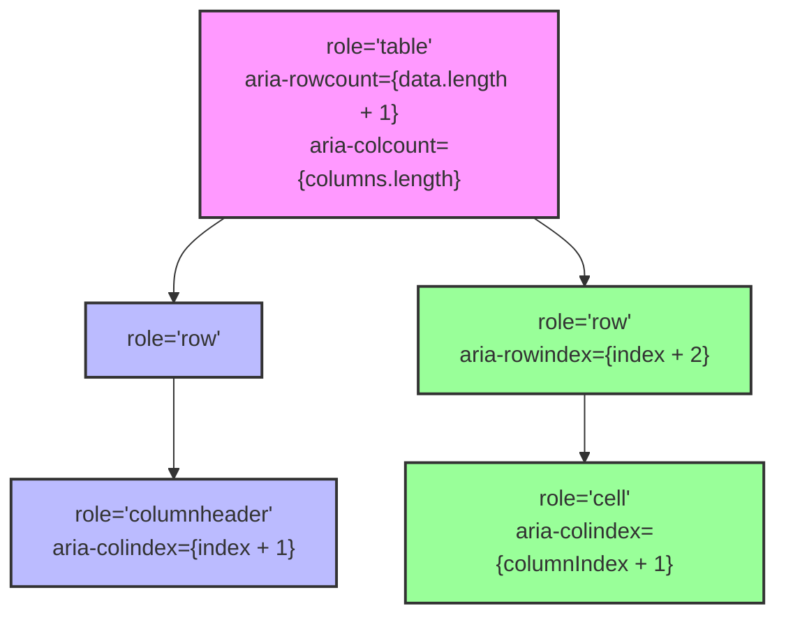
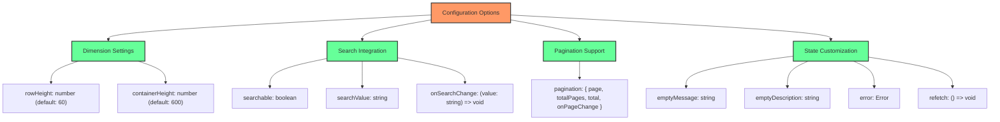
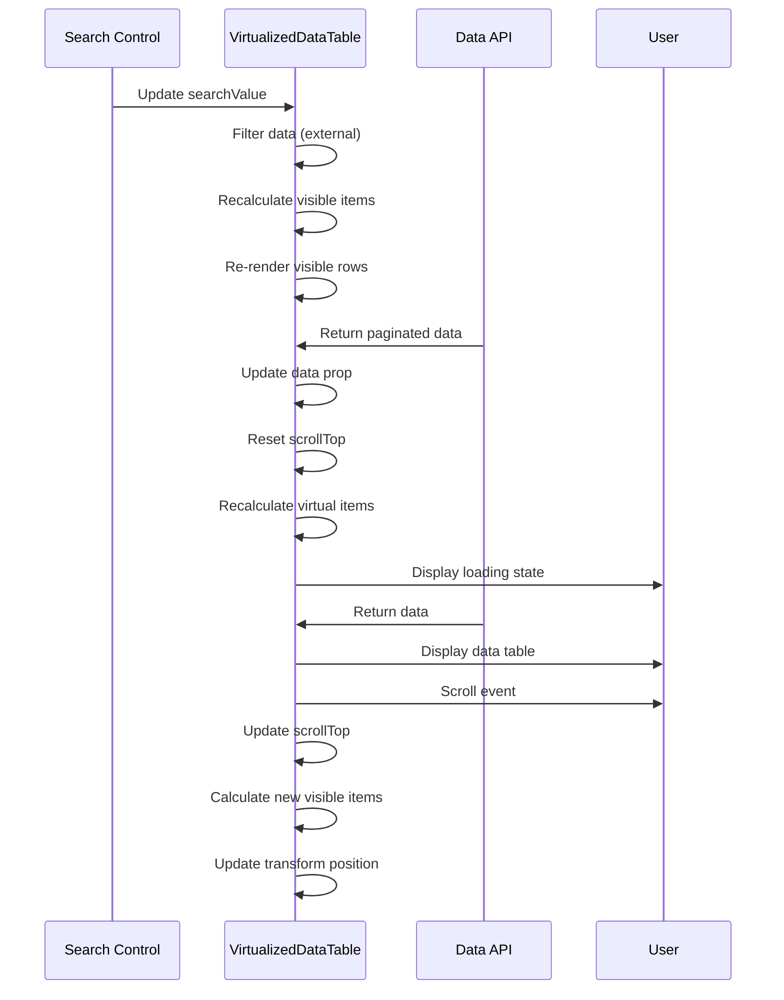

# VirtualizedDataTable Component

<cite>
**Referenced Files in This Document**   
- [virtualized-data-table.tsx](file://src/components/ui/virtualized-data-table.tsx)
- [DataTableColumn](file://src/components/ui/virtualized-data-table.tsx#L7-L12)
- [RowRenderer](file://src/components/ui/virtualized-data-table.tsx#L78-L115)
</cite>

## Table of Contents

1. [Introduction](#introduction)
2. [Virtualization Algorithm](#virtualization-algorithm)
3. [Performance Optimization](#performance-optimization)
4. [Accessibility Implementation](#accessibility-implementation)
5. [State Management](#state-management)
6. [Configuration Options](#configuration-options)
7. [Integration Patterns](#integration-patterns)
8. [Responsive Design](#responsive-design)

## Introduction

The VirtualizedDataTable component is a high-performance table implementation designed to efficiently render large datasets by only rendering visible rows. This virtualization approach significantly improves performance and memory usage when dealing with thousands of records. The component is implemented as a client-side React component using virtual scrolling techniques to maintain smooth scrolling performance while minimizing DOM nodes.

**Section sources**

- [virtualized-data-table.tsx](file://src/components/ui/virtualized-data-table.tsx#L1-L57)

## Virtualization Algorithm

The VirtualizedDataTable implements a sophisticated virtual scrolling algorithm that calculates which rows should be visible based on the current scroll position, container dimensions, and row height. The algorithm uses a buffer zone approach to ensure smooth scrolling by rendering rows slightly beyond the visible area.

The core virtualization logic is implemented through the `virtualItems` useMemo calculation, which determines the start and end indices of visible items based on the current scroll position. The algorithm calculates the number of visible items by dividing the container height by the row height, then applies a buffer of 5 rows before and 10 rows after the visible area to prevent blank spaces during rapid scrolling.



**Diagram sources**

- [virtualized-data-table.tsx](file://src/components/ui/virtualized-data-table.tsx#L59-L70)

**Section sources**

- [virtualized-data-table.tsx](file://src/components/ui/virtualized-data-table.tsx#L59-L70)

## Performance Optimization

The VirtualizedDataTable employs multiple performance optimization techniques to ensure smooth rendering and scrolling with large datasets. The component uses React's useMemo hook to memoize the virtual scrolling calculations, preventing unnecessary recalculations on every render. The scroll event handler is wrapped in useCallback to maintain a stable reference and prevent unnecessary re-renders of child components.

The component implements transform-based positioning using CSS translateY to move the visible rows container, leveraging GPU acceleration for smooth scrolling performance. The willChange CSS property is applied to hint to the browser that the transform property will change, enabling optimization of the rendering pipeline.



**Diagram sources**

- [virtualized-data-table.tsx](file://src/components/ui/virtualized-data-table.tsx#L59-L76)
- [virtualized-data-table.tsx](file://src/components/ui/virtualized-data-table.tsx#L250-L254)

**Section sources**

- [virtualized-data-table.tsx](file://src/components/ui/virtualized-data-table.tsx#L59-L76)
- [virtualized-data-table.tsx](file://src/components/ui/virtualized-data-table.tsx#L250-L254)

## Accessibility Implementation

The VirtualizedDataTable component implements comprehensive ARIA accessibility attributes to ensure the table is usable by assistive technologies. The main table container uses role="table" with aria-rowcount and aria-colcount to communicate the table structure to screen readers. Each row is marked with role="row" and assigned an aria-rowindex that accounts for the header row.

Table headers use role="columnheader" with aria-colindex to identify their position in the table, while data cells use role="cell" with appropriate aria-colindex values. The component maintains proper semantic structure even with virtualized rendering, ensuring that screen readers can navigate the table content effectively.



**Diagram sources**

- [virtualized-data-table.tsx](file://src/components/ui/virtualized-data-table.tsx#L218-L221)
- [virtualized-data-table.tsx](file://src/components/ui/virtualized-data-table.tsx#L232-L240)
- [virtualized-data-table.tsx](file://src/components/ui/virtualized-data-table.tsx#L101-L103)
- [virtualized-data-table.tsx](file://src/components/ui/virtualized-data-table.tsx#L108-L110)

**Section sources**

- [virtualized-data-table.tsx](file://src/components/ui/virtualized-data-table.tsx#L218-L240)
- [virtualized-data-table.tsx](file://src/components/ui/virtualized-data-table.tsx#L101-L110)

## State Management

The VirtualizedDataTable manages scroll state efficiently using React's useState hook to track the scrollTop position. This state is updated through the scroll event handler and used in the virtualization calculations to determine which rows should be visible. The component maintains minimal state to avoid unnecessary re-renders while still providing smooth scrolling behavior.

The RowRenderer component is memoized using React's memo function to prevent re-renders when the same row data is displayed. This optimization is particularly important for complex cell content that might be expensive to re-render. The memoization ensures that rows are only re-rendered when their data actually changes.

```mermaid
classDiagram
class VirtualizedDataTable {
+containerRef : RefObject<HTMLDivElement>
+scrollTop : number
+setScrollTop : Dispatch<SetStateAction<number>>
+virtualItems : VirtualItems
+handleScroll(e : UIEvent) : void
}
class RowRenderer {
+item : T
+index : number
+style : CSSProperties
}
class VirtualItems {
+startIndex : number
+endIndex : number
+visibleItems : T[]
}
VirtualizedDataTable --> RowRenderer : "renders"
VirtualizedDataTable --> VirtualItems : "calculates"
VirtualizedDataTable --> "React.useState" : "manages scrollTop"
VirtualizedDataTable --> "React.useMemo" : "memoizes virtualItems"
VirtualizedDataTable --> "React.useCallback" : "optimizes handleScroll"
RowRenderer --> "React.memo" : "prevents unnecessary re-renders"
```

**Diagram sources**

- [virtualized-data-table.tsx](file://src/components/ui/virtualized-data-table.tsx#L56-L57)
- [virtualized-data-table.tsx](file://src/components/ui/virtualized-data-table.tsx#L78-L115)
- [virtualized-data-table.tsx](file://src/components/ui/virtualized-data-table.tsx#L59-L70)

**Section sources**

- [virtualized-data-table.tsx](file://src/components/ui/virtualized-data-table.tsx#L56-L115)

## Configuration Options

The VirtualizedDataTable provides several configurable options to customize its appearance and behavior. The rowHeight and containerHeight props allow developers to adjust the table's dimensions to fit their specific use cases. These values have default settings of 60px for row height and 600px for container height, but can be overridden as needed.

The component supports search functionality through the searchable, searchValue, and onSearchChange props, allowing integration with external search controls. Pagination is supported through the pagination prop, which accepts an object containing page information and a callback for page changes. The component also supports custom empty and error states with configurable messages and descriptions.



**Diagram sources**

- [virtualized-data-table.tsx](file://src/components/ui/virtualized-data-table.tsx#L34-L35)
- [virtualized-data-table.tsx](file://src/components/ui/virtualized-data-table.tsx#L22-L31)
- [virtualized-data-table.tsx](file://src/components/ui/virtualized-data-table.tsx#L20-L21)

**Section sources**

- [virtualized-data-table.tsx](file://src/components/ui/virtualized-data-table.tsx#L14-L36)

## Integration Patterns

The VirtualizedDataTable is designed to integrate seamlessly with various application features including search, pagination, and data loading states. The component accepts a data array as its primary prop and renders rows based on the provided columns configuration. Each column can specify a render function for custom cell content, allowing complex UI elements within table cells.

For integration with search functionality, the component can be paired with external search controls that update the searchValue prop and handle search changes through the onSearchChange callback. Pagination integration is achieved by passing pagination information and a page change handler, which the component uses to display pagination controls and current page information.



**Diagram sources**

- [virtualized-data-table.tsx](file://src/components/ui/virtualized-data-table.tsx#L46-L49)
- [virtualized-data-table.tsx](file://src/components/ui/virtualized-data-table.tsx#L26-L31)
- [virtualized-data-table.tsx](file://src/components/ui/virtualized-data-table.tsx#L118-L129)

**Section sources**

- [virtualized-data-table.tsx](file://src/components/ui/virtualized-data-table.tsx#L118-L180)

## Responsive Design

While the VirtualizedDataTable focuses on performance with large datasets, it also considers responsive design principles. The component's height is controlled by the containerHeight prop, allowing it to adapt to different screen sizes. The flexible layout using CSS flexbox ensures that columns distribute available space appropriately across different viewport widths.

The component works in conjunction with other responsive components in the application, such as the responsive-table.tsx, to provide an optimal user experience across devices. By using relative units and flexible layouts, the VirtualizedDataTable maintains usability on both desktop and tablet devices, though it is primarily optimized for larger screens where large datasets are typically managed.

**Section sources**

- [virtualized-data-table.tsx](file://src/components/ui/virtualized-data-table.tsx#L215-L217)
- [virtualized-data-table.tsx](file://src/components/ui/virtualized-data-table.tsx#L246-L247)
