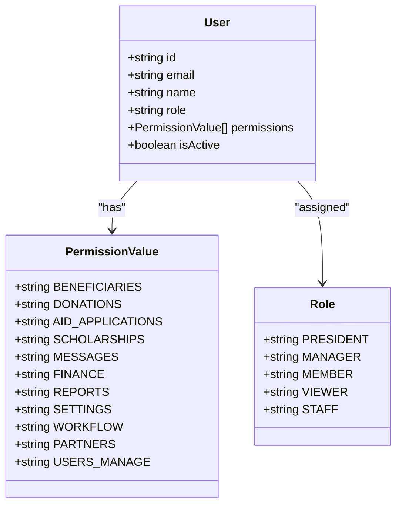
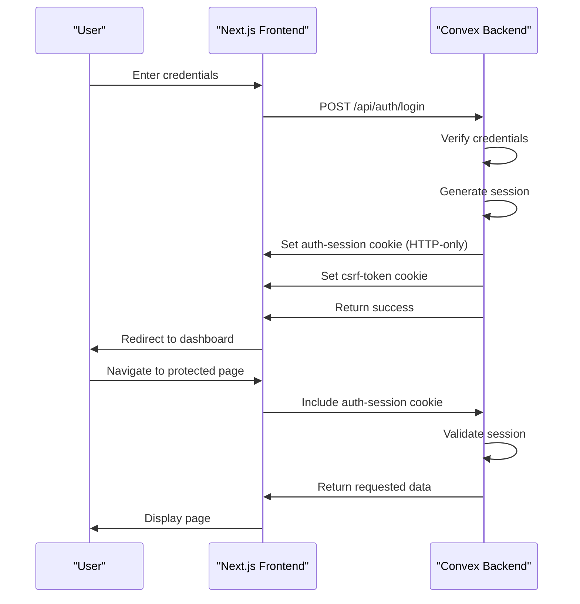
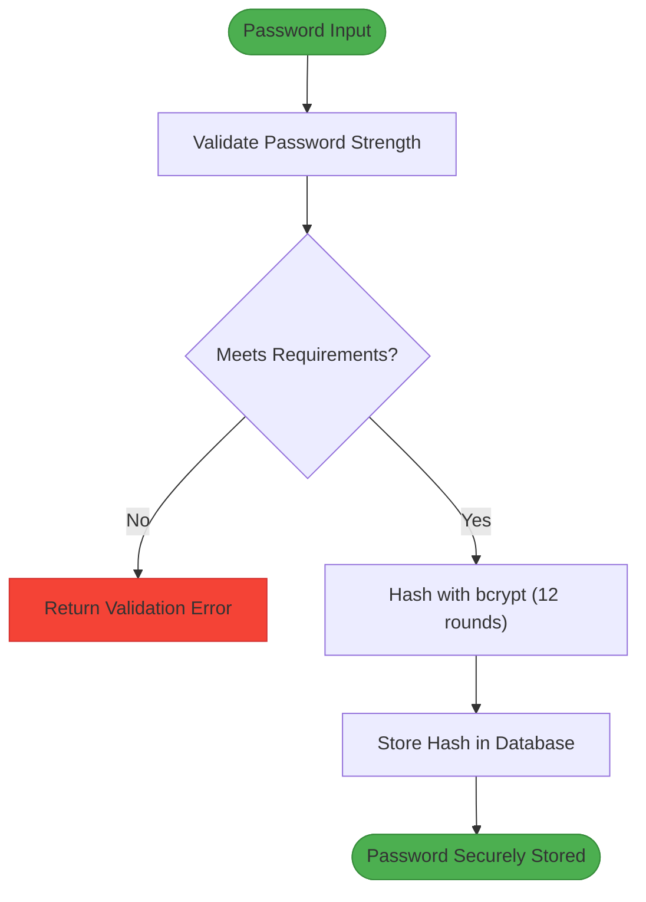
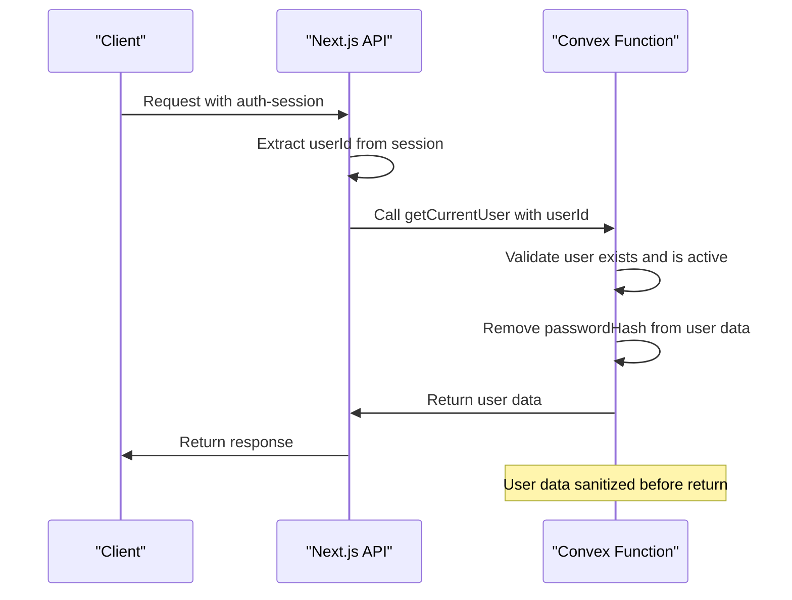
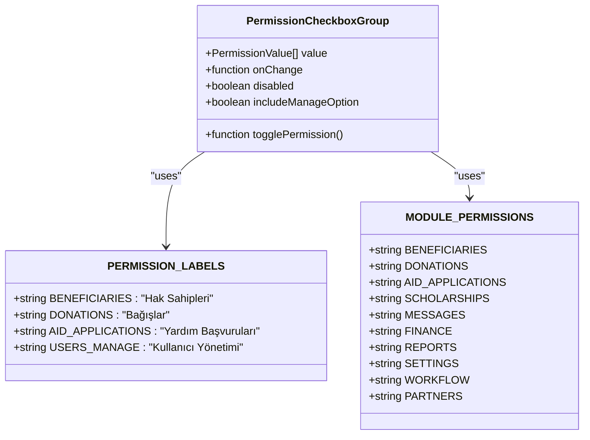
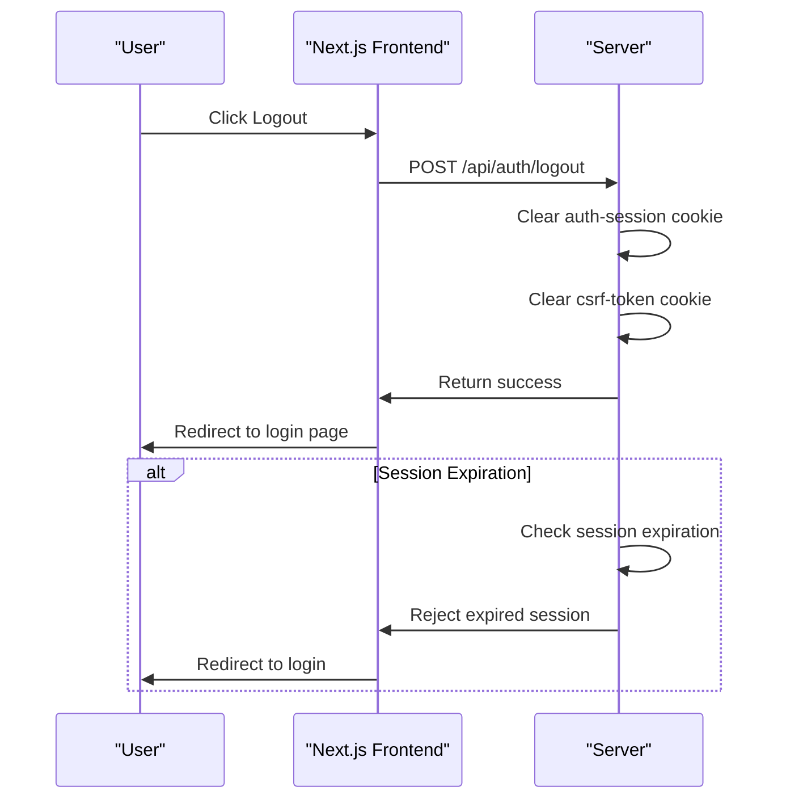
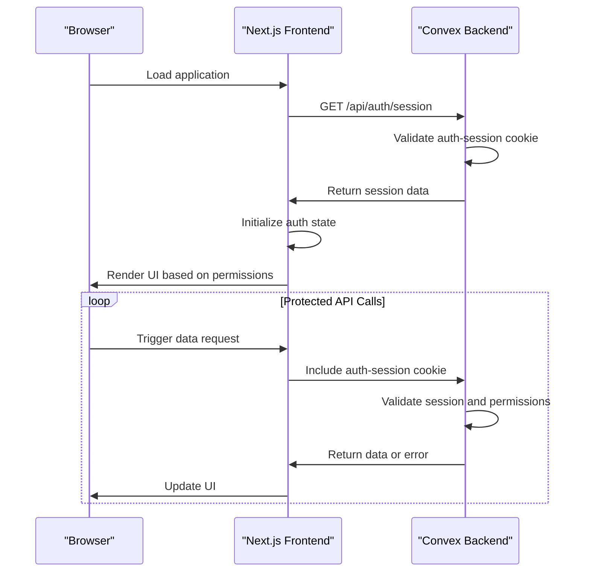

# Authentication and Authorization Security

<cite>
**Referenced Files in This Document**   
- [auth.ts](file://convex/auth.ts)
- [get-user.ts](file://src/lib/auth/get-user.ts)
- [password.ts](file://src/lib/auth/password.ts)
- [session.ts](file://src/lib/auth/session.ts)
- [auth.ts](file://src/types/auth.ts)
- [permissions.ts](file://src/types/permissions.ts)
- [permission-checkbox-group.tsx](file://src/components/users/permission-checkbox-group.tsx)
</cite>

## Table of Contents

1. [Introduction](#introduction)
2. [Role-Based Access Control (RBAC) Implementation](#role-based-access-control-rbac-implementation)
3. [Session Management and Token-Based Authentication](#session-management-and-token-based-authentication)
4. [Password Hashing and Secure Storage](#password-hashing-and-secure-storage)
5. [Convex Function Access Control](#convex-function-access-control)
6. [Frontend Role-Based Rendering](#frontend-role-based-rendering)
7. [Session Expiration and Logout Mechanisms](#session-expiration-and-logout-mechanisms)
8. [Protection Against Session Fixation](#protection-against-session-fixation)
9. [Frontend-Backend Authentication Integration](#frontend-backend-authentication-integration)
10. [Error Handling for Unauthorized Access](#error-handling-for-unauthorized-access)

## Introduction

The PORTAL application implements a comprehensive authentication and authorization security framework to protect sensitive data and functionality. This document details the security architecture, focusing on role-based access control, secure session management, password protection, and integration between frontend and backend systems. The implementation leverages Convex as the backend database and application logic layer, with Next.js handling the frontend and API routes.

**Section sources**

- [auth.ts](file://convex/auth.ts#L1-L82)
- [session.ts](file://src/lib/auth/session.ts#L1-L181)

## Role-Based Access Control (RBAC) Implementation

The RBAC system in PORTAL is built around six distinct roles with granular permission levels. The implementation uses a permission-based model rather than direct role checking, allowing for flexible access control configurations. The system defines module-level permissions for major application areas and special permissions for administrative functions.

The six roles in the system are:

- Dernek Başkanı (Association President) - Full administrative access
- Yönetici (Manager) - Managerial access with most permissions
- Üye (Member) - Regular member with basic access
- Görüntüleyici (Viewer) - Read-only access to specific modules
- Personel (Staff) - Default role with limited permissions
- Mock users for development and testing

Each role is associated with a specific set of permissions that determine access to application features. The permission system is defined in the `permissions.ts` file, which exports constants for all available permissions.

**Diagram sources**

- [permissions.ts](file://src/types/permissions.ts#L1-L39)
- [auth.ts](file://src/types/auth.ts#L3-L16)

**Section sources**

- [permissions.ts](file://src/types/permissions.ts#L1-L39)
- [session.ts](file://src/lib/auth/session.ts#L82-L142)

## Session Management and Token-Based Authentication

PORTAL implements secure session management using HTTP-only cookies for session storage and token-based authentication flows. The session system is designed to prevent common security vulnerabilities while providing a seamless user experience.

The authentication flow begins with user login, where credentials are verified and a session is created. The session cookie contains a session ID, user ID, and expiration timestamp, all stored in a serialized JSON format. The cookie is marked as HTTP-only to prevent access via JavaScript, reducing the risk of cross-site scripting (XSS) attacks.

**Diagram sources**

- [session.ts](file://src/lib/auth/session.ts#L8-L12)
- [route.ts](file://src/app/api/auth/login/route.ts#L92-L143)

**Section sources**

- [session.ts](file://src/lib/auth/session.ts#L8-L83)
- [route.ts](file://src/app/api/auth/login/route.ts#L92-L143)

## Password Hashing and Secure Storage

The application implements robust password security practices, using bcrypt with a high salt round count to protect user credentials. Password hashing is performed on the server side to ensure that plain text passwords are never stored or transmitted.

The password hashing configuration uses 12 salt rounds, which provides a strong balance between security and performance. This higher number of rounds makes brute force attacks significantly more difficult and time-consuming. Passwords are validated against strength requirements before hashing, ensuring a minimum level of complexity.

**Diagram sources**

- [password.ts](file://src/lib/auth/password.ts#L7-L10)
- [password.ts](file://src/lib/auth/password.ts#L27-L51)

**Section sources**

- [password.ts](file://src/lib/auth/password.ts#L7-L54)

## Convex Function Access Control

Access control in Convex functions is implemented through user role verification before any data access operations. The system uses a combination of query and mutation functions that validate user permissions before executing database operations.

The `getCurrentUser` query in the auth module retrieves user information while ensuring the user is active and removing the password hash from the returned data. This function is used throughout the application to verify user identity and retrieve user data securely.

**Diagram sources**

- [auth.ts](file://convex/auth.ts#L9-L26)
- [get-user.ts](file://src/lib/auth/get-user.ts#L54-L68)

**Section sources**

- [auth.ts](file://convex/auth.ts#L9-L26)
- [get-user.ts](file://src/lib/auth/get-user.ts#L54-L68)

## Frontend Role-Based Rendering

The frontend implements role-based rendering to control UI component visibility based on user permissions. This ensures that users only see functionality they are authorized to access, providing both security and a clean user interface.

The `PermissionCheckboxGroup` component allows administrators to assign permissions to users through a user-friendly interface. The component displays all available permissions with descriptive labels and handles the selection state for each permission.

**Diagram sources**

- [permission-checkbox-group.tsx](file://src/components/users/permission-checkbox-group.tsx#L1-L74)
- [permissions.ts](file://src/types/permissions.ts#L25-L37)

**Section sources**

- [permission-checkbox-group.tsx](file://src/components/users/permission-checkbox-group.tsx#L1-L74)

## Session Expiration and Logout Mechanisms

The application implements session expiration policies to enhance security by automatically logging out inactive users. Sessions have configurable timeouts, with different durations for regular and "remember me" sessions.

The logout mechanism securely terminates user sessions by clearing authentication cookies. When a user logs out, both the auth-session and csrf-token cookies are removed with immediate expiration, ensuring the session cannot be reused.

**Diagram sources**

- [route.ts](file://src/app/api/auth/logout/route.ts#L1-L50)
- [session.ts](file://src/lib/auth/session.ts#L46-L53)

**Section sources**

- [route.ts](file://src/app/api/auth/logout/route.ts#L1-L50)
- [session.ts](file://src/lib/auth/session.ts#L46-L53)

## Protection Against Session Fixation

PORTAL implements several measures to protect against session fixation attacks. The system generates a new session ID on each successful login, preventing attackers from using a pre-created session ID. Additionally, the application uses CSRF tokens to protect against cross-site request forgery attacks that could be used in conjunction with session fixation.

The session cookie is configured with the 'strict' SameSite policy, which prevents the cookie from being sent in cross-site requests. This further mitigates the risk of session fixation and other cross-site attacks.

**Section sources**

- [route.ts](file://src/app/api/auth/login/route.ts#L92-L143)
- [session.ts](file://src/lib/auth/session.ts#L9-L12)

## Frontend-Backend Authentication Integration

The authentication system integrates seamlessly between the frontend and backend, maintaining consistent auth state across the application. The frontend initializes its authentication state by calling the `/api/auth/session` endpoint, which validates the session cookie and returns user information.

This integration ensures that both frontend and backend perform independent validation of the authentication state, providing defense in depth. The frontend can conditionally render components based on the user's role and permissions, while the backend enforces the same restrictions at the API level.

**Diagram sources**

- [route.ts](file://src/app/api/auth/session/route.ts#L1-L64)
- [get-user.ts](file://src/lib/auth/get-user.ts#L13-L47)

**Section sources**

- [route.ts](file://src/app/api/auth/session/route.ts#L1-L64)
- [get-user.ts](file://src/lib/auth/get-user.ts#L13-L47)

## Error Handling for Unauthorized Access

The system implements comprehensive error handling for unauthorized access attempts. When a user tries to access a resource without proper permissions, the backend returns appropriate HTTP status codes (typically 401 for unauthenticated requests and 403 for authenticated but unauthorized requests).

The frontend handles these errors gracefully, redirecting users to the login page when authentication is required or displaying appropriate error messages when users lack sufficient permissions. This approach maintains security while providing a good user experience.

**Section sources**

- [route.ts](file://src/app/api/auth/session/route.ts#L20-L64)
- [route.ts](file://src/app/api/auth/logout/route.ts#L25-L50)
