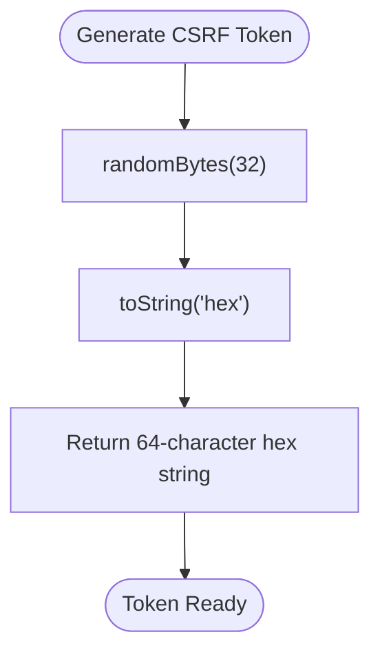
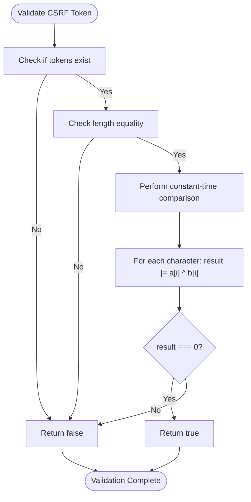
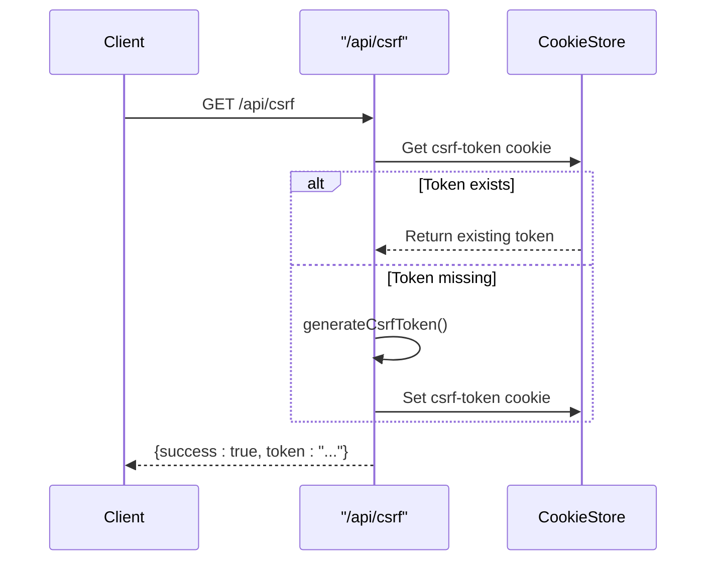
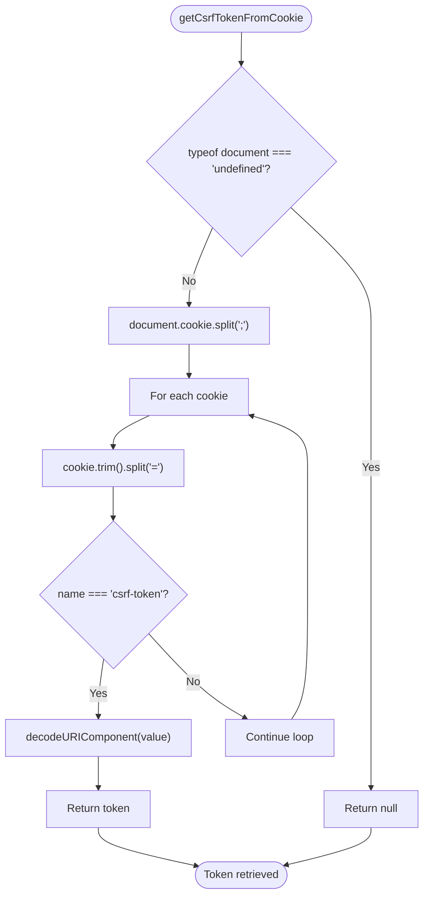
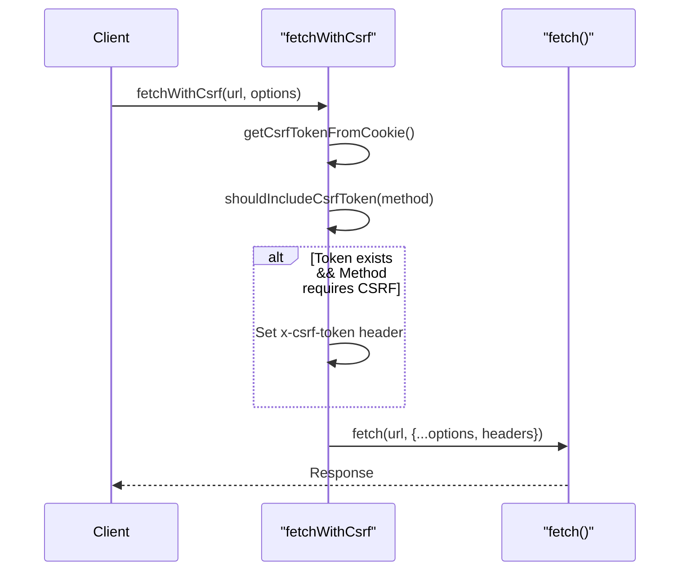
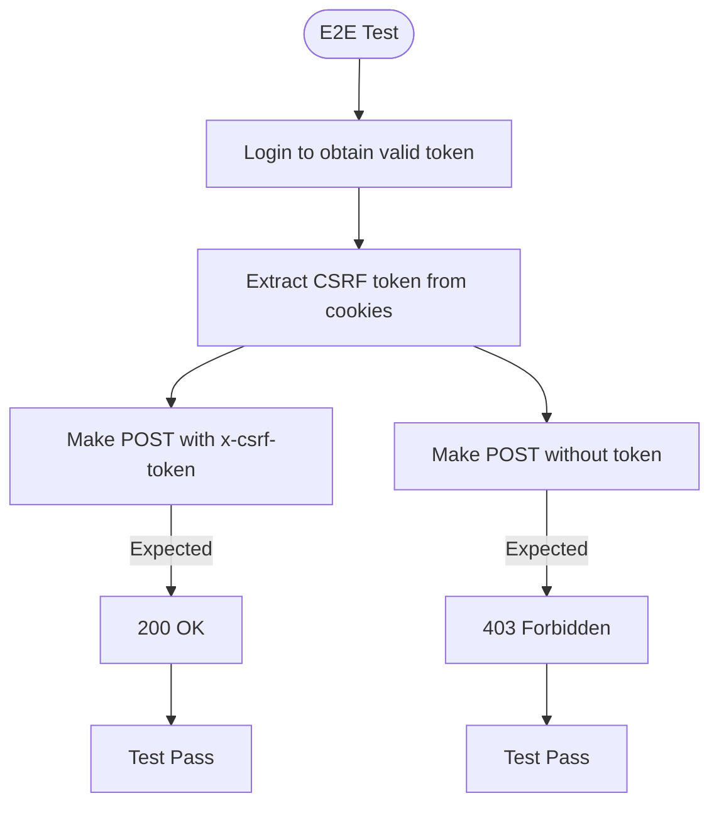

# CSRF Protection

<cite>
**Referenced Files in This Document**   
- [csrf.ts](file://src/lib/csrf.ts)
- [route.ts](file://src/app/api/csrf/route.ts)
- [auth-utils.ts](file://src/lib/api/auth-utils.ts)
- [login/route.ts](file://src/app/api/auth/login/route.ts)
- [logout/route.ts](file://src/app/api/auth/logout/route.ts)
- [auth.spec.ts](file://e2e/auth.spec.ts)
</cite>

## Table of Contents

1. [Introduction](#introduction)
2. [CSRF Token Generation](#csrf-token-generation)
3. [CSRF Token Validation](#csrf-token-validation)
4. [API Endpoint Implementation](#api-endpoint-implementation)
5. [Client-Side Token Retrieval](#client-side-token-retrieval)
6. [Security Attributes and Cookie Configuration](#security-attributes-and-cookie-configuration)
7. [Integration with API Requests](#integration-with-api-requests)
8. [Token Binding and Session Management](#token-binding-and-session-management)
9. [Vulnerability Mitigation](#vulnerability-mitigation)
10. [Testing Strategy](#testing-strategy)

## Introduction

Cross-Site Request Forgery (CSRF) protection in PORTAL is implemented through cryptographically secure token generation and validation mechanisms. The system ensures that state-changing operations are protected against unauthorized cross-origin requests by leveraging CSRF tokens that are bound to user sessions. This document details the implementation of CSRF protection across server and client components, including token generation, validation, transmission, and testing methodologies.

## CSRF Token Generation

The CSRF token generation process uses Node.js's `crypto` module to produce cryptographically secure random tokens. Each token is 32 bytes long and encoded as a hexadecimal string, ensuring sufficient entropy to prevent guessing attacks.

**Diagram sources**

- [csrf.ts](file://src/lib/csrf.ts#L13-L15)

**Section sources**

- [csrf.ts](file://src/lib/csrf.ts#L6-L16)

## CSRF Token Validation

CSRF token validation employs constant-time comparison to prevent timing attacks. The validation function first checks token presence and length equality before performing a bitwise comparison across all characters. This approach ensures that the comparison time does not leak information about token similarity.

**Diagram sources**

- [csrf.ts](file://src/lib/csrf.ts#L27-L44)

**Section sources**

- [csrf.ts](file://src/lib/csrf.ts#L27-L45)

## API Endpoint Implementation

The `/api/csrf` endpoint handles CSRF token generation and distribution. When accessed via GET request, it checks for an existing token in cookies and generates a new one if none exists. The endpoint sets the token in a cookie with appropriate security attributes and returns it in the response body.

**Diagram sources**

- [route.ts](file://src/app/api/csrf/route.ts#L9-L42)

**Section sources**

- [route.ts](file://src/app/api/csrf/route.ts#L1-L43)

## Client-Side Token Retrieval

Client-side applications retrieve CSRF tokens from cookies using the `getCsrfTokenFromCookie()` function. This utility parses the document's cookie string and extracts the CSRF token value, making it available for inclusion in subsequent API requests.

**Diagram sources**

- [csrf.ts](file://src/lib/csrf.ts#L49-L63)

**Section sources**

- [csrf.ts](file://src/lib/csrf.ts#L49-L63)

## Security Attributes and Cookie Configuration

The CSRF token cookie is configured with specific security attributes to enhance protection. It is marked as Secure in production environments, uses SameSite=Strict to prevent cross-origin sending, and has a 24-hour expiration. The cookie is not HttpOnly, allowing client-side JavaScript access while maintaining other security controls.

**Cookie Attributes**

- **httpOnly**: false (client-side accessible)
- **secure**: true in production
- **sameSite**: strict
- **maxAge**: 86400 seconds (24 hours)
- **path**: /

**Section sources**

- [route.ts](file://src/app/api/csrf/route.ts#L20-L27)
- [login/route.ts](file://src/app/api/auth/login/route.ts#L119-L126)

## Integration with API Requests

CSRF tokens are automatically included in state-changing API requests (POST, PUT, PATCH, DELETE) through the `fetchWithCsrf` wrapper function. This utility retrieves the token from cookies and adds it to the `x-csrf-token` header, ensuring consistent protection across all mutating operations.

**Diagram sources**

- [csrf.ts](file://src/lib/csrf.ts#L68-L80)

**Section sources**

- [csrf.ts](file://src/lib/csrf.ts#L68-L89)
- [auth.spec.ts](file://e2e/auth.spec.ts#L36-L47)

## Token Binding and Session Management

CSRF tokens are bound to user sessions during authentication. When a user logs in, a new CSRF token is generated and set in cookies alongside the session cookie. This binding ensures that CSRF tokens are rotated with each new session, preventing token reuse across different authentication states.

**Session Flow**

1. User authenticates via `/api/auth/login`
2. Server generates new CSRF token
3. Token is set in non-HttpOnly cookie
4. Token is validated on subsequent protected requests
5. Both session and CSRF tokens are cleared on logout

**Section sources**

- [login/route.ts](file://src/app/api/auth/login/route.ts#L93-L126)
- [logout/route.ts](file://src/app/api/auth/logout/route.ts#L21-L28)
- [auth-utils.ts](file://src/lib/api/auth-utils.ts#L64-L73)

## Vulnerability Mitigation

The CSRF protection system addresses several common vulnerabilities through specific implementation choices:

**Token Leakage Prevention**

- Tokens are only transmitted over HTTPS in production
- SameSite=Strict attribute prevents cross-origin inclusion
- Short token lifetime (24 hours) limits exposure window

**Replay Attack Protection**

- Tokens are validated against session state
- Constant-time comparison prevents timing attacks
- Token regeneration on login prevents session fixation

**Implementation Weaknesses Addressed**

- Non-HttpOnly cookies are justified by client-side framework requirements
- Token validation occurs server-side despite client access
- Comprehensive coverage of all mutating endpoints

**Section sources**

- [csrf.ts](file://src/lib/csrf.ts#L27-L45)
- [auth-utils.ts](file://src/lib/api/auth-utils.ts#L64-L73)

## Testing Strategy

CSRF protection is validated through end-to-end tests that verify both the presence of CSRF requirements and the effectiveness of the protection mechanism. Tests confirm that protected endpoints reject requests without valid CSRF tokens and accept properly tokenized requests.

**Test Cases**

- POST requests without CSRF token should return 403
- Valid CSRF token in header should allow request processing
- Invalid CSRF token should result in rejection
- Token regeneration across sessions is verified

**Diagram sources**

- [auth.spec.ts](file://e2e/auth.spec.ts#L210-L227)

**Section sources**

- [auth.spec.ts](file://e2e/auth.spec.ts#L210-L227)
- [auth-utils.ts](file://src/lib/api/auth-utils.ts#L64-L73)
