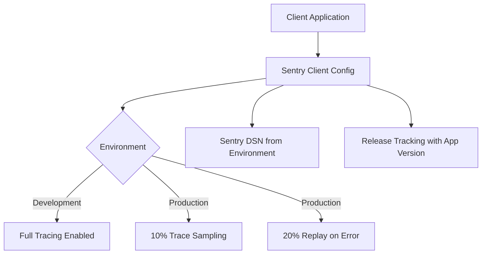
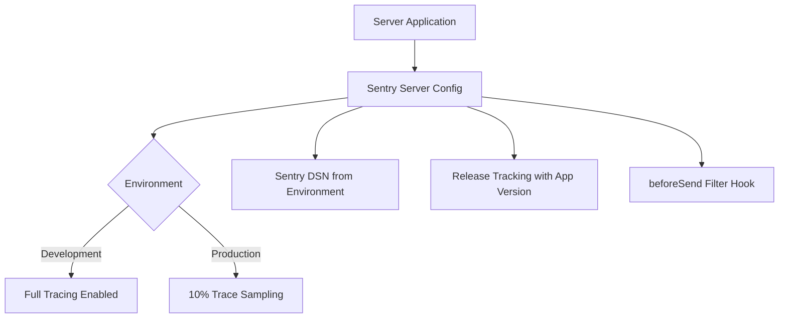
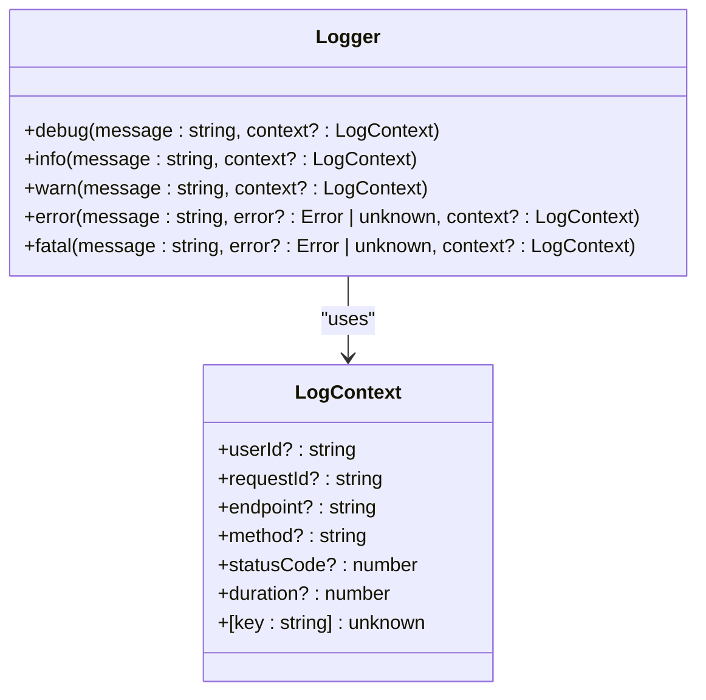
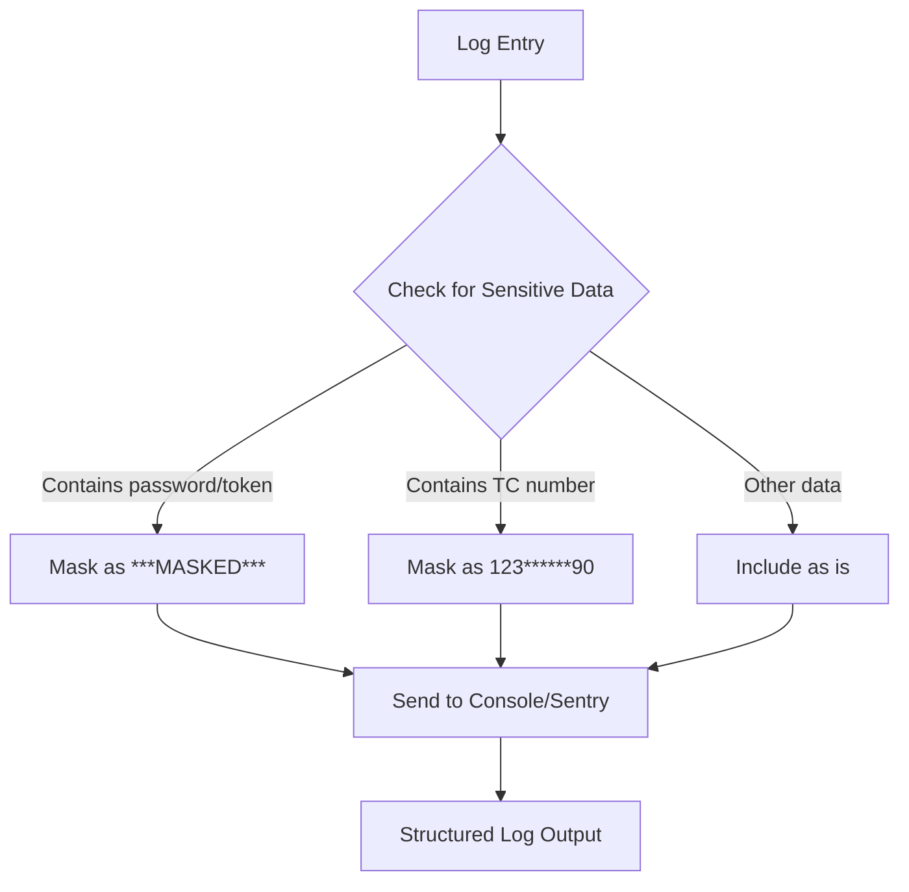
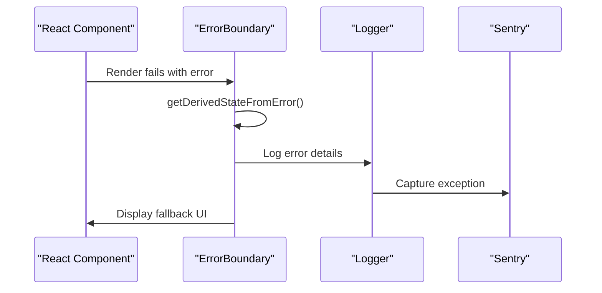
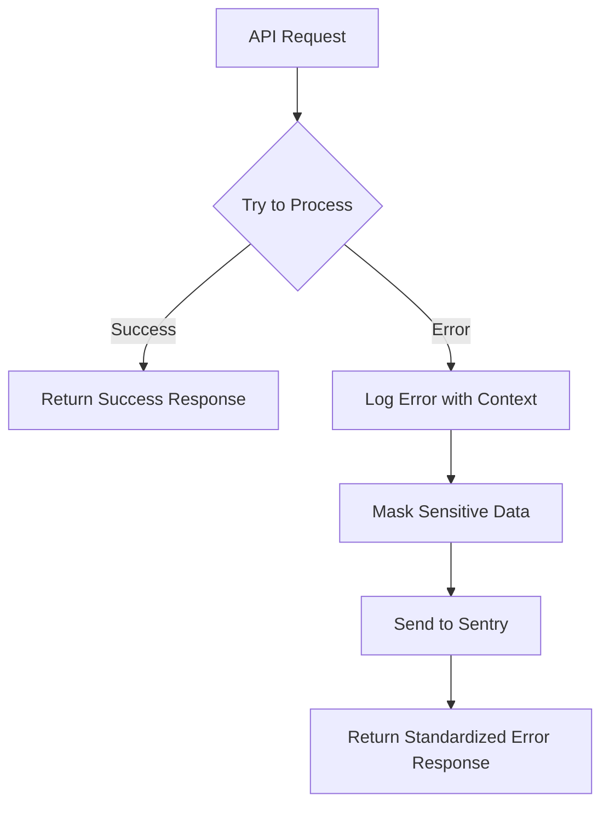
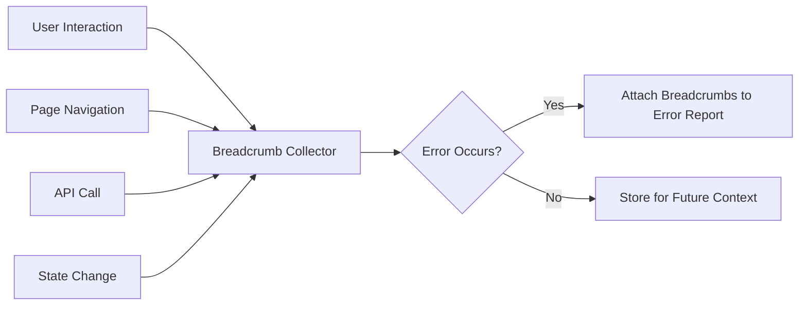
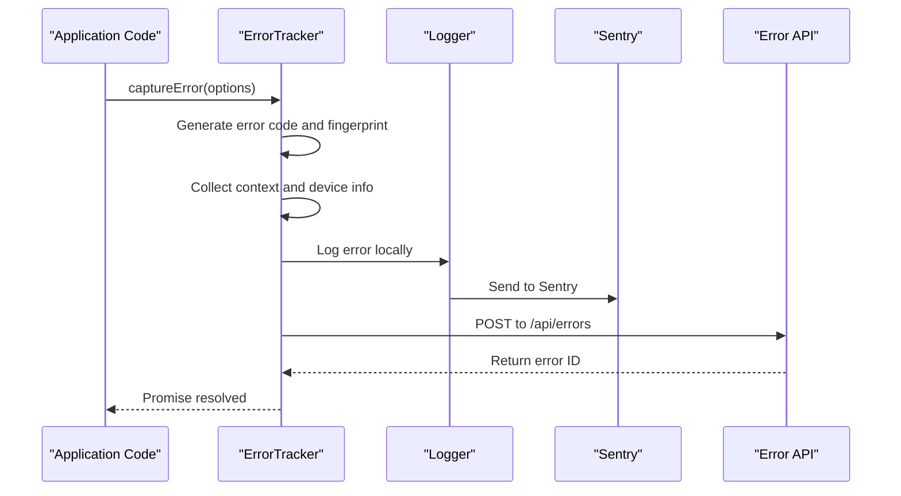
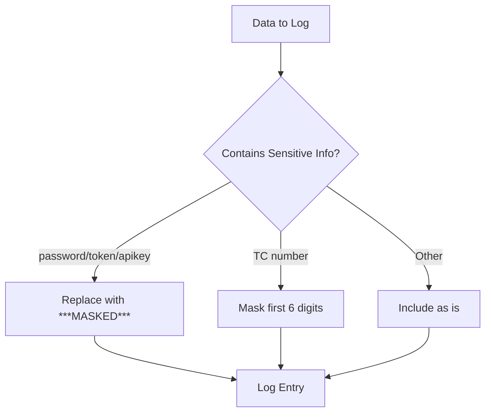
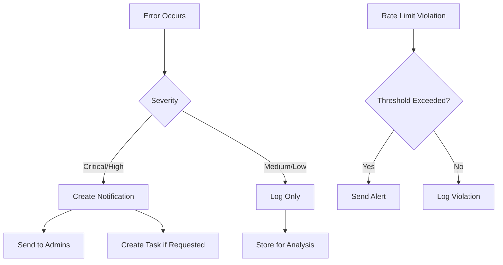

# Error Monitoring and Logging

<cite>
**Referenced Files in This Document**   
- [sentry.client.config.ts](file://sentry.client.config.ts)
- [sentry.server.config.ts](file://sentry.server.config.ts)
- [logger.ts](file://src/lib/logger.ts)
- [error-boundary.tsx](file://src/components/ui/error-boundary.tsx)
- [api/errors/route.ts](file://src/app/api/errors/route.ts)
- [api/errors/stats/route.ts](file://src/app/api/errors/stats/route.ts)
- [error-tracker.ts](file://src/lib/error-tracker.ts)
- [error-notifications.ts](file://src/lib/error-notifications.ts)
- [sentry.properties](file://sentry.properties)
</cite>

## Table of Contents

1. [Introduction](#introduction)
2. [Sentry Integration](#sentry-integration)
3. [Structured Logging Practices](#structured-logging-practices)
4. [Error Capture Across Application Layers](#error-capture-across-application-layers)
5. [Breadcrumb Collection and User Session Tracking](#breadcrumb-collection-and-user-session-tracking)
6. [Manual Error Reporting and Custom Metrics](#manual-error-reporting-and-custom-metrics)
7. [Data Privacy and Compliance](#data-privacy-and-compliance)
8. [Error Management and Alerting](#error-management-and-alerting)
9. [Conclusion](#conclusion)

## Introduction

The PORTAL application implements a comprehensive error monitoring and logging system to ensure reliability, maintainability, and compliance with data protection regulations. This documentation details the integration of Sentry for error tracking, structured logging practices, and the mechanisms for capturing errors across different layers of the application. The system is designed to provide detailed debugging context while protecting sensitive information and complying with KVKK/GDPR requirements.

## Sentry Integration

### Client-Side Configuration

The client-side Sentry configuration is defined in `sentry.client.config.ts`, which initializes the Sentry SDK for browser environments. The configuration includes settings for error sampling, session replay, and environment-specific behavior. In production, only 10% of traces are sampled to balance performance and monitoring needs, while session replays are disabled by default and only activated on errors at a 20% rate.



**Diagram sources**

- [sentry.client.config.ts](file://sentry.client.config.ts#L6-L24)

**Section sources**

- [sentry.client.config.ts](file://sentry.client.config.ts#L1-L25)

### Server-Side Configuration

The server-side Sentry configuration in `sentry.server.config.ts` follows similar principles but with server-specific considerations. The configuration enables distributed tracing with a 10% sampling rate in production and includes release tracking using the application version. The `beforeSend` hook allows for filtering or modifying events before they are sent to Sentry, providing a mechanism to exclude development errors in production environments.



**Diagram sources**

- [sentry.server.config.ts](file://sentry.server.config.ts#L6-L22)

**Section sources**

- [sentry.server.config.ts](file://sentry.server.config.ts#L1-L23)

## Structured Logging Practices

### Logger Implementation

The structured logging system is implemented in `logger.ts`, providing a consistent interface for logging across the application. The logger supports multiple log levels (debug, info, warn, error, fatal) with configurable minimum levels based on the environment. In development, all log levels are enabled, while in production, only warnings and errors are logged to reduce noise.



**Diagram sources**

- [logger.ts](file://src/lib/logger.ts#L15-L21)

**Section sources**

- [logger.ts](file://src/lib/logger.ts#L1-L213)

### Context Inclusion and Sensitive Data Handling

The logging system automatically includes contextual information such as user IDs, request IDs, endpoints, and methods. A critical feature is the automatic masking of sensitive data through the `maskSensitive` function, which identifies and masks fields containing passwords, tokens, API keys, and Turkish identification numbers (TC numbers). TC numbers are specifically masked to show only the first three and last two digits, ensuring compliance with privacy regulations.



**Diagram sources**

- [logger.ts](file://src/lib/logger.ts#L66-L95)

## Error Capture Across Application Layers

### React Error Boundaries

React error boundaries are implemented in `error-boundary.tsx` to catch JavaScript errors anywhere in the component tree. The `ErrorBoundary` component captures errors during rendering, lifecycle methods, and event handlers, providing a fallback UI to maintain application usability. When an error is caught, it is automatically logged to the console and sent to Sentry with detailed context including the error message, stack trace, and component stack.



**Diagram sources**

- [error-boundary.tsx](file://src/components/ui/error-boundary.tsx#L25-L60)

**Section sources**

- [error-boundary.tsx](file://src/components/ui/error-boundary.tsx#L1-L259)

### API Routes and Server-Side Error Handling

API routes implement comprehensive error handling with structured logging. When an error occurs in an API route, it is caught in a try-catch block, logged with relevant context (endpoint, method, status code), and returned as a standardized error response. The error logging includes the request URL, method, and any relevant parameters while respecting data privacy rules.



**Section sources**

- [api/errors/route.ts](file://src/app/api/errors/route.ts#L1-L45)
- [api/auth/session/route.ts](file://src/app/api/auth/session/route.ts#L1-L64)

### Convex Functions and Asynchronous Operations

Convex functions and asynchronous operations are monitored through the error tracking system. The application uses a centralized error capture mechanism that can be invoked from Convex functions to report errors to both the logging system and Sentry. This ensures that errors occurring in serverless functions are properly tracked and visible in the monitoring dashboard.

**Section sources**

- [convex/auth.ts](file://convex/auth.ts#L62-L80)
- [api/errors/route.ts](file://src/app/api/errors/route.ts#L47-L89)

## Breadcrumb Collection and User Session Tracking

### Breadcrumb Implementation

The application collects breadcrumbs to provide context for debugging errors. Breadcrumbs include user interactions, page navigation, and significant application events. This information is automatically attached to error reports, allowing developers to reconstruct the sequence of actions that led to an error. The breadcrumb system is integrated with the analytics tracker, which records user interactions and page views.



**Section sources**

- [ui/analytics-tracker.tsx](file://src/components/ui/analytics-tracker.tsx#L1-L60)
- [ui/analytics-tracker.tsx](file://src/components/ui/analytics-tracker.tsx#L62-L119)

### User Session Tracking

User sessions are tracked to facilitate error reproduction and user support. The session tracking system captures the user ID, session duration, and key interactions. This information is included in error reports (with proper anonymization) to help identify patterns and reproduce issues. Session data is also used to correlate errors with specific user workflows and identify systemic issues affecting particular user segments.

**Section sources**

- [auth/login/route.ts](file://src/app/api/auth/login/route.ts#L92-L143)
- [ui/analytics-tracker.tsx](file://src/components/ui/analytics-tracker.tsx#L157-L207)

## Manual Error Reporting and Custom Metrics

### Manual Error Reporting

The application provides mechanisms for manual error reporting through the `captureError` function in `error-tracker.ts`. This allows developers to report errors that are caught and handled gracefully but still need to be monitored. The function accepts detailed parameters including error title, description, category, severity, and custom context, enabling precise error classification and filtering in Sentry.



**Section sources**

- [error-tracker.ts](file://src/lib/error-tracker.ts#L133-L183)
- [error-tracker.ts](file://src/lib/error-tracker.ts#L185-L223)

### Custom Metric Capture

Custom metrics are captured using the Web Vitals integration and the analytics tracking system. Performance metrics such as Largest Contentful Paint (LCP), First Input Delay (FID), and Cumulative Layout Shift (CLS) are collected and sent to both Sentry and a custom analytics endpoint. This allows for monitoring application performance over time and identifying performance regressions.

```mermaid
flowchart TD
A[Performance Metric] --> B{Web Vitals Observer}
B --> C[Collect LCP, FID, CLS, etc.]
C --> D{Send to Sentry?}
D --> |Yes| E[Sentry.metrics.distribution()]
D --> |Yes| F[Custom Analytics Endpoint]
E --> G[Performance Dashboard]
F --> G
```

**Section sources**

- [performance/web-vitals.ts](file://src/lib/performance/web-vitals.ts#L50-L95)

## Data Privacy and Compliance

### Sensitive Information Protection

The application implements multiple layers of protection for sensitive information. The logger automatically masks fields containing passwords, tokens, and TC numbers using the `maskSensitive` function. TC numbers are specifically handled to comply with Turkish data protection regulations, showing only partial information in logs. This ensures that personally identifiable information (PII) is never exposed in error reports or logs.



**Section sources**

- [logger.ts](file://src/lib/logger.ts#L66-L95)
- [logger.ts](file://src/lib/logger.ts#L50-L64)

### KVKK and GDPR Compliance

The error monitoring system is designed to comply with both KVKK (Turkish Personal Data Protection Law) and GDPR (General Data Protection Regulation). Sensitive user data is never stored in its entirety in logs or error reports. User identifiers are used only when necessary for debugging and are always paired with appropriate access controls. The system also provides mechanisms for data subject access requests and the right to be forgotten, ensuring compliance with data protection regulations.

**Section sources**

- [logger.ts](file://src/lib/logger.ts#L66-L95)
- [api/audit-logs/route.ts](file://src/app/api/audit-logs/route.ts#L1-L57)

## Error Management and Alerting

### Alert Configuration

The system includes configurable alerts for different error severities and patterns. Critical and high-severity errors trigger immediate notifications to the development team through the error notification system. The `createErrorNotification` function creates workflow notifications for critical errors, ensuring they are visible in the application's task management system. Rate limit violations also trigger alerts when certain thresholds are exceeded.



**Section sources**

- [error-notifications.ts](file://src/lib/error-notifications.ts#L1-L46)
- [error-notifications.ts](file://src/lib/error-notifications.ts#L44-L90)
- [rate-limit-monitor.ts](file://src/lib/rate-limit-monitor.ts#L208-L239)

### Error Grouping and Sourcemap Usage

Sentry is configured to group similar errors using fingerprints, which are generated based on the error type, component, and function name. This prevents alert fatigue by consolidating related errors into a single issue. Sourcemaps are used in production to resolve minified JavaScript stack traces back to the original source code, making it easier to identify the root cause of errors. The release tracking feature correlates errors with specific application versions, helping to identify when issues were introduced.

**Section sources**

- [sentry.client.config.ts](file://sentry.client.config.ts#L17-L19)
- [sentry.server.config.ts](file://sentry.server.config.ts#L15-L19)
- [error-tracker.ts](file://src/lib/error-tracker.ts#L133-L183)

## Conclusion

The PORTAL application's error monitoring and logging system provides comprehensive visibility into application health and user experience. By integrating Sentry for both client and server-side error tracking, implementing structured logging with sensitive data protection, and capturing errors across all application layers, the system enables rapid issue detection and resolution. The focus on data privacy and compliance ensures that monitoring practices align with KVKK and GDPR requirements. With configurable alerts, effective error grouping, and sourcemap support, the system provides developers with the tools needed to maintain a reliable and secure application.
