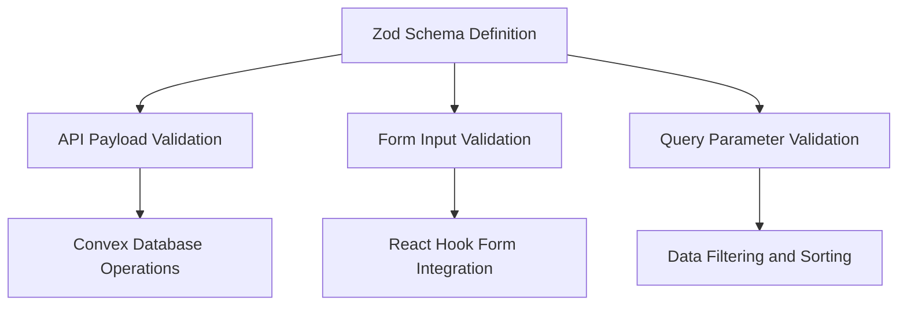
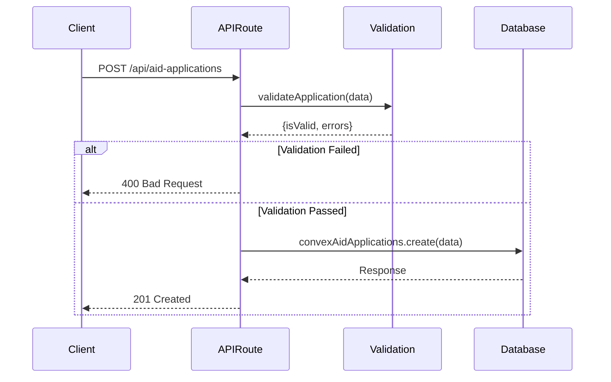
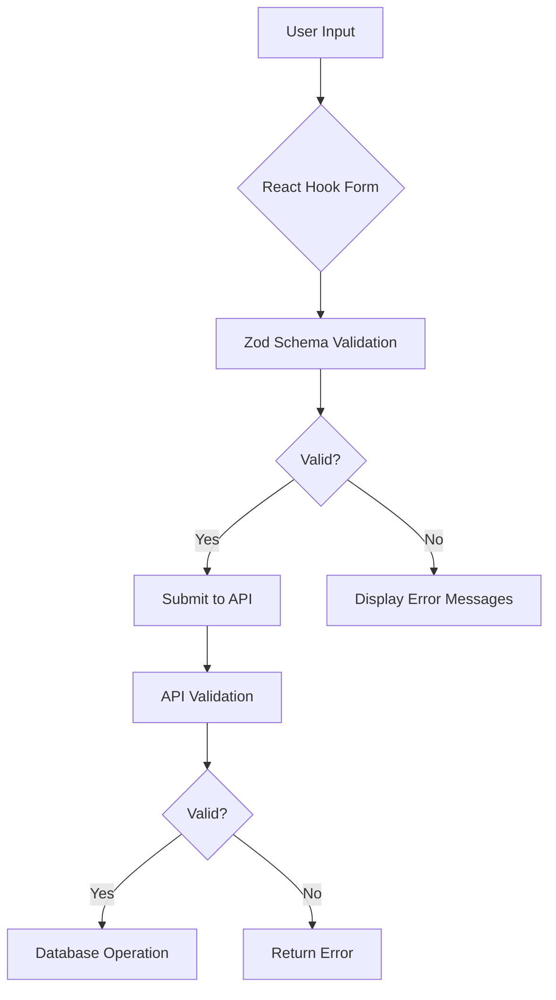
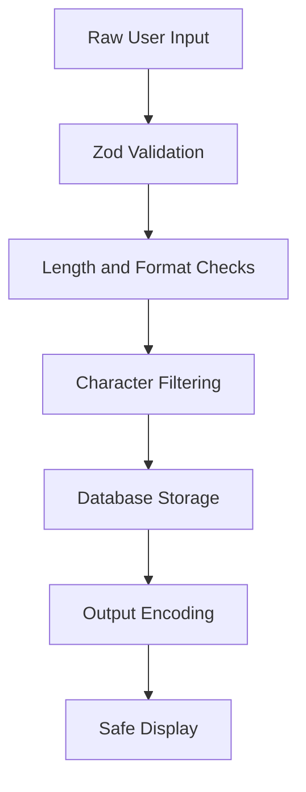
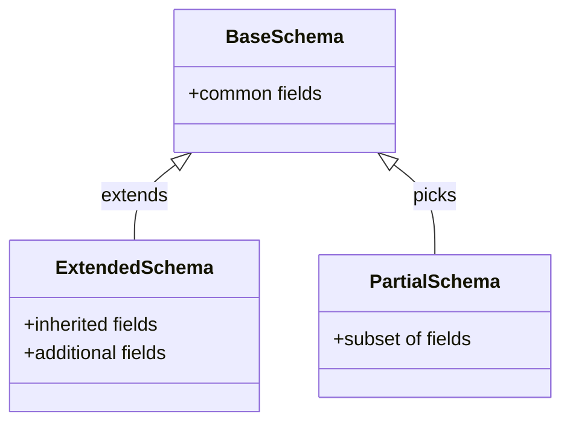
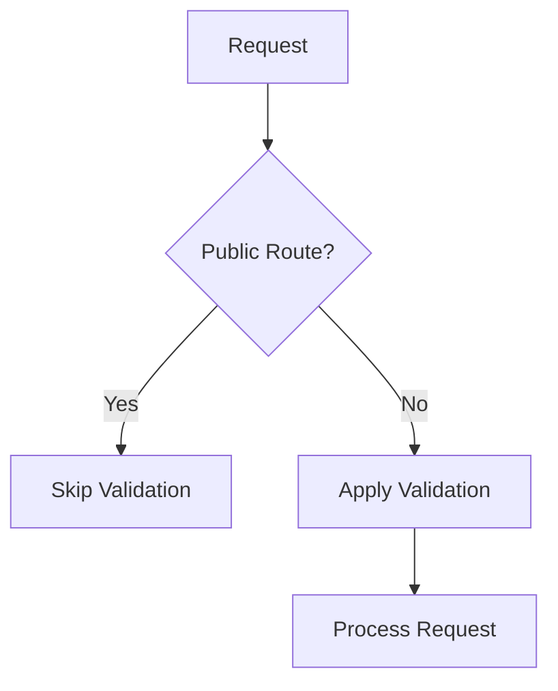

# Input Validation and Sanitization

<cite>
**Referenced Files in This Document**   
- [aid-application.ts](file://src/lib/validations/aid-application.ts)
- [meeting.ts](file://src/lib/validations/meeting.ts)
- [beneficiary.ts](file://src/lib/validations/beneficiary.ts)
- [kumbara.ts](file://src/lib/validations/kumbara.ts)
- [task.ts](file://src/lib/validations/task.ts)
- [route.ts](file://src/app/api/aid-applications/route.ts)
- [route.ts](file://src/app/api/meetings/route.ts)
- [middleware.ts](file://src/middleware.ts)
- [user-form.tsx](file://src/components/forms/user-form.tsx)
</cite>

## Table of Contents

1. [Introduction](#introduction)
2. [Zod Schema Implementation](#zod-schema-implementation)
3. [Domain-Specific Validation Rules](#domain-specific-validation-rules)
4. [Validation Middleware in API Routes](#validation-middleware-in-api-routes)
5. [Frontend Integration with React Hook Form](#frontend-integration-with-react-hook-form)
6. [Data Sanitization Techniques](#data-sanitization-techniques)
7. [Error Handling and Formatting](#error-handling-and-formatting)
8. [Schema Composition and Reuse](#schema-composition-and-reuse)
9. [Schema Versioning and Evolution](#schema-versioning-and-evolution)
10. [Performance Considerations](#performance-considerations)
11. [Testing Strategies](#testing-strategies)
12. [Extending Validation for New Features](#extending-validation-for-new-features)

## Introduction

The PORTAL application implements a comprehensive input validation and sanitization system to ensure data integrity, prevent security vulnerabilities, and provide a consistent user experience. The system leverages Zod for type-safe validation across API payloads, form inputs, and query parameters. This document details the implementation patterns, domain-specific rules, and integration points for the validation system.

**Section sources**

- [aid-application.ts](file://src/lib/validations/aid-application.ts)
- [meeting.ts](file://src/lib/validations/meeting.ts)
- [beneficiary.ts](file://src/lib/validations/beneficiary.ts)

## Zod Schema Implementation

The validation system is built on Zod, providing runtime type checking and validation for all data inputs. Schemas are defined in the `src/lib/validations` directory and used throughout the application for API payloads, form inputs, and query parameters.



**Diagram sources**

- [aid-application.ts](file://src/lib/validations/aid-application.ts)
- [meeting.ts](file://src/lib/validations/meeting.ts)
- [kumbara.ts](file://src/lib/validations/kumbara.ts)

**Section sources**

- [aid-application.ts](file://src/lib/validations/aid-application.ts)
- [meeting.ts](file://src/lib/validations/meeting.ts)
- [kumbara.ts](file://src/lib/validations/kumbara.ts)

## Domain-Specific Validation Rules

The application implements domain-specific validation rules in several key areas:

### Aid Application Validation

The aid application schema validates complex domain rules including application stages, status transitions, and financial aid types. It ensures data consistency for beneficiary relationships and processing workflows.

```mermaid
classDiagram
class AidApplicationDocument {
+_id : string
+application_date : string
+applicant_type : enum
+applicant_name : string
+beneficiary_id : string?
+one_time_aid : number?
+regular_financial_aid : number?
+stage : enum
+status : enum
+priority : enum?
}
AidApplicationDocument : +isValidAidApplicationDocument(data : unknown) boolean
AidApplicationDocument : +validateAidApplicationDocument(data : unknown) AidApplicationDocument | null
```

**Diagram sources**

- [aid-application.ts](file://src/lib/validations/aid-application.ts#L7-L44)

**Section sources**

- [aid-application.ts](file://src/lib/validations/aid-application.ts#L7-L70)

### Meeting Validation

Meeting validation includes temporal constraints and participant rules. The system enforces that meetings are scheduled at least one hour in the future and that organizers are included in the participant list.

```mermaid
classDiagram
class MeetingFormData {
+title : string
+description : string?
+meeting_date : string
+location : string?
+organizer : string
+participants : string[]
+status : enum
+meeting_type : enum
+agenda : string?
+notes : string?
}
MeetingFormData : +isWithinOneHour(dateStr : string) boolean
MeetingFormData : +meetingTypeLabels Record<string, string>
MeetingFormData : +meetingStatusLabels Record<string, string>
```

**Diagram sources**

- [meeting.ts](file://src/lib/validations/meeting.ts#L57-L93)

**Section sources**

- [meeting.ts](file://src/lib/validations/meeting.ts#L1-L171)

## Validation Middleware in API Routes

API routes implement validation middleware to ensure data integrity before processing requests. The validation occurs at the route handler level, with specific validation functions for each endpoint.



**Diagram sources**

- [route.ts](file://src/app/api/aid-applications/route.ts#L6-L27)
- [route.ts](file://src/app/api/meetings/route.ts#L7-L36)

**Section sources**

- [route.ts](file://src/app/api/aid-applications/route.ts#L1-L115)
- [route.ts](file://src/app/api/meetings/route.ts#L1-L137)

## Frontend Integration with React Hook Form

The frontend integrates Zod schemas with React Hook Form for seamless client-side validation. This provides immediate feedback to users while ensuring the same validation rules are applied on both client and server.



**Diagram sources**

- [user-form.tsx](file://src/components/forms/user-form.tsx)
- [beneficiary.ts](file://src/lib/validations/beneficiary.ts)

**Section sources**

- [beneficiary.ts](file://src/lib/validations/beneficiary.ts#L96-L498)

## Data Sanitization Techniques

The application implements data sanitization to prevent XSS and injection attacks, particularly in user-generated content. While the provided code does not explicitly show sanitization functions, the architecture suggests several layers of protection.

### Sanitization Layers

1. **Input Validation**: Zod schemas enforce data types and formats
2. **Content Filtering**: Text fields have length limits and character restrictions
3. **Database Protection**: Convex database provides additional security layers
4. **Output Encoding**: Automatic encoding in React components



**Diagram sources**

- [kumbara.ts](file://src/lib/validations/kumbara.ts)
- [beneficiary.ts](file://src/lib/validations/beneficiary.ts)

**Section sources**

- [kumbara.ts](file://src/lib/validations/kumbara.ts#L1-L241)

## Error Handling and Formatting

The validation system includes comprehensive error handling strategies using Zod's error formatting utilities. Errors are structured to provide meaningful feedback to both users and developers.

### Error Response Structure

```typescript
{
  success: boolean,
  error?: string,
  details?: string[],
  errors?: {
    field: string,
    message: string
  }[]
}
```

The system differentiates between validation errors and system errors, providing appropriate status codes and messages for each case.

**Section sources**

- [route.ts](file://src/app/api/aid-applications/route.ts#L68-L73)
- [route.ts](file://src/app/api/meetings/route.ts#L82-L87)

## Schema Composition and Reuse

The validation system employs schema composition patterns to promote reuse and maintainability. Base schemas are extended and combined to create more complex validation rules.

### Composition Patterns

- **Schema Extension**: Using `.extend()` to add fields to existing schemas
- **Schema Merging**: Combining multiple schemas with `.merge()`
- **Partial Schemas**: Creating subsets with `.partial()`
- **Conditional Validation**: Using `.refine()` for complex business rules



**Diagram sources**

- [kumbara.ts](file://src/lib/validations/kumbara.ts#L95-L107)
- [beneficiary.ts](file://src/lib/validations/beneficiary.ts#L398-L497)

**Section sources**

- [kumbara.ts](file://src/lib/validations/kumbara.ts#L1-L241)
- [beneficiary.ts](file://src/lib/validations/beneficiary.ts#L1-L498)

## Schema Versioning and Evolution

The application manages schema evolution through careful versioning practices. When changes are required, the system maintains backward compatibility while introducing new validation rules.

### Versioning Strategy

1. **Backward Compatibility**: New fields are optional by default
2. **Deprecation Warnings**: Logging when deprecated fields are used
3. **Gradual Migration**: Supporting old and new formats during transition
4. **Documentation Updates**: Clear communication of changes

The use of TypeScript types with Zod schemas (`satisfies z.ZodType`) ensures type safety during schema evolution.

**Section sources**

- [aid-application.ts](file://src/lib/validations/aid-application.ts#L45)
- [beneficiary.ts](file://src/lib/validations/beneficiary.ts)

## Performance Considerations

The validation system is designed with performance in mind, particularly for high-volume operations. Several optimization strategies are employed:

### Optimization Techniques

- **Schema Caching**: Reusing compiled schemas
- **Selective Validation**: Validating only changed fields
- **Batch Processing**: Validating multiple items efficiently
- **Asynchronous Validation**: Non-blocking validation for complex rules

The middleware architecture ensures that validation only occurs for protected routes, reducing unnecessary processing.



**Diagram sources**

- [middleware.ts](file://src/middleware.ts#L136-L214)

**Section sources**

- [middleware.ts](file://src/middleware.ts#L1-L229)

## Testing Strategies

The application employs comprehensive testing strategies using Vitest to ensure validation rules work as expected.

### Test Coverage

- **Unit Tests**: Individual schema validation rules
- **Integration Tests**: API endpoints with validation
- **Edge Cases**: Boundary conditions and error scenarios
- **Performance Tests**: Validation under load

The test suite includes both positive and negative test cases to verify that valid data is accepted and invalid data is properly rejected.

**Section sources**

- [beneficiary.test.ts](file://src/__tests__/lib/validations/beneficiary.test.ts)
- [sanitization.test.ts](file://src/__tests__/lib/sanitization.test.ts)

## Extending Validation for New Features

When adding new features, the validation system can be extended following established patterns:

### Extension Guidelines

1. **Create New Schema**: Define a Zod schema in the appropriate validations file
2. **Implement Reusable Components**: Extract common validation rules
3. **Integrate with API Routes**: Add validation to route handlers
4. **Connect to Frontend**: Use with React Hook Form
5. **Add Tests**: Ensure comprehensive test coverage

The modular design allows new validation rules to be added without disrupting existing functionality.

**Section sources**

- [aid-application.ts](file://src/lib/validations/aid-application.ts)
- [meeting.ts](file://src/lib/validations/meeting.ts)
- [kumbara.ts](file://src/lib/validations/kumbara.ts)
