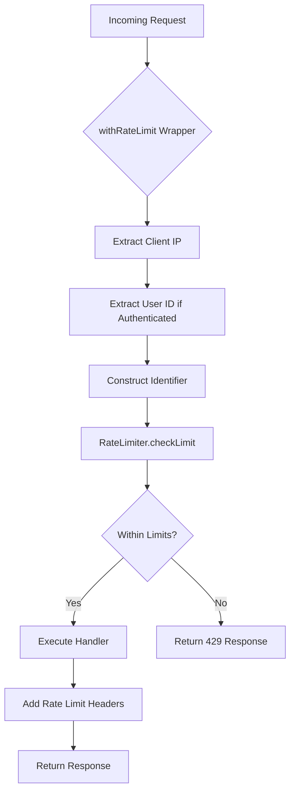
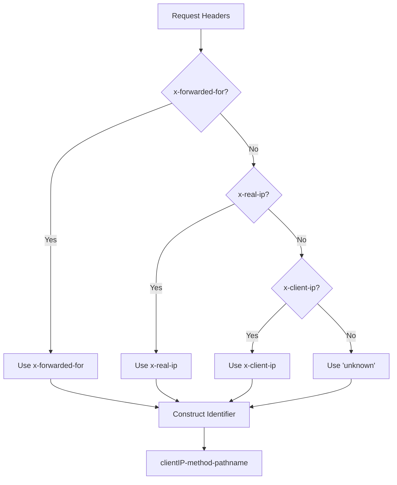
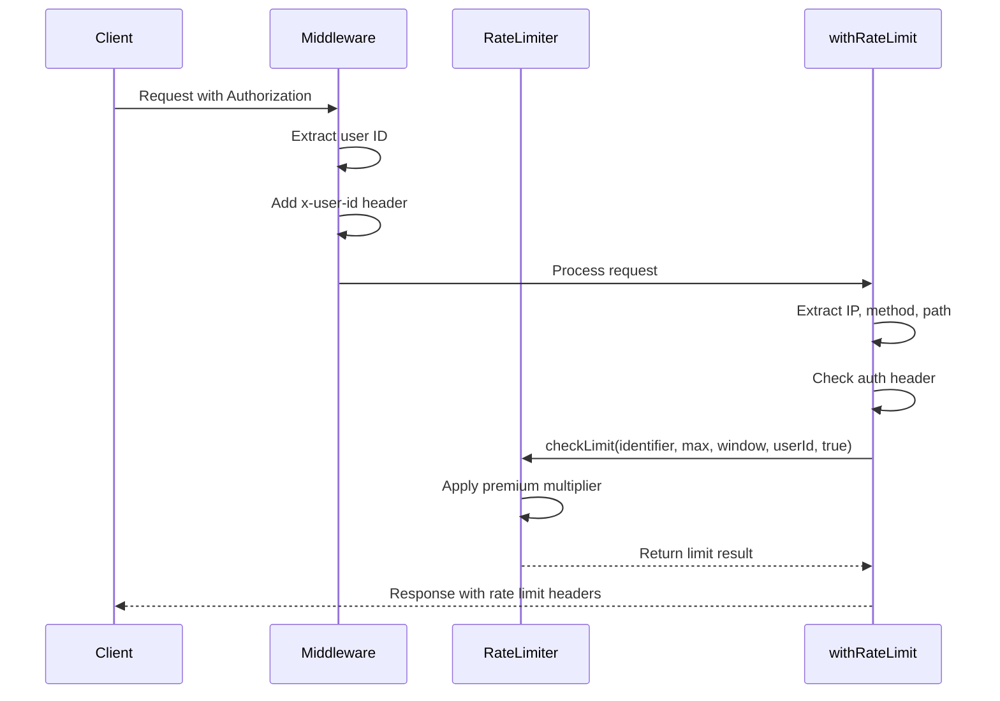
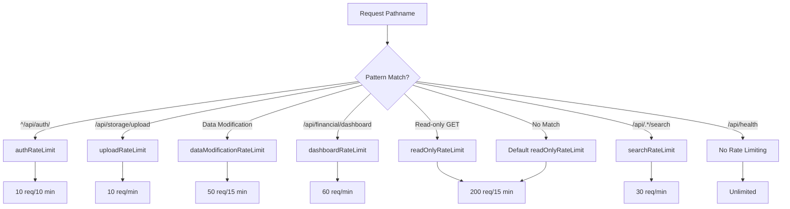
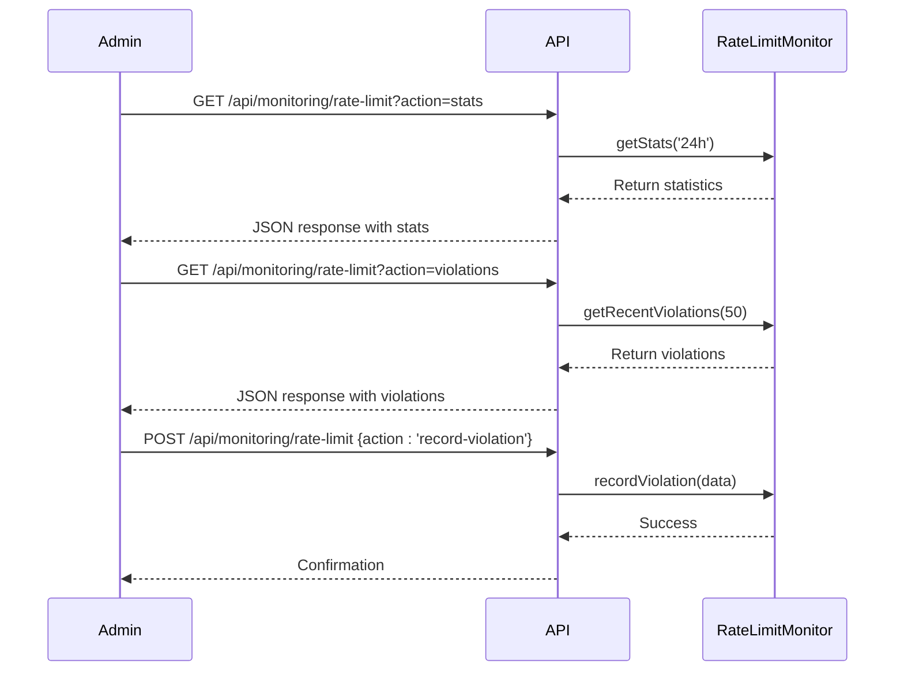
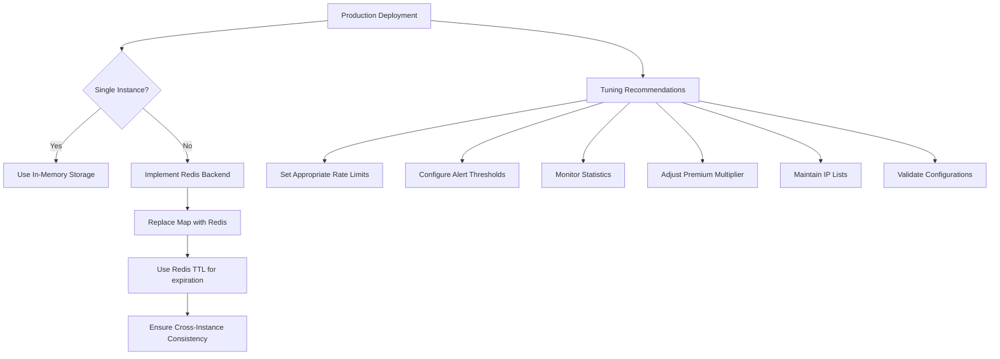

# Rate Limiting

<cite>
**Referenced Files in This Document**   
- [rate-limit.ts](file://src/lib/rate-limit.ts)
- [rate-limit-config.ts](file://src/lib/rate-limit-config.ts)
- [security.ts](file://src/lib/security.ts)
- [rate-limit-monitor.ts](file://src/lib/rate-limit-monitor.ts)
- [middleware.ts](file://src/middleware.ts)
- [route.ts](file://src/app/api/monitoring/rate-limit/route.ts)
</cite>

## Table of Contents

1. [Introduction](#introduction)
2. [Core Components](#core-components)
3. [Identifier Construction Strategy](#identifier-construction-strategy)
4. [RateLimiter Service Integration](#ratelimiter-service-integration)
5. [Configuration Options](#configuration-options)
6. [Authenticated User Tracking](#authenticated-user-tracking)
7. [Endpoint-Specific Rate Limiting](#endpoint-specific-rate-limiting)
8. [Response Handling on Limit Exceeded](#response-handling-on-limit-exceeded)
9. [Monitoring and Analytics](#monitoring-and-analytics)
10. [Performance and Production Considerations](#performance-and-production-considerations)

## Introduction

The PORTAL system implements a comprehensive rate limiting mechanism to protect API endpoints from abuse and ensure fair usage. The rate limiting system is built around a higher-order function `withRateLimit` that wraps API route handlers to enforce request quotas based on client IP, HTTP method, and pathname. This document details the implementation, configuration, and usage patterns of the rate limiting system across the PORTAL application.

**Section sources**

- [rate-limit.ts](file://src/lib/rate-limit.ts#L1-L148)
- [rate-limit-config.ts](file://src/lib/rate-limit-config.ts#L1-L194)

## Core Components

The rate limiting system in PORTAL consists of several key components working together to provide robust protection against excessive API usage. At the core is the `withRateLimit` higher-order function that serves as the primary interface for applying rate limits to API routes. This function wraps route handlers and intercepts requests before they reach the business logic, checking against configured limits.

The system integrates with the `RateLimiter` service class which maintains the state of request counts and enforces the actual limits. Configuration is managed through environment variables and predefined rate limiting profiles for different types of endpoints (authentication, data modification, read-only operations, etc.). The implementation supports both IP-based and user-based tracking, with special handling for authenticated users who receive higher limits.



**Diagram sources**

- [rate-limit.ts](file://src/lib/rate-limit.ts#L10-L88)
- [security.ts](file://src/lib/security.ts#L78-L279)

**Section sources**

- [rate-limit.ts](file://src/lib/rate-limit.ts#L1-L148)
- [security.ts](file://src/lib/security.ts#L77-L279)

## Identifier Construction Strategy

The rate limiting system constructs unique identifiers for tracking request quotas by combining multiple request attributes. The identifier format is `${clientIP}-${req.method}-${req.nextUrl.pathname}`, which creates a composite key based on the client's IP address, HTTP method, and requested path.

IP address extraction follows a prioritized approach, checking multiple headers to accurately identify the client IP in various deployment scenarios:

- `x-forwarded-for` (standard proxy header)
- `x-real-ip` (commonly used by load balancers)
- `x-client-ip` (alternative client IP header)
- Falls back to 'unknown' if no IP can be determined

This composite identifier ensures that rate limits are applied appropriately based on the specific combination of client, method, and endpoint. For example, GET requests to `/api/users` and POST requests to the same path are tracked separately, preventing aggressive POST usage from affecting legitimate GET requests.



**Diagram sources**

- [rate-limit.ts](file://src/lib/rate-limit.ts#L16-L28)
- [middleware.ts](file://src/middleware.ts#L3-L229)

**Section sources**

- [rate-limit.ts](file://src/lib/rate-limit.ts#L16-L28)
- [middleware.ts](file://src/middleware.ts#L3-L229)

## RateLimiter Service Integration

The `RateLimiter` class serves as the central service for tracking and enforcing rate limits across the PORTAL application. This singleton class maintains in-memory maps of request attempts and violations, providing methods to check limits, reset counters, and retrieve statistics.

The integration between `withRateLimit` and `RateLimiter` occurs through the `checkLimit` method, which takes the constructed identifier, maximum requests, window duration, user ID, and authentication status as parameters. The method returns an object containing whether the request is allowed, remaining requests, and reset time.

Key features of the RateLimiter service include:

- Whitelist and blacklist support via environment variables
- Premium multiplier for authenticated users (configurable via RATE_LIMIT_PREMIUM_MULTIPLIER)
- Default configuration fallbacks using environment variables
- Violation tracking and logging
- Statistics collection for monitoring

```mermaid
classDiagram
class RateLimiter {
-attempts : Map<string, RateLimitRecord>
-violations : Map<string, number>
-whitelistIPs : Set<string>
-blacklistIPs : Set<string>
-defaultConfig : RateLimitConfig
-premiumMultiplier : number
+checkLimit(identifier, maxAttempts, windowMs, userId, isAuthenticated) : {allowed, remaining, resetTime}
+getRemainingAttempts(identifier) : number
+getRemainingTime(identifier) : number
+reset(identifier) : void
+resetAll() : void
+getStats() : RateLimitStats
}
class RateLimitRecord {
+count : number
+resetTime : number
+firstRequest : number
}
class RateLimitConfig {
+maxRequests : number
+windowMs : number
+skipSuccessfulRequests? : boolean
+skipFailedRequests? : boolean
}
RateLimiter --> RateLimitRecord : "maintains"
RateLimiter --> RateLimitConfig : "uses"
```

**Diagram sources**

- [security.ts](file://src/lib/security.ts#L78-L279)
- [rate-limit.ts](file://src/lib/rate-limit.ts#L4-L9)

**Section sources**

- [security.ts](file://src/lib/security.ts#L78-L279)
- [rate-limit.ts](file://src/lib/rate-limit.ts#L30-L37)

## Configuration Options

The rate limiting system provides several configuration options to customize behavior for different endpoints and scenarios. These options are defined in the `RateLimitOptions` interface and can be passed to the `withRateLimit` function.

The primary configuration parameters are:

- `maxRequests`: Maximum number of requests allowed within the window
- `windowMs`: Time window in milliseconds for the rate limit
- `skipSuccessfulRequests`: Whether to reset the counter after successful responses
- `skipFailedRequests`: Whether to reset the counter after failed responses

These options can be set directly when using `withRateLimit`, or through environment variables when using the pre-configured rate limiters. The system uses environment variables with defaults to ensure flexibility across deployment environments:

```mermaid
flowchart TD
A[Environment Variables] --> B[RATE_LIMIT_AUTH_MAX]
A --> C[RATE_LIMIT_AUTH_WINDOW]
A --> D[RATE_LIMIT_DATA_MODIFY_MAX]
A --> E[RATE_LIMIT_DATA_MODIFY_WINDOW]
A --> F[RATE_LIMIT_READ_MAX]
A --> G[RATE_LIMIT_READ_WINDOW]
A --> H[RATE_LIMIT_UPLOAD_MAX]
A --> I[RATE_LIMIT_UPLOAD_WINDOW]
A --> J[RATE_LIMIT_SEARCH_MAX]
A --> K[RATE_LIMIT_SEARCH_WINDOW]
A --> L[RATE_LIMIT_DASHBOARD_MAX]
A --> M[RATE_LIMIT_DASHBOARD_WINDOW]
A --> N[RATE_LIMIT_API_MAX]
A --> O[RATE_LIMIT_API_WINDOW]
B --> P[authRateLimit]
C --> P
D --> Q[dataModificationRateLimit]
E --> Q
F --> R[readOnlyRateLimit]
G --> R
H --> S[uploadRateLimit]
I --> S
J --> T[searchRateLimit]
K --> T
L --> U[dashboardRateLimit]
M --> U
N --> V[apiRateLimit]
O --> V
```



**Diagram sources**

- [rate-limit.ts](file://src/lib/rate-limit.ts#L92-L147)
- [env-validation.ts](file://src/lib/env-validation.ts#L39-L80)

**Section sources**

- [rate-limit.ts](file://src/lib/rate-limit.ts#L4-L9)
- [env-validation.ts](file://src/lib/env-validation.ts#L39-L80)

## Authenticated User Tracking

The rate limiting system provides enhanced tracking for authenticated users through the `x-user-id` header. When a request includes authentication credentials, the system extracts the user ID and passes it to the `RateLimiter.checkLimit` method along with the authentication status.

Authenticated users receive preferential treatment through the premium multiplier mechanism. The `RATE_LIMIT_PREMIUM_MULTIPLIER` environment variable (default: 2.0) increases the maximum request limit for authenticated users. This allows legitimate users with valid sessions to make more requests while still protecting against abuse.

The authentication status is determined by the presence of an `authorization` header in the request. The middleware automatically adds the `x-user-id` header to authenticated requests, enabling the rate limiting system to distinguish between anonymous and authenticated traffic.



**Diagram sources**

- [rate-limit.ts](file://src/lib/rate-limit.ts#L23-L37)
- [middleware.ts](file://src/middleware.ts#L200-L212)

**Section sources**

- [rate-limit.ts](file://src/lib/rate-limit.ts#L23-L37)
- [middleware.ts](file://src/middleware.ts#L200-L212)

## Endpoint-Specific Rate Limiting

PORTAL implements endpoint-specific rate limiting through a configuration-driven approach using the `RATE_LIMIT_CONFIGS` array in `rate-limit-config.ts`. This configuration maps URL patterns to specific rate limiting functions based on the endpoint's sensitivity and usage patterns.

The system defines different rate limiting profiles for various endpoint categories:

- Authentication endpoints: Strict limits (10 attempts per 10 minutes)
- Data modification endpoints: Moderate limits (50 requests per 15 minutes)
- Read-only endpoints: Higher limits (200 requests per 15 minutes)
- Upload endpoints: Very strict limits (10 uploads per minute)
- Search endpoints: Moderate limits (30 searches per minute)
- Dashboard endpoints: High frequency limits (60 requests per minute)

The `applyGlobalRateLimit` function in `rate-limit-config.ts` determines which rate limiter to apply based on the request pathname, using regular expression patterns to match endpoints to their appropriate rate limiting profile.



**Diagram sources**

- [rate-limit-config.ts](file://src/lib/rate-limit-config.ts#L21-L107)
- [middleware.ts](file://src/middleware.ts#L110-L127)

**Section sources**

- [rate-limit-config.ts](file://src/lib/rate-limit-config.ts#L21-L107)
- [middleware.ts](file://src/middleware.ts#L110-L127)

## Response Handling on Limit Exceeded

When a client exceeds the rate limit, the system returns a 429 Too Many Requests response with detailed information to guide the client. The response includes both JSON payload and HTTP headers to provide comprehensive rate limit information.

The JSON response body contains:

- Error message in Turkish: "Çok fazla istek gönderdiniz. Lütfen biraz bekleyin."
- Retry-after guidance in seconds
- Error code: 'RATE_LIMIT_EXCEEDED'

HTTP headers include:

- `Retry-After`: Number of seconds until the limit resets
- `X-RateLimit-Remaining`: Number of requests remaining in current window
- `X-RateLimit-Reset`: ISO timestamp when the limit resets

The system also supports conditional counting through the `skipSuccessfulRequests` and `skipFailedRequests` options. When configured, successful responses (status < 400) or failed responses (status >= 400) can be excluded from rate limit counting, allowing for more nuanced rate limiting strategies.

```mermaid
flowchart TD
A[Rate Limit Exceeded] --> B[Calculate Remaining Time]
B --> C[Create 429 Response]
C --> D[Set JSON Body]
D --> E[error: "Çok fazla istek..."]
D --> F[retryAfter: seconds]
D --> G[code: "RATE_LIMIT_EXCEEDED"]
C --> H[Set Headers]
H --> I[Retry-After: seconds]
H --> J[X-RateLimit-Remaining: 0]
H --> K[X-RateLimit-Reset: ISO]
C --> L[Return Response]
```

**Diagram sources**

- [rate-limit.ts](file://src/lib/rate-limit.ts#L39-L59)
- [rate-limit.ts](file://src/lib/rate-limit.ts#L65-L76)

**Section sources**

- [rate-limit.ts](file://src/lib/rate-limit.ts#L39-L59)
- [rate-limit.ts](file://src/lib/rate-limit.ts#L65-L76)

## Monitoring and Analytics

The rate limiting system includes comprehensive monitoring capabilities through the `RateLimitMonitor` class and the `/api/monitoring/rate-limit` endpoint. This monitoring system tracks violations, generates statistics, and provides alerting for suspicious activity.

Key monitoring features include:

- Violation tracking with detailed metadata (IP, endpoint, user ID, etc.)
- Statistics collection for requests, violations, and violation rates
- Top violators identification
- Endpoint-specific statistics
- Alert thresholds for high violation rates or large numbers of violating IPs

The monitoring endpoint supports several actions via query parameters:

- `stats`: Get overall statistics for a time range
- `violations`: Get recent violations
- `ip-stats`: Get statistics for a specific IP address
- `export`: Export all monitoring data as JSON
- `reset`: Reset monitoring data (admin only)



**Diagram sources**

- [rate-limit-monitor.ts](file://src/lib/rate-limit-monitor.ts#L1-L49)
- [route.ts](file://src/app/api/monitoring/rate-limit/route.ts#L1-L195)

**Section sources**

- [rate-limit-monitor.ts](file://src/lib/rate-limit-monitor.ts#L1-L49)
- [route.ts](file://src/app/api/monitoring/rate-limit/route.ts#L1-L195)

## Performance and Production Considerations

The rate limiting implementation in PORTAL is designed with performance and production readiness in mind. While currently using in-memory storage for rate limit tracking, the system is structured to support Redis or other distributed storage solutions for production environments.

Key performance considerations:

- The in-memory implementation is suitable for single-instance deployments
- For multi-instance deployments, Redis would provide consistent state across instances
- The `RateLimiter` class could be extended to use Redis instead of JavaScript Maps
- Memory usage is controlled by automatically expiring old records
- The monitoring system limits stored violations to prevent memory bloat

For production environments, the following tuning recommendations apply:

- Configure appropriate rate limits based on endpoint sensitivity and expected usage
- Set up alerting for high violation rates or large numbers of violating IPs
- Monitor the rate limit statistics endpoint regularly
- Adjust the premium multiplier based on user trust levels
- Consider implementing a Redis backend for multi-instance deployments
- Regularly review and update the whitelist and blacklist IP lists

The system also provides configuration validation through the `validateRateLimitConfig` function, which checks for duplicate patterns and missing required properties in the rate limit configurations.



**Diagram sources**

- [security.ts](file://src/lib/security.ts#L79-L80)
- [rate-limit-config.ts](file://src/lib/rate-limit-config.ts#L164-L193)

**Section sources**

- [security.ts](file://src/lib/security.ts#L79-L80)
- [rate-limit-config.ts](file://src/lib/rate-limit-config.ts#L164-L193)
