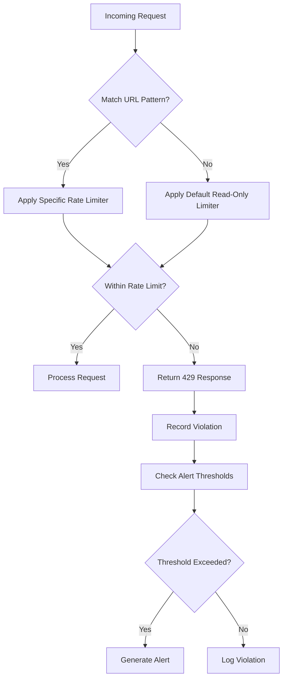
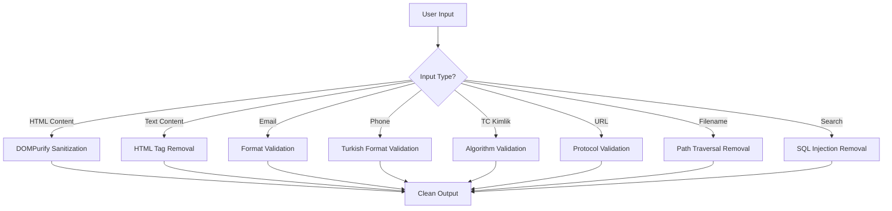
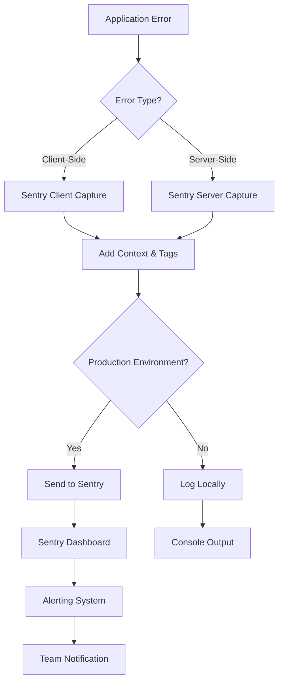

# Security Implementation

<cite>
**Referenced Files in This Document**   
- [csrf.ts](file://src/lib/csrf.ts)
- [rate-limit.ts](file://src/lib/rate-limit.ts)
- [rate-limit-config.ts](file://src/lib/rate-limit-config.ts)
- [rate-limit-monitor.ts](file://src/lib/rate-limit-monitor.ts)
- [sanitization.ts](file://src/lib/sanitization.ts)
- [aid-application.ts](file://src/lib/validations/aid-application.ts)
- [kumbara.ts](file://src/lib/validations/kumbara.ts)
- [meeting.ts](file://src/lib/validations/meeting.ts)
- [task.ts](file://src/lib/validations/task.ts)
- [session.ts](file://src/lib/auth/session.ts)
- [password.ts](file://src/lib/auth/password.ts)
- [logger.ts](file://src/lib/logger.ts)
- [sentry.client.config.ts](file://sentry.client.config.ts)
- [sentry.server.config.ts](file://sentry.server.config.ts)
- [auth-utils.ts](file://src/lib/api/auth-utils.ts)
- [http-cache.ts](file://src/lib/http-cache.ts)
</cite>

## Table of Contents

1. [CSRF Protection](#csrf-protection)
2. [Rate Limiting Strategy](#rate-limiting-strategy)
3. [Input Validation and Sanitization](#input-validation-and-sanitization)
4. [Authentication and Authorization](#authentication-and-authorization)
5. [Data Protection Measures](#data-protection-measures)
6. [Error Monitoring and Logging with Sentry](#error-monitoring-and-logging-with-sentry)
7. [Security Best Practices for Developers](#security-best-practices-for-developers)

## CSRF Protection

The PORTAL application implements a robust Cross-Site Request Forgery (CSRF) protection mechanism to safeguard state-changing operations. The implementation follows a token-based approach where a cryptographically secure token is generated and validated for each session.

CSRF tokens are generated using Node.js's `crypto.randomBytes()` function, producing a 32-character hexadecimal string. These tokens are stored in a cookie named `csrf-token` with the following security attributes:

- `httpOnly: false` to allow client-side JavaScript access
- `secure: true` in production environments to enforce HTTPS
- `sameSite: 'strict'` to prevent cross-origin requests
- `maxAge: 86400` (24 hours) for token expiration

The CSRF token generation endpoint is available at `/api/csrf` (GET), which either returns an existing token or generates a new one if none exists. Client-side applications can retrieve the token using the `getCsrfTokenFromCookie()` utility function and include it in subsequent requests via the `x-csrf-token` header.

The validation process employs constant-time comparison to prevent timing attacks, ensuring that the token validation is secure against side-channel attacks. The implementation includes a fetch wrapper `fetchWithCsrf()` that automatically includes the CSRF token in requests for methods that modify data (POST, PUT, PATCH, DELETE).

**Section sources**

- [csrf.ts](file://src/lib/csrf.ts#L1-L90)
- [route.ts](file://src/app/api/csrf/route.ts#L1-L43)
- [http-cache.ts](file://src/lib/http-cache.ts#L167-L221)

## Rate Limiting Strategy

PORTAL implements a comprehensive rate limiting strategy using Redis-based tracking to protect API endpoints from abuse and denial-of-service attacks. The system employs different rate limiting policies based on endpoint categories and user authentication status.

The rate limiting configuration is defined in `RATE_LIMIT_CONFIGS`, which maps URL patterns to specific rate limiting functions. The system implements several pre-configured rate limiters:

- **Authentication endpoints**: 5 requests per 5 minutes
- **File uploads**: 10 uploads per minute
- **Data modification**: 50 requests per 15 minutes
- **Read-only operations**: 200 requests per 15 minutes
- **Search operations**: 30 searches per minute
- **Dashboard endpoints**: 60 requests per minute

Rate limiting is applied globally through the `applyGlobalRateLimit` middleware, which matches incoming requests to the appropriate rate limiting configuration based on the URL pattern. For authenticated requests, the system tracks limits per user, while unauthenticated requests are limited by IP address.

The implementation includes a monitoring system that tracks rate limit violations and generates alerts when thresholds are exceeded. The monitoring service records violation details including IP address, endpoint, method, user agent, and authentication status. Alert thresholds are configured for:

- High violation rates (>10% of requests)
- Excessive violating IPs (>100 per hour)
- Endpoint-specific violations (>50 per endpoint)

Administrators can monitor rate limiting statistics through the `/api/monitoring/rate-limit` endpoint, which provides insights into recent violations, top violators, and endpoint-specific statistics.

**Diagram sources**

- [rate-limit-config.ts](file://src/lib/rate-limit-config.ts#L1-L194)
- [rate-limit.ts](file://src/lib/rate-limit.ts#L1-L148)
- [rate-limit-monitor.ts](file://src/lib/rate-limit-monitor.ts#L1-L304)

**Section sources**

- [rate-limit-config.ts](file://src/lib/rate-limit-config.ts#L1-L194)
- [rate-limit.ts](file://src/lib/rate-limit.ts#L1-L148)
- [rate-limit-monitor.ts](file://src/lib/rate-limit-monitor.ts#L1-L304)
- [route.ts](file://src/app/api/monitoring/rate-limit/route.ts#L1-L160)

## Input Validation and Sanitization

PORTAL employs a multi-layered approach to input validation and sanitization to prevent common security vulnerabilities such as XSS, SQL injection, and path traversal attacks.

### Zod Schema Validation

The application uses Zod for runtime validation of data structures, particularly for API requests and database operations. Several validation schemas are implemented for different entities:

- **Aid Application Validation**: Validates application data including applicant information, aid types, and processing details
- **Kumbara Donation Validation**: Validates donation details including donor information, amounts, and location data
- **Meeting Validation**: Validates meeting details including dates, participants, and agenda items
- **Task Validation**: Validates task details including titles, priorities, and due dates

These schemas enforce type safety, required fields, and value constraints, ensuring that only properly formatted data is processed by the application.

### Data Sanitization

The application implements comprehensive data sanitization through the `sanitization.ts` library, which provides functions to clean various types of input:

- **HTML Sanitization**: Uses DOMPurify to remove dangerous HTML elements and attributes while preserving safe formatting
- **Text Sanitization**: Removes HTML tags and special characters from plain text
- **Email Validation**: Validates email format and normalizes case
- **Phone Number Sanitization**: Validates Turkish phone number format and normalizes to international format
- **TC Kimlik No Validation**: Validates Turkish ID numbers using the official algorithm
- **URL Sanitization**: Blocks dangerous protocols (javascript:, data:) and validates URL format
- **Filename Sanitization**: Removes path traversal attempts and dangerous characters
- **Search Query Sanitization**: Removes SQL injection attempts and special query characters
- **Number Sanitization**: Handles Turkish number format (dot as thousand separator, comma as decimal)

The sanitization process is applied at multiple levels:

1. Client-side form validation using Zod schemas
2. Server-side input validation in API routes
3. Database operation validation
4. Output encoding when rendering user-generated content

**Diagram sources**

- [sanitization.ts](file://src/lib/sanitization.ts#L1-L412)
- [aid-application.ts](file://src/lib/validations/aid-application.ts#L1-L70)
- [kumbara.ts](file://src/lib/validations/kumbara.ts#L1-L241)
- [meeting.ts](file://src/lib/validations/meeting.ts#L1-L171)
- [task.ts](file://src/lib/validations/task.ts#L1-L238)

**Section sources**

- [sanitization.ts](file://src/lib/sanitization.ts#L1-L412)
- [aid-application.ts](file://src/lib/validations/aid-application.ts#L1-L70)
- [kumbara.ts](file://src/lib/validations/kumbara.ts#L1-L241)
- [meeting.ts](file://src/lib/validations/meeting.ts#L1-L171)
- [task.ts](file://src/lib/validations/task.ts#L1-L238)

## Authentication and Authorization

PORTAL implements a robust authentication and authorization system based on session management with granular permission controls.

### Session Management

The authentication system uses server-side sessions stored in a secure cookie named `auth-session`. The session cookie is configured with the following security attributes:

- `httpOnly: true` to prevent client-side JavaScript access
- `secure: true` in production to enforce HTTPS
- `sameSite: 'strict'` to prevent cross-site request forgery
- Appropriate expiration based on user activity

Session data includes the session ID, user ID, and expiration timestamp. The system validates sessions on each request and automatically refreshes them upon successful authentication.

### Password Security

User passwords are securely hashed using bcrypt with 12 salt rounds, providing strong protection against brute force attacks. The system enforces password strength requirements:

- Minimum 8 characters
- Maximum 128 characters
- At least one number
- At least one letter

The password validation function provides clear feedback to users about password requirements while maintaining security.

### Role-Based Access Control

The system implements a role-based access control (RBAC) model with six distinct user roles:

- **SUPER_ADMIN**: Full system access
- **ADMIN**: Administrative functions
- **MANAGER**: Business operations
- **MEMBER**: Standard user access
- **VIEWER**: Read-only access
- **VOLUNTEER**: Limited functionality

Each role has a defined set of permissions that control access to specific features and data. The authorization system validates user permissions for each protected operation, ensuring that users can only access resources they are authorized to use.

The authentication utilities provide helper functions to check user permissions, roles, and authentication status, making it easy to implement secure access control throughout the application.

**Section sources**

- [session.ts](file://src/lib/auth/session.ts#L1-L181)
- [password.ts](file://src/lib/auth/password.ts#L1-L54)
- [auth-utils.ts](file://src/lib/api/auth-utils.ts#L1-L58)

## Data Protection Measures

PORTAL implements comprehensive data protection measures to ensure the confidentiality, integrity, and availability of sensitive information both at rest and in transit.

### Encryption in Transit

All communication between clients and the server is encrypted using HTTPS with modern TLS protocols. The application enforces secure connections through:

- HSTS (HTTP Strict Transport Security) headers
- Secure cookie attributes
- Redirects from HTTP to HTTPS
- Content Security Policy (CSP) headers

API endpoints that handle sensitive operations require additional security headers, including the CSRF token, to prevent cross-site request forgery attacks.

### Data at Rest Protection

Sensitive data stored in the database is protected through several mechanisms:

- **TC Kimlik No Hashing**: Turkish ID numbers are hashed using a secure algorithm before storage
- **Password Hashing**: User passwords are hashed with bcrypt before storage
- **Field-Level Encryption**: Sensitive fields are encrypted before storage
- **Access Controls**: Database access is restricted based on user roles and permissions

The system implements data minimization principles, collecting only the information necessary for its operations and retaining it only for as long as required.

### Audit Logging

All sensitive operations are logged in the audit_logs collection, providing a complete record of user activities. Audit logs include:

- Timestamp of the operation
- User ID and role
- Type of operation
- Target resource
- Outcome (success/failure)
- IP address and user agent

These logs are protected with the same security measures as other sensitive data and are accessible only to authorized personnel.

### Data Export and Privacy

The system complies with KVKK/GDPR regulations by implementing privacy-preserving features:

- User data export capabilities
- Data deletion requests
- Consent management
- Anonymization of personal data where appropriate

When logging or displaying TC Kimlik numbers, the system masks them to show only the first three and last two digits (e.g., 123**\*\***89), protecting user privacy while maintaining functionality.

**Section sources**

- [session.ts](file://src/lib/auth/session.ts#L1-L181)
- [password.ts](file://src/lib/auth/password.ts#L1-L54)
- [logger.ts](file://src/lib/logger.ts#L1-L213)

## Error Monitoring and Logging with Sentry

PORTAL integrates Sentry for comprehensive error monitoring and performance tracking on both client and server sides.

### Sentry Configuration

The application is configured with separate Sentry configurations for client and server environments:

**Client-Side Configuration:**

- DSN from environment variables
- Traces sample rate of 10% in production, 100% in development
- Replay session sample rate of 0% (disabled)
- Replay on error sample rate of 20%
- Release tracking enabled in production
- Environment-specific configuration

**Server-Side Configuration:**

- DSN from environment variables
- Traces sample rate of 10% in production, 100% in development
- Release tracking enabled in production
- Environment-specific configuration
- Filters to prevent development errors from being sent in production

### Logging Implementation

The application uses a custom logger implementation that provides structured logging with the following features:

- Log level filtering (debug, info, warn, error, fatal)
- Contextual information (user ID, request ID, endpoint, method)
- Sensitive data masking
- Stack trace shortening in production
- Integration with Sentry for error reporting

The logger automatically masks sensitive information such as passwords, tokens, and TC Kimlik numbers before logging. When logging errors, the system captures the error message, stack trace, and contextual information, which is then forwarded to Sentry for analysis.

### Monitoring and Alerting

The logging system integrates with Sentry to provide real-time monitoring and alerting:

- Error tracking with full stack traces
- Performance monitoring for critical operations
- User feedback collection
- Release tracking to correlate errors with deployments
- Custom tags and contexts for better error grouping

The system is configured to send only production errors to Sentry, preventing development noise from cluttering the error dashboard. In production, the system captures both caught and uncaught exceptions, providing comprehensive visibility into application stability.

**Diagram sources**

- [sentry.client.config.ts](file://sentry.client.config.ts#L1-L25)
- [sentry.server.config.ts](file://sentry.server.config.ts#L1-L23)
- [logger.ts](file://src/lib/logger.ts#L1-L213)

**Section sources**

- [sentry.client.config.ts](file://sentry.client.config.ts#L1-L25)
- [sentry.server.config.ts](file://sentry.server.config.ts#L1-L23)
- [logger.ts](file://src/lib/logger.ts#L1-L213)

## Security Best Practices for Developers

When extending the PORTAL application, developers should follow these security best practices to maintain the integrity and security of the system.

### CSRF Protection Implementation

When creating new API endpoints that modify data, always ensure CSRF protection is properly implemented:

- Use the existing CSRF utilities (`generateCsrfToken`, `validateCsrfToken`)
- Include the CSRF token in the `x-csrf-token` header for state-changing requests
- Never disable CSRF protection for convenience
- Test CSRF protection thoroughly in development

### Rate Limiting Considerations

When adding new API endpoints, consider the appropriate rate limiting strategy:

- Classify endpoints as authentication, data modification, read-only, or special purpose
- Apply the appropriate rate limiter based on the endpoint category
- Consider the impact on user experience when setting limits
- Monitor usage patterns and adjust limits as needed
- Ensure monitoring is enabled for new endpoints

### Input Validation and Sanitization

Always validate and sanitize input data at multiple levels:

- Implement Zod schemas for complex data structures
- Use the provided sanitization utilities for common input types
- Never trust client-provided data
- Validate data on both client and server sides
- Use parameterized queries to prevent SQL injection
- Sanitize output when rendering user-generated content

### Authentication and Authorization

When implementing new features that require authentication:

- Use the existing session management system
- Implement proper role-based access control
- Never expose sensitive user information
- Use the provided authorization utilities to check permissions
- Follow the principle of least privilege

### Data Protection

When handling sensitive data:

- Always use HTTPS for data transmission
- Hash passwords and sensitive identifiers
- Mask sensitive data in logs and displays
- Implement proper access controls
- Follow data minimization principles
- Comply with privacy regulations (KVKK/GDPR)

### Error Handling and Logging

When implementing error handling:

- Use the centralized logging system
- Never expose sensitive information in error messages
- Implement graceful error recovery
- Use Sentry for production error monitoring
- Include appropriate context in logs
- Mask sensitive data in logs

### General Security Practices

- Keep dependencies up to date
- Regularly review security configurations
- Conduct security testing for new features
- Follow secure coding practices
- Review code for security vulnerabilities
- Stay informed about security best practices

By following these guidelines, developers can ensure that new features maintain the high security standards of the PORTAL application while providing valuable functionality to users.

**Section sources**

- [csrf.ts](file://src/lib/csrf.ts#L1-L90)
- [rate-limit-config.ts](file://src/lib/rate-limit-config.ts#L1-L194)
- [sanitization.ts](file://src/lib/sanitization.ts#L1-L412)
- [session.ts](file://src/lib/auth/session.ts#L1-L181)
- [logger.ts](file://src/lib/logger.ts#L1-L213)
- [sentry.client.config.ts](file://sentry.client.config.ts#L1-L25)
- [sentry.server.config.ts](file://sentry.server.config.ts#L1-L23)
