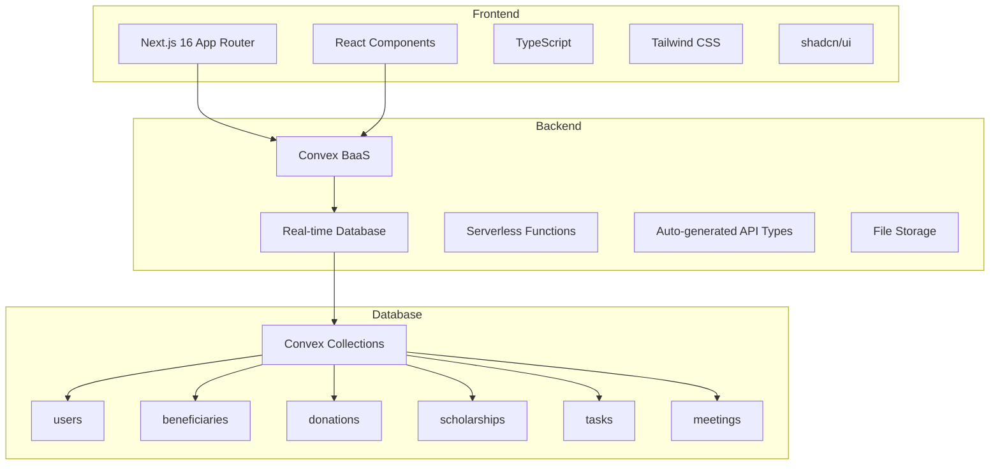
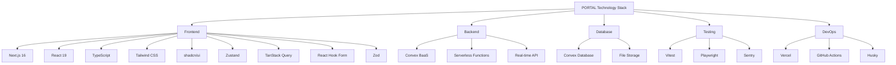
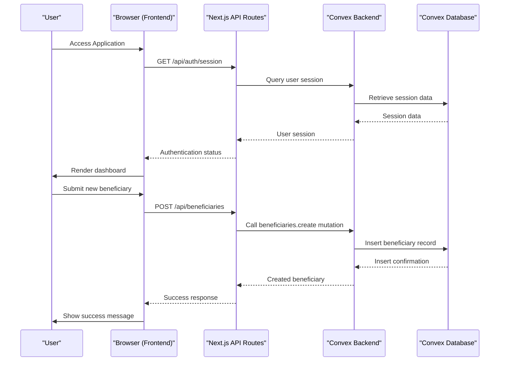
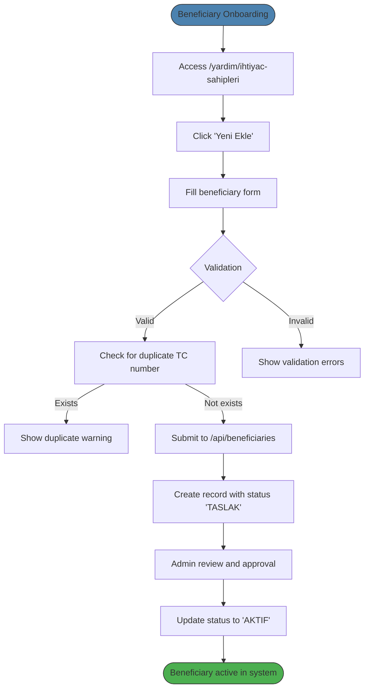
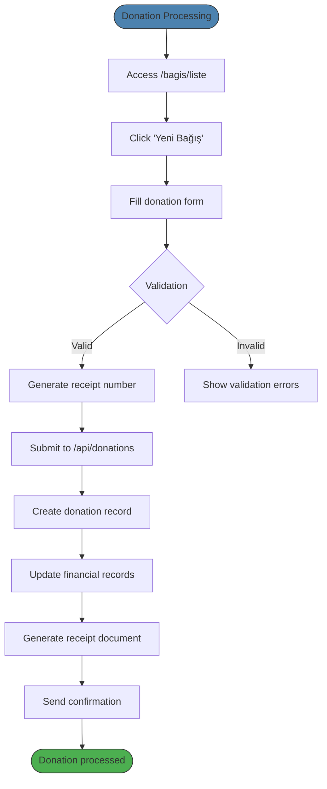

# System Overview

<cite>
**Referenced Files in This Document**   
- [README.md](file://README.md)
- [PROJECT_OVERVIEW.md](file://PROJECT_OVERVIEW.md)
- [TECHNICAL_DEEP_DIVE.md](file://TECHNICAL_DEEP_DIVE.md)
- [beneficiaries.ts](file://convex/beneficiaries.ts)
- [donations.ts](file://convex/donations.ts)
- [route.ts](file://src/app/api/donations/route.ts)
- [client.ts](file://src/lib/convex/client.ts)
- [server.ts](file://src/lib/convex/server.ts)
- [get-user.ts](file://src/lib/auth/get-user.ts)
</cite>

## Table of Contents

1. [Introduction](#introduction)
2. [Core Mission and Purpose](#core-mission-and-purpose)
3. [Architectural Vision](#architectural-vision)
4. [Technology Stack](#technology-stack)
5. [System Architecture](#system-architecture)
6. [Key User Workflows](#key-user-workflows)
7. [Security and Compliance](#security-and-compliance)
8. [Conclusion](#conclusion)

## Introduction

The PORTAL system is a full-stack non-profit association management platform specifically designed for Turkish organizations. Built with Next.js 16 and Convex, PORTAL provides a comprehensive solution for managing beneficiaries, donations, scholarships, tasks, meetings, and financial records. This document provides a detailed overview of the system's architecture, functionality, and implementation, serving both beginners seeking conceptual understanding and experienced developers requiring technical depth.

The platform follows a server-centric Backend-as-a-Service (BaaS) approach, leveraging Convex for real-time database operations and API functionality. With type-safe development throughout the stack using TypeScript, PORTAL ensures robustness and maintainability. The system is designed to handle the specific requirements of Turkish non-profit organizations, including localization for Turkish language, currency (₺), date formats (DD.MM.YYYY), and compliance with TC Kimlik (Turkish ID) validation requirements.

**Section sources**

- [README.md](file://README.md#L1-L254)
- [PROJECT_OVERVIEW.md](file://PROJECT_OVERVIEW.md#L1-L304)

## Core Mission and Purpose

PORTAL's primary mission is to empower Turkish non-profit associations with a comprehensive digital management system that streamlines operations and enhances organizational efficiency. The platform addresses the critical needs of non-profits by providing integrated tools for beneficiary management, donation tracking, scholarship administration, task coordination, meeting management, and financial record keeping.

The system enables organizations to maintain detailed records of beneficiaries (ihtiyaç sahipleri), including personal information, family size, income level, housing type, health status, and education level. For donation management (bağış yönetimi), PORTAL supports various donation types, payment methods, currencies (TRY, USD, EUR), and includes features for receipt generation and tracking. The scholarship system (burs sistemi) facilitates student applications, tracking of academic progress, and management of orphan scholarships (yetim burs).

PORTAL also includes robust task management with Kanban-style boards, meeting management with calendar integration and action item tracking, internal messaging for organizational communication, and comprehensive reporting capabilities for both financial and operational metrics. The platform's design specifically accommodates Turkish organizational requirements, including TC Kimlik number validation, Turkish Lira currency formatting, and localization of all user interface elements into Turkish.

**Section sources**

- [PROJECT_OVERVIEW.md](file://PROJECT_OVERVIEW.md#L11-L27)
- [README.md](file://README.md#L47-L54)

## Architectural Vision

PORTAL follows a server-centric Backend-as-a-Service (BaaS) architectural approach, leveraging Convex as the central platform for database operations, API endpoints, and serverless functions. This architecture enables type-safe development across the entire stack, from frontend components to backend queries and mutations, ensuring consistency and reducing errors.

The system implements a clear separation of concerns between frontend, backend, and database layers while maintaining tight integration through Convex's auto-generated API types. The frontend, built with Next.js 16's App Router, consumes Convex's type-safe API through both client-side React components and server-side API routes. This dual approach allows for real-time data synchronization in interactive components while maintaining security and performance in server-rendered pages.

Type safety is enforced throughout the development process, with TypeScript interfaces automatically generated from Convex's schema definitions. This ensures that data structures remain consistent across the application, from database collections to API responses and frontend components. The architecture also incorporates serverless functions for business logic, eliminating the need for traditional server management while providing scalable performance.

**Diagram sources**

- [README.md](file://README.md#L38-L43)
- [PROJECT_OVERVIEW.md](file://PROJECT_OVERVIEW.md#L34-L50)
- [convex/schema.ts](file://convex/schema.ts)

**Section sources**

- [TECHNICAL_DEEP_DIVE.md](file://TECHNICAL_DEEP_DIVE.md#L1-L124)
- [README.md](file://README.md#L36-L43)

## Technology Stack

PORTAL leverages a modern technology stack optimized for performance, type safety, and developer productivity. The frontend is built with Next.js 16 using the App Router pattern, providing server-side rendering, static site generation, and client-side interactivity. React 19 serves as the UI library, with TypeScript enforcing strict type checking throughout the codebase.

For styling, the system uses Tailwind CSS v4 in conjunction with shadcn/ui components, enabling rapid UI development with consistent design patterns. State management is handled by a combination of Zustand for global state and TanStack Query for server state synchronization. Form handling utilizes React Hook Form with Zod for runtime validation, ensuring data integrity at both client and server levels.

The backend is powered by Convex, which provides a real-time database, serverless functions, and auto-generated type-safe APIs. This Backend-as-a-Service approach eliminates the need for traditional API development while ensuring seamless integration between frontend and backend. Additional technologies include Vercel Analytics for performance monitoring, Sentry for error tracking, and Playwright for end-to-end testing.

**Diagram sources**

- [README.md](file://README.md#L58-L77)
- [PROJECT_OVERVIEW.md](file://PROJECT_OVERVIEW.md#L32-L58)

**Section sources**

- [README.md](file://README.md#L38-L77)
- [PROJECT_OVERVIEW.md](file://PROJECT_OVERVIEW.md#L32-L58)

## System Architecture

The PORTAL system architecture follows a three-tier pattern with clear separation between presentation, application logic, and data storage layers. The frontend layer, implemented with Next.js 16's App Router, handles user interface rendering and client-side interactivity. The backend layer, powered by Convex, manages business logic, authentication, and data validation through serverless functions. The database layer, also provided by Convex, stores all application data in a serverless, real-time database.

Communication between frontend and backend occurs through Convex's type-safe API, which is auto-generated from the database schema. This ensures that all data interactions are type-checked at compile time, reducing runtime errors. The system uses both client-side and server-side Convex clients: the `ConvexReactClient` for real-time data in React components and the `ConvexHttpClient` for server-side operations in API routes.

Authentication is session-based with JWT tokens stored in HttpOnly cookies, providing protection against cross-site scripting (XSS) attacks. The system implements role-based access control (RBAC) with six distinct user roles (SUPER_ADMIN, ADMIN, MANAGER, MEMBER, VIEWER, VOLUNTEER), each with specific permissions for different modules and operations.

**Diagram sources**

- [TECHNICAL_DEEP_DIVE.md](file://TECHNICAL_DEEP_DIVE.md#L125-L174)
- [src/app/api/](file://src/app/api/)
- [convex/](file://convex/)

**Section sources**

- [TECHNICAL_DEEP_DIVE.md](file://TECHNICAL_DEEP_DIVE.md#L125-L174)
- [src/lib/convex/client.ts](file://src/lib/convex/client.ts#L1-L80)
- [src/lib/convex/server.ts](file://src/lib/convex/server.ts#L1-L70)

## Key User Workflows

PORTAL supports several critical user workflows that are essential for non-profit organization operations. These workflows are designed to be intuitive and efficient, guiding users through complex processes with minimal friction.

The beneficiary onboarding workflow begins with a user accessing the beneficiary management interface and selecting "Yeni Ekle" (New Add). The system presents a comprehensive form for collecting personal information, family details, financial status, housing conditions, health information, and educational background. Before submission, the form validates all required fields, including TC Kimlik number format (11 digits) and contact information. Upon submission, the system checks for duplicate TC numbers and creates a new beneficiary record with initial status "TASLAK" (Draft). Administrators can later review and approve the application, changing the status to "AKTIF" (Active).

The donation processing workflow starts with a user navigating to the donation management section and selecting "Yeni Bağış" (New Donation). The form captures donor information (name, phone, email), donation amount and currency (TRY, USD, EUR), payment method, donation purpose, and optional receipt details. The system validates the donation amount (must be positive) and donor information before processing. For physical donations collected through kumbara (piggy banks), additional fields capture collection location, date, and route information. Upon successful processing, the system generates a unique receipt number and updates financial records accordingly.

**Diagram sources**

- [src/app/api/donations/route.ts](file://src/app/api/donations/route.ts#L1-L148)
- [convex/donations.ts](file://convex/donations.ts#L1-L149)
- [convex/beneficiaries.ts](file://convex/beneficiaries.ts#L1-L229)

**Section sources**

- [PROJECT_OVERVIEW.md](file://PROJECT_OVERVIEW.md#L17-L24)
- [src/app/api/donations/route.ts](file://src/app/api/donations/route.ts#L1-L148)
- [convex/beneficiaries.ts](file://convex/beneficiaries.ts#L1-L229)

## Security and Compliance

PORTAL implements a comprehensive security framework to protect sensitive data and ensure compliance with Turkish regulations, particularly KVKK (Personal Data Protection Law). The system incorporates multiple layers of security controls, including authentication, authorization, input validation, and data protection mechanisms.

Authentication is implemented using session-based JWT tokens stored in HttpOnly cookies, which helps prevent cross-site scripting (XSS) attacks. The system enforces CSRF (Cross-Site Request Forgery) protection on all mutation operations, requiring valid CSRF tokens for state-changing requests. Rate limiting is applied to API endpoints to prevent abuse and denial-of-service attacks.

Data security measures include input sanitization to prevent XSS and injection attacks, hashing of sensitive data such as TC Kimlik numbers using bcrypt, and role-based access control (RBAC) with granular permissions. The system implements six user roles with different permission levels, ensuring that users can only access data and perform actions appropriate to their responsibilities.

Compliance with Turkish data protection requirements is addressed through features such as TC Kimlik number validation (11-digit algorithm), consent management for personal data processing, and audit logging of sensitive operations. The system also includes data export functionality that respects privacy requirements while enabling legitimate reporting needs.

**Section sources**

- [README.md](file://README.md#L144-L151)
- [PROJECT_OVERVIEW.md](file://PROJECT_OVERVIEW.md#L133-L157)
- [TECHNICAL_DEEP_DIVE.md](file://TECHNICAL_DEEP_DIVE.md#L175-L222)

## Conclusion

The PORTAL system represents a comprehensive solution for Turkish non-profit association management, combining modern technology with domain-specific functionality. By leveraging Next.js 16 and Convex in a server-centric BaaS architecture, the platform delivers a type-safe, scalable, and maintainable solution for managing beneficiaries, donations, scholarships, tasks, meetings, and financial records.

The system's architecture effectively balances real-time capabilities with security and performance considerations, providing a seamless experience for both end-users and administrators. Through its comprehensive feature set and adherence to Turkish organizational requirements, PORTAL empowers non-profits to streamline their operations, improve data accuracy, and enhance their ability to serve beneficiaries effectively.

The combination of cutting-edge technology, robust security measures, and thoughtful workflow design positions PORTAL as a powerful tool for modern non-profit management in Turkey, addressing both current operational needs and future scalability requirements.
