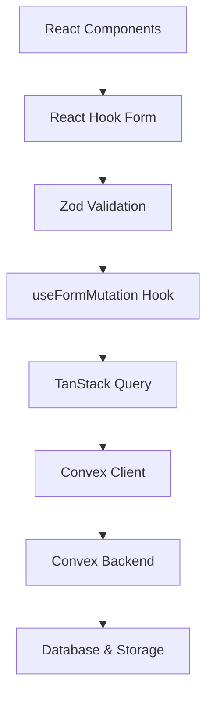
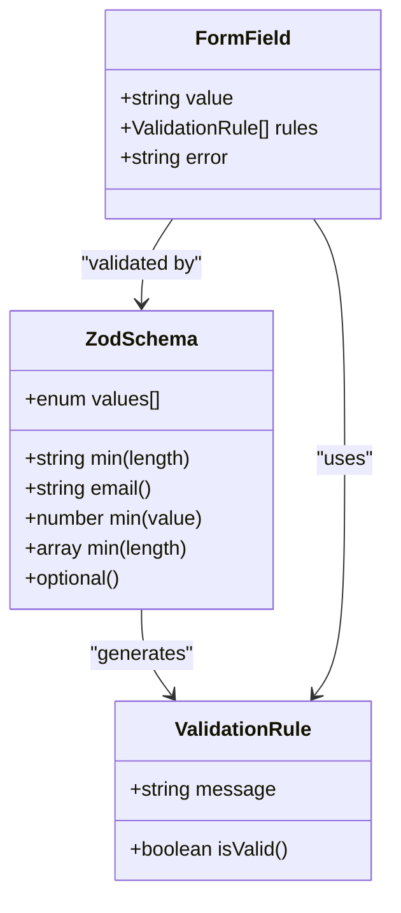
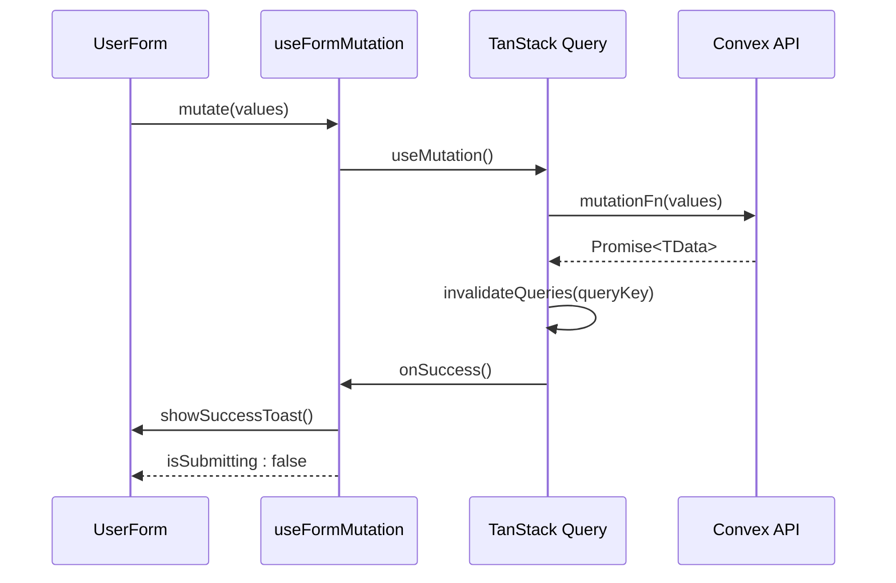

# Technology Stack

<cite>
**Referenced Files in This Document**   
- [package.json](file://package.json)
- [tailwind.config.js](file://tailwind.config.js)
- [user-form.tsx](file://src/components/forms/user-form.tsx)
- [aid-application.ts](file://src/lib/validations/aid-application.ts)
- [client.ts](file://src/lib/convex/client.ts)
- [useFormMutation.ts](file://src/hooks/useFormMutation.ts)
- [route-helpers.ts](file://src/lib/api/route-helpers.ts)
- [api.ts](file://src/lib/convex/api.ts)
- [users/route.ts](file://src/app/api/users/route.ts)
</cite>

## Table of Contents

1. [Next.js 16 (App Router)](#nextjs-16-app-router)
2. [React 19](#react-19)
3. [Convex (BaaS)](#convex-baas)
4. [Tailwind CSS](#tailwind-css)
5. [Zod](#zod)
6. [React Hook Form](#react-hook-form)
7. [Zustand](#zustand)
8. [TanStack Query](#tanstack-query)
9. [Integration Patterns](#integration-patterns)
10. [Configuration and Best Practices](#configuration-and-best-practices)

## Next.js 16 (App Router)

Next.js 16 with the App Router serves as the foundation of the PORTAL application, providing server-side rendering, file-based routing, and API route handling. The App Router pattern is fully implemented in the `src/app` directory, organizing routes hierarchically with layout and page components. This structure enables efficient code splitting, nested layouts, and simplified data fetching patterns.

The application leverages Next.js features such as route handlers in the `src/app/api` directory for server-side API endpoints, middleware for authentication and routing logic, and environment variable management for configuration. The build process is optimized through Next.js's static generation and server-side rendering capabilities, ensuring fast load times and SEO-friendly content delivery.

**Section sources**

- [package.json](file://package.json#L95)
- [middleware.ts](file://src/middleware.ts)

## React 19

React 19 provides the core component model and rendering engine for the PORTAL application. The application utilizes React's modern features including server components, actions, and the updated React Compiler for optimized rendering performance. React 19's enhanced server component capabilities work seamlessly with Next.js 16's App Router to minimize client-side JavaScript while maintaining interactivity.

The component architecture follows React best practices with a clear separation between presentational and container components. Custom hooks like `useFormMutation` encapsulate reusable logic, promoting code reusability and maintainability across the application.

**Section sources**

- [package.json](file://package.json#L98-L100)
- [user-form.tsx](file://src/components/forms/user-form.tsx#L3)

## Convex (BaaS)

Convex serves as the Backend-as-a-Service (BaaS) layer, providing a full-stack development platform that integrates seamlessly with the React frontend. The integration is established through the Convex client initialized in `src/lib/convex/client.ts`, which handles connection management and error handling during both development and build processes.

The application uses Convex for data storage, real-time updates, and serverless function execution. The `src/lib/convex/api.ts` file provides a comprehensive API wrapper that standardizes interactions with Convex functions, abstracting the underlying implementation details. This wrapper exposes methods for all core entities including beneficiaries, donations, users, and meetings, enabling consistent data access patterns throughout the application.

Convex functions are defined in the `convex/` directory and accessed through the generated API types, ensuring type safety and autocompletion. The integration includes proper error handling, connection validation, and build-time safeguards to prevent initialization issues during static generation.

**Diagram sources**

- [client.ts](file://src/lib/convex/client.ts)
- [api.ts](file://src/lib/convex/api.ts)

**Section sources**

- [client.ts](file://src/lib/convex/client.ts)
- [api.ts](file://src/lib/convex/api.ts)
- [users/route.ts](file://src/app/api/users/route.ts#L2)

## Tailwind CSS

Tailwind CSS provides the styling framework for the PORTAL application, enabling utility-first CSS development with a responsive design system. The configuration in `tailwind.config.js` sets up content scanning for all relevant source files, ensuring that all used classes are included in the final build.

The application leverages Tailwind's responsive design capabilities, using class variants for different screen sizes to create a mobile-first responsive interface. The design system is extended through component libraries that wrap common UI patterns with consistent styling, such as buttons, forms, and cards found in the `src/components/ui/` directory.

**Section sources**

- [tailwind.config.js](file://tailwind.config.js)
- [package.json](file://package.json#L151)

## Zod

Zod is used for runtime type checking and data validation throughout the PORTAL application. The schema definition in `src/lib/validations/aid-application.ts` demonstrates the implementation of comprehensive validation rules for application data structures. Zod schemas are used to validate both frontend form inputs and backend API responses, ensuring data integrity across the entire stack.

The integration with React Hook Form through `@hookform/resolvers` enables seamless validation of user inputs, providing immediate feedback to users. Zod's type inference capabilities allow for automatic TypeScript type generation from schemas, reducing the need for duplicate type definitions and ensuring consistency between validation rules and type definitions.

**Diagram sources**

- [aid-application.ts](file://src/lib/validations/aid-application.ts)
- [user-form.tsx](file://src/components/forms/user-form.tsx#L27-L40)

**Section sources**

- [aid-application.ts](file://src/lib/validations/aid-application.ts)
- [user-form.tsx](file://src/components/forms/user-form.tsx#L5)

## React Hook Form

React Hook Form manages form state and validation in the PORTAL application, providing an efficient and flexible approach to handling user inputs. The `UserForm` component in `src/components/forms/user-form.tsx` demonstrates the implementation of a complex form with multiple input types, validation rules, and submission handling.

The integration with Zod through `zodResolver` enables type-safe form validation with comprehensive error messages. React Hook Form's uncontrolled component approach minimizes re-renders and improves performance, especially for forms with many fields. The form implementation includes features such as password generation, field normalization, and permission management through checkbox groups.

**Section sources**

- [user-form.tsx](file://src/components/forms/user-form.tsx)
- [package.json](file://package.json#L101)

## Zustand

Zustand provides state management for the PORTAL application, offering a lightweight and scalable solution for managing global application state. While not explicitly visible in the provided code snippets, Zustand is included as a dependency and is likely used for managing application-wide state such as user authentication, theme preferences, and UI state.

The library's minimal API surface and middleware support make it well-suited for the application's needs, allowing for easy integration with other libraries and tools. Zustand's store creation pattern enables type-safe state management with TypeScript, and its subscription model ensures efficient updates without unnecessary re-renders.

**Section sources**

- [package.json](file://package.json#L109)

## TanStack Query

TanStack Query (formerly React Query) handles data fetching, caching, and synchronization in the PORTAL application. The `useFormMutation` hook in `src/hooks/useFormMutation.ts` demonstrates the integration of TanStack Query for managing form submissions and data mutations.

The hook abstracts common mutation patterns, including query invalidation after successful mutations, loading state management, and error handling with user feedback through toast notifications. This abstraction reduces boilerplate code across form components and ensures consistent behavior for data updates throughout the application.

The implementation includes automatic query invalidation based on query keys, error boundary handling, and success/error callbacks with user feedback. This pattern ensures that the UI stays synchronized with the backend data without requiring manual cache management.

**Diagram sources**

- [useFormMutation.ts](file://src/hooks/useFormMutation.ts)
- [api.ts](file://src/lib/convex/api.ts)

**Section sources**

- [useFormMutation.ts](file://src/hooks/useFormMutation.ts)
- [package.json](file://package.json#L71-L72)

## Integration Patterns

The PORTAL application demonstrates several key integration patterns between the technology stack components. The most prominent pattern is the combination of Zod validation with React Hook Form, which provides type-safe form handling with comprehensive validation rules. This integration is exemplified in the `user-form.tsx` component, where a Zod schema defines the validation rules and is connected to React Hook Form through the `zodResolver`.

Another critical integration pattern is the use of TanStack Query with Convex for data fetching and mutation management. The `useFormMutation` custom hook abstracts the common pattern of invalidating queries after mutations, showing how these libraries work together to manage data synchronization between the frontend and backend.

The application also demonstrates the integration of Next.js API routes with Convex, where server-side endpoints in `src/app/api` use the Convex client to interact with the backend. This pattern enables secure server-side data access while leveraging Convex's real-time capabilities and type safety.

**Section sources**

- [user-form.tsx](file://src/components/forms/user-form.tsx)
- [useFormMutation.ts](file://src/hooks/useFormMutation.ts)
- [users/route.ts](file://src/app/api/users/route.ts)

## Configuration and Best Practices

The PORTAL application follows several best practices in configuring and using its technology stack. The `tailwind.config.js` file is configured to scan all relevant source files, ensuring that all used classes are included in the production build. The Next.js configuration in `package.json` specifies the required Node.js version and includes scripts for development, testing, and deployment.

For form handling, the application uses a consistent pattern of combining React Hook Form with Zod validation, providing both type safety and runtime validation. The `useFormMutation` custom hook demonstrates a best practice of abstracting common mutation patterns to reduce code duplication and ensure consistent behavior across the application.

The Convex integration includes error handling and connection validation, particularly in the client initialization code which handles build-time scenarios and invalid URLs gracefully. This ensures that the application remains stable even when environment variables are not properly configured.

Security best practices are implemented through CSRF protection, input sanitization, and password strength validation, particularly evident in the user management API routes. The application also implements proper error handling and logging throughout the stack, using standardized response formats and error messages.

**Section sources**

- [tailwind.config.js](file://tailwind.config.js)
- [client.ts](file://src/lib/convex/client.ts)
- [route-helpers.ts](file://src/lib/api/route-helpers.ts)
- [users/route.ts](file://src/app/api/users/route.ts)
