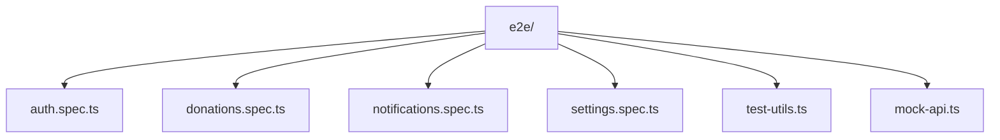
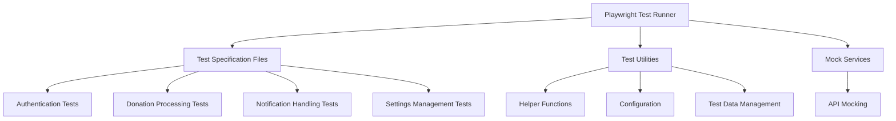
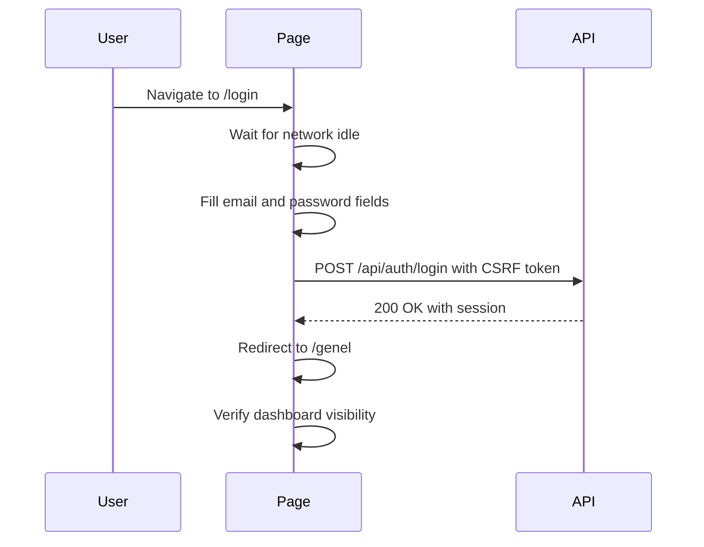
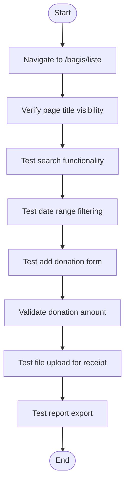
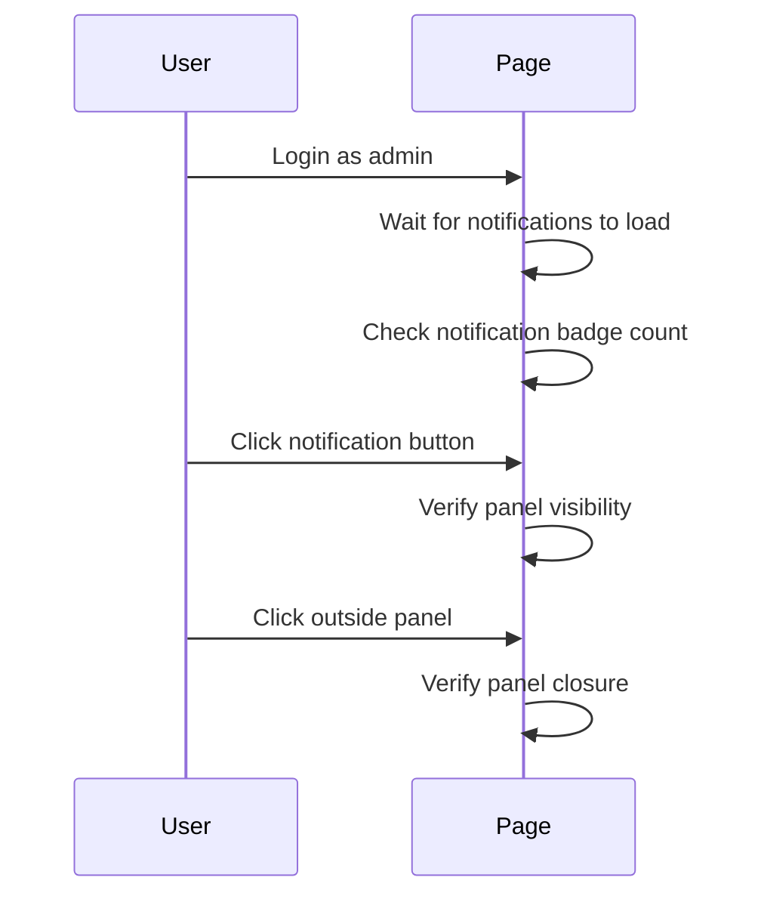
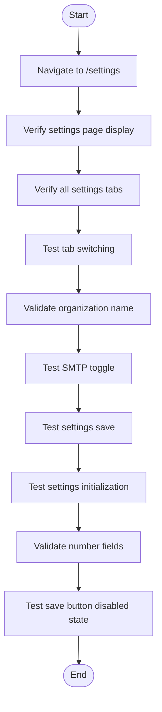
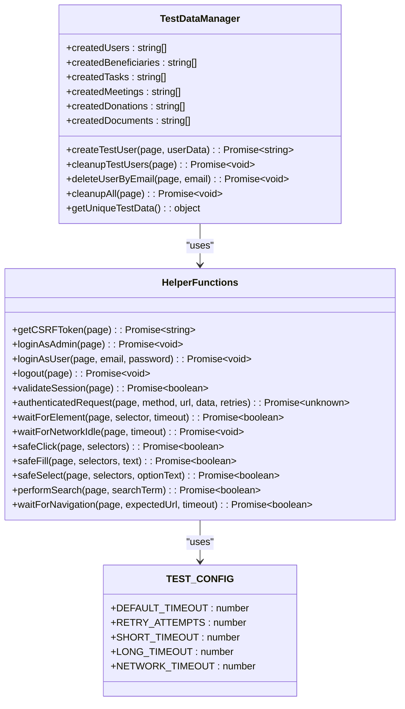
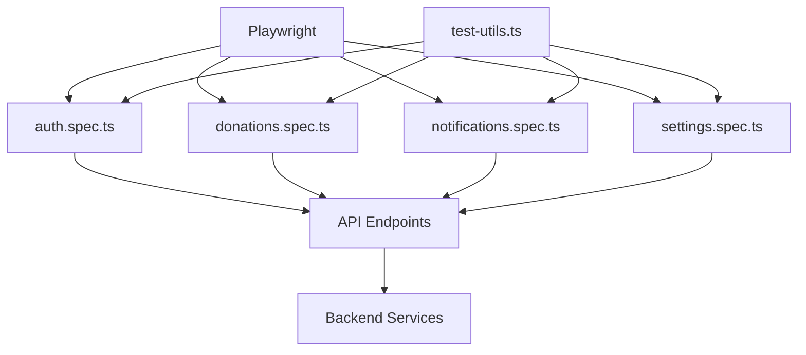

# End-to-End Testing

<cite>
**Referenced Files in This Document**   
- [auth.spec.ts](file://e2e/auth.spec.ts)
- [donations.spec.ts](file://e2e/donations.spec.ts)
- [notifications.spec.ts](file://e2e/notifications.spec.ts)
- [settings.spec.ts](file://e2e/settings.spec.ts)
- [test-utils.ts](file://e2e/test-utils.ts)
- [package.json](file://package.json)
</cite>

## Table of Contents

1. [Introduction](#introduction)
2. [Project Structure](#project-structure)
3. [Core Components](#core-components)
4. [Architecture Overview](#architecture-overview)
5. [Detailed Component Analysis](#detailed-component-analysis)
6. [Dependency Analysis](#dependency-analysis)
7. [Performance Considerations](#performance-considerations)
8. [Troubleshooting Guide](#troubleshooting-guide)
9. [Conclusion](#conclusion)

## Introduction

This document provides a comprehensive overview of the end-to-end testing framework implemented in the PORTAL application using Playwright. It details the testing strategy for critical user workflows such as authentication, donation processing, notification handling, and system settings management. The documentation covers test implementation patterns, isolation strategies, debugging techniques, and CI/CD integration for automated browser testing.

## Project Structure

The end-to-end testing suite is organized within the `e2e/` directory, containing multiple spec files that target specific application modules. Each test file simulates real user interactions with the application, ensuring comprehensive coverage of critical workflows.

**Diagram sources**

- [e2e/](file://e2e/)

**Section sources**

- [e2e/](file://e2e/)

## Core Components

The end-to-end testing framework consists of several core components that work together to provide reliable and maintainable tests. These include test specification files for different application modules, utility functions for common operations, and configuration settings for test execution.

**Section sources**

- [e2e/auth.spec.ts](file://e2e/auth.spec.ts)
- [e2e/donations.spec.ts](file://e2e/donations.spec.ts)
- [e2e/test-utils.ts](file://e2e/test-utils.ts)

## Architecture Overview

The end-to-end testing architecture is built on Playwright, providing a robust framework for browser automation. Tests are organized by feature area, with each spec file focusing on a specific module of the application. The architecture includes utility functions for common operations, configuration settings for test stability, and proper test isolation to ensure reliability.

**Diagram sources**

- [e2e/auth.spec.ts](file://e2e/auth.spec.ts)
- [e2e/donations.spec.ts](file://e2e/donations.spec.ts)
- [e2e/test-utils.ts](file://e2e/test-utils.ts)

## Detailed Component Analysis

### Authentication Testing

The authentication testing suite validates the complete login and logout workflow, including session persistence and protected route access. Tests verify successful login with valid credentials, error handling for invalid credentials, and proper redirection for authenticated and unauthenticated users.

**Diagram sources**

- [e2e/auth.spec.ts](file://e2e/auth.spec.ts#L18-L83)

**Section sources**

- [e2e/auth.spec.ts](file://e2e/auth.spec.ts#L12-L167)

### Donation Processing Testing

The donation processing tests validate the complete workflow for managing donations, including viewing donation lists, filtering by various criteria, searching by donor name, and validating form inputs. Tests also cover different payment methods and donation purposes.

**Diagram sources**

- [e2e/donations.spec.ts](file://e2e/donations.spec.ts#L13-L268)

**Section sources**

- [e2e/donations.spec.ts](file://e2e/donations.spec.ts#L3-L268)

### Notification Handling Testing

The notification testing suite validates the notification panel functionality, including badge count display, panel opening and closing, navigation to notification details, and handling of empty states. Tests ensure proper user interaction with the notification system.

**Diagram sources**

- [e2e/notifications.spec.ts](file://e2e/notifications.spec.ts#L9-L132)

**Section sources**

- [e2e/notifications.spec.ts](file://e2e/notifications.spec.ts#L4-L132)

### Settings Management Testing

The settings management tests validate the complete workflow for managing system settings, including displaying the settings page, navigating between tabs, validating form inputs, and saving settings. Tests also cover permission-based access control for settings management.

**Diagram sources**

- [e2e/settings.spec.ts](file://e2e/settings.spec.ts#L9-L199)

**Section sources**

- [e2e/settings.spec.ts](file://e2e/settings.spec.ts#L4-L199)

### Test Utilities and Configuration

The test utilities provide shared functionality across all test files, including helper functions for common operations, configuration settings for test stability, and test data management. These utilities ensure consistency and reliability across the test suite.

**Diagram sources**

- [e2e/test-utils.ts](file://e2e/test-utils.ts#L4-L794)

**Section sources**

- [e2e/test-utils.ts](file://e2e/test-utils.ts#L1-L794)

## Dependency Analysis

The end-to-end testing framework has dependencies on Playwright for browser automation and various utility functions for test stability. The tests interact with the application's API endpoints and UI components, ensuring proper integration between frontend and backend systems.

**Diagram sources**

- [package.json](file://package.json#L124)
- [e2e/auth.spec.ts](file://e2e/auth.spec.ts)
- [e2e/donations.spec.ts](file://e2e/donations.spec.ts)
- [e2e/notifications.spec.ts](file://e2e/notifications.spec.ts)
- [e2e/settings.spec.ts](file://e2e/settings.spec.ts)
- [e2e/test-utils.ts](file://e2e/test-utils.ts)

**Section sources**

- [package.json](file://package.json#L124)
- [e2e/](file://e2e/)

## Performance Considerations

The test suite includes various performance considerations to ensure reliable and efficient test execution. These include network idle waiting, timeout configurations, retry mechanisms for flaky elements, and progressive delays for retry attempts. The TEST_CONFIG object defines various timeout values to accommodate different test scenarios and network conditions.

**Section sources**

- [e2e/test-utils.ts](file://e2e/test-utils.ts#L4-L10)

## Troubleshooting Guide

When troubleshooting end-to-end tests, consider the following common issues and solutions:

1. **Flaky tests**: Implement retry mechanisms and proper waiting strategies using the provided utility functions.
2. **Element not found**: Use the safeClick and safeFill utility functions that include retry logic and multiple selector fallbacks.
3. **Timeout issues**: Adjust timeout values in the TEST_CONFIG object based on the specific test requirements.
4. **Authentication failures**: Ensure proper CSRF token handling and session management using the provided authentication helpers.
5. **Network issues**: Use the waitForNetworkIdle function to ensure all network requests have completed before proceeding.

**Section sources**

- [e2e/test-utils.ts](file://e2e/test-utils.ts)

## Conclusion

The end-to-end testing framework in PORTAL provides comprehensive coverage of critical user workflows using Playwright. The tests are organized by feature area, with shared utilities for common operations and proper test isolation. The framework includes robust error handling, retry mechanisms, and configuration options to ensure reliable test execution. By following the patterns and practices documented here, developers can maintain and extend the test suite to ensure the application's quality and reliability.
