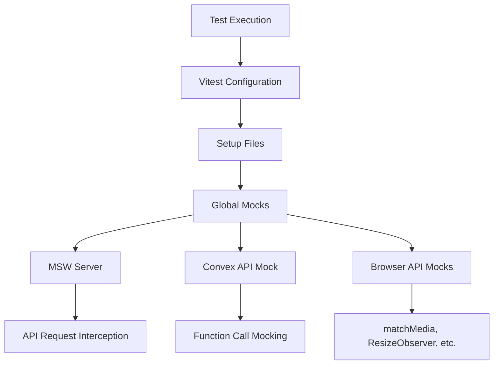

# Testing Strategy

<cite>
**Referenced Files in This Document**   
- [vitest.config.ts](file://vitest.config.ts)
- [package.json](file://package.json)
- [src/__tests__/setup.ts](file://src/__tests__/setup.ts)
- [src/__tests__/mocks/convex-api.ts](file://src/__tests__/mocks/convex-api.ts)
- [src/__tests__/mocks/handlers.ts](file://src/__tests__/mocks/handlers.ts)
- [src/__tests__/mocks/server.ts](file://src/__tests__/mocks/server.ts)
- [src/__tests__/api/auth.test.ts](file://src/__tests__/api/auth.test.ts)
- [src/__tests__/lib/validations/beneficiary.test.ts](file://src/__tests__/lib/validations/beneficiary.test.ts)
- [e2e/auth.spec.ts](file://e2e/auth.spec.ts)
- [e2e/donations.spec.ts](file://e2e/donations.spec.ts)
- [e2e/settings.spec.ts](file://e2e/settings.spec.ts)
- [e2e/notifications.spec.ts](file://e2e/notifications.spec.ts)
- [convex/auth.ts](file://convex/auth.ts)
- [convex/users.ts](file://convex/users.ts)
</cite>

## Table of Contents

1. [Testing Strategy Overview](#testing-strategy-overview)
2. [Unit Testing with Vitest](#unit-testing-with-vitest)
3. [End-to-End Testing with Playwright](#end-to-end-testing-with-playwright)
4. [Test Organization and Structure](#test-organization-and-structure)
5. [Testing Critical Functionality](#testing-critical-functionality)
6. [Test Setup and Mocking Strategy](#test-setup-and-mocking-strategy)
7. [Test Coverage and Reporting](#test-coverage-and-reporting)
8. [Writing Practical Tests](#writing-practical-tests)
9. [Continuous Integration Testing](#continuous-integration-testing)

## Testing Strategy Overview

PORTAL implements a comprehensive multi-layered testing strategy to ensure application reliability, functionality, and performance. The testing framework combines unit testing with Vitest for isolated component and function validation, and end-to-end testing with Playwright for complete user journey verification. This dual approach enables thorough validation of both individual code units and integrated system behavior.

The testing architecture is designed to validate critical application components including authentication flows, CRUD operations across various entities, business logic in Convex functions, and React component interactions. Test files are organized in a structured manner that mirrors the source code organization, facilitating easy maintenance and test discovery.

**Section sources**

- [package.json](file://package.json#L16-L20)
- [vitest.config.ts](file://vitest.config.ts#L1-L45)

## Unit Testing with Vitest

PORTAL utilizes Vitest as the primary unit testing framework for testing individual components, functions, and modules in isolation. Vitest provides a fast, Jest-compatible testing environment with excellent support for modern JavaScript features and React components.

The unit testing strategy focuses on validating business logic, data validation rules, utility functions, and API route handlers. Tests are written using a combination of describe, it, expect, and other Vitest assertions to create clear, readable test specifications. The framework supports mocking of external dependencies through vi.mock() and vi.fn() to isolate the units under test.

Unit tests are organized in the src/**tests** directory, with subdirectories mirroring the structure of the src directory. This organization enables developers to easily locate tests corresponding to specific source files and maintain a clear relationship between tests and implementation.

**Section sources**

- [vitest.config.ts](file://vitest.config.ts#L6-L44)
- [package.json](file://package.json#L16-L19)
- [src/**tests**/setup.ts](file://src/__tests__/setup.ts#L1-L33)

## End-to-End Testing with Playwright

PORTAL implements end-to-end testing using Playwright to validate complete user workflows and system integration. Playwright tests simulate real user interactions with the application, including navigation, form submissions, and UI interactions across different browsers.

The e2e directory contains Playwright test files that validate critical user journeys such as authentication flows, donation management, settings configuration, and notifications handling. Tests are organized by feature area, with separate spec files for authentication, donations, settings, and notifications.

Playwright tests use a describe-block structure to group related tests and beforeEach hooks to ensure consistent test setup. The framework provides robust element selection, interaction capabilities, and network interception features that enable comprehensive testing of complex application behaviors.

**Section sources**

- [package.json](file://package.json#L20-L21)
- [e2e/auth.spec.ts](file://e2e/auth.spec.ts#L1-L307)
- [e2e/donations.spec.ts](file://e2e/donations.spec.ts#L1-L268)
- [e2e/settings.spec.ts](file://e2e/settings.spec.ts#L1-L199)
- [e2e/notifications.spec.ts](file://e2e/notifications.spec.ts#L1-L132)

## Test Organization and Structure

The PORTAL testing suite follows a well-organized structure that separates unit tests from end-to-end tests and groups tests by functionality. Unit tests are located in the src/**tests** directory, while end-to-end tests are in the e2e directory.

Within src/**tests**, tests are organized into subdirectories that mirror the application structure:

- api: Tests for Next.js API routes
- hooks: Tests for custom React hooks
- lib: Tests for utility functions and validation logic
- mocks: Mock implementations for external dependencies
- setup.ts: Test setup and global configuration

The e2e directory contains feature-specific test files:

- auth.spec.ts: Authentication flows
- donations.spec.ts: Donation management
- settings.spec.ts: System settings configuration
- notifications.spec.ts: Notification handling

This organization enables developers to quickly locate relevant tests and understand the testing coverage for different application components.

**Section sources**

- [src/**tests**](file://src/__tests__)
- [e2e](file://e2e)

## Testing Critical Functionality

PORTAL's testing strategy places special emphasis on validating critical application functionality, including authentication, CRUD operations, and business logic in Convex functions.

### Authentication Testing

Authentication flows are thoroughly tested at both the unit and end-to-end levels. Unit tests in src/**tests**/api/auth.test.ts validate individual API route behaviors, including input validation, error handling, and security checks. These tests verify that the login endpoint properly validates email and password inputs, handles invalid credentials, and manages session state.

End-to-end tests in e2e/auth.spec.ts validate the complete authentication user journey, including successful login with valid credentials, error handling for invalid credentials, and proper redirection for authenticated and unauthenticated users.

### CRUD Operations Testing

CRUD operations for key entities such as users, beneficiaries, and donations are tested to ensure data integrity and proper API behavior. The convex/users.ts file contains Convex functions for user management, which are tested through both direct function calls and API route integration tests.

Unit tests validate the business logic within these functions, while end-to-end tests verify the complete workflow from UI interaction to database persistence. This multi-layered approach ensures that CRUD operations work correctly across the entire stack.

### Business Logic in Convex Functions

Convex functions contain critical business logic that is tested extensively. The auth.ts and users.ts files in the convex directory contain query and mutation functions that are tested to ensure proper data access, validation, and transformation.

Unit tests mock the Convex context to isolate and test individual functions, verifying that they handle inputs correctly, perform appropriate database operations, and return expected results. This testing approach ensures that the server-side business logic is reliable and secure.

**Section sources**

- [src/**tests**/api/auth.test.ts](file://src/__tests__/api/auth.test.ts#L6-L167)
- [e2e/auth.spec.ts](file://e2e/auth.spec.ts#L1-L307)
- [convex/auth.ts](file://convex/auth.ts#L1-L82)
- [convex/users.ts](file://convex/users.ts#L1-L220)

## Test Setup and Mocking Strategy

PORTAL employs a comprehensive test setup and mocking strategy to create isolated, reliable tests. The testing environment is configured in vitest.config.ts and src/**tests**/setup.ts, with additional mocking utilities in the src/**tests**/mocks directory.

### MSW for API Mocking

The application uses MSW (Mock Service Worker) to intercept and mock HTTP requests during testing. The src/**tests**/mocks/handlers.ts file defines request handlers for various API endpoints, including authentication, beneficiaries, and dashboard metrics. These handlers return predefined responses that simulate real API behavior without requiring a running backend.

The MSW server is set up in src/**tests**/mocks/server.ts and configured to run in the Node.js environment. This allows unit tests to verify API route behavior with consistent, predictable responses.

### Convex API Mocking

Since Convex functions cannot be directly imported and tested in isolation, PORTAL uses a comprehensive mocking strategy. The src/**tests**/mocks/convex-api.ts file provides a mock implementation of the Convex API with vi.fn() mocks for all exposed functions.

This mock API is aliased in vitest.config.ts, replacing the real Convex API imports with the mock implementation during testing. This allows unit tests to verify that API functions are called with the correct parameters and that the application responds appropriately to different return values.

### Global Test Setup

The src/**tests**/setup.ts file configures the global testing environment, including:

- Importing @testing-library/jest-dom for enhanced assertions
- Mocking browser APIs like matchMedia, ResizeObserver, and IntersectionObserver
- Setting up global mocks for browser features used by the application

This setup ensures that tests run consistently across different environments and that components relying on browser APIs can be tested reliably.

**Diagram sources**

- [vitest.config.ts](file://vitest.config.ts#L10)
- [src/**tests**/setup.ts](file://src/__tests__/setup.ts#L1-L33)
- [src/**tests**/mocks/server.ts](file://src/__tests__/mocks/server.ts#L1-L6)
- [src/**tests**/mocks/handlers.ts](file://src/__tests__/mocks/handlers.ts#L1-L65)
- [src/**tests**/mocks/convex-api.ts](file://src/__tests__/mocks/convex-api.ts#L1-L50)

**Section sources**

- [vitest.config.ts](file://vitest.config.ts#L34-L42)
- [src/**tests**/setup.ts](file://src/__tests__/setup.ts#L1-L33)
- [src/**tests**/mocks/server.ts](file://src/__tests__/mocks/server.ts#L1-L6)
- [src/**tests**/mocks/handlers.ts](file://src/__tests__/mocks/handlers.ts#L1-L65)
- [src/**tests**/mocks/convex-api.ts](file://src/__tests__/mocks/convex-api.ts#L1-L50)

## Test Coverage and Reporting

PORTAL implements comprehensive test coverage tracking and reporting to ensure code quality and identify untested areas. The coverage configuration is defined in vitest.config.ts, using the v8 coverage provider.

The coverage settings include:

- Multiple reporters: text, json, and html for different consumption needs
- Exclusion of test files, node_modules, and third-party code from coverage calculations
- Detailed reporting on statement, branch, function, and line coverage

Coverage reports are generated when running tests with the --coverage flag, providing insights into which parts of the codebase are well-tested and which areas need additional test coverage. The html reporter generates an interactive coverage report that can be examined to drill down into specific files and identify uncovered lines.

This coverage information is used to maintain a high standard of code quality and ensure that critical functionality is thoroughly tested before deployment.

**Section sources**

- [vitest.config.ts](file://vitest.config.ts#L20-L32)

## Writing Practical Tests

PORTAL provides clear patterns for writing practical tests for different types of components and functionality.

### Testing API Routes

API routes are tested by importing the route handlers and calling them with mock request objects. The auth.test.ts file demonstrates this approach, creating NextRequest instances with specific methods, headers, and body content to test different scenarios.

Tests verify the response status, headers, and body content, ensuring that API routes handle both valid and invalid inputs appropriately. The mocking of Convex functions, password utilities, and CSRF validation allows for comprehensive testing of the authentication logic without external dependencies.

### Testing React Components

React components are tested using Vitest with React Testing Library, which provides utilities for rendering components and interacting with them in a way that simulates real user behavior. The setup includes mocking of browser APIs and global objects to ensure consistent test execution.

Component tests focus on user interactions, state changes, and rendering behavior, verifying that components respond correctly to different props and user actions.

### Testing Convex Functions

Convex functions are tested by mocking the Convex context and database operations. The mocking strategy allows tests to verify that functions perform the correct database queries and mutations, handle errors appropriately, and return expected results.

The combination of direct function testing and integration testing through API routes ensures that Convex functions work correctly both in isolation and as part of the complete application flow.

**Section sources**

- [src/**tests**/api/auth.test.ts](file://src/__tests__/api/auth.test.ts#L6-L167)
- [src/**tests**/lib/validations/beneficiary.test.ts](file://src/__tests__/lib/validations/beneficiary.test.ts#L1-L79)

## Continuous Integration Testing

PORTAL integrates testing into the continuous integration and deployment pipeline through npm scripts defined in package.json. These scripts enable automated testing at various stages of development and deployment.

The test scripts include:

- "test": Runs Vitest in watch mode for development
- "test:ui": Launches the Vitest UI for interactive test exploration
- "test:run": Runs Vitest tests without watch mode
- "test:coverage": Runs tests with coverage reporting
- "e2e": Runs Playwright end-to-end tests
- "e2e:ui": Launches Playwright Test UI

These scripts are designed to be used in CI/CD pipelines, where tests are automatically executed on code changes. The coverage reporting helps maintain code quality standards, while the separation of unit and end-to-end tests allows for efficient execution in different pipeline stages.

The integration with Vercel deployment scripts ensures that tests are run before deployment, preventing the release of code that fails to meet quality standards.

**Section sources**

- [package.json](file://package.json#L16-L21)
- [scripts/deploy-vercel.sh](file://scripts/deploy-vercel.sh)
- [scripts/validate-deploy.sh](file://scripts/validate-deploy.sh)
