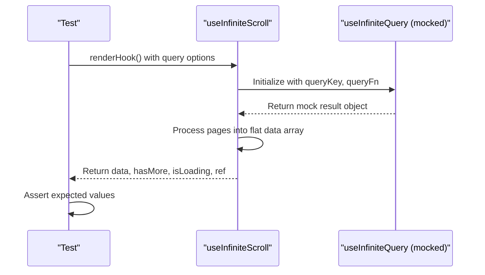
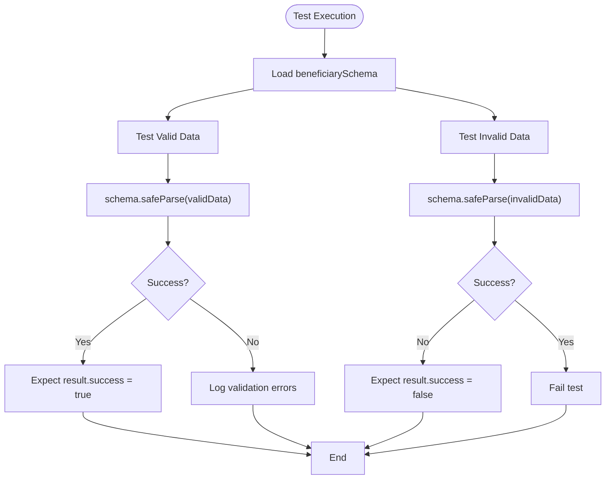

# Unit Testing

<cite>
**Referenced Files in This Document**   
- [vitest.config.ts](file://vitest.config.ts)
- [setup.ts](file://src/__tests__/setup.ts)
- [convex-api.ts](file://src/__tests__/mocks/convex-api.ts)
- [handlers.ts](file://src/__tests__/mocks/handlers.ts)
- [server.ts](file://src/__tests__/mocks/server.ts)
- [useInfiniteScroll.test.ts](file://src/__tests__/hooks/useInfiniteScroll.test.ts)
- [beneficiary.test.ts](file://src/__tests__/lib/validations/beneficiary.test.ts)
- [useInfiniteScroll.ts](file://src/hooks/useInfiniteScroll.ts)
- [beneficiary.ts](file://src/lib/validations/beneficiary.ts)
</cite>

## Table of Contents

1. [Test Configuration](#test-configuration)
2. [Test Organization](#test-organization)
3. [Mocking External Dependencies](#mocking-external-dependencies)
4. [Testing React Components and Hooks](#testing-react-components-and-hooks)
5. [Utility and Validation Testing](#utility-and-validation-testing)
6. [Coverage and Best Practices](#coverage-and-best-practices)

## Test Configuration

The unit testing environment in PORTAL is configured through `vitest.config.ts`, which sets up the testing framework with appropriate environment, aliases, and coverage reporting. The configuration specifies `jsdom` as the test environment to simulate browser-like conditions for React component testing. Global setup is handled via `setup.ts`, which initializes necessary mocks for browser APIs such as `matchMedia`, `ResizeObserver`, and `IntersectionObserver` that are not natively available in Node.js environments.

Module path aliases are configured to redirect Convex-generated API and server modules to mock implementations, ensuring tests do not make actual backend calls. This is achieved by mapping paths like `@/convex/_generated/api` to `src/__tests__/mocks/convex-api.ts`. The test runner includes all files matching `*.test.ts`, `*.test.tsx`, `*.spec.ts`, and `*.spec.tsx` patterns while excluding directories such as `node_modules`, `dist`, and `e2e`.

Code coverage is reported using the `v8` provider with outputs in text, JSON, and HTML formats. The coverage configuration excludes test files, E2E tests, and third-party directories to focus on application logic.

**Section sources**

- [vitest.config.ts](file://vitest.config.ts#L1-L45)
- [setup.ts](file://src/__tests__/setup.ts#L1-L33)

## Test Organization

Unit tests are organized under the `src/__tests__` directory, following a structured hierarchy that mirrors the application's architecture. The main subdirectories include:

- `api/`: Contains tests for API route handlers
- `hooks/`: Houses tests for custom React hooks
- `lib/`: Includes tests for utility functions, validation schemas, and service logic
- `mocks/`: Stores mock implementations for external services and dependencies
- `setup.ts`: Global setup file executed before each test

This organization enables clear separation of concerns and makes it easier to locate tests related to specific functionality. For example, `useInfiniteScroll.test.ts` resides in `hooks/`, while validation logic for beneficiary data is tested in `lib/validations/beneficiary.test.ts`.

**Section sources**

- [src/**tests**](file://src/__tests__)

## Mocking External Dependencies

### Convex Dependency Mocking

To prevent actual calls to the Convex backend during testing, module aliases in `vitest.config.ts` redirect Convex-generated modules to a mock implementation in `convex-api.ts`. This file uses `vi.fn()` from Vitest to create mock functions for all Convex API endpoints such as `auth.login`, `users.list`, and `beneficiaries.create`. These mocks allow tests to simulate successful responses or error conditions without requiring a live backend.

The alias configuration ensures that any import of `@/convex/_generated/api` or similar paths resolves to the mock file, effectively stubbing out all Convex interactions. This approach enables isolated unit testing of components and services that depend on Convex.

### HTTP Request Mocking with MSW

Mock Service Worker (MSW) is used to intercept and mock HTTP requests at the network level. The implementation consists of two key files:

- `handlers.ts`: Defines request handlers for various endpoints such as `/api/auth/login` and `/api/csrf`
- `server.ts`: Sets up the MSW server instance using the defined handlers

These mocks simulate realistic API responses, including success cases with mock user data and error scenarios with appropriate status codes. For example, the login handler returns a mock user object when credentials match `admin@test.com`/`admin123`, otherwise returning a 401 status.

**Section sources**

- [vitest.config.ts](file://vitest.config.ts#L34-L42)
- [convex-api.ts](file://src/__tests__/mocks/convex-api.ts#L1-L50)
- [handlers.ts](file://src/__tests__/mocks/handlers.ts#L1-L65)
- [server.ts](file://src/__tests__/mocks/server.ts#L1-L6)

## Testing React Components and Hooks

React components and custom hooks are tested using `@testing-library/react` in conjunction with Vitest. The `jsdom` environment provides a browser-like DOM for rendering components and simulating user interactions.

### Custom Hook Testing: useInfiniteScroll

The `useInfiniteScroll` hook is thoroughly tested to ensure it correctly integrates with TanStack Query for infinite loading patterns. Tests verify:

- Proper initialization with default and custom options (limit, initial page parameter)
- Correct flattening of paginated data from multiple query pages
- Accurate exposure of loading states (`isLoading`, `isFetchingNextPage`)
- Functionality of the intersection observer ref for triggering page fetches
- Proper handling of empty data states

The tests use Vitest's mocking capabilities to stub `useInfiniteQuery` from TanStack Query, allowing verification of the hook's configuration without making actual API calls.

**Diagram sources**

- [useInfiniteScroll.test.ts](file://src/__tests__/hooks/useInfiniteScroll.test.ts#L1-L260)
- [useInfiniteScroll.ts](file://src/hooks/useInfiniteScroll.ts#L33-L84)

## Utility and Validation Testing

### Validation Schema Testing

Validation logic, particularly for complex forms like beneficiary data, is rigorously tested to ensure data integrity. The `beneficiary.test.ts` file contains tests for the Zod-based validation schema that governs beneficiary form submissions.

Key test cases include:

- Validation of complete, correct data against the schema
- Rejection of incomplete data with missing required fields
- Handling of optional fields with valid formats
- Specialized validation rules such as TC Kimlik No algorithm checking
- Conditional validation (e.g., requiring Mernis check when TC number is provided)
- Age-based restrictions (preventing minors from being marked as married)

The tests use `safeParse` to validate data without throwing exceptions, allowing inspection of validation errors when assertions fail.

**Diagram sources**

- [beneficiary.test.ts](file://src/__tests__/lib/validations/beneficiary.test.ts#L1-L79)
- [beneficiary.ts](file://src/lib/validations/beneficiary.ts#L1-L498)

## Coverage and Best Practices

### Coverage Configuration

The test suite is configured to generate comprehensive coverage reports using the `v8` engine. Reports are output in three formats:

- Text: Console output for quick feedback
- JSON: Machine-readable format for CI/CD integration
- HTML: Interactive reports for detailed analysis

The coverage configuration excludes test files, E2E tests, and third-party code to focus on application logic. This ensures that coverage metrics accurately reflect the quality of business logic rather than test infrastructure.

### Best Practices

The testing strategy follows several best practices:

- **Isolation**: Components and hooks are tested in isolation using mocks for dependencies
- **Comprehensive Assertions**: Tests verify both success and failure cases
- **Edge Cases**: Validation tests include boundary conditions and invalid inputs
- **Setup Files**: Common mocks are centralized in `setup.ts` to avoid duplication
- **Path Resolution**: Aliases ensure consistent module resolution between app and test code

Common issues such as mocking Convex dependencies and resolving path aliases are addressed through the configuration in `vitest.config.ts`, ensuring tests run reliably across different environments.

**Section sources**

- [vitest.config.ts](file://vitest.config.ts#L20-L32)
- [setup.ts](file://src/__tests__/setup.ts#L1-L33)
