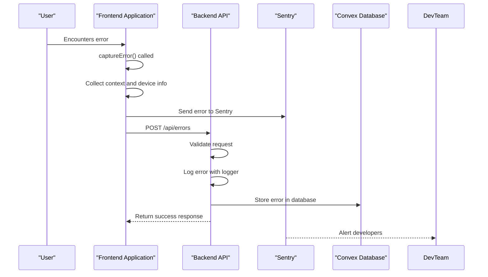
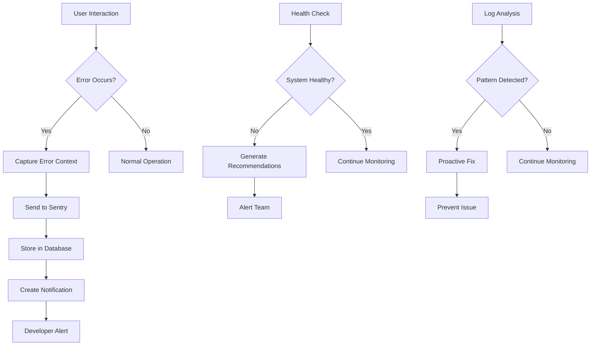

# Diagnostic Procedures

<cite>
**Referenced Files in This Document**   
- [QUICK_STATUS.md](file://QUICK_STATUS.md)
- [src/lib/logger.ts](file://src/lib/logger.ts)
- [src/lib/error-tracker.ts](file://src/lib/error-tracker.ts)
- [src/app/api/errors/route.ts](file://src/app/api/errors/route.ts)
- [convex/errors.ts](file://convex/errors.ts)
- [src/app/api/health/route.ts](file://src/app/api/health/route.ts)
- [sentry.properties](file://sentry.properties)
</cite>

## Table of Contents

1. [Interpreting Quick Status Report Metrics](#interpreting-quick-status-report-metrics)
2. [Diagnostic Workflow for Root Cause Analysis](#diagnostic-workflow-for-root-cause-analysis)
3. [Checklists for Common Diagnostic Scenarios](#checklists-for-common-diagnostic-scenarios)
4. [Development Commands for Testing and Validation](#development-commands-for-testing-and-validation)
5. [Environment-Specific Diagnostic Procedures](#environment-specific-diagnostic-procedures)
6. [Monitoring Tools and Proactive Issue Identification](#monitoring-tools-and-proactive-issue-identification)

## Interpreting Quick Status Report Metrics

The PORTAL application's QUICK_STATUS.md provides a comprehensive overview of the system's health and progress. The completion percentage of 96% indicates that the MVP is nearly complete, with only two critical items remaining. The test coverage of 94.0% (436/464) shows a strong commitment to quality assurance, with recent improvements adding 12 new tests. The production checklist in the quick status report outlines essential requirements that must be met before deployment, including email and SMS services being production-ready, all tests passing, audit logging activation, monitoring setup, backup automation, security audit completion, performance testing, updated documentation, and staging environment testing. The quick status report also highlights completed tasks such as the email service, SMS service with Twilio integration, and analytics endpoint fixes, which contribute to the overall system stability.

**Section sources**

- [QUICK_STATUS.md](file://QUICK_STATUS.md#L1-L321)

## Diagnostic Workflow for Root Cause Analysis

The diagnostic workflow for identifying root causes in the PORTAL application involves examining log files, Sentry reports, and system metrics. The application uses a comprehensive logging system implemented in src/lib/logger.ts that captures debug, info, warn, error, and fatal level messages with context. Sensitive information such as passwords, tokens, and TC identification numbers are automatically masked in logs for security. Error messages are enriched with contextual information including user ID, request ID, endpoint, method, status code, and duration. In production environments, logs are structured as JSON objects containing timestamp, level, message, context, and error details. For error tracking, the system integrates with Sentry, automatically capturing exceptions and sending them to the Sentry dashboard when SENTRY_DSN is configured. The error tracking system in src/lib/error-tracker.ts collects additional context such as device information, performance metrics, and page context to provide comprehensive error reports. System health can be checked via the /api/health endpoint, which performs connectivity tests to the Convex backend and returns detailed reports on validation, connectivity, and recommendations for improvement.

**Diagram sources **

- [src/lib/error-tracker.ts](file://src/lib/error-tracker.ts#L151-L283)
- [src/app/api/errors/route.ts](file://src/app/api/errors/route.ts#L47-L112)
- [convex/errors.ts](file://convex/errors.ts#L13-L128)

**Section sources**

- [src/lib/logger.ts](file://src/lib/logger.ts#L1-L213)
- [src/lib/error-tracker.ts](file://src/lib/error-tracker.ts#L1-L365)
- [src/app/api/errors/route.ts](file://src/app/api/errors/route.ts#L1-L180)
- [src/app/api/health/route.ts](file://src/app/api/health/route.ts#L1-L173)

## Checklists for Common Diagnostic Scenarios

### Authentication Failures

- Verify that the NEXT_PUBLIC_CONVEX_URL environment variable is correctly configured
- Check the authentication tokens for validity and expiration
- Examine the audit logs in convex/audit_logs.ts for authentication-related entries
- Review the user session status and ensure proper session management
- Validate that the CSRF protection is functioning correctly
- Check for any rate limiting issues that might be blocking authentication attempts

### API Errors

- Examine the error details in the errors collection via GET /api/errors
- Check the specific error category (runtime, ui_ux, system, data, security, performance, integration)
- Review the severity level (critical, high, medium, low) to prioritize investigation
- Analyze the stack trace and context information for clues about the root cause
- Verify that the API endpoint is properly configured and accessible
- Check the Convex connectivity by testing the /api/health endpoint with detailed=true parameter
- Review the communication logs in convex/communication_logs.ts for any related issues

### Performance Bottlenecks

- Use the Web Vitals tracking system in components/analytics/WebVitalsTracker.tsx to monitor performance metrics
- Check the function execution times using the measureTime utility in src/lib/logger.ts
- Analyze the database query performance and optimize slow queries
- Monitor the API response times and identify endpoints with high latency
- Review the client-side rendering performance and optimize component re-renders
- Check for any memory leaks or excessive resource consumption
- Use the performance monitoring tools to identify and address performance issues

**Section sources**

- [src/lib/logger.ts](file://src/lib/logger.ts#L198-L208)
- [src/lib/error-tracker.ts](file://src/lib/error-tracker.ts#L115-L132)
- [convex/communication_logs.ts](file://convex/communication_logs.ts#L43-L97)
- [src/app/api/health/route.ts](file://src/app/api/health/route.ts#L50-L93)

## Development Commands for Testing and Validation

The PORTAL application provides several development commands for testing and validation as outlined in the QUICK_STATUS.md file. For development, use "npm run dev" to start the application on port 3000 with Turbopack, and "npm run convex:dev" for Convex development. For quality checks, run "npm run typecheck" to verify TypeScript with zero errors, "npm run lint" to check ESLint with zero errors, "npm run test:run" to execute 450 tests (currently 424 passing), and "npm run e2e" to run Playwright end-to-end tests. For production, use "npm run build" to create a Next.js build, "npm run start" to launch the production server, and "npm run convex:deploy" to deploy to Convex production. These commands enable comprehensive testing and validation of the application at various stages of development and deployment.

**Section sources**

- [QUICK_STATUS.md](file://QUICK_STATUS.md#L220-L237)

## Environment-Specific Diagnostic Procedures

### Development Environment

- Enable debug logging by setting NODE_ENV to development
- Use the detailed health check at /api/health?detailed=true to verify system connectivity
- Monitor console output for detailed error information and stack traces
- Utilize the error tracking system to capture and analyze errors in real-time
- Run unit tests and integration tests frequently to catch issues early
- Use the local Convex development environment for testing database operations

### Staging Environment

- Configure monitoring with Sentry using the SENTRY_DSN environment variable
- Perform end-to-end testing with "npm run e2e" to validate the complete workflow
- Conduct performance testing to identify bottlenecks before production deployment
- Verify that all environment variables are correctly set for the staging environment
- Test the email and SMS services with staging credentials
- Validate that the audit logging is functioning correctly and capturing all required events

### Production Environment

- Monitor the system using the production-ready monitoring setup
- Check the error dashboard at /api/errors for any critical or high-severity issues
- Verify that the backup automation is running correctly and creating daily exports
- Monitor system metrics and performance indicators for any anomalies
- Use the health check endpoint to verify system availability and response times
- Review the communication logs for any failed email or SMS deliveries
- Ensure that the security audit has been completed and all vulnerabilities addressed

**Section sources**

- [QUICK_STATUS.md](file://QUICK_STATUS.md#L270-L275)
- [sentry.properties](file://sentry.properties#L1-L4)
- [src/app/api/health/route.ts](file://src/app/api/health/route.ts#L1-L173)

## Monitoring Tools and Proactive Issue Identification

The PORTAL application employs several monitoring tools to proactively identify potential issues before they become critical. The system integrates with Sentry for comprehensive error tracking, capturing exceptions and providing detailed reports with stack traces, context, and user information. The error tracking system in src/lib/error-tracker.ts automatically retries failed error reports by storing them in localStorage and attempting to resend them periodically. The application includes a health check endpoint at /api/health that provides both basic and detailed system status information, including connectivity to the Convex backend and configuration validation. The logging system in src/lib/logger.ts captures detailed information about system operations, which can be analyzed to identify patterns and potential issues. The error database schema in convex/errors.ts includes fields for tracking error occurrences over time, allowing for trend analysis and identification of recurring issues. The system also includes communication logging in convex/communication_logs.ts to monitor the success and failure rates of email and SMS deliveries. By regularly monitoring these tools and analyzing the collected data, potential issues can be identified and addressed before they impact users.

**Diagram sources **

- [src/lib/error-tracker.ts](file://src/lib/error-tracker.ts#L309-L350)
- [src/app/api/errors/route.ts](file://src/app/api/errors/route.ts#L91-L103)
- [src/app/api/health/route.ts](file://src/app/api/health/route.ts#L50-L140)

**Section sources**

- [src/lib/error-tracker.ts](file://src/lib/error-tracker.ts#L1-L365)
- [src/app/api/errors/route.ts](file://src/app/api/errors/route.ts#L1-L180)
- [src/app/api/health/route.ts](file://src/app/api/health/route.ts#L1-L173)
- [convex/errors.ts](file://convex/errors.ts#L1-L573)
- [sentry.properties](file://sentry.properties#L1-L4)
