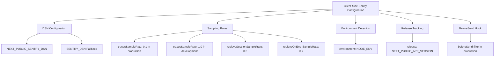
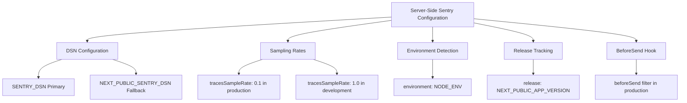
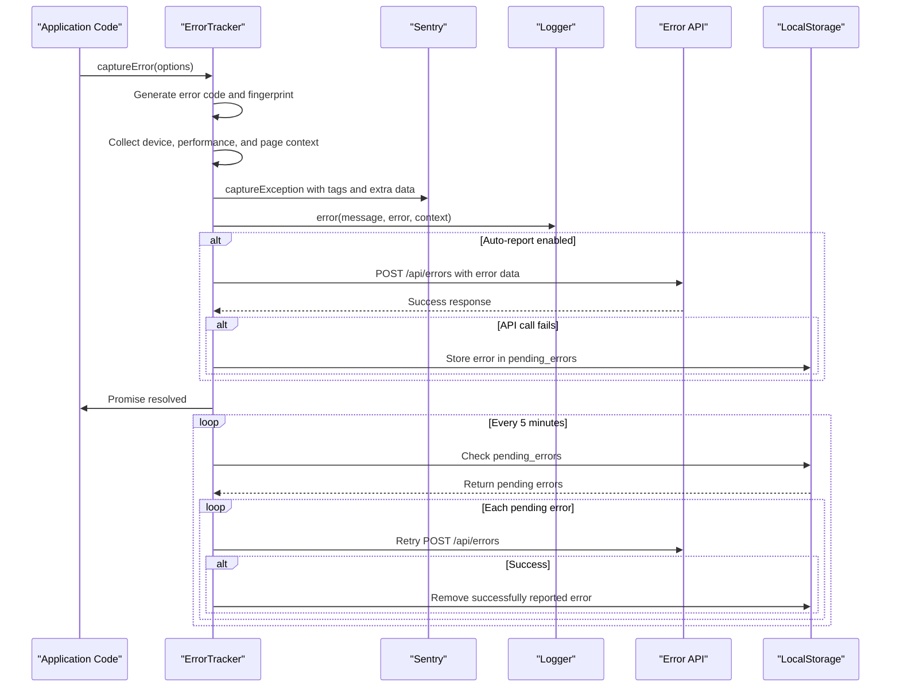
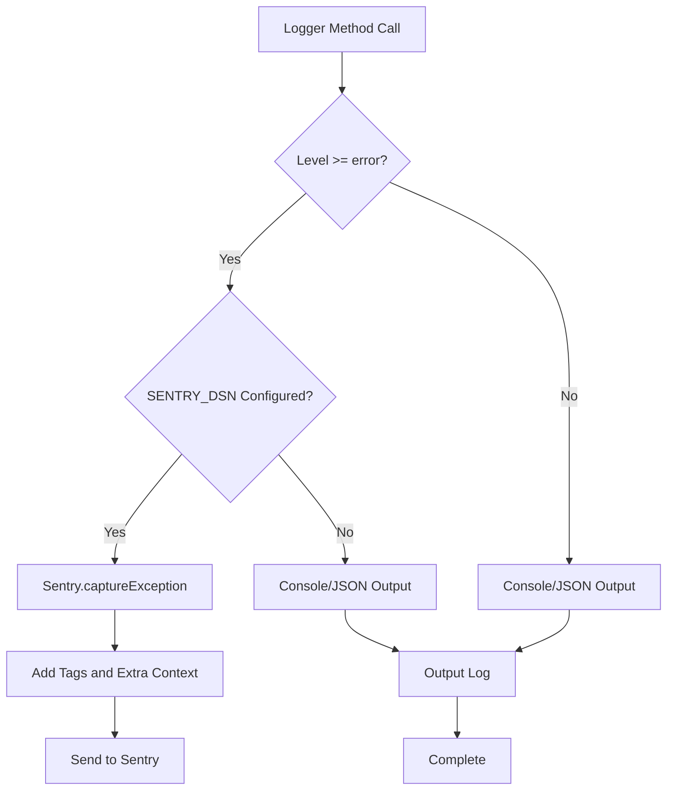
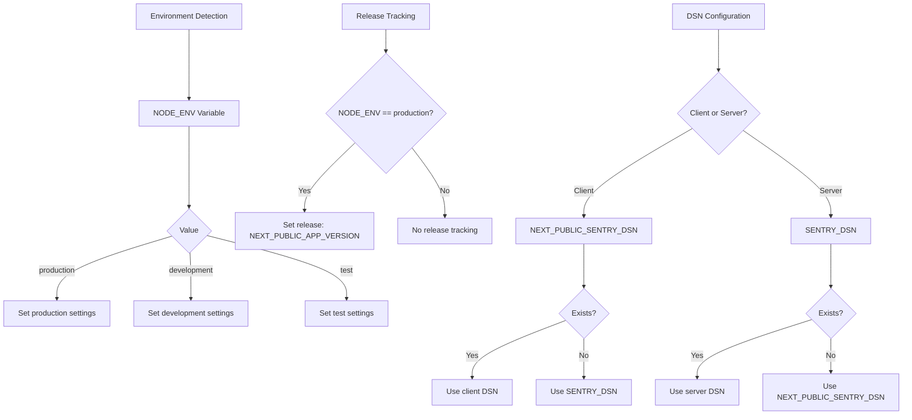

# Error Monitoring with Sentry

<cite>
**Referenced Files in This Document**   
- [sentry.client.config.ts](file://sentry.client.config.ts)
- [sentry.server.config.ts](file://sentry.server.config.ts)
- [src/lib/logger.ts](file://src/lib/logger.ts)
- [src/lib/error-tracker.ts](file://src/lib/error-tracker.ts)
- [src/lib/global-error-handler.ts](file://src/lib/global-error-handler.ts)
- [src/lib/env-validation.ts](file://src/lib/env-validation.ts)
- [src/app/api/errors/route.ts](file://src/app/api/errors/route.ts)
</cite>

## Table of Contents

1. [Sentry Configuration Overview](#sentry-configuration-overview)
2. [Client-Side Configuration](#client-side-configuration)
3. [Server-Side Configuration](#server-side-configuration)
4. [Error Capture and Reporting](#error-capture-and-reporting)
5. [BeforeSend Hook Functionality](#beforesend-hook-functionality)
6. [Logger Integration](#logger-integration)
7. [Release Tracking and Environment Settings](#release-tracking-and-environment-settings)
8. [Interpreting Sentry Reports](#interpreting-sentry-reports)
9. [Troubleshooting Common Issues](#troubleshooting-common-issues)

## Sentry Configuration Overview

The PORTAL application implements comprehensive error monitoring using Sentry for both client and server environments. The configuration is split into two distinct files: `sentry.client.config.ts` for browser-side monitoring and `sentry.server.config.ts` for server-side monitoring. Both configurations leverage environment variables for DSN (Data Source Name) settings, with fallback mechanisms between `NEXT_PUBLIC_SENTRY_DSN` and `SENTRY_DSN` variables. The system is designed to automatically capture exceptions, provide detailed context, and report errors to both Sentry and the application's internal error tracking API.

**Section sources**

- [sentry.client.config.ts](file://sentry.client.config.ts#L1-L24)
- [sentry.server.config.ts](file://sentry.server.config.ts#L1-L22)

## Client-Side Configuration

The client-side Sentry configuration in `sentry.client.config.ts` is optimized for browser environments with specific settings for different deployment environments. The DSN is sourced from either `NEXT_PUBLIC_SENTRY_DSN` or `SENTRY_DSN` environment variables, ensuring flexibility in deployment configurations. In production, the traces sample rate is set to 0.1 (10%) to balance performance monitoring with data volume, while development environments sample 100% of traces for comprehensive debugging. Session replays are disabled (0.0 sample rate) but error replays are set to 0.2 (20%) to capture user interactions leading to errors without excessive data collection.

The configuration enables release tracking by setting the release version from `NEXT_PUBLIC_APP_VERSION`, allowing error correlation with specific application versions. The `beforeSend` hook in production ensures errors are filtered before transmission, maintaining data quality. Environment detection uses `NODE_ENV` to distinguish between development and production contexts.

**Diagram sources**

- [sentry.client.config.ts](file://sentry.client.config.ts#L6-L24)

**Section sources**

- [sentry.client.config.ts](file://sentry.client.config.ts#L6-L24)
- [src/lib/env-validation.ts](file://src/lib/env-validation.ts#L8-L26)

## Server-Side Configuration

The server-side Sentry configuration in `sentry.server.config.ts` shares similarities with the client configuration but has distinct differences tailored for server environments. The DSN priority is reversed compared to the client configuration, with `SENTRY_DSN` taking precedence over `NEXT_PUBLIC_SENTRY_DSN`. This reflects the server's need for a private, secure DSN that should not be exposed to client-side code. The sampling rate for traces is identical to the client configuration (10% in production, 100% in development), maintaining consistent performance monitoring across the stack.

Server-side configuration includes production-specific settings such as release tracking using `NEXT_PUBLIC_APP_VERSION` and a `beforeSend` hook that filters events before transmission. The environment is set using `NODE_ENV`, ensuring proper context for error reporting. Unlike the client configuration, the server configuration does not include session or error replay settings, as these are primarily client-side features.

**Diagram sources**

- [sentry.server.config.ts](file://sentry.server.config.ts#L6-L22)

**Section sources**

- [sentry.server.config.ts](file://sentry.server.config.ts#L6-L22)
- [src/lib/env-validation.ts](file://src/lib/env-validation.ts#L28-L37)

## Error Capture and Reporting

The PORTAL application implements a sophisticated error capture and reporting system through the `captureError` function in `src/lib/error-tracker.ts`. This function serves as the central mechanism for capturing errors with comprehensive context, including user information, device details, performance metrics, and page context. When an error occurs, the system generates a unique error code, collects stack trace information, and creates a fingerprint for deduplication purposes.

Errors are reported through multiple channels: Sentry, the application logger, and a backend API endpoint. The `captureError` function automatically sends exceptions to Sentry with detailed tags and extra context, including error category, severity, component, and fingerprint. Simultaneously, the error is logged through the application's logger system, which itself integrates with Sentry for critical errors. If auto-reporting is enabled (default behavior), the error is also sent to the `/api/errors` endpoint for persistent storage and further processing.

The system includes a robust retry mechanism for failed error reports. When network requests to the error API fail, errors are stored in localStorage with a maximum of 10 pending errors. A periodic retry process runs every 5 minutes to resend these pending errors, ensuring reliable error reporting even during temporary connectivity issues.

**Diagram sources**

- [src/lib/error-tracker.ts](file://src/lib/error-tracker.ts#L151-L283)
- [src/app/api/errors/route.ts](file://src/app/api/errors/route.ts#L1-L45)

**Section sources**

- [src/lib/error-tracker.ts](file://src/lib/error-tracker.ts#L151-L283)
- [src/app/api/errors/route.ts](file://src/app/api/errors/route.ts#L1-L45)

## BeforeSend Hook Functionality

The `beforeSend` hook in both client and server Sentry configurations provides a critical filtering mechanism for error events before they are transmitted to Sentry. In production environments, this hook allows the application to inspect and potentially modify or discard events based on custom criteria. The current implementation in both configuration files returns the event unchanged, effectively allowing all captured errors to be sent to Sentry.

This hook serves as a strategic point for implementing custom filtering logic, such as excluding specific error types, sanitizing sensitive data, or applying rate limiting based on error characteristics. The hook receives both the event object and a hint parameter (currently unused), providing access to the complete error payload for inspection. By returning `null`, the hook could prevent specific events from being sent, while returning a modified event object allows for data transformation before transmission.

The separation of `beforeSend` hooks between client and server configurations enables environment-specific filtering logic. For example, client-side filtering might focus on user privacy and sensitive input data, while server-side filtering could prioritize security-related errors or system-level exceptions.

**Section sources**

- [sentry.client.config.ts](file://sentry.client.config.ts#L19-L22)
- [sentry.server.config.ts](file://sentry.server.config.ts#L17-L20)

## Logger Integration

The PORTAL application's logger system in `src/lib/logger.ts` is tightly integrated with Sentry, creating a comprehensive monitoring solution. The logger implements a hierarchical interface with methods for different log levels (debug, info, warn, error, fatal). When an error or fatal log is recorded, the logger automatically captures the exception in Sentry if a DSN is configured.

The integration is implemented in the `log` method of the `LoggerImpl` class, which checks if the log level is error or fatal and if a Sentry DSN is available. When these conditions are met, the logger calls `Sentry.captureException` with the error object and context information. This automatic integration ensures that all errors logged through the application's standard logging mechanism are also reported to Sentry, providing redundancy and comprehensive coverage.

The logger also implements important security features, including automatic masking of sensitive data such as passwords, tokens, and TC numbers. This prevents sensitive information from being exposed in logs and subsequently transmitted to Sentry. Stack traces are shortened in production environments to reduce payload size while maintaining diagnostic value.

**Diagram sources**

- [src/lib/logger.ts](file://src/lib/logger.ts#L159-L164)

**Section sources**

- [src/lib/logger.ts](file://src/lib/logger.ts#L106-L185)
- [src/lib/error-tracker.ts](file://src/lib/error-tracker.ts#L225-L243)

## Release Tracking and Environment Settings

The Sentry configuration in PORTAL implements release tracking by setting the `release` parameter to the value of `NEXT_PUBLIC_APP_VERSION` in production environments. This allows Sentry to correlate errors with specific application versions, providing valuable insights into when issues were introduced and whether they persist across releases. The release tracking is conditionally enabled only in production, as version tracking is most valuable in the live environment where users experience the application.

Environment detection is handled through the `NODE_ENV` environment variable, with fallback to 'development' if not specified. This ensures that errors are properly categorized as occurring in development, production, or other environments. The configuration uses this environment information to adjust sampling rates and enable production-specific features.

The DSN configuration follows a cascading approach with multiple fallbacks. On the client side, `NEXT_PUBLIC_SENTRY_DSN` is preferred, with `SENTRY_DSN` as a fallback. On the server side, the priority is reversed, with `SENTRY_DSN` taking precedence. This design ensures that the private server DSN is not exposed to client-side code while maintaining flexibility in deployment configurations.

**Diagram sources**

- [sentry.client.config.ts](file://sentry.client.config.ts#L7-L12)
- [sentry.server.config.ts](file://sentry.server.config.ts#L7-L10)
- [src/lib/env-validation.ts](file://src/lib/env-validation.ts#L118-L142)

**Section sources**

- [sentry.client.config.ts](file://sentry.client.config.ts#L7-L12)
- [sentry.server.config.ts](file://sentry.server.config.ts#L7-L10)
- [src/lib/env-validation.ts](file://src/lib/env-validation.ts#L118-L142)

## Interpreting Sentry Reports

Sentry reports in the PORTAL application provide rich context for diagnosing and resolving errors. Each error report includes comprehensive metadata such as error category, severity, component, function name, and user action. The system categorizes errors into types including runtime, UI/UX, design bugs, system issues, data problems, security concerns, performance bottlenecks, and integration failures, enabling effective triage and assignment.

Error reports contain detailed context information including device details (browser, OS, device type), performance metrics (load time, DOM content loaded, time to interactive), and page context (URL, pathname, referrer). This information helps correlate errors with specific user actions and environmental factors. The fingerprinting system generates unique identifiers for error patterns, enabling effective deduplication and trend analysis.

Critical and high-severity errors trigger notifications through the application's error notification system, ensuring timely response. The integration with the `/api/errors` endpoint provides persistent storage of error reports, allowing for long-term analysis and reporting through the application's error statistics endpoints. This dual reporting system (Sentry + internal API) provides both real-time monitoring and historical analysis capabilities.

**Section sources**

- [src/lib/error-tracker.ts](file://src/lib/error-tracker.ts#L19-L43)
- [src/app/api/errors/route.ts](file://src/app/api/errors/route.ts#L1-L45)
- [src/app/api/errors/stats/route.ts](file://src/app/api/errors/stats/route.ts#L1-L47)

## Troubleshooting Common Issues

When troubleshooting Sentry integration issues in the PORTAL application, several common problems may arise. Missing error reports are typically caused by incorrect DSN configuration or environment variable issues. Verify that `NEXT_PUBLIC_SENTRY_DSN` (client) or `SENTRY_DSN` (server) are properly set in the environment and that the DSN URL is valid. The `env-validation.ts` file contains schema validation that will surface configuration issues during application startup.

Configuration problems often stem from mismatched settings between client and server configurations. Ensure that the DSN variables are correctly prioritized (client DSN for browser, server DSN for backend) and that environment variables are properly loaded in both contexts. The logger's automatic Sentry integration can be verified by checking if error logs appear in both the console and Sentry dashboard.

Rate limiting issues may occur when the sampling rates are set too high in production, leading to excessive data transmission. The current configuration (10% sampling in production) is designed to prevent this, but monitoring Sentry's rate limit headers and quotas is recommended. If errors are being dropped due to rate limiting, consider adjusting the `tracesSampleRate` or implementing additional filtering in the `beforeSend` hook.

For issues with error deduplication, verify that the fingerprinting system is working correctly. The `generateErrorFingerprint` function combines component, function name, error message, and stack trace to create unique identifiers. If similar errors are not being properly grouped, check that the context information (particularly component and function_name) is being provided consistently in error capture calls.

**Section sources**

- [sentry.client.config.ts](file://sentry.client.config.ts#L6-L24)
- [sentry.server.config.ts](file://sentry.server.config.ts#L6-L22)
- [src/lib/env-validation.ts](file://src/lib/env-validation.ts#L8-L213)
- [src/lib/error-tracker.ts](file://src/lib/error-tracker.ts#L48-L67)
