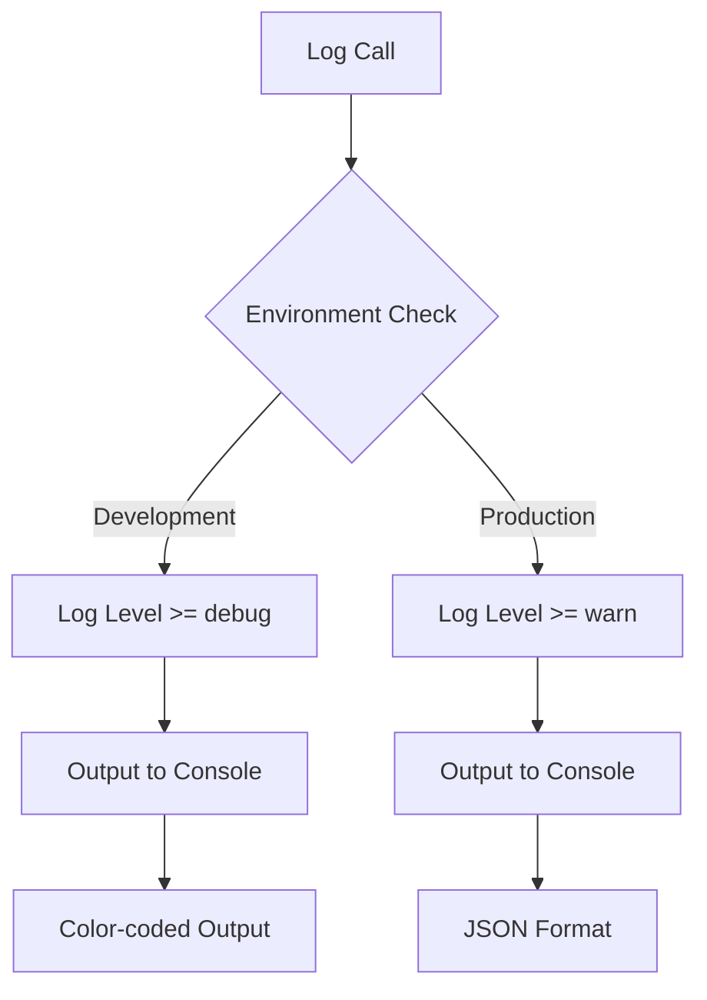
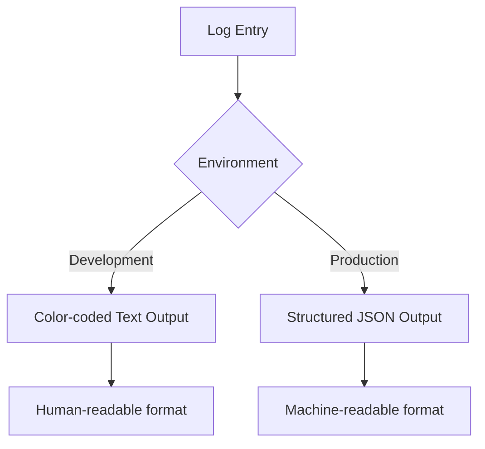
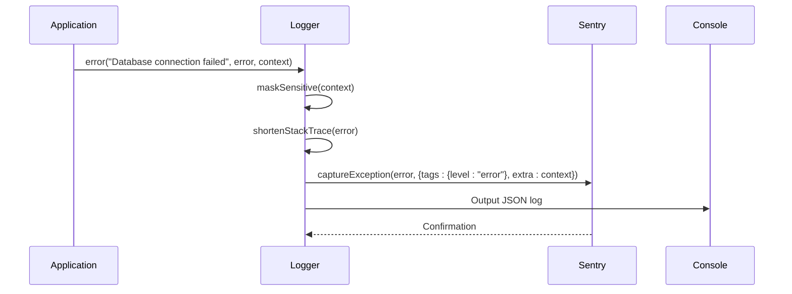
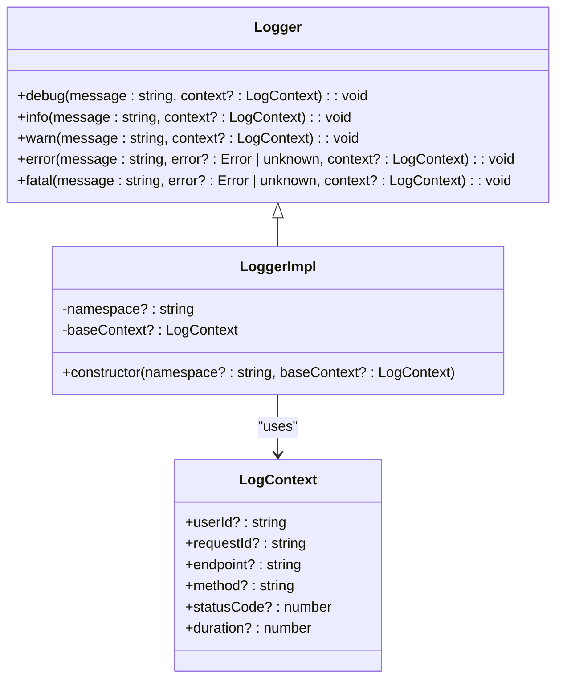

# Logging Strategy

<cite>
**Referenced Files in This Document**   
- [logger.ts](file://src/lib/logger.ts)
- [sentry.server.config.ts](file://sentry.server.config.ts)
- [sentry.client.config.ts](file://sentry.client.config.ts)
- [route.ts](file://src/app/api/auth/login/route.ts)
</cite>

## Table of Contents

1. [Centralized Logger Implementation](#centralized-logger-implementation)
2. [Log Levels and Environment Behavior](#log-levels-and-environment-behavior)
3. [Log Structure and Sensitive Data Handling](#log-structure-and-sensitive-data-handling)
4. [Output Formatting](#output-formatting)
5. [Sentry Integration for Error Reporting](#sentry-integration-for-error-reporting)
6. [Namespaced Loggers and Context Management](#namespaced-loggers-and-context-management)
7. [Performance Monitoring with measureTime](#performance-monitoring-with-measuretime)
8. [Common Logging Issues and Best Practices](#common-logging-issues-and-best-practices)

## Centralized Logger Implementation

The PORTAL application implements a centralized logging system through the `Logger` interface and `LoggerImpl` class, providing a consistent approach to application logging across all components and services. The logger serves as the primary mechanism for recording application events, errors, and performance metrics.

**Section sources**

- [logger.ts](file://src/lib/logger.ts#L14-L20)
- [logger.ts](file://src/lib/logger.ts#L105-L185)

## Log Levels and Environment Behavior

The logging system supports five distinct log levels: debug, info, warn, error, and fatal. Each level serves a specific purpose in the application's monitoring and debugging workflow. The logger's behavior adapts based on the current environment, with different minimum log levels configured for development and production.

In development mode, all log levels including debug are enabled, providing comprehensive visibility into application behavior. In production, the minimum log level is set to 'warn', reducing log volume while still capturing potentially important issues. This environment-specific configuration ensures optimal performance in production while maintaining detailed debugging capabilities during development.



**Diagram sources**

- [logger.ts](file://src/lib/logger.ts#L23-L35)

## Log Structure and Sensitive Data Handling

Log messages are structured with consistent fields including timestamp, log level, message, context data, and optional error information. The logger automatically includes timestamps in ISO format and supports contextual data that can include user IDs, request IDs, endpoints, methods, and status codes.

A critical feature of the logging system is its automatic masking of sensitive information. The logger implements comprehensive data protection by identifying and masking sensitive fields in log context. This includes:

- Authentication tokens, passwords, and API keys are replaced with '**_MASKED_**'
- TC numbers (Turkish identification numbers) are partially masked, showing only the first 3 and last 2 digits
- The masking process is recursive, handling nested objects and arrays

The `maskSensitive` function recursively traverses context objects, identifying sensitive fields by name patterns (case-insensitive) such as 'password', 'token', 'apikey', 'tc_no', 'tcno', 'applicant_tc_no', 'tc', and 'tcnumber'.

**Section sources**

- [logger.ts](file://src/lib/logger.ts#L66-L96)

## Output Formatting

The logger adapts its output format based on the environment. In development, logs are displayed with color-coding for easy visual differentiation of log levels:

- Debug: Cyan
- Info: Green
- Warn: Yellow
- Error: Red
- Fatal: Magenta

This color-coded output appears in the console with the log level, timestamp, and message on a single line, followed by formatted context data and error details when present.

In production, all logs are output as JSON objects, making them compatible with log aggregation and analysis systems. The JSON format includes all log properties (timestamp, level, message, context, and error) in a structured format that can be easily parsed and indexed.



**Diagram sources**

- [logger.ts](file://src/lib/logger.ts#L146-L156)

## Sentry Integration for Error Reporting

The logging system integrates with Sentry for comprehensive error tracking and reporting. When error or fatal level logs are generated, the logger automatically forwards the information to Sentry if a DSN (Data Source Name) is configured in the environment.

The integration captures both the error object and contextual information, providing developers with detailed insights into application failures. Error stack traces are automatically shortened in production to reduce noise while preserving essential information. The Sentry integration includes:

- Automatic capture of exceptions with `Sentry.captureException`
- Inclusion of log level as a Sentry tag
- Attachment of context data as Sentry extras
- Environment-specific configuration in both client and server config files



**Diagram sources**

- [logger.ts](file://src/lib/logger.ts#L159-L164)
- [sentry.server.config.ts](file://sentry.server.config.ts#L6-L22)
- [sentry.client.config.ts](file://sentry.client.config.ts#L6-L24)

## Namespaced Loggers and Context Management

The logging system provides utilities for creating specialized loggers with predefined context. The `createLogger` function allows for namespaced loggers that automatically include a namespace in all log entries, making it easier to trace logs to specific application components.

The `withContext` function creates a logger instance with predefined context that is automatically included in all log entries from that logger. This eliminates the need to repeatedly pass common context data and ensures consistency across related log entries.

For example, an API route might create a namespaced logger with request-specific context:



**Diagram sources**

- [logger.ts](file://src/lib/logger.ts#L189-L195)

**Section sources**

- [logger.ts](file://src/lib/logger.ts#L189-L195)

## Performance Monitoring with measureTime

The logging system includes a `measureTime` utility function that simplifies performance monitoring of code execution. This function wraps any operation and automatically logs the execution duration, making it easy to identify performance bottlenecks.

The utility uses a try-catch block to ensure that timing is captured for both successful executions and failures. When a function executes successfully, an info-level log is generated with the duration. If the function throws an error, an error-level log is generated with the duration and error details.

This approach provides valuable performance insights without requiring developers to manually implement timing logic throughout the codebase.

```mermaid
flowchart TD
A[measureTime(fn, label)] --> B[Record Start Time]
B --> C[Execute Function]
C --> D{Success?}
D --> |Yes| E[Log Duration as Info]
D --> |No| F[Log Duration and Error as Error]
E --> G[Return Result]
F --> H[Re-throw Error]
G --> I[End]
H --> I
```

**Diagram sources**

- [logger.ts](file://src/lib/logger.ts#L197-L207)

**Section sources**

- [logger.ts](file://src/lib/logger.ts#L197-L207)

## Common Logging Issues and Best Practices

Several common issues can arise with logging implementation, and the PORTAL application addresses these through its design:

**Missing Context**: The `withContext` utility helps prevent missing context by allowing developers to create loggers with predefined context that is automatically included in all entries.

**Improper Error Handling**: The logger safely handles error objects by creating a copy with a shortened stack trace in production, preventing excessive log volume while preserving essential debugging information.

**Performance Impacts**: The logging system minimizes performance impacts through several mechanisms:

- Environment-based log level filtering prevents unnecessary log processing
- Production JSON formatting is more efficient than formatted text output
- The `shouldLog` method quickly evaluates whether a log entry meets the minimum level requirement before processing

Best practices for using the logging system include:

- Using appropriate log levels for different types of messages
- Including relevant context data to aid in debugging
- Using namespaced loggers for major application components
- Leveraging the `measureTime` utility for performance-critical operations
- Avoiding logging of sensitive information through the automatic masking system

**Section sources**

- [logger.ts](file://src/lib/logger.ts#L115-L117)
- [route.ts](file://src/app/api/auth/login/route.ts#L37-L40)
- [route.ts](file://src/app/api/auth/login/route.ts#L158-L162)
