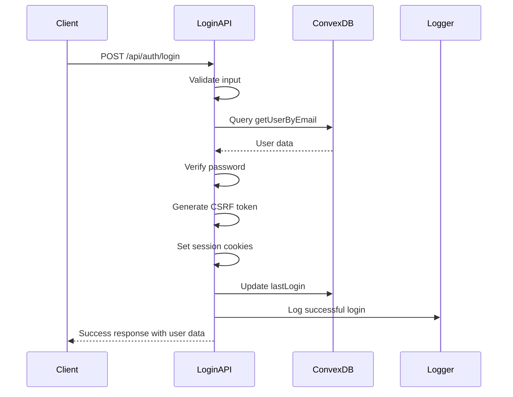
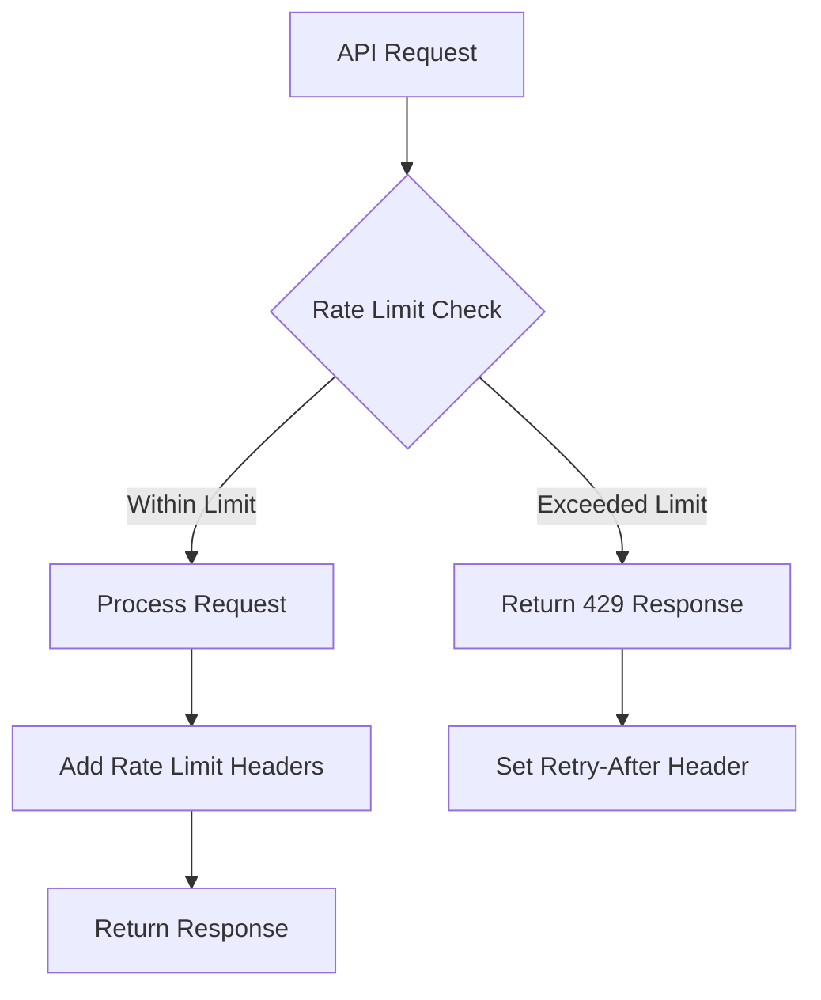
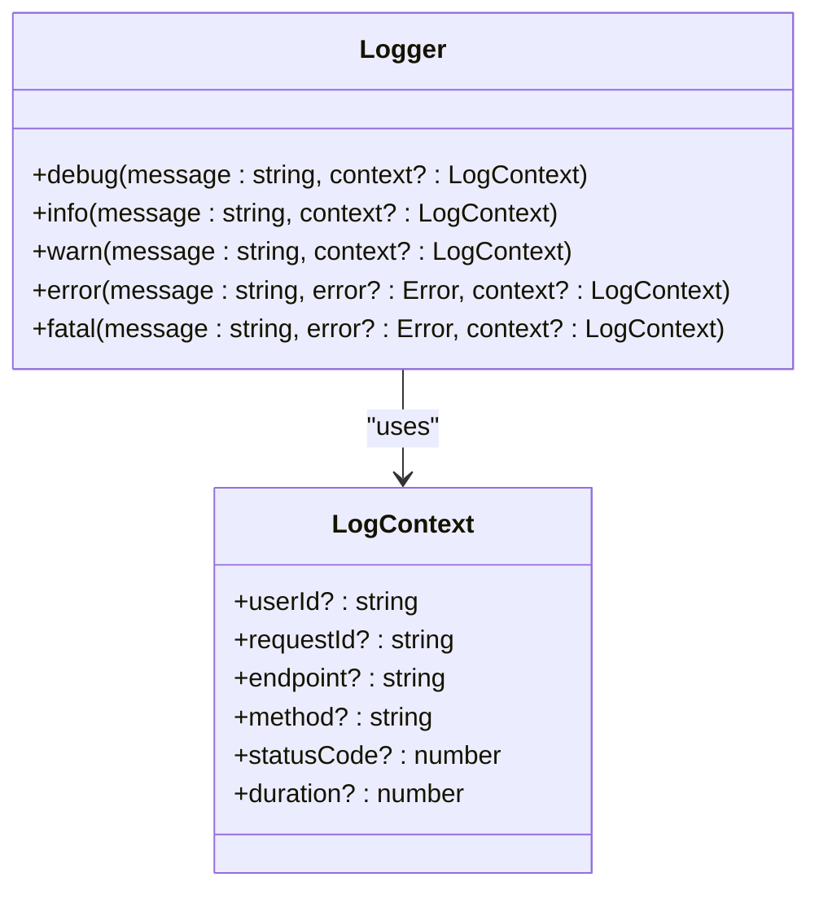
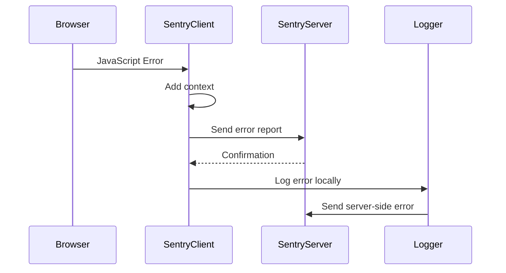

# Troubleshooting

<cite>
**Referenced Files in This Document**   
- [src/lib/logger.ts](file://src/lib/logger.ts)
- [sentry.client.config.ts](file://sentry.client.config.ts)
- [sentry.server.config.ts](file://sentry.server.config.ts)
- [src/lib/rate-limit.ts](file://src/lib/rate-limit.ts)
- [src/lib/api/route-helpers.ts](file://src/lib/api/route-helpers.ts)
- [src/lib/auth/session.ts](file://src/lib/auth/session.ts)
- [convex/auth.ts](file://convex/auth.ts)
- [src/app/api/auth/login/route.ts](file://src/app/api/auth/login/route.ts)
- [src/app/api/auth/session/route.ts](file://src/app/api/auth/session/route.ts)
</cite>

## Table of Contents

1. [Common Issues and Solutions](#common-issues-and-solutions)
2. [Authentication Failures](#authentication-failures)
3. [Database Connection Problems](#database-connection-problems)
4. [API Errors](#api-errors)
5. [Performance Bottlenecks](#performance-bottlenecks)
6. [Logging Strategy](#logging-strategy)
7. [Error Monitoring with Sentry](#error-monitoring-with-sentry)
8. [Diagnostic Procedures](#diagnostic-procedures)
9. [Reproducing and Resolving Bugs](#reproducing-and-resolving-bugs)
10. [Environment-Specific Issues](#environment-specific-issues)

## Common Issues and Solutions

This section addresses the most frequently encountered issues during development, testing, and production deployment of the PORTAL application. The solutions provided are practical and tested, designed to help developers and system administrators quickly resolve problems.

**Section sources**

- [src/lib/logger.ts](file://src/lib/logger.ts#L1-L213)
- [sentry.client.config.ts](file://sentry.client.config.ts#L1-L25)
- [sentry.server.config.ts](file://sentry.server.config.ts#L1-L23)

## Authentication Failures

Authentication issues are among the most common problems in the PORTAL application. These typically manifest as login failures, session expiration, or CSRF token validation errors.

### Login Failures

When users cannot log in, check the following:

- Verify that the email and password are correct
- Ensure the user account is active (isActive: true)
- Check that the password hash exists in the database
- Validate that the rate limiting is not blocking the login attempts

The authentication flow uses Convex BaaS for user management, with password verification handled in Next.js API routes. The login endpoint `/api/auth/login` implements rate limiting to prevent brute force attacks.

**Diagram sources**

- [src/app/api/auth/login/route.ts](file://src/app/api/auth/login/route.ts#L1-L178)
- [convex/auth.ts](file://convex/auth.ts#L1-L82)

### Session Management Issues

Session problems often occur due to cookie configuration or expiration. The application uses HttpOnly cookies for session storage with appropriate security flags:

- `httpOnly: true` - Prevents client-side script access
- `secure: true` in production - Requires HTTPS
- `sameSite: strict` - Prevents CSRF attacks
- Proper maxAge based on rememberMe flag

**Section sources**

- [src/lib/auth/session.ts](file://src/lib/auth/session.ts#L1-L181)
- [src/app/api/auth/session/route.ts](file://src/app/api/auth/session/route.ts#L1-L65)

## Database Connection Problems

The PORTAL application uses Convex BaaS as its backend-as-a-service, which handles database connections automatically. However, connection issues can still occur due to network problems or configuration errors.

### Convex Connection Issues

If the application cannot connect to Convex:

- Verify that the Convex deployment URL is correctly configured
- Check network connectivity between the application server and Convex
- Ensure that the Convex CLI is properly authenticated
- Validate that the Convex functions are deployed and accessible

The application uses the convexHttp client for server-side operations, which provides a reliable connection to the Convex database.

**Section sources**

- [src/lib/convex/server.ts](file://src/lib/convex/server.ts)
- [convex/\_generated/server.js](file://convex/_generated/server.js)

## API Errors

API errors can occur due to various reasons including validation failures, rate limiting, or server-side exceptions.

### Rate Limiting

The PORTAL application implements comprehensive rate limiting to protect against abuse:

- Authentication endpoints: 10 attempts per 10 minutes
- Data modification: 50 requests per 15 minutes
- Read-only endpoints: 200 requests per 15 minutes
- Upload endpoints: 10 uploads per minute
- Search endpoints: 30 searches per minute

Rate limiting is implemented using the `withRateLimit` higher-order function, which tracks requests by IP address and HTTP method.

**Diagram sources**

- [src/lib/rate-limit.ts](file://src/lib/rate-limit.ts#L1-L148)

### Validation Errors

API endpoints use Zod for request validation. When validation fails, the response includes detailed error messages:

- 400 status code for validation errors
- Error details in the response body
- Contextual information for debugging

The `handleApiError` function in route-helpers.ts provides standardized error handling across all API routes.

**Section sources**

- [src/lib/api/route-helpers.ts](file://src/lib/api/route-helpers.ts#L1-L235)

## Performance Bottlenecks

Performance issues in the PORTAL application are typically related to database queries, API response times, or frontend rendering.

### Database Query Optimization

To optimize database queries:

- Use Convex indexes for frequently queried fields
- Implement pagination for large datasets
- Use field selection to retrieve only needed data
- Cache frequently accessed data

The application uses Convex's real-time database capabilities, which automatically optimize data retrieval for subscribed components.

### Frontend Performance

Frontend performance can be improved by:

- Using virtual scrolling for large lists
- Implementing code splitting
- Optimizing image loading
- Reducing bundle size

The application uses Next.js 16 with Turbopack, which provides excellent build performance and code splitting capabilities.

**Section sources**

- [src/lib/performance.ts](file://src/lib/performance.ts)
- [src/components/ui/virtualized-data-table.tsx](file://src/components/ui/virtualized-data-table.tsx)

## Logging Strategy

The PORTAL application uses a centralized logging system with comprehensive error tracking and monitoring.

### Centralized Logger

The logger implementation provides:

- Structured logging with context
- Sensitive data masking
- Environment-specific formatting
- Integration with Sentry
- Performance measurement

The logger automatically masks sensitive information including:

- Passwords and tokens
- TC identification numbers
- API keys

**Diagram sources**

- [src/lib/logger.ts](file://src/lib/logger.ts#L1-L213)

### Log Levels

The application uses five log levels:

- **debug**: Detailed information for debugging
- **info**: General operational information
- **warn**: Potential issues that don't prevent operation
- **error**: Errors that prevent specific operations
- **fatal**: Critical errors that may affect system stability

**Section sources**

- [src/lib/logger.ts](file://src/lib/logger.ts#L3-L213)

## Error Monitoring with Sentry

The PORTAL application integrates with Sentry for comprehensive error monitoring and performance tracking.

### Sentry Configuration

Sentry is configured separately for client and server environments:

- Client-side: Captures JavaScript errors and performance issues
- Server-side: Captures API errors and server exceptions

The configuration includes:

- Environment detection (development vs production)
- Sample rates for performance monitoring
- Release tracking
- Error filtering

**Diagram sources**

- [sentry.client.config.ts](file://sentry.client.config.ts#L1-L25)
- [sentry.server.config.ts](file://sentry.server.config.ts#L1-L23)

### Error Investigation

To investigate reported issues in Sentry:

1. Identify the error type and frequency
2. Examine the stack trace and context
3. Check the affected users and devices
4. Review the breadcrumbs leading to the error
5. Reproduce the issue in a development environment

The integration with the centralized logger ensures that all errors are captured with rich context information.

**Section sources**

- [src/lib/logger.ts](file://src/lib/logger.ts#L159-L164)
- [sentry.client.config.ts](file://sentry.client.config.ts#L6-L25)

## Diagnostic Procedures

This section provides step-by-step diagnostic procedures for both frontend and backend problems.

### Frontend Diagnostics

For frontend issues:

1. Check the browser console for JavaScript errors
2. Verify network requests in the developer tools
3. Inspect component state and props
4. Check for CSS issues
5. Test in different browsers

The application uses React 19 with strict mode, which helps identify potential issues during development.

### Backend Diagnostics

For backend issues:

1. Check server logs for error messages
2. Verify API responses and status codes
3. Test database queries directly
4. Monitor system resources
5. Check third-party service connectivity

Use the centralized logger to trace the execution flow and identify where issues occur.

**Section sources**

- [src/lib/logger.ts](file://src/lib/logger.ts)
- [src/app/api/auth/login/route.ts](file://src/app/api/auth/login/route.ts)

## Reproducing and Resolving Bugs

Effective bug resolution requires consistent reproduction and systematic debugging.

### Reproducing Bugs

To reproduce bugs:

1. Document the exact steps to reproduce
2. Identify the environment and conditions
3. Capture relevant logs and screenshots
4. Isolate the issue from other factors
5. Create a minimal test case

The application's comprehensive logging makes it easier to understand the context in which bugs occur.

### Resolving Bugs

To resolve bugs:

1. Analyze the error logs and stack traces
2. Identify the root cause
3. Develop and test a fix
4. Verify the fix doesn't introduce new issues
5. Deploy and monitor the fix

Use the unit and E2E tests to validate that fixes work as expected.

**Section sources**

- [src/**tests**](file://src/__tests__)
- [e2e](file://e2e)

## Environment-Specific Issues

Different environments (development, staging, production) may exhibit different behaviors due to configuration differences.

### Configuration Problems

Common configuration issues include:

- Missing environment variables
- Incorrect API endpoints
- Database connection settings
- Authentication credentials
- Third-party service integrations

The application uses environment-specific configuration files and validation to prevent many of these issues.

### Environment Differences

Key differences between environments:

- **Development**: Full logging, no rate limiting, mock data
- **Staging**: Production-like configuration, limited data
- **Production**: Optimized performance, comprehensive monitoring

Use the `validate-deploy.sh` script to verify that all requirements are met before deployment.

**Section sources**

- [scripts/validate-deploy.sh](file://scripts/validate-deploy.sh)
- [package.json](file://package.json)
